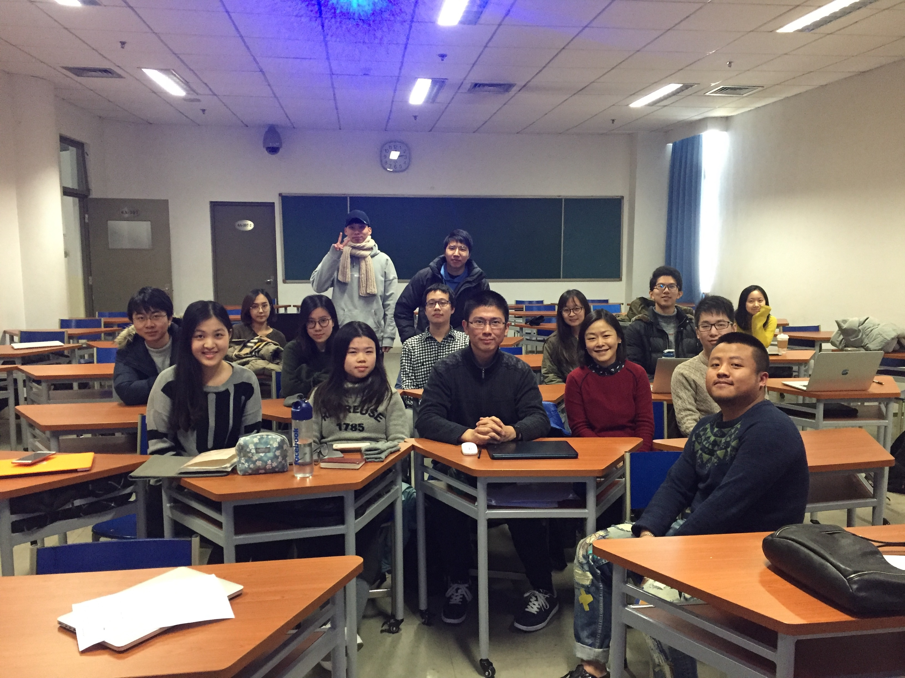

# Autumn 2018

Course number: 40641533

Instructor: Xiaojing Bai

Teaching Assistants: Qing Lyu, Yibin Shu

[Q&A Platform](https://piazza.com/tsinghua.edu.cn/fall2018/40641533)

## Overview
This course provides an introduction to computational linguistics, covering the fundamental models of linguistic phenomena at the levels of morphology, syntax, semantics and pragmatics. Students will learn how these models are implemented, evaluated, and applied to real-world natural language processing (NLP) tasks, together with some entry-level but practical skills in NLP with Python.

## Aims
+ To introduce the fundamental language models, their strengths and weaknesses.

+ To introduce some current and potential NLP applications.
+ To develop an understanding of how linguistics can support research in NLP.
+ To develop an understanding of how computational perspectives and tools can support research in both theoretical and applied linguistics.


## Prerequisite
This is an entry-level course accessible to undergraduate students in linguistics. No background in computational linguistics or computer science is required; mathematical essentials are expected; and a burning interest in linguistics and programming are highly appreciated.

## Teaching
There will be 14 lectures in total, each followed by a practical session during which students can have a go with some language tools on their own computers.

## Grading
+ Participation (5%): showing up for class, demonstrating preparedness, contributing to class discussions
+ Quizzes (20%): in-class quizzes about the required readings
+ Homework (25%): post-class tasks concerning the lectures, practicals, and readings
+ Final exam (20%): close-book exam covering the topics of the course
+ Term project (30%): a research proposal (e.g. a theoretical or applied study of language from a computational perspective and supported by CL tools or resources, an improvement of a CL algorithm or an NLP application, etc.) and the preliminary implementation of the proposal

## Readings
+ [Speech and Language Processing - An Introduction to Natural Language Processing, Computational Linguistics, and Speech Recognition](http://web.stanford.edu/~jurafsky/slp3/) by Daniel Jurafsky and James. H. Martin

+ [Natural Language Processing with Python](http://www.nltk.org/book/) by Steven Bird, Ewan Klein, and Edward Loper

+ [How to Think Like a Computer Scientist](https://runestone.academy/runestone/static/thinkcspy/index.html) by the Runestone Interactive Project

## Homework 0
Try [Homework 0](docs/homework_0) to see whether this course is your cup of tea, in the sense of what you are supposed to do and what you may learn.

## Quizzes
Click [here](docs/quizzes) to see the schedule for in-class quizzes and the readings to be covered respectively.

## Schedule

Session | Slides | Required Readings | Extras
------- | ------ | -------- | -----
1 | [Introduction](slides/1/) [[pdf](slides/1/1.pdf)]  [Practical 1](slides/1/prac1_Python_intro.pdf)   [Homework](slides/1/#37) | [J+M_1](readings/1/J+M_1.pdf)|[Kenneth Church: A Pendulum Swung Too Far](readings/1/Pendulum_Swung_Too_Far.pdf) [Shuly Wintner: What Science Underlies Natural Language Engineering](readings/1/What_Science_Underlies_Natural_Language_Engineering.pdf) [冯志伟:《统计自然语言处理》序言](readings/1/冯志伟_统计自然语言处理_序言.pdf) [宗成庆:自然语言处理的基本方法](readings/1/宗成庆_自然语言处理的基本方法.pdf) [IBM Watson](http://tech.sina.com.cn/d/IBMWatson/)
2 | [Text Normalization, Finite State Transducers, and Morphological Parsing](slides/2/) [[pdf](slides/2/2.pdf)]  [Practical 2](slides/2/prac2_function.pdf)   [Homework](slides/2/#44) | [J+M_2](readings/2/J+M_2.pdf) (2.2, 2.3, 2.4)  [J+M_second_edition_2](readings/2/J+M_second_edition_2.pdf) (2.2)   [J+M_second_edition_3](readings/2/J+M_second_edition_3.pdf) (3.1)|[J+M_second_edition_3.2-3.7](readings/2/J+M_second_edition_3.pdf) [Julia Hirschberg and Christopher D. Manning: Advances in Natural Language Processing](readings/2/advances_nlp_2015.pdf)  [Saying maths](http://www.batmath.it/eng/say/say.htm)
3 | [Regular Expressions and Edit Distance](slides/3/) [[pdf](slides/3/3.pdf)]   [Practical 3](slides/3/prac3_structured_programs.pdf)   [Homework](slides/3/#20)| [J+M_2](readings/2/J+M_2.pdf) (2.1, 2.5) |[regex 101](https://regex101.com/)
4 | [N-gram Language Models](slides/4) [[pdf](slides/4/4.pdf)]   [Practical 4](slides/4/prac4.pdf)   [Homework](slides/4/#34) | [J+M_3](readings/4/J+M_3.pdf)(3.1-3.3)  [Homework](slides/4/#34)|[Smoothing: J+M_3.4-3.5](readings/4/J+M_3.pdf) [Mathematical foundations](readings/4/pre_math_manning_schutze.pdf)
5 | [Hidden Markov Models and Part-Of-Speech Tagging](slides/5) [[pdf](slides/5/5.pdf)]  [Practical 5](slides/5/prac5.pdf)[[data download](slides/5/Lovers_on_Aran_messed.txt)][[example solutions](slides/5/prac5_example_sol.zip)] [Homework](slides/5/#27)|[J+M_8](readings/5/J+M_8.pdf) (8.1-8.4; 8.7) |[现代汉语](readings/5/现代汉语_北大现代汉语教研室.pdf) [The Penn - CU Chinese Treebank Project](https://verbs.colorado.edu/chinese/ctb.html)
6 | [Formal Grammars and Syntactic Parsing](slides/6)[[pdf](slides/6/6.pdf)] [Practical 6](slides/6/#40) [Homework](slides/6/#42)| [J+M_10](readings/6/J+M_10.pdf) [J+M_11](readings/6/J+M_11.pdf) |[CYK algorithm](http://ccl.pku.edu.cn/doubtfire/Course/Computational%20Linguistics/contents/CYK_parsing.pdf)
7 | [Statistical Parsing and Dependency Parsing](slides/7)[[pdf](slides/7/7.pdf)] [Practical 7](slides/7/#36) [Homework](slides/7/#37) | [J+M_12](readings/7/J+M_12.pdf) (excluding 12.7)  [J+M_13](readings/7/J+M_13.pdf) (13.1)|[詹卫东:从计算机处理的角度看短语结构歧义](http://ccl.pku.edu.cn/doubtfire/Papers/1998_Different%20types%20of%20Chinese%20ambiguous%20structures.pdf)
8 | [Features and Unification, Language and Complexity](slides/8)[[pdf](slides/8/8.pdf)]  [Practical 8](slides/8/#41) [Homework](slides/8/#42) |  [J+M_second_edition_15](readings/8/J+M_second_edition_15.pdf) (Optional)   [J+M_second_edition_16](readings/8/J+M_second_edition_16.pdf) |
9 | [Meaning Representation and Vector Semantics](slides/9)[[pdf](slides/9/9.pdf)] [Practical 9](slides/9/prac9_CYK_revisited.pdf) [Homework](slides/9/#39) | [J+M_14](readings/9/J+M_14.pdf) (14.1-14.4)  [J+M_6](readings/9/J+M_6.pdf) (6.1-6.3) |
10 | [Semantic Similarity and Word Sense Disambiguation](slides/10)  [Teamwork submission guideline](slides/10/teamwork_submission_guideline.pdf) [Homework](slides/10/#34) | [J+M_6](readings/9/J+M_6.pdf) (6.1-6.7) [J+M_C](https://bxjthu.github.io/CompLing/readings/10/J+M_C.pdf) |[Distributed word representations: vector comparison](slides/10/vector_comparison.mp4)
11 | Teamwork presentation   More on WordNet|  |
12 | Semantic Role Labeling and Computational Discourse  |  |
13 | Online Language Resources: Advances, Applications, and Challenges  |  |
14 | NLP Applications -1 |  |
15 | NLP Applications -2 |  |

# WE

**Autumn 2017**  
Teaching Assistant: Yuxiao Ye

{:height="244" width="326"}
