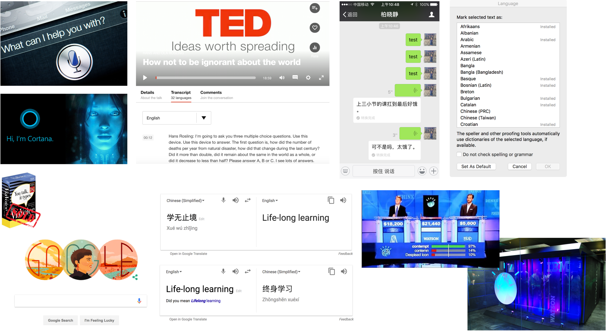
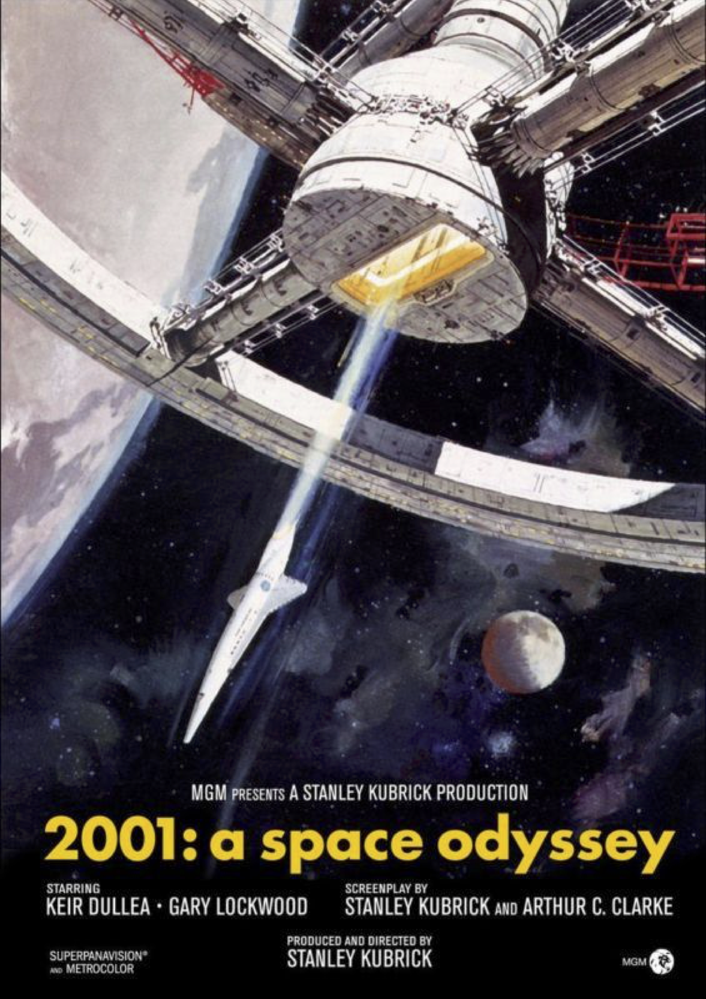
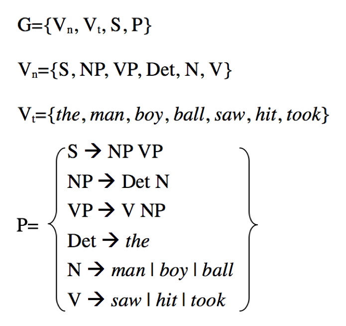
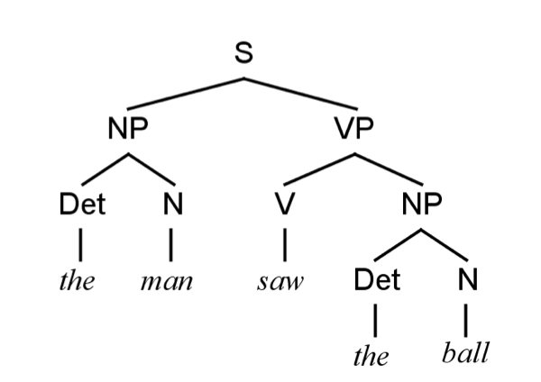
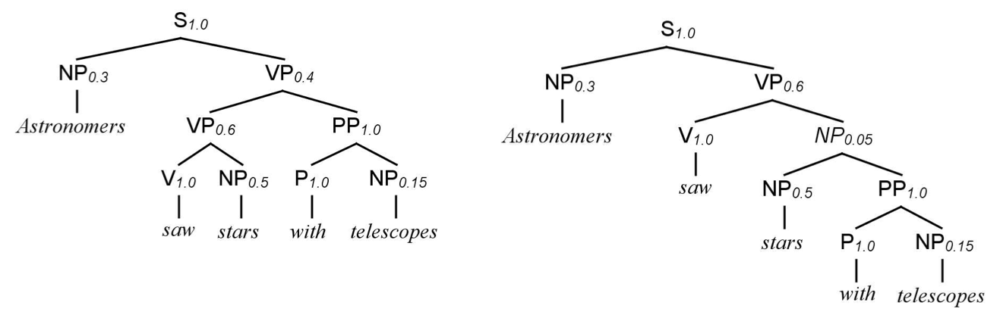
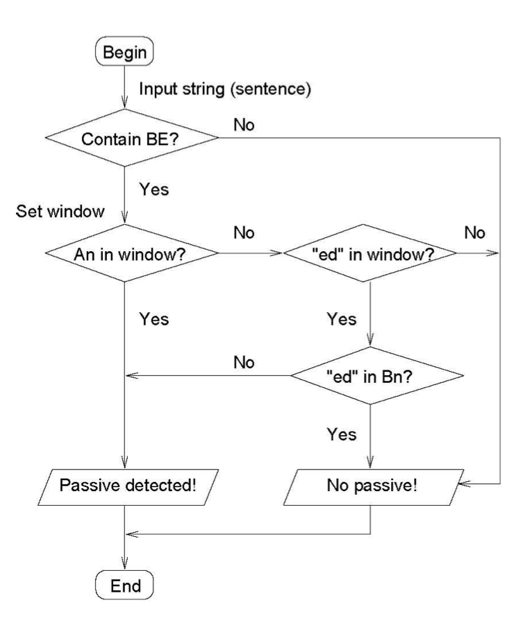
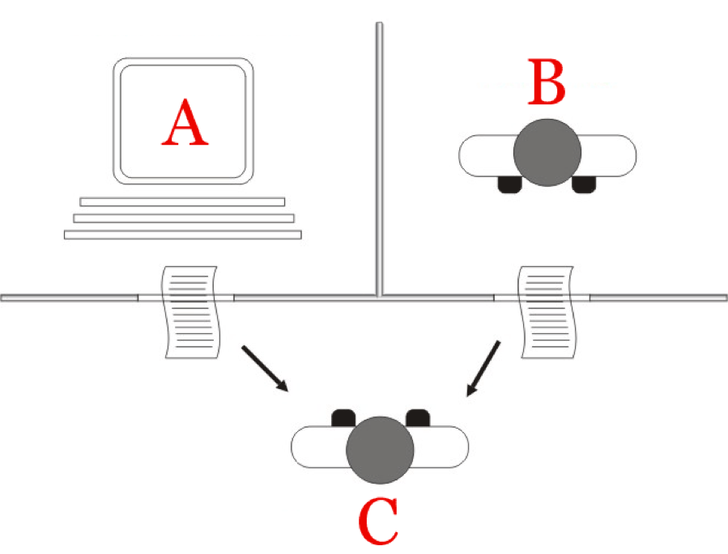
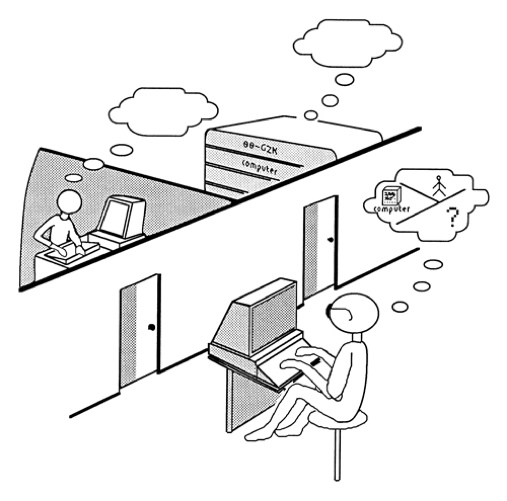

class: center, middle
# Computational Linguistics 

** Xiaojing Bai **

** Tsinghua University **

** https://github.com/bxjthu **
---
class: center, middle
##That the powerful play goes on, 
##and you may contribute a verse.

---
class: center, middle

##That the powerful play goes on, 
##and you may contribute a verse.
##What will your verse be?   
---
## At the end of this session you will
+   understand what computational linguistic is in the general sense;   

+   understand what this course is for and what it focuses on;   

+   have some preliminary but important ideas about computational linguistic;   

+   get started with Python and learn basic data types and sequence operations in Python.
---
class: center, middle
##Giving computers the ability 
##to process human language
---

---
class: center, middle
##Giving computers the ability 
##to process human language
A vibrant interdisciplinary field  
with many names corresponding to its many facets
 

Overlapping fields in different departments
---
## What is _Computational Linguistics?_
.left-column-1[

]

.right-column-1[
  

The premier international scientific and professional society for people working on computational problems involving human language

Founded in 1962 and originally named the Association for Machine Translation and Computational Linguistics

For more information: https://www.aclweb.org/
]
---
## What is _Computational Linguistics?_
Computational linguistics is the scientific study of language from a computational perspective. 

Computational linguists are interested in providing computational models of various kinds of linguistic 

phenomena. These models may be "knowledge-based" ("hand-crafted") or "data-driven" ("statistical" or 

"empirical").   

Work in computational linguistics is in some cases motivated from a scientific perspective in that one is 

trying to provide a computational explanation for a particular linguistic or psycholinguistic phenomenon; 

and in other cases the motivation may be more purely technological in that one wants to provide a working 

component of a speech or natural language system. 
---
## What is _Computational Linguistics?_
Indeed, the work of computational linguists is incorporated into many working systems today, including 

speech recognition systems, text-to-speech synthesizers, automated voice response systems, web search 

engines, text editors, language instruction materials, to name just a few.   

&nbsp;&nbsp;&nbsp;&nbsp;_“Linguistics has a hundred-year history as a scientific discipline, and computational linguistics has a _

&nbsp;&nbsp;&nbsp;&nbsp;_ fifty-year history as a part of computer science. But it is only in the last decade or so that language_

&nbsp;&nbsp;&nbsp;&nbsp;_ understanding has emerged as an industry reaching millions of people, with information retrieval and_

&nbsp;&nbsp;&nbsp;&nbsp;_machine translation available on the Internet, and speech recognition becoming popular on desktop_

&nbsp;&nbsp;&nbsp;&nbsp;_computers."_

 Peter Norvig and Stuart Russell. Foreword. J+M 2nd

---

## Fire the _linguists_ ?
_
“Every time I fire a linguist,  _
_the performance of the speech recognizer goes up.”
_                 

Frederick Jelinek (1932 – 2010)

###Rationalism vs. Empiricism (rule-based vs. statistics-based)

Suggested readings:

+ Church, K. (2011). A pendulum swung too far. _Linguistic Issues in Language Technology_, 6(5), 1-27.

+ Wintner, S. (2009). What science underlies natural language engineering?. _Computational Linguistics_, 35(4), 641-644.

+ 宗成庆 (2008).《统计自然语言处理》. 北京: 清华大学出版社.

+ 冯志伟 (2008). 序言.《统计自然语言处理》 (宗成庆著). 北京: 清华大学出版社.
---
## About this course

+ Overview

+ Aims

+ Prerequisite

+ Teaching

+ Readings

+ Grading

+ Tentative schedule

---
## Preliminary but important …

+ Some brief history

+ Knowledge in natural language processing

+ Complexity of language

+ Models and algorithms  

Suggested reading: J+M 2nd, Chapter 1 Introduction 

---
## Some brief history
+ 1940s – 1950s: foundational insights

+ 1957 – 1970: the two camps

+ 1970 – 1983: four paradigms

+ 1983 – 1993: empiricism and finite-state models redux 

+ 1994 – 1999: the field comes together

+ 2000 – 2008: the rise of machine learning
---
## Some brief history
###Some old events
+ 1949 Warren Weaver’s memorandum

+ 1950 Turing Test

+ 1952 First conference on MT at MIT 

+ 1954 First MT demo by Georgetown University and IBM 

+ 1954 _Mechanical Translation_ >>> 1980 _Computational Linguistics_ 

+ 1957 Chomsky’s _Syntactic Structures_ 

+ 1962 The Association for Machine Translation and Computational Linguistics 

+ 1966 The (in)famous ALPAC report 

---
##Knowledge in natural language processing
.left-column-3[
Mankind finds a mysterious, obviously artificial, monolith 

buried on the moon and, with the intelligent computer HAL, 

sets off on a quest...    

_Dave Bowman: Open the pod bay doors, HAL. _

_HAL: I’m sorry Dave, I’m afraid I can’t do that. _

Stanley Kubrick and Arthur C. Clarke, 

screenplay of _2001: A Space Odyssey_
]

.right-column-3[

]
---
##Knowledge in natural language processing
###What would HAL need to know about language?

---
##Knowledge in natural language processing
###What would HAL need to know about language?

+ **Phonetics and phonology**: knowledge about linguistic sounds 

+ **Morphology**: knowledge of the meaningful components of words 

+ **Syntax**: knowledge of the structural relationships between words 

+ **Semantics**: knowledge of meaning 

+ **Pragmatics**: knowledge of the relationship of meaning to the goals and intentions of the speaker 

+ **Discourse**: knowledge about linguistic units larger than a single utterance 

---
##Complexity of language
###Resolving ambiguity at different levels
e.g. _I made her duck._
---
##Complexity of language
###Resolving ambiguity at different levels
e.g. _I made her duck._

+ I cooked waterfowl for her. 

+ I cooked waterfowl belonging to her. 

+ I created the (plaster?) duck she owns. 

+ I caused her to quickly lower her head or body. 

+ I waved my magic wand and turned her into undifferentiated waterfowl. 

---
##Complexity of language
###Resolving ambiguity at different levels
e.g. _I made her duck._

+ I cooked waterfowl for her. 

+ I cooked waterfowl belonging to her. 

+ I created the (plaster?) duck she owns. 

+ I caused her to quickly lower her head or body. 

+ I waved my magic wand and turned her into undifferentiated waterfowl.   

**Difficulties in Chinese information processing** 中文信息系处理

Suggested reading: 俞士汶等 (2003).《现代汉语语法信息词典详解》. 北京: 清华大学出版社.
---
##Models and algorithms
###How NLP systems work?
  

---
##Models and algorithms
+ Model

  + A model of an **object** is a physical representation that shows what it looks like or how it works. The model is often smaller than the object it represents.

  + A model of a **system or process** is a theoretical description that can help you understand how the system or process works, or how it might work. 

+ Language model: a formal description of linguistic knowledge

+ Important models
  + state machines
  
  + rule systems
  
  + logic
  
  + probabilistic models
  
  + vector-space models

---
##Models and algorithms
   

---
##Models and algorithms
.left-column-1[
  

]
.right-column-1[
  

]
---
##Models and algorithms
.left-column-2[
+ Algorithm

  + An algorithm is a series of mathematical steps, especially in a computer program, which will give you the answer to a particular kind of problem or question.

+ Important algorithms
  
  + state space search algorithms
  
  + machine learning algorithms
]
---
##Models and algorithms
.left-column-2[
+ Algorithm

  + An algorithm is a series of mathematical steps, especially in a computer program, which will give you the answer to a particular kind of problem or question.

+ Important algorithms
  
  + state space search algorithms
  
  + machine learning algorithms
]
.right-column-2[

]

---
##The Turing Test 
By Alan Turing in 1950

.left-column-3[

]
.right-column-3[
     

]
---
##The Turing Test 
.left-column-3[
We may hope that machines will eventually compete with men in all purely 
intellectual fields. But which are the best ones to start with? Even this is a 
difficult decision. Many people think that a very abstract activity, like the 
playing of chess, would be best. It can also be maintained that it is best to 
provide the machine with the best sense organs that money can buy, and 
then teach it to understand and speak English. This process could follow 
the normal teaching of a child. Things would be pointed out and named, 
etc. Again I do not know what the right answer is, but I think both approaches 
should be tried. 

We can only see a short distance ahead, but we can see plenty there that 
needs to be done.     

Turing, A. M. (1950). Computing machinery  
and intelligence. _Mind_, 59(236), 433-460.
]
.right-column-3[

]
---
## At the end of this session you will
+   understand what computational linguistic is in the general sense;   

+   understand what this course is for and what it focuses on;   

+   have some preliminary but important ideas about computational linguistic;   

+   get started with Python and learn basic data types and sequence operations in Python.
---
class: center, middle
##Next session

Regular Expressions, Text Normalization,
 
and Finite State Transducers
---

