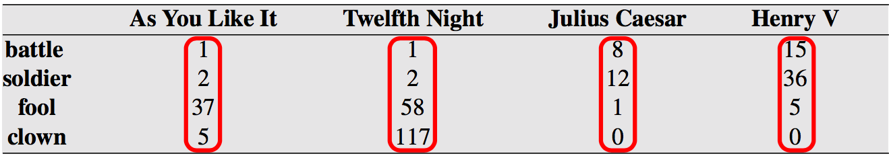
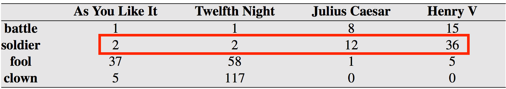
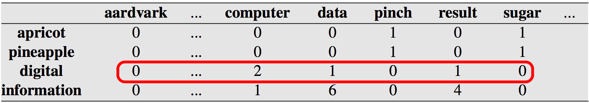
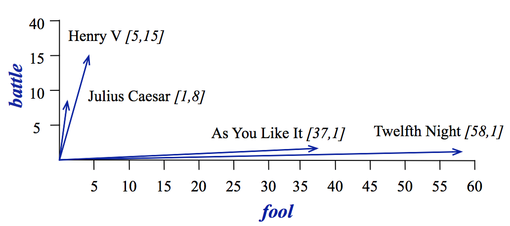
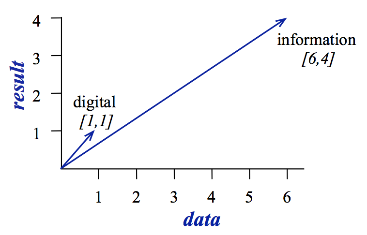
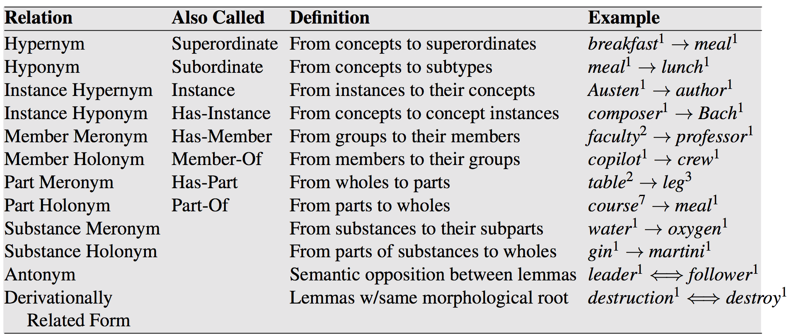
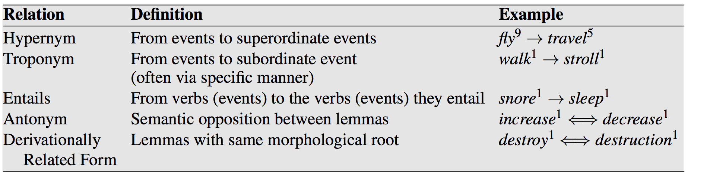
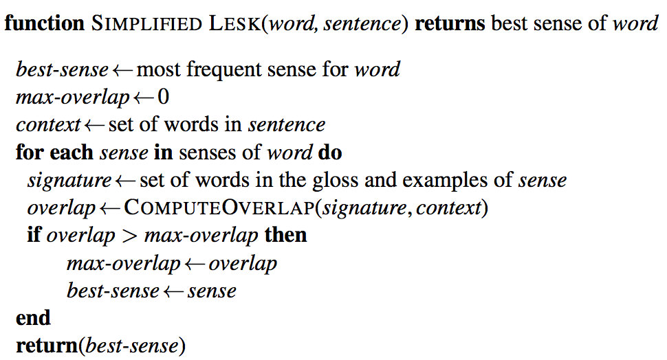

class: center, middle
# Computational Linguistics<br>
## 10. Word Sense Disambiguation <br> and Semantic Similarity

** Xiaojing Bai **

** Tsinghua University **

** https://bxjthu.github.io/CompLing **

---

## Recap: Can a computer understand the meaning of a sentence?

.left-column-3[
+ How could we tell if it did?

+ Alan Turing: Can a computer think?

  Internal states vs.observable behaviors

+ Natural language understanding

  Using observable behaviors to judge the capacity

+ Computational approaches to natural language
]
.right-column-3[

]
???
Turing side-stepped the question of somehow examining the internal states of a computer by instead using its behavior as evidence of intelligence.

---

## Recap: meaning representation

+ First-order logic as a meaning representation language
  + Basic elements
  + Variables and quantifiers
  + Lambda notation
  + The semantics of FOL
  + Event and state representations

Some notes: Broadly speaking, logic-based approaches to natural language semantics focus on those aspects of natural language which guide our judgments of <font color="red">consistency</font> and <font color="red">inconsistency</font>. The syntax of a logical language is designed to make these features formally explicit. As a result, determining properties like consistency can often be reduced to symbolic manipulation, that is, to a task that can be carried out by a computer.

---

## Recap: meaning representation

+ First-order logic as a meaning representation language

+ Syntax-driven semantic analysis

+ A simplifying assumption: representing word meanings as unanalyzed symbols like _EAT_ or _JOHN_ or _RED_

More on
+ A richer model of the semantics of words
+ Lexical semantics
+ Computational lexical semantics

---

## Recap: vectors as meaning representations

What's the difference?




---

## Recap: vectors as meaning representations

What's the difference?

.left-column-4[

]

.right-column-4[
> 
]

---

## Recap: representing the meaning of a word

+ Dictionary entries

+ Feature structures

+ Relational databases

+ Vectors

+ Trees

+ Synsets

---

## At the end of this session you will

+ understand what are word senses

+ understand what are the possible relations between the senses of a word

+ understand what are the possible relations between senses

+ know about how word senses are defined in WordNet

+ know about the goal and applications of WSD

+ know about the types of algorithms for WSD

+ know about the goal and applications of computing word similarity

---

## Word senses

_carpet vs. carpets_

_sing vs. sing, sang, sung_

---

## Word senses

_carpet vs. carpets_

_sing vs. sing, sang, sung_

+ Lemma or citation form: the grammatical form of a word that is used to represent a word in dictionaries and thesaurus

+ Wordform: the full inflected or derived form of a lemma

---

## Word senses

_carpet vs. carpets_

_sing vs. sing, sang, sung_

+ Lemma or citation form: the grammatical form of a word that is used to represent a word in dictionaries and thesaurus

+ Wordform: the full inflected or derived form of a lemma

** Word sense ** : a discrete representation of one aspect of the meaning of a lemma

.smaller[
E.g.

_Instead, a <font color="red">bank</font> can hold the investments in a custodial account in the client’s name._

_But as agriculture burgeons on the east <font color="red">bank</font>, the river will shrink even more._
]
???
individually separate and distinct
---

## Relations between the senses of a word

+ Senses coincidentally sharing an orthographic form but not related

+ Related terms

  + Homonym: .smaller[e.g. bank ("financial institution") vs. bank ("sloping mound")]

  + Homonymy

  + Homograph: .smaller[e.g. bank; bat("club for hitting a ball") vs. bat ("nocturnal flying animal")]

  + Homophone: .smaller[e.g. write vs. right; piece vs. peace]

+ Related problems for NLP

---

## Relations between the senses of a word

+ Senses semantically related

+ Related terms

  + Polysemy: .smaller[e.g. bank, school, university, hospital]

  + Metonymy: .smaller[e.g. the White House, Jane Austen, Plums]

---

## Relations between senses (rather than words)

+ Synonymy

+ Antonymy

+ Hypernymy

+ Meronymy

---

## How to define the meaning of a word sense?

Examples from _American Heritage Dictionary_ (Morris, 1985)

|  |  
:--|:--|:--
**right** &nbsp;&nbsp;&nbsp;|_adj._ &nbsp;&nbsp;&nbsp;|located nearer the right hand esp. being on the right when facing the same direction as the observer
&nbsp;|  |  
**left** |_adj._ |located nearer to this side of the body than the right
&nbsp;|  |  
**red** &nbsp;&nbsp;&nbsp;|_n._ |the color of blood or a ruby
&nbsp;|  |  
**blood** &nbsp;&nbsp;&nbsp;&nbsp;&nbsp;&nbsp;|_n._ &nbsp;&nbsp;&nbsp;|the red liquid that circulates in the heart, arteries and veins of animals

---
## WordNet: a database of lexical relations

+ Defining a sense through its relationship with other senses

+ The most commonly used resource for English sense relations

+ Three databases: 1) nouns, 2) verbs, 3) adjectives and adverbs

+ Representing a concept in logical terms vs. represents a concept as a list of the word senses that can be used to express the concept

+ WordNet 3.0

---
## Noun relations in WordNet



---
## Verb relations in WordNet



---

## More details about WordNet

+ [WordNet online](http://wordnetweb.princeton.edu/perl/webwn)

+ [Database statistics](http://wordnet.princeton.edu/wordnet/man/wnstats.7WN.html)

+ [A glossary of WordNet terms](https://wordnet.princeton.edu/wordnet/man/wngloss.7WN.html)

+ [Five Papers on WordNet](http://wordnetcode.princeton.edu/5papers.pdf)

+ [FAQ for linguists](https://wordnet.princeton.edu/wordnet/frequently-asked-questions/for-linguists/)

+ [Wordnet with NLTK](http://www.nltk.org/book/ch02.html#wordnet)

---

## Word sense disambiguation (WSD)

+ Lexical ambiguity and an avalanche of competing interpretations

+ WSD: the task of selecting the correct sense for a word
  + Input: a word in context along with a fixed inventory of potential senses<br>
  + Output: the correct word sense for that use

  _Reports said the plant was likely to close in December, leaving many jobless._<br><br>
  plant 1: leafy green organism<br>
  plant 2: equipment and fixtures for manufacturing<br>

+ Applications
---
## Types of algorithms for WSD

+ Supervised
.smaller[
  We know the answers for many examples and can use them to learn from their (automatically determinable) characteristics. We then apply the learned model to a comparable set of examples (not the same ones).
]
+ **Weakly supervised (knowledge-based)**
.smaller[
  **We start with no known answers, but we use secondary texts (dictionary glosses) to infer underlying relationships through the Lesk algorithm.**
]
+ Semi-supervised
.smaller[
  We know the answers for a small number of examples, and can gain more examples from the data by finding similar cases and inferring the answers they should have through bootstrapping.
]
+ Unsupervised
.smaller[
  We start with no known answers, and no predefined senses. The set of “senses” is created automatically from the instances of each word in the training set.
]
---

## Weakly supervised or knowledge-based WSD

+ Indirect supervision

+ Knowledge from dictionaries, thesauruses or similar knowledge bases

+ The original Lesk algorithm (Lesk, 1986)

+ The simplified Lesk algorithm (Kilgarriff and Rosenzweig, 2000)

---

.left-column-2[
## The simplified Lesk algorithm



.smaller[
The COMPUTEOVERLAP function returns the number of words in common between two sets, ignoring function words or other words on a stop list.
]
]

.right-column-4[
<br><br>
.smaller[
_The <font color="red">bank</font> can guarantee <font color="red">deposits</font> will eventually cover future tuition costs because it invests in adjustable-rate <font color="red">mortgage</font> securities._

bank1

Gloss: a financial institution that accepts <font color="red">deposits</font> and channels the money into lending activities

Examples: _“he cashed a check at the bank”, “that bank holds the <font color="red">mortgage</font> on my home”_

bank2

Gloss: sloping land (especially the slope beside a body of water)

Examples: _“they pulled the canoe up on the bank”, “he sat on the bank of the river and watched the currents”_
]
]

---

## The simplified Lesk algorithm

+ Choosing the sense whose dictionary gloss or definition shares the most words with the target word’s neighborhood

+ The original Lesk algorithm (Lesk, 1986)

  Choosing the sense whose dictionary gloss or definition shares the most words with the dictionary glosses or definitions of the target word’s neighborhood

.smaller[
|  |  
:--|:--|:--
pine | 1 | kinds of <font color="red">evergreen tree</font> with needle-shaped leaves
| 2 | waste away through sorrow or illness
cone | 1 | solid body which narrows to a point
| 2 | something of this shape whether solid or hollow
| 3 | fruit of certain <font color="red">evergreen trees</font>
]
---

## Two Python implementations of the Lesk algorithms

http://www.nltk.org/howto/wsd.html

https://github.com/alvations/pywsd

<br>

```
*
* >>> wn.synset('car.n.01').definition()
* 'a motor vehicle with four wheels; usually propelled by an internal combustion engine'
*
* >>> wn.synset('car.n.01').examples()
* ['he needs a car to get to work']
*
```

---

## Word similarity

.smaller[
_They didn’t have <font color="red">newspapers</font>, <font color="red">books</font> and even <font color="red">cell phones</font> to transmit their viewpoints like we do._
]
+ A fundamental task for semantic models is to predict how similar two words’ meanings are

+ Applications: query expansion, learning sentiment lexicons, paraphrasing...

+ Thesaurus methods

+ Goal: measure how close the two target words are within the hierarchy

+ [WordNet::Similarity](http://maraca.d.umn.edu/cgi-bin/similarity/similarity.cgi)

+ [Computing semantic similarity with NLTK](http://www.nltk.org/book/ch02.html#wordnet)

---

## Measure of the association between words

+ Simple frequency isn’t the best measure!

  Words that are frequent but not informative or discriminative: _the, it, they_

+ Positive Pointwise Mutual	Information	(PPMI)

$$ I(x,y) = \log_2 \frac{P(x,y)}{P(x)P(y)}  \qquad  PMI(w,c) = \log_2 \frac{P(w,c)}{P(w)P(c)} $$

<br>
$$ PPMI(w,c) = max (\log_2 \frac{P(w,c)}{P(w)P(c)} ,0)$$

---

## At the end of this session you will

+ understand what are word senses

+ understand what are the possible relations between the senses of a word

+ understand what are the possible relations between senses

+ know about how word senses are defined in WordNet

+ know about the goal and applications of WSD

+ know about the types of algorithms for WSD

+ know about the goal and applications of computing word similarity


---

##Assignment

** 1. Review **

+ [J+M[3rd]_17](https://bxjthu.github.io/CompLing/readings/10_J+M[3rd]_17.pdf)

+ [Related projects of Wordnet](https://wordnet.princeton.edu/wordnet/related-projects/)

** 2. Practice **

+ [Wordnet with NLTK](http://www.nltk.org/book/ch02.html#wordnet)

+ Finish Exercise - Practical 6 and submit your codes at 网络学堂. (DDL: Dec. 13)

---
class: center, middle
## Next session

Semantic Role Labeling and Computational Discourse
