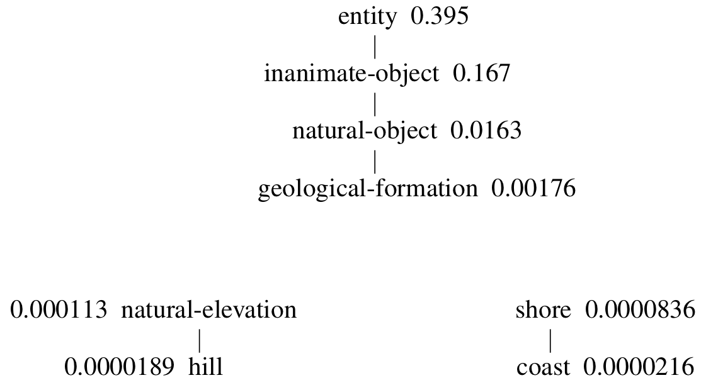
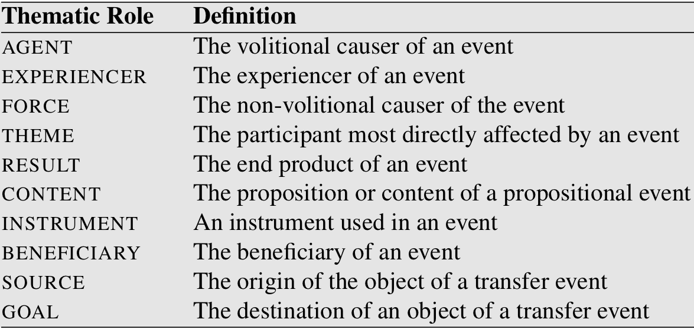
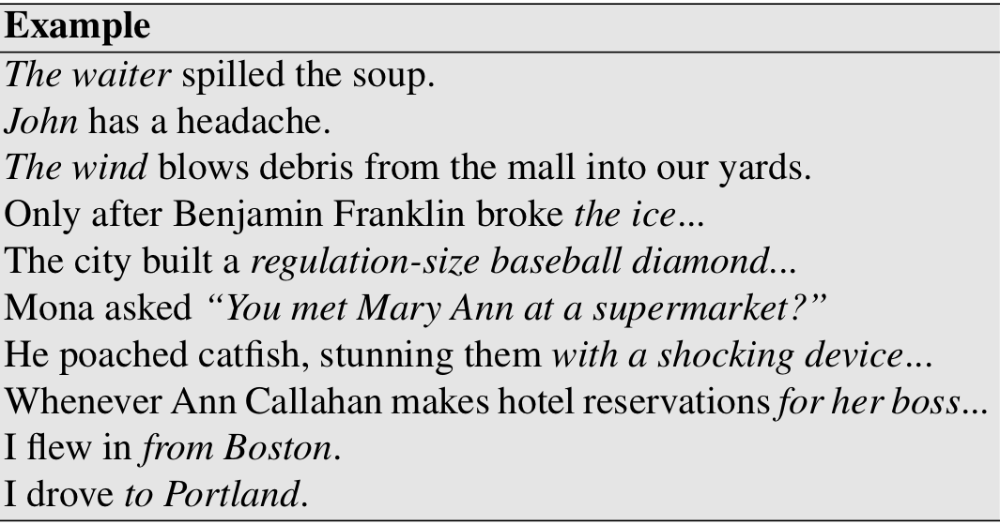
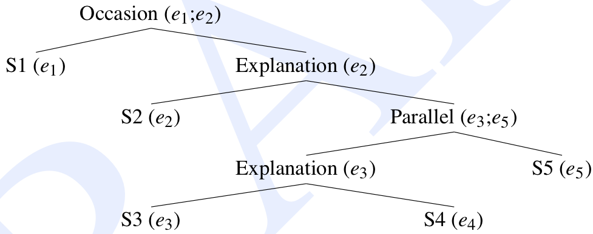

class: center, middle
# Computational Linguistics 
## 11. Semantic Role Labeling  and Computational Discourse

** Xiaojing Bai **

** Tsinghua University **

** https://bxjthu.github.io/CompLing **

---

## At the end of this session you will

+ know about how to measure word similarity

+ understand the importance of evaluation in NLP

+ know about how semantic roles are modeled

+ know about the tasks of computational discourse

+ understand what coherence means and how to describe coherence relations

+ know about automatic coherence assignment and reference resolution

---

## Recap: Word similarity

+ A fundamental task for semantic models is to predict how similar two words’ meanings are

+ Applications: query expansion, learning sentiment lexicons, paraphrasing...

+ [WordNet::Similarity](http://maraca.d.umn.edu/cgi-bin/similarity/similarity.cgi)

  "We observe that humans find it extremely easy to say if two words are related and if one word is more related to a given word than another. For example, if we come across two words -- 'car' and 'bicycle', we know they are related as both are means of transport. Also, we easily observe that 'bicycle' is more related to 'car' than 'fork' is. But is there some way to assign a quantitative value to this relatedness?"

---
## Word similarity vs. word relatedness

Mug, cup, coffee, croissant

&nbsp;&nbsp;&nbsp;&nbsp;&nbsp;&nbsp;

---
## Word similarity vs. word relatedness

Mug, cup, coffee, croissant

&nbsp;&nbsp;&nbsp;&nbsp;&nbsp;&nbsp;

+ Word similarity - a subcase of word relatedness

+ Not distinguished in the following measuring algorithms

---

## Algorithms to measure word similarity

+ Distributional algorithms

+ Thesaurus-based algorithms

  + Goal: To measure the distance between two senses in a thesaurus like WordNet or [MeSH](https://www.nlm.nih.gov/mesh/)

  + The hypernym/hyponym .smaller[(is-a or subsumption)] hierarchy .smaller[(noun-noun, verb-verb)]

---

## Algorithms to measure word similarity: thesaurus-based

+ The simplest algorithm: path-length based similarity

.left-column-4[
$pathlen(c_1,c_2)$ = .smaller[1 + the number of edges in the shortest path in the thesaurus graph between the sense nodes $c_1$ and $c_2$]

$sim_{path}(c_1,c_2) = \frac{1}{pathlen(c_1,c_2)}$

$wordsim(w_1,w_2) = \underset{c_1 \in senses(w_1) \atop c_2 \in senses(w_2)}{\text{max}} sim(c_1,c_2)$

 
.smaller[
[WordNet::Similarity](http://maraca.d.umn.edu/cgi-bin/similarity/similarity.cgi)
]
]

.right-column-4[

]

???
For most applications, we don’t have sense-tagged data, and thus we need our algorithm to give us the similarity between words rather than between senses or concepts.

Approximate the correct similarity (which would require sense disambiguation) by just using the pair of senses for the two words that results in maximum sense similarity.
---

## Algorithms to measure word similarity: thesaurus-based

+ The implicit assumption of the basic path-length algorithm

  Each link in the network represents a uniform distance.

  .left-column-2[
  But some links .smaller[(e.g., deep in the WordNet hierarchy)] often seem to represent an intuitively narrow distance, while other links .smaller[(e.g., higher up in the WordNet hierarchy)] represent an intuitively wider distance.

  Resnik (1995)
  ]
  .right-column-2[
  
  ]

???
For example, the distance from nickel to money (5) seems intuitively much shorter than the distance from nickel to an abstract word standard; the link between medium of exchange and standard seems wider than that between, say, coin and coinage.
---

## Algorithms to measure word similarity: thesaurus-based

+ More fine-grained metrics, e.g., information-content similarity

  + Associating probabilities with concepts in the taxonomy
  + Avoiding the unreliability of edge distances

.left-column-2[
$P(c) = \frac{\sum_{w \in words(c)} count(w)}{N}$

.smaller[
$P(c)$: the probability of encountering an instance of concept c in the corpus;

$words(c)$: the set of words subsumed by concept $c$;

$N$: the total number of words in the corpus that are also present in the thesaurus.
]

.smaller[
.right[[WordNet::Similarity](http://maraca.d.umn.edu/cgi-bin/similarity/similarity.cgi)]]
]
.right-column-4[

]

---

## Evaluating thesaurus-based similarity

+ NLP evaluation

  "As the engineering branch of computational linguistics, natural language processing is concerned with the creation of artifacts that accomplish tasks. The operative question in evaluating an NLP algorithm or system is therefore the extent to which it produces the results for which it was designed. " (Resnik & Lin, 2010)

+ Evaluation metrics for thesaurus-based similarity: correlation coefficient

  + Human-labeled datasets
  + TOEFL dataset
  + Contextual dataset
  + End-applications

---

## Word similarity vs. word relatedness

Mug, cup, coffee, croissant

&nbsp;&nbsp;&nbsp;&nbsp;&nbsp;&nbsp;

+ Word similarity - a subcase of word relatedness

+ Not distinguished in many measuring algorithms

---

## Measure of the association between words

+ Simple frequency isn’t the best measure!

  Words that are frequent but not informative or discriminative: _the, it, they_

+ Positive Pointwise Mutual	Information	(PPMI)

$$ I(x,y) = \log_2 \frac{P(x,y)}{P(x)P(y)}  \qquad  PMI(w,c) = \log_2 \frac{P(w,c)}{P(w)P(c)} $$

 
$$ PPMI(w,c) = max (\log_2 \frac{P(w,c)}{P(w)P(c)} ,0)$$

???
Logarithms can be used to simplify calculations, as the addition and subtraction of logarithms is equivalent to multiplication and division, though the use of printed tables of logarithms for this has declined with the spread of electronic calculators.

---

## Semantic role labeling

+ Applications: question answering, dialogue systems, machine translation, etc.

+ Grammatical function vs. semantic role

  + Grammatical function: subject, object, prepositional complement, ...
  + Semantic role: agent, patient, theme, goal, ...
  + Argument alternations
  .smaller[
  Mary broke the window. 
  The window broke. 
  The window was broken (by Mary).]
  + Syntactic annotation (of grammatical functions)

      Identifying only surface subjects  
      Disregarding differences in semantic roles
---

## Commonly used thematic roles

+ One of the oldest linguistic models by Panini (7th-4th centuries BCE)

+ Modern formulation by Fillmore (1968) and Gruber (1965)

???
Panini |ˈpɑːnɪni|: Indian grammarian
---

## Alternative semantic role models

+ Define generalized semantic roles that abstract over the specific thematic roles

+ Define semantic roles that are specific to a particular verb or a particular group of semantically related verbs or nouns

+ Two commonly used lexical resources

  + PropBank

  + FrameNet

   
  Food for your thought: How would _PropBank_ and _FrameNet_ be used?

---

## The Proposition Bank (PropBank)

+ Sentences annotated with semantic roles

+ Semantic roles defined with respect to individual verb senses

+ Semantic roles numbered rather than named, e.g. Arg0, Arg1, Arg2, etc.

  + Arg0: the PROTO-AGENT
  + Arg1: the PROTO-PATIENT
  + Arg2: the benefactive, instrument, attribute, or end state
  + Arg3: the start point, benefactive, instrument, or attribute
  + Arg4: the end point

  [John]$ \scriptscriptstyle{ARG0} $ broke [the window]$ \scriptscriptstyle{ARG1} $

  [The window]$ \scriptscriptstyle{ARG1}$ broke

---

## PropBank: functional tags for modifiers
.left-column-2[
+ LOC: location
+ EXT: extent
+ CAU: cause
+ TMP: time
+ MNR: manner
+ DIR: direction
+ PNC: purpose
+ ADV: general-purpose
+ NEG: negation marker
+ MOD: modal verb
]
.right-column-2[
_Mr. Bush met him privately, in the White House, on Thursday._

REL: _met_ 
ARG0: _Mr. Bush_ 
ARG1: _him_ 
ARGM-MNR: _privately_ 
ARGM-LOC: _in the White House_ 
ARGM-TMP: _on Thursday_
]

.smaller[
.right[https://propbank.github.io/
]]
---

## PropBank: creation

+ Extraction of all Penn Treebank II sentences for a given verb

+ Automatic tagging of semantic roles

+ Manual correction by annotators

+ Adjudication of tagging disagreements

---

## FrameNet

A highly detailed lexicon of English predicates based on Frame Semantics

+ The basic assumption of Frame Semantics (Fillmore et al., 2002): Each word in a given meaning evokes a particular frame and possibly profiles some element or aspect of that frame.

+ Semantic frames are schematic representations of situations involving various participants, props, and other conceptual roles.

+ Frames are annotated for events, states, and relations

+ Frames connected to each other by frame-to-frame relations

---

## FrameNet: important terms

+ Frame Elements (FEs)

  + The participants, props, and roles of a frame
  + Including agents, inanimate objects, and elements of the setting
  + Corresponding roughly to syntactic dependents (arguments and adjuncts)

+ Lexical Units (LUs)

  A pairing of a lemma and frame - i.e. a "word" taken in one of its senses, e.g. the verb _tie_ in the _Attaching_ frame

---

## FrameNet: important terms

+ Valence: the particular kinds of constituents, in terms of semantic roles, grammatical functions, and phrase types, with which a word combines in a grammatical sentence

  + Semantic valence: the frame that underlies the meaning of a word, and the number and kinds of entities that participate in the situation instantiating the frame

  + Syntactic valence: the number and type of syntactic constituents that are dependent on, or in construction with a word

.smaller[
.right[
https://framenet.icsi.berkeley.edu/]]

---
## Computational discourse

Previously: language phenomena operating at the word or sentence level

+ Discourse tasks

  + Discourse Segmentation

  + Reference Resolution (esp. anaphora resolution)

+ A discourse: a coherent structured group of sentences

---
## Coherence

+ A property of well-written texts

+ Ensuring that sentences in the texts are meaningfully related

  + Thematic organization
  + Temporal organization
  + ...
  + NOT a random juxtaposition

+ Making texts easier to read and understand

+ Two aspects of coherence

  + Coherence relations
  + Entity-based coherence

---

## Coherence relations

John hid Bill’s car keys. He was drunk.

John hid Bill’s car keys. He likes spinach.

---

## Entity-based coherence

a. John went to his favorite music store to buy a piano. 
b. He had frequented the store for many years. 
c. He was excited that he could finally buy a piano. 
d. He arrived just as the store was closing for the day.

a. John went to his favorite music store to buy a piano. 
b. It was a store John had frequented for many years. 
c. He was excited that he could finally buy a piano. 
d. It was closing just as John arrived.

---

## Coherence relations between sentences

The Tin Woodman was caught in the rain. His joints rusted.

John hid Bill’s car keys. He was drunk.

The Scarecrow wanted some brains. The Tin Woodman wanted a heart.

Dorothy was from Kansas. She lived in the midst of the great Kansas prairies.

Dorothy picked up the oil-can. She oiled the Tin Woodman’s joints.

---

## Coherence relations between sentences: Hobbs (1979)

+ Result: Infer that the state or event asserted by S0 causes or could cause the state or event asserted by S1.

  .smaller[_The Tin Woodman was caught in the rain. His joints rusted._]

+ Explanation: Infer that the state or event asserted by S1 causes or could cause the state
or event asserted by S0.

  .smaller[_John hid Bill’s car keys. He was drunk._]

+ Parallel: Infer p(a1,a2,...) from the assertion of S0 and p(b1,b2,...) from the assertion of S1, where ai and bi are similar, for all i.

  .smaller[_The Scarecrow wanted some brains. The Tin Woodman wanted a heart._]

---

## Coherence relations between sentences: Hobbs (1979)

+ Elaboration: Infer the same proposition P from the assertions of S0 and S1.

  .smaller[_Dorothy was from Kansas. She lived in the midst of the great Kansas prairies._]

+ Occasion: A change of state can be inferred from the assertion of S0, whose final state can be inferred from S1, or a change of state can be inferred from the assertion of S1, whose initial state can be inferred from S0.

  .smaller[_Dorothy picked up the oil-can. She oiled the Tin Woodman’s joints._]

---

## Coherence relations in a discourse

John went to the bank to deposit his paycheck. (S1)

He then took a train to Bill’s car dealership. (S2)

He needed to buy a car. (S3)

The company he works for now isn’t near any public transportation. (S4)

He also wanted to talk to Bill about their softball league. (S5)

---

## Coherence relations in a discourse

.smaller[
John went to the bank to deposit his paycheck. (S1)

He then took a train to Bill’s car dealership. (S2)

He needed to buy a car. (S3)

The company he works for now isn’t near any public transportation. (S4)

He also wanted to talk to Bill about their softball league. (S5)
]

---

## Coherence relations between sentences: RST

+ Rhetorical Structure Theory (RST)

+ A model of text organization for text generation (Mann & Thompson, 1987)

+ A set of 23 rhetorical relations held between spans of text within a discourse

  + The nucleus: the unit that is more central to the writer’s purpose and interpretable independently

  + The satellite: the unit that is less central and generally only interpretable with respect to the nucleus

  E.g., The _Evidence_ relation: a satellite presents evidence for the proposition or situation expressed in the nucleus.

  _Kevin must be here. His car is parked outside._

---

## RST: examples

.smaller[
.right[
http://www.sfu.ca/rst/01intro/intro.html

http://123.56.88.210/demo/depannotate/
]
]

---

## RST: examples

---

## Automatic coherence assignment

+ Assigning a relation between two sentences

+ Extracting a tree or graph representing an entire discourse

+ Discourse parsing

+ A shallow cue-phrase-based algorithm for coherence extraction

  1. Identify the cue phrases or discourse markers in a text;

  2. Segment the text into discourse segments, using cue phrases;

  3. Classify the relationship between each consecutive discourse segment, using cue phrases.

---

## Reference resolution

.smaller[Victoria Chen, Chief Financial Officer of Megabucks Banking Corp since 2004, saw her pay jump 20%, to $1.3 million, as the 37-year-old also became the Denver-based financial-services company’s president. It has been ten years since she came to Megabucks from rival Lotsabucks.]

+ The task: What entity is being talked about by each NP?

+ Reference: the use of linguistic expressions to denote an entity or individual

+ Referring expression: a linguistic expression used to perform reference

+ Referent: the entity that is referred to

---
## Referring expressions

+ Indefinite noun phrases: introduce new entities into the discourse  
  e.g. a pair of stove-lids

+ Definite noun phrases: refer to entities that are uniquely identifiable  
  e.g. the room

+ (Personal) pronouns: refer to entities with a high degree of salience  
  e.g. she, them

+ Demonstrative pronouns: refer to entities and events  
  e.g. this (room), (I had not expected) that

+ Proper nouns: evoke uniquely identifiable known entity  
  e.g. Beijing, Tsinghua
---

## Coreference vs. anaphora

.smaller[Victoria Chen, Chief Financial Officer of Megabucks Banking Corp since 2004, saw her pay jump 20%, to $1.3 million, as the 37-year-old also became the Denver-based financial-services company’s president. It has been ten years since she came to Megabucks from rival Lotsabucks.]

+ Anaphora: reference to an entity previously introduced into the discourse

  + Antecedent: an earlier word, phrase, or clause to which another word (especially a following relative pronoun) refers back
  + Anaphor: a word or phrase that refers back to an earlier word or phrase

+ Cataphora: the phenomenon where the anaphor precedes the antecedent  
  .smaller[e.g. After his class, John will play football.]

+ Coreference: reference to an entity by two or more referring expressions

  + Coreference chain: a set of coreferring expressions that corefer

---

## Reference resolution

+ Reference resolution: to determine what entities are referred to by which linguistic expressions

  + Anaphora resolution: to find an antecedent for each anaphor (typically, third person pronoun)

  + Coreference resolution: to find the referring expressions that refer to the same entity

---

## Pronominal anaphora resolution: the task

+ The input
  + A single pronoun (he, him, she, her, it, and sometimes they/them)
  + The previous context

+ The Output
  + The antecedent of the pronoun in this context

+ Constraints on possible referents
  + Hard constraints
  + Soft constraints

---

## Pronominal anaphora resolution: hard constraints

+ Number agreement: singular, plural

+ Person agreement: first, second, third

+ Gender agreement: masculine, feminine, non-personal

+ Binding theory constraints

Note: A complete statement of the constraints requires reference to semantic and other factors, and cannot be stated purely in terms of syntactic configuration.

---

## Pronominal anaphora resolution: binding theory constraints

Chomsky (1981)

+ Principle A: Reflexives must have local antecedents 

  .smaller[(1) **John$_i$** washed **himself$_i$**.  (2) **John$_i$** asked Mary to wash **himself$_i$**.]

+ Principle B: Personal pronouns must not have local antecedents 

  .smaller[(1) **John$_i$** asked Mary to wash **him$_i$**.  (2) **John$_i$** washed **him$_i$**.]

+ Principle C: An R-expression must not have an antecedent that c-commands it  

  .smaller[**John$_i$** saw **John$_i$**.]

---

## Pronominal anaphora resolution: soft constraints

+ Selectional restrictions: Verbs impose semantic constraints on the kind of concepts that are allowed to be their arguments

  .smaller[John parked his car in the garage after driving it around for hours.]

+ Recency: Entities introduced in recent utterances are more likely to be referred to by a pronoun than entities introduced in utterances further back.

  .smaller[The doctor found an old map in the captain’s chest. Jim found an even older map hidden on the shelf. It described an island.]

---

## Pronominal anaphora resolution: soft constraints

+ Grammatical role: Entities introduced in subject position tend to get topicalised and are more likely to be referred to by a pronoun than entities in object positions.

  .smaller[Jim Hawkins went to the bar with Billy Bones. He called for a glass of rum.]

+ Repeated mention: Entities that have already been referred to frequently are more likely to be pronominalised than those that have not.

  .smaller[Billy Bones had been thinking about a glass of rum ever since the pirate ship docked. He hobbled over to the Old Parrot bar. Jim Hawkins went with him. He called for a glass of rum.]

---

## Pronominal anaphora resolution: soft constraints

+ Parallelism: Pronouns are more likely to refer to those entities that do not violate syntactically parallel constructions.

  .smaller[Long John Silver went with Jim to the Old Parrot. Billy Bones went with him to the Old Anchor Inn.]

+ Verb semantics: Certain verbs appear to place a semantically-oriented emphasis on one of their argument positions, which can have the effect of biasing the manner in which subsequent pronouns are interpreted.

  .smaller[John telephoned Bill. He had lost the laptop.

  John criticised Bill. He had lost the laptop.]

---

## Pronominal anaphora resolution: three algorithms

+ Many factors influence pronominal anaphora resolution.

+ Many of these factors might contradict each other for specific examples.

+ No pronoun resolution algorithm successfully accounts for all these factors.

+ Three algorithms
  + Purely syntax-based (Hobbs, 1978)
  + Centering (Grosz et al., 1995)
  + Supervised ML

---

## At the end of this session you will

+ know about how to measure word similarity

+ understand the importance of evaluation in NLP

+ know about how semantic roles are modeled

+ know about the tasks of computational discourse

+ understand what coherence means and how to describe coherence relations

+ know about automatic coherence assignment and reference resolution

---

##Assignment

** 1. Review **

+ [J+M[3rd]_22](https://bxjthu.github.io/CompLing/readings/11_J+M[3rd]_22.pdf)

+ [J+M_21](https://bxjthu.github.io/CompLing/readings/11_J+M_21.pdf)

** 2. Review **

+ [Exercise - Practical 6 solution](https://bxjthu.github.io/CompLing/slides/prac/ngram_sol.py)

---
class: center, middle
## Next session

NLP Applications - 1
