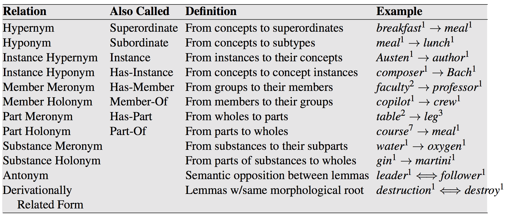
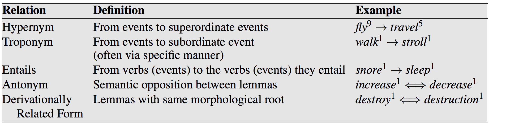
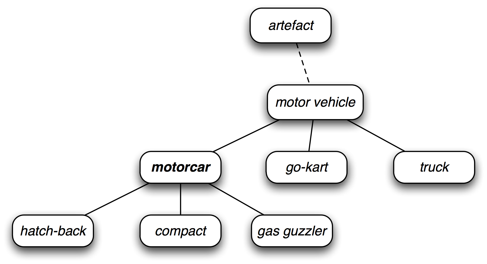
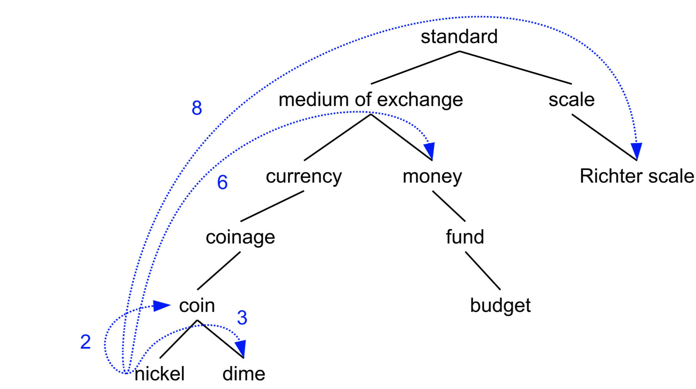

class: center, middle
# Computational Linguistics 
## 11. More on WordNet

** Xiaojing Bai **

** Tsinghua University **

** https://bxjthu.github.io/CompLing **

---

## More on WordNet

+ What is it?

+ How does it look like?

+ How to use it?

---
## WordNet: What is it?

+ WordNet 3.1

+ Thesaurus: a structured list of words organized by meaning

+ A lexical database of English

+ Three databases: 1) nouns, 2) verbs, 3) adjectives and adverbs

+ Defining a sense through its relationship with other senses

+ The most commonly used resource for English sense relations

---
## Noun relations in WordNet

---
## Verb relations in WordNet

---

## More details about WordNet

+ [WordNet online](http://wordnetweb.princeton.edu/perl/webwn)

+ [Database statistics](https://wordnet.princeton.edu/documentation/wnstats7wn)

+ [A glossary of WordNet terms](https://wordnet.princeton.edu/documentation/wngloss7wn)

+ [Five Papers on WordNet](http://wordnetcode.princeton.edu/5papers.pdf)

+ [Frequently Asked Questions](https://wordnet.princeton.edu/frequently-asked-questions)

+ [Wordnet with NLTK](http://www.nltk.org/book/ch02.html#wordnet)

---
## WordNet: How does it look like?

+ [WordNet 3.1 database files](http://wordnetcode.princeton.edu/wn3.1.dict.tar.gz)

  Samples: [index.noun](index.noun); [data.noun]([data.noun)

+ WordNet concept hierarchy

  

---
## WordNet: How to use it?

+ [Related projects](https://wordnet.princeton.edu/related-projects)

+ Measuring word similarity with WordNet

  + A fundamental task for semantic models is to predict how similar two words’ meanings are

  + Thesaurus methods

  + Goal: To measure how close the two target words are within the hierarchy

---

## Word similarity: path-length based algorithm
.left-column-2[
+ Basic intuition
+ Implicit assumption

\\(\text{pathlen}(c_1,c_2)\\) = 1 + the number of edges in the shortest path in the thesaurus graph between the sense nodes \\(c_1\\) and \\(c_2\\)

$$\text{sim}_\text{{path}}(c_1,c_2)=\frac{1}{\text{pathlen}(c_1,c_2)}$$

$$\text{wordsim}(w_1,w_2)= \underset{c_1 \in \text{senses}(w_1) \atop c_2 \in \text{senses}(w_2)}{\text{max}}\text{sim}(c_1,c_2)$$

]

.right-column-2[

]

---
## Word similarity: refined algorithms

+ [WordNet::Similarity](http://maraca.d.umn.edu/cgi-bin/similarity/similarity.cgi)

+ [Computing semantic similarity with NLTK](http://www.nltk.org/book/ch02.html#wordnet)

---
## Related projects

+ [Wordnets in the World](http://globalwordnet.org/wordnets-in-the-world/)

+ [Semantic networks - in languages other than English](https://wordnet.princeton.edu/related-projects)

+ Chinese Object-Oriented Lexicon (introduced by Zheng Hua)

---
## Voluntary research tasks: online language resources for NLP

Introduce an online language resource for NLP, together with the possible applications that interest you most. Such as:
+ Online search engines equipped with big corpora
  + [Word Sketch Engine](https://www.sketchengine.co.uk/)
  + [Google Ngram](https://books.google.com/ngrams) .smaller[(Wiki: [Google Ngram Viewer](https://en.wikipedia.org/wiki/Google_Ngram_Viewer))]
  + [WebCorp Search Engine](http://www.webcorp.org.uk/live/index.jsp)
  + [CCL Corpus Search Engine](http://ccl.pku.edu.cn:8080/ccl_corpus/) (PKU)
  + [BCC Corpus Search Engine](http://bcc.blcu.edu.cn/) (BLCU)
  + ...
+ Knowledge bases
  + [HowNet](http://www.keenage.com/html/e_index.html) (Zhendong Dong)
  + [The Emotion Ontology](http://ir.dlut.edu.cn/EmotionOntologyDownload) (Dalian University of Technology)
  + ...

---
## Voluntary research tasks: WSD algorithms

+ Supervised
.smaller[
  We know the answers for many examples and can use them to learn from their (automatically determinable) characteristics. We then apply the learned model to a comparable set of examples (not the same ones).
]
+ Weakly supervised (knowledge-based)
.smaller[
  We start with no known answers, but we use secondary texts (dictionary glosses) to infer underlying relationships through the Lesk algorithm.
]
+ Semi-supervised
.smaller[
  We know the answers for a small number of examples, and can gain more examples from the data by finding similar cases and inferring the answers they should have through bootstrapping.
]
+ Unsupervised
.smaller[
  We start with no known answers, and no predefined senses. The set of “senses” is created automatically from the instances of each word in the training set.
]

---

## Important events for the remaining weeks

\\(\surd\\) Week 12: Teamwork presentation

\\(\Box\\) Week 13: Quiz 9

\\(\Box\\) Week 14: Term project milestone 1 [idea(s)]

\\(\Box\\) Week 15: Term project milestone 2 [literature review]

\\(\Box\\) Week 16: Final exam

\\(\Box\\) Week 17: Term project milestone 3 [methodology]

\\(\Box\\) Week 18: Term project milestone 4 [final submission]

---

##Homework

+ Read/Review (Quiz 9 on Dec. 12, 2018)

  + [J+M_6](https://bxjthu.github.io/CompLing/readings/9/J+M_6.pdf) (6.1-6.7)
  + [J+M_C](https://bxjthu.github.io/CompLing/readings/10/J+M_C.pdf) (C.1-C.4)

+ Practice

  + http://www.nltk.org/book/ch02.html#wordnet

---
class: center, middle
## Next session

Semantic Role Labeling and Computational Discourse
