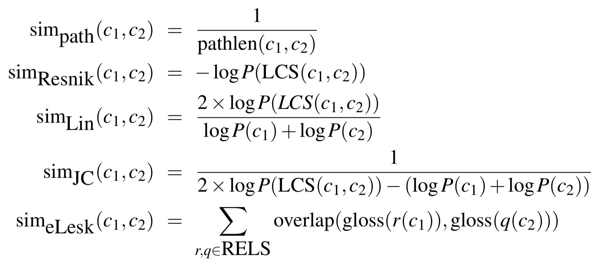

class: center, middle
# Computational Linguistics 
## 11. More on WordNet

** Xiaojing Bai **

** Tsinghua University **

** https://bxjthu.github.io/CompLing **

---

## More on WordNet

+ What is it?

+ How does it look like?

+ How to use it?

---
## WordNet: What is it?

+ WordNet 3.1

+ Thesaurus: a structured list of words organized by meaning

+ A lexical database of English

+ Three databases: 1) nouns, 2) verbs, 3) adjectives and adverbs

+ Defining a sense through its relationship with other senses

+ The most commonly used resource for English sense relations

---
## Noun relations in WordNet

---
## Verb relations in WordNet

---

## More details about WordNet

+ [WordNet online](http://wordnetweb.princeton.edu/perl/webwn)

+ [Database statistics](https://wordnet.princeton.edu/documentation/wnstats7wn)

+ [A glossary of WordNet terms](https://wordnet.princeton.edu/documentation/wngloss7wn)

+ [Five Papers on WordNet](http://wordnetcode.princeton.edu/5papers.pdf)

+ [Frequently Asked Questions](https://wordnet.princeton.edu/frequently-asked-questions)

+ [Wordnet with NLTK](http://www.nltk.org/book/ch02.html#wordnet)

---
## WordNet: How does it look like?

+ [WordNet 3.1 database files](http://wordnetcode.princeton.edu/wn3.1.dict.tar.gz)

  Samples: [index.noun](index.noun); [data.noun]([data.noun)

+ WordNet concept hierarchy

  

---
## WordNet: How to use it?

+ [Related projects](https://wordnet.princeton.edu/related-projects)

+ Measuring word similarity with WordNet

  + A fundamental task for semantic models is to predict how similar two words’ meanings are

  + Thesaurus methods

  + Goal: To measure how close the two target words are within the hierarchy

---

## Word similarity: path-length based algorithm
.left-column-2[
+ Basic intuition
+ Implicit assumption

\\(\text{pathlen}(c_1,c_2)\\) = 1 + the number of edges in the shortest path in the thesaurus graph between the sense nodes \\(c_1\\) and \\(c_2\\)

$$\text{sim}_\text{{path}}(c_1,c_2) = \frac{1}{\text{pathlen}(c_1,c_2)}$$

$$\text{wordsim}(w_1,w_2) = \underset{c_1 \in \text{senses}(w_1) \atop c_2 \in \text{senses}(w_2)}{\text{max}}\text{sim}(c_1,c_2)$$

]

.right-column-2[

]

---
## Word similarity: refined algorithms

+ More fine-grained metrics, e.g., information-content word similarity

  + Structure of the thesaurus
  + Probabilistic information derived from a corpus

.left-column-2[
$$P(c) = \frac{\sum_{w \in words(c)} count(w)}{N}$$

.smaller[
\\(P(c)\\): the probability of encountering an instance of concept c in the corpus;

\\(words(c)\\): the set of words subsumed by concept \\(c\\);

\\(N\\): the total number of words in the corpus that are also present in the thesaurus.
]
]
.right-column-4[

]

---
## Word similarity: refined algorithms

+ More fine-grained metrics, e.g., information-content word similarity

  + Structure of the thesaurus
  + Probabilistic information derived from a corpus

.left-column-2[
$$P(c) = \frac{\sum_{w \in words(c)} count(w)}{N}$$

$$\text{IC}(c) = - \log P(c)$$

$$\text{sim}_\text{{Resnik}}(c_1,c_2) = - \log P(\text{LCS}(c_1,c_2))$$
]

.right-column-4[

]

---
## Logarithms

+ Logarithms can be used to simplify calculations, as the addition and subtraction of logarithms is equivalent to multiplication and division, though the use of printed tables of logarithms for this has declined with the spread of electronic calculators... The base of a common logarithm is 10, and that of a natural logarithm is the number e (2.71828 …) .smaller[(Source: Oxford dictionary)]

+ The logarithm of x to base b is denoted as logb (x) (or, without parentheses, as logb x, or even without explicit base as log x, when no confusion is possible). .smaller[(Source: Wiki)]

+ 在l(x)的定义中，log对数操作既可以以2为底，也可以以e为底，但它们没有本质区别，只差一个固定的倍数。当讨论信息编码的时候，采用以2为底比较方便，这时候I(x)的单位是bit；而讨论机器学习的时候，以e为底比较方便。.smaller[(source: http://zhangtielei.com/posts/blog-deep-learning-foundation.html)]

???
$$\text{sim}_\text{{Resnik}}(c_1,c_2) = - \log P(\text{LCS}(c_1,c_2))$$

$$\text{sim}_\text{{Lin}}(c_1,c_2) = \frac{2 \times \log P(\text{LCS}(c_1,c_2))}{\log P(c_1) + \log P(c_2)}$$

$$\text{sim}_\text{{JC}}(c_1,c_2) = \frac{1}{2 \times \log P(\text{LCS}(c_1,c_2))- (\log P(c_1) + \log P(c_2))}$$

$$\text{sim}_\text{{eLesk}}(c_1,c_2) = \sum_{r,q \in \text{RELS}} \text{overlap} ( \text{gloss}(r(c_1)),  \text{gloss}(q(c_2))\)$$
---
## Word similarity: five thesaurus/dictionary-based similarity measures

+ [WordNet::Similarity](http://maraca.d.umn.edu/cgi-bin/similarity/similarity.cgi)

+ [Computing semantic similarity with NLTK](http://www.nltk.org/book/ch02.html#wordnet)

---

## Evaluating thesaurus-based similarity

+ NLP evaluation

  "As the engineering branch of computational linguistics, natural language processing is concerned with the creation of artifacts that accomplish tasks. The operative question in evaluating an NLP algorithm or system is therefore the extent to which it produces the results for which it was designed. " (Resnik & Lin, 2010)

+ Evaluation metrics
  + Correlation coefficient:  (1)human-labeled datasets; (2)TOEFL datasets; (3)contextual datasets

  + End-application embedment

---
## Related projects

+ [Wordnets in the World](http://globalwordnet.org/wordnets-in-the-world/)

+ [Semantic networks - in languages other than English](https://wordnet.princeton.edu/related-projects)

+ Chinese Object-Oriented Lexicon (introduced by Zheng Hua)

---

## Recap: Algorithms to measure word similarity

+ Thesaurus-based algorithms

+ Distributional algorithms 

  Cosine for measuring word similarity

  + Word similarity as vector similarity

  + Vector similarity as the cosine of the angle between the vectors

---
## Recap: Word similarity vs. word relatedness

Mug, cup, coffee, croissant

&nbsp;&nbsp;&nbsp;&nbsp;&nbsp;&nbsp;

+ Word similarity - a subcase of word relatedness

+ Not distinguished in the following measuring algorithm

---
## Recap: Measure of the association between words

Positive Pointwise Mutual	Information	(PPMI)

How much more are the two words co-occurring in our corpus than we would have a priori expected them to appear by chance?
  

$$ PMI(w,c) = \log_2 \frac{P(w,c)}{P(w)P(c)} $$

$$ PPMI(w,c) = max (\log_2 \frac{P(w,c)}{P(w)P(c)} ,0)$$

---
## Recap: Word sense disambiguation (WSD)

+ Lexical ambiguity and an avalanche of competing interpretations

+ WSD: the task of selecting the correct sense for a word
  + Input: a word in context along with a fixed inventory of potential senses 
  + Output: the correct word sense for that use

  _Reports said the plant was likely to close in December, leaving many jobless._  
  plant 1: leafy green organism 
  plant 2: equipment and fixtures for manufacturing 

+ Applications
---
## Voluntary research tasks: WSD algorithms

+ [Supervised](Supervised_WSD.pdf)
.smaller[
  We know the answers for many examples and can use them to learn from their (automatically determinable) characteristics. We then apply the learned model to a comparable set of examples (not the same ones).
]
+ Weakly supervised (knowledge-based)
.smaller[
  We start with no known answers, but we use secondary texts (dictionary glosses) to infer underlying relationships through the Lesk algorithm.
]
+ Semi-supervised
.smaller[
  We know the answers for a small number of examples, and can gain more examples from the data by finding similar cases and inferring the answers they should have through bootstrapping.
]
+ [Unsupervised](Unsupervised_WSD.pdf)
.smaller[
  We start with no known answers, and no predefined senses. The set of “senses” is created automatically from the instances of each word in the training set.
]

---

## Important events for the remaining weeks

\\(\surd\\) Week 12: Teamwork presentation

\\(\surd\\) Week 13: Quiz 9

\\(\Box\\) Week 14: Term project milestone 1 [idea(s)] (5%)

\\(\Box\\) Week 15: Term project milestone 2 [literature review] (10%)

\\(\Box\\) Week 16: Final exam

\\(\Box\\) Week 17: Term project milestone 3 [methodology] (10%)

\\(\Box\\) Week 18: Term project milestone 4 [final submission] (10%)

---

##Homework

+ Read/Review (Quiz 9 on Dec. 12, 2018)

  + [J+M_6](https://bxjthu.github.io/CompLing/readings/9/J+M_6.pdf) (6.1-6.7)
  + [J+M_C](https://bxjthu.github.io/CompLing/readings/10/J+M_C.pdf) (C.1-C.4)

+ Practice

  + http://www.nltk.org/book/ch02.html#wordnet

---
class: center, middle
## Next session

Semantic Role Labeling
