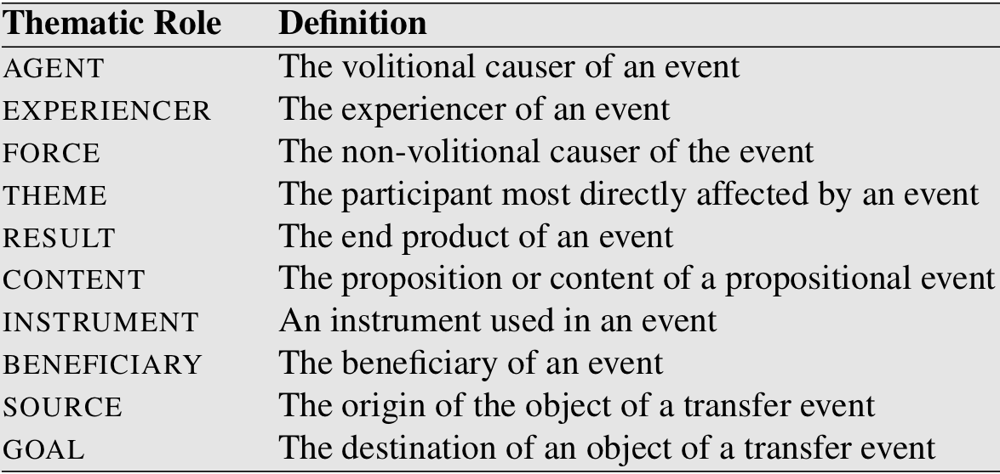

class: center, middle
# Computational Linguistics 
## 12. Semantic Role Labeling

** Xiaojing Bai **

** Tsinghua University **

** https://bxjthu.github.io/CompLing **

---

## At the end of this session you will

+ understand what are semantic roles

+ know about how semantic roles are modeled

+ know about two commonly used lexical resources with semantic roles

+ know about how semantic roles are labeled

---

## Semantic role labeling

+ The earliest linguistic realization of events and their participants

+ Applications: question answering, dialogue systems, machine translation, etc.

+ Grammatical function vs. semantic role
  + Grammatical function: subject, object, prepositional complement, ...
  + Semantic role: agent, patient, theme, goal, ...

+ Semantic roles
  + Representations that express the abstract role that arguments of a predicate can take in the event
  + Shallow meaning representations
  + Representations that capture the semantic commonality between linguistic expressions

---

## Commonly used thematic roles

+ Semantic roles - the general term for all sets of roles, large or small

+ No universally agreed-upon set of roles

+ One of the oldest linguistic models by Panini (7th-4th centuries BCE)

+ Modern formulation by Fillmore (1968) and Gruber (1965)

???
Panini |ˈpɑːnɪni|: Indian grammarian

---

## Diathesis alternations .smaller[(aka: argument alternations, verb alterations)]

+ Diathesis: the set of syntactic patterns with which a verb or other word is most typically associated

+ The multiple argument structure realizations

  

---

## Alternative semantic role models

+ Define generalized semantic roles that abstract over the specific thematic roles

+ Define semantic roles that are specific to a particular verb or a particular group of semantically related verbs or nouns

+ Two commonly used lexical resources

  + PropBank

  + FrameNet

   
  Food for your thought: How would _PropBank_ and _FrameNet_ be used?

---

## The Proposition Bank (PropBank)

+ Sentences annotated with semantic roles

+ Semantic roles defined with respect to individual verb senses

+ Semantic roles numbered rather than named, e.g. Arg0, Arg1, Arg2, etc.

  + Arg0: the PROTO-AGENT
  + Arg1: the PROTO-PATIENT
  + Arg2: the benefactive, instrument, attribute, or end state
  + Arg3: the start point, benefactive, instrument, or attribute
  + Arg4: the end point

  [John]\\(\scriptscriptstyle{ARG0} \\) broke [the window] \\(\scriptscriptstyle{ARG1} \\)

  [The window]\\(\scriptscriptstyle{ARG1}\\) broke

---

## PropBank: functional tags for modifiers
.left-column-2[
+ LOC: location
+ EXT: extent
+ CAU: cause
+ TMP: time
+ MNR: manner
+ DIR: direction
+ PNC: purpose
+ ADV: general-purpose
+ NEG: negation marker
+ MOD: modal verb
]
.right-column-2[
_Mr. Bush met him privately, in the White House, on Thursday._

REL: _met_ 
ARG0: _Mr. Bush_ 
ARG1: _him_ 
ARGM-MNR: _privately_ 
ARGM-LOC: _in the White House_ 
ARGM-TMP: _on Thursday_
]

.smaller[
.right[https://propbank.github.io/
]]
---

## PropBank: creation

+ Extraction of all Penn Treebank II sentences for a given verb

+ Automatic tagging of semantic roles

+ Manual correction by annotators

+ Adjudication of tagging disagreements

---

## FrameNet

A highly detailed lexicon of English predicates based on Frame Semantics

+ The basic assumption of Frame Semantics (Fillmore et al., 2002): Each word in a given meaning evokes a particular frame and possibly profiles some element or aspect of that frame.

+ Semantic frames are schematic representations of situations involving various participants, props, and other conceptual roles.

+ Frames are annotated for events, states, and relations

+ Frames connected to each other by frame-to-frame relations

---

## FrameNet: important terms

+ Frame Elements (FEs)

  + The participants, props, and roles of a frame
  + Including agents, inanimate objects, and elements of the setting
  + Corresponding roughly to syntactic dependents (arguments and adjuncts)

+ Lexical Units (LUs)

  A pairing of a lemma and frame - i.e. a "word" taken in one of its senses, e.g. the verb _tie_ in the _Attaching_ frame

---

## FrameNet: important terms

+ Valence: the particular kinds of constituents, in terms of semantic roles, grammatical functions, and phrase types, with which a word combines in a grammatical sentence

  + Semantic valence: the frame that underlies the meaning of a word, and the number and kinds of entities that participate in the situation instantiating the frame

  + Syntactic valence: the number and type of syntactic constituents that are dependent on, or in construction with a word

.smaller[
.right[
https://framenet.icsi.berkeley.edu/]]

---
## Semantic Role Labeling (SRL)

+ Task: automatically find the semantic roles of each argument of each predicate in a sentence

+ Current approaches
  + Based on supervised machine learning
  + FrameNet and PropBank: specify what counts as a predicate, define the set of roles used in the task, and provide training and test sets

---

## At the end of this session you will

+ understand what are semantic roles

+ know about how semantic roles are modeled

+ know about two commonly used lexical resources with semantic roles

+ know about how semantic roles are labeled

---

## Practical 12: online language resources for NLP - 1

Introduce an online language resource for NLP, together with the possible applications that interest you most. Such as:
+ Online search engines equipped with big corpora
  + [Word Sketch Engine](https://www.sketchengine.co.uk/)
  + [Google Ngram](https://books.google.com/ngrams) .smaller[(Wiki: [Google Ngram Viewer](https://en.wikipedia.org/wiki/Google_Ngram_Viewer))]
  + [WebCorp Search Engine](http://www.webcorp.org.uk/live/index.jsp)
  + [CCL Corpus Search Engine](http://ccl.pku.edu.cn:8080/ccl_corpus/) (PKU)
  + [BCC Corpus Search Engine](http://bcc.blcu.edu.cn/) (BLCU)
  + ...
+ Knowledge bases
  + [HowNet](http://www.keenage.com/html/e_index.html) (Zhendong Dong)
  + [The Emotion Ontology](http://ir.dlut.edu.cn/EmotionOntologyDownload) (Dalian University of Technology)
  + ...

---

##Homework

+ Read/Review

  + [J+M_18](https://bxjthu.github.io/CompLing/readings/12/J+M_18.pdf)

+ Term project milestone 1 [idea(s)] (DDL: Dec. 18, 2018)

---
class: center, middle
## Next session

Online language resources:  advances, applications, and challenges
