class: center, middle
# Computational Linguistics 
## 13. NLP Applications

** Xiaojing Bai **

** Tsinghua University **

** https://bxjthu.github.io/CompLing **

---

## At the end of this session you will

+ understand the task of machine translation

+ know about the difficulties of machine translation

+ know about the different approaches of machine translation

+ know about computer-assisted translation

---

## Machine translation (MT): an overview

+ The task: the use of computers to automate some or all of the process of translating from one language to another.

+ One of the first applications envisaged for computers

  Warren Weaver (1949):
.smaller[
  _I have a text in front of me which is written in Russian but I am going to pretend that it is really written in English and that it has been coded in some strange symbols. All I need to do is strip off the code in order to retrieve the information contained in the text._
]
+ First demonstrated by IBM in 1954 .smaller[(a basic word-for-word translation system)]

+ Found to be much harder than expected!

---

## Machine translation (MT): an overview

+ Commercial/Political interest

  + EU spends more than 1,000,000,000 Euro on translation costs each year

  + USA has invested heavily in MT for intelligence purposes

  + Original MT research looked at Russian-English

+ Some historical sketch

  + John Hutchins: _Machine Translation: General Overview_

  + 冯志伟: 《澄清对机器翻译的一些误解》

---

## Machine translation (MT): an overview

+ Related terms

  + Fully Automatic High Quality Machine Translation (FAHQMT)

  + Human-aided Machine Translation (HAMT)

  + Machine-aided Human Translation (MAHT)

  + Computer-aided Translation (CAT)

---

## Why is MT so hard: differences between languages

.left-column-1[

.smaller[
 
黛玉自在枕上感念宝钗……

   
又听见窗外竹梢焦叶之上， 雨声淅沥，

   
清寒透幕，

  
不觉又滴下泪来。]

]

.right-column-1[

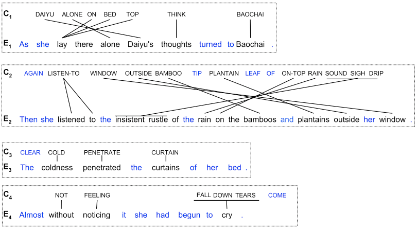

]

---
## Why is MT so hard

[J+M_25.1](https://bxjthu.github.io/CompLing/readings/13_J+M_25.pdf)

+ Systematic differences that can be modeled in a general way

+ Idiosyncratic and lexical differences that must be dealt with one by one

+ Some examples

  + [汉英机器翻译的难点分析](http://ccl.pku.edu.cn/doubtfire/NLP/Machine_Translation/Difficulities_of_MT/paper98-7.htm)

  + [汉英机器翻译研制中遇到的问题札记](http://ccl.pku.edu.cn/doubtfire/NLP/Machine_Translation/Difficulities_of_MT/paper99-4.htm)

---
.left-column-3[
## Why MT is worthwhile anyway

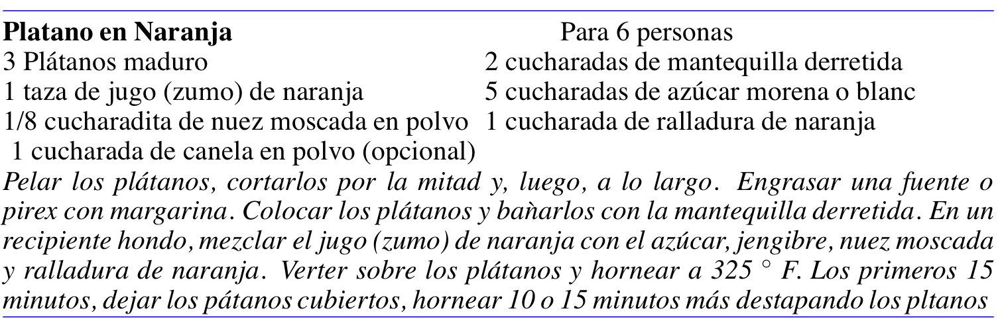

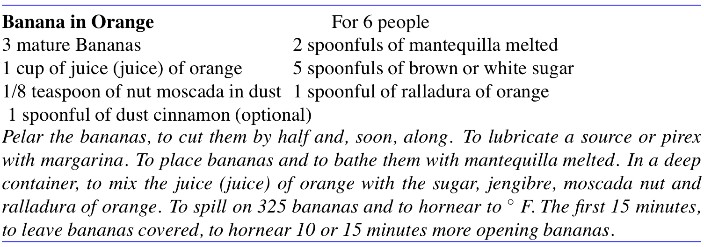
]
.right-column-3[
            
.smaller[A useful tool for many applications: from information gisting to increasing the productivity of professional translators.]
]
---

## What Makes a good translation?

+ Fidelity: the translation should preserve the meaning of the source text

+ Fluency: the translation should be fluent with respect to the target language

 
[Machine Translation Evaluation Resources and Methods: A Survey](https://bxjthu.github.io/CompLing/readings/MT_evaluation_survey)

http://matrix.statmt.org/matrix

---

## Approaches to MT

+ Classical, or rule-based, MT uses glossaries and transformation rules to perform translation

+ Statistical MT uses large parallel corpora to build models of translation probabilities, and to model the choice of a translation that is faithful and fluent

---

## Classical MT and the Vauquois triangle

Direct, transfer, interlingua approaches in the Vauquois (1968) triangle

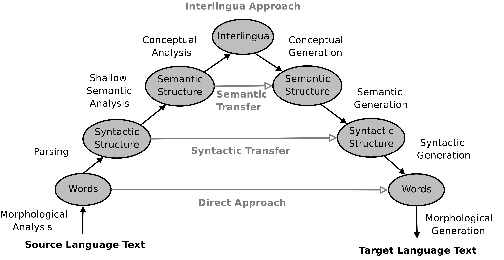

???
Vauquois, B. (1968). A survey of formal grammars and algorithms for recognition and transformation in mechanical translation. In Ifip congress (2) (Vol. 68, pp. 1114-1122).

---

.left-column-4[
## Classical MT: direct approach

+ Word-by-word mapping
+ Bilingual dictionary
+ No intermediate structure
+ Simple reordering rules

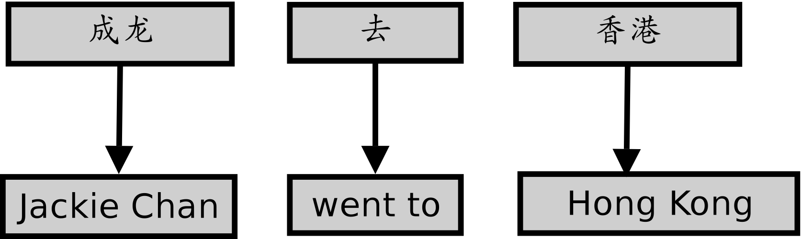

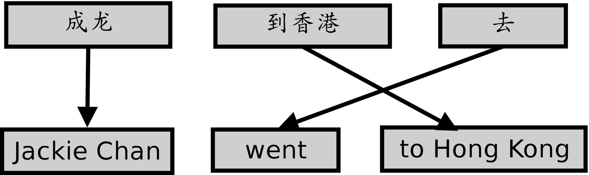
]

.right-column-4[

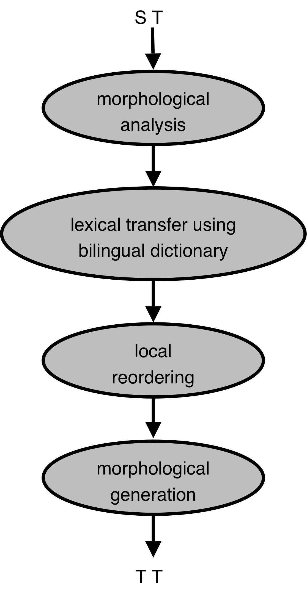

]

---

## Classical MT: direct approach

+ Advantages
  + It is easy to implement.
  + Results give a rough idea of what the text is about.

+ Disadvantages
  + Bilingual dictionaries and reordering rules require manual construction.   
  + New dictionaries and rules are required for each language pair.
  + No account is given of polysemy.
  + The quality of translation is low.
  + Local reordering rules only handle single-word reorderings.
  + With no knowledge of syntax, phrase reordering or long-distance reordering cannot  be handled.

---

## Classical MT: transfer approach

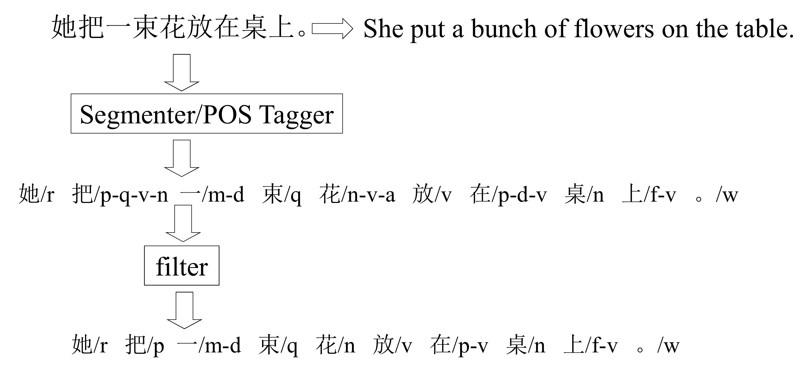

---

## Classical MT: transfer approach

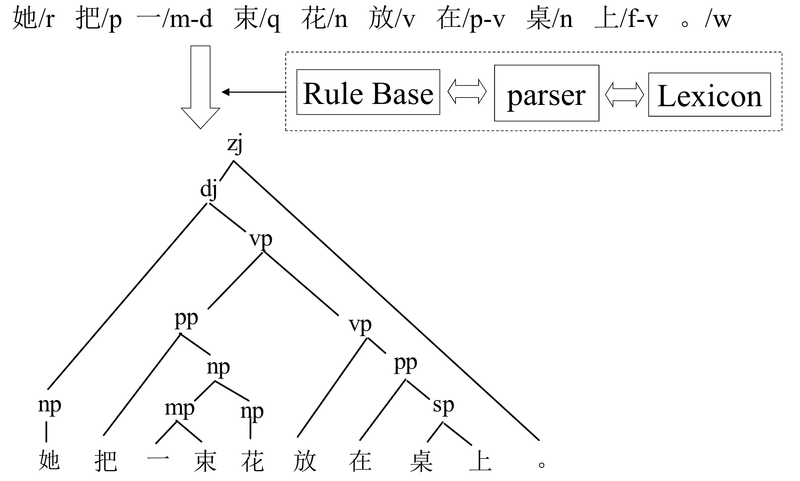

---

## Classical MT: transfer approach

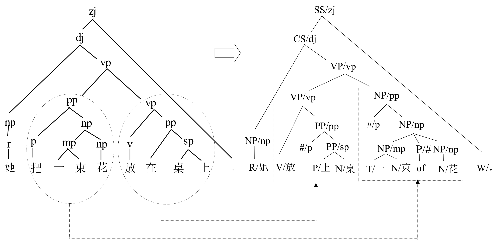

---

## Classical MT: transfer approach

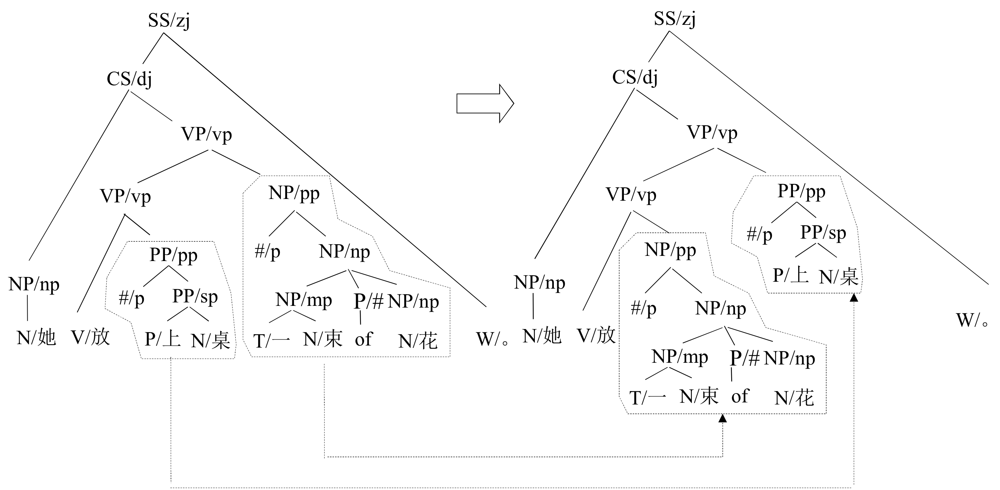

---

## Classical MT: transfer approach

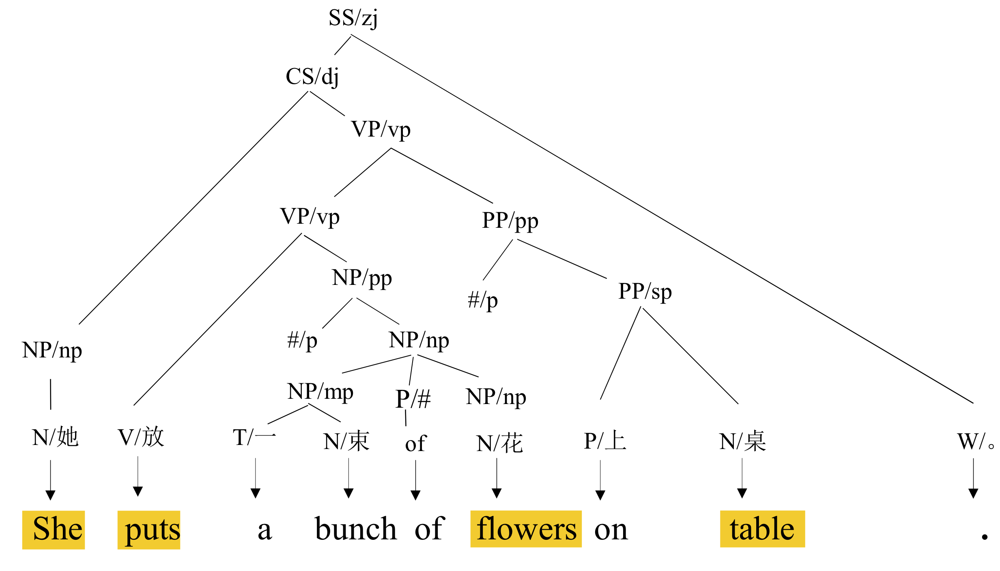

---

## Classical MT: transfer approach

+ Advantages
  + It can deal with the reordering of phrases and long-distance reordering.

+ Disadvantages   
  + A parser is required for the source language.
  + Transfer rules need to be constructed for each language pair.
  + Extra techniques (for semantic transfer) are required to handle polysemy.

---

## Classical MT: interlingua approach
.left-column-1[
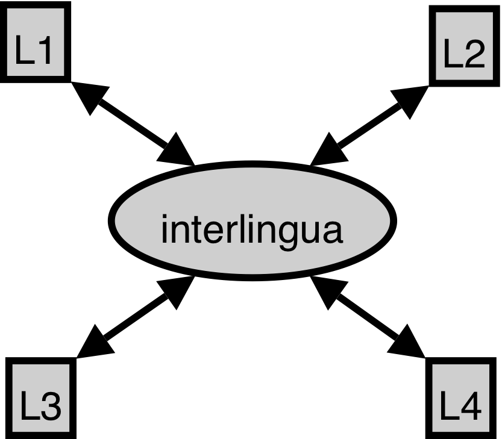
]
.right-column-1[
.left-column-2[
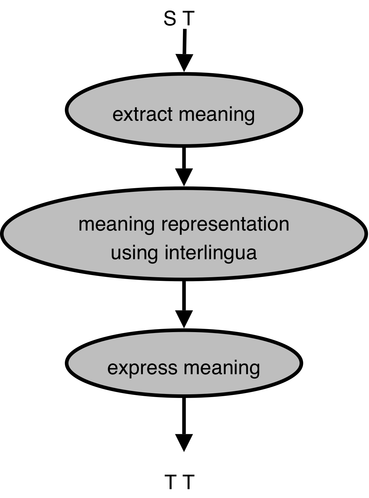
]
.right-column-2[
Interlingua: a language-independent meaning representation

Represent the meaning of the input in interlingua.

Generate the target language from the interlingual representation.
]
]

---

## Classical MT: interlingua approach

Interlingual representation of _Mary did not slap the green witch._

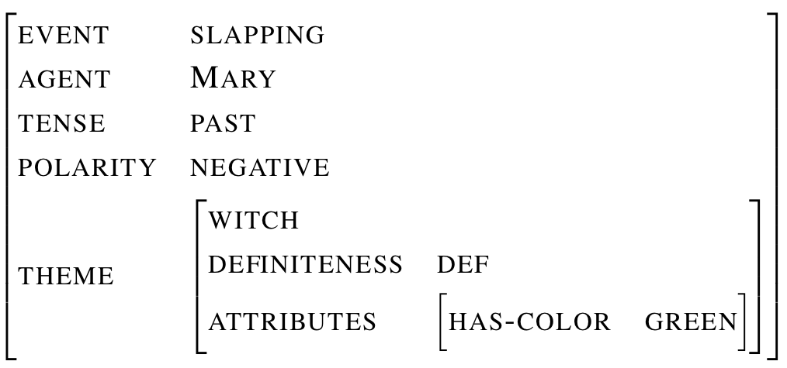

---

## Classical MT: interlingua approach

+ Advantages
  + Economy of effort: for n languages, 2n rather than n(n-1) systems are required.
  + New dictionaries and rules are not needed for each language pair.

+ Disadvantages
  + Fine-grained semantic analysis (rather than morphological analysis or parsing) is required in the source language .
  + Interlingua must be extremely fine-grained to be universal.
  + The generation is difficult.

---
## Statistical MT

+ Rationales

  + Focus on the result, not the process.
  + Strictly speaking, it is impossible for a sentence in one language to be a translation of a sentence in other.
  + A compromise between fidelity and fluency.
  + In the case of MT, translation is no longer an art.

+ Basic idea: Build probabilistic models of faithfulness and fluency, and then combine these models to choose the most probable translation .smaller[(Brown et al. 1990)]

  BestTranslation $\hat{T}$ = $\underset{T}{\arg\max}$ faithfulness(T,S) fluency(T) 
  .smaller[S (the source sentence); T (the target sentence)]

---

## Statistical MT

+ Calculating faithfulness and fluency

  \\(
  \begin{aligned}
  BestTranslation \; \hat{T} & = \underset{T}{\arg\max} P(T|S) \\\
  & = \underset{T}{\arg\max} \frac{P(S|T)P(T)}{P(S)} \Lleftarrow \text{using the Bayes’ rule}\\\
  & = \underset{T}{\arg\max} P(S|T)P(T)
  \end{aligned}
  \\)

  P(S|T): faithfulness, the translation model 
  P(T): fluency, the target language model

  Probabilities acquired from training data .smaller[(bilingual corpus and monolingual corpus)]

---
.left-column-3[
## Statistical MT

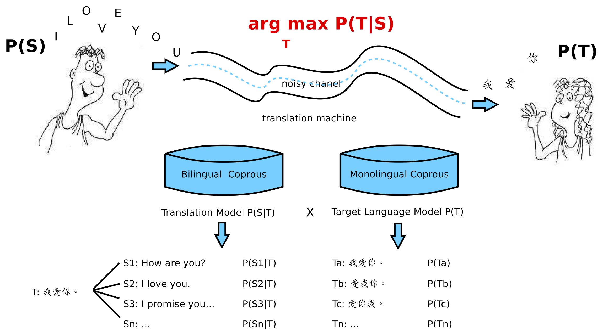
]
.right-column-3[
               
.smaller[To think of the source language and the target language backwards. ]
]

---

## P(F|E): the Phrase-Based Translation Model

+ Estimate these probabilities
  + by considering how each individual word is translated
  + by considering how each phrase is translated

  Unit of translation

  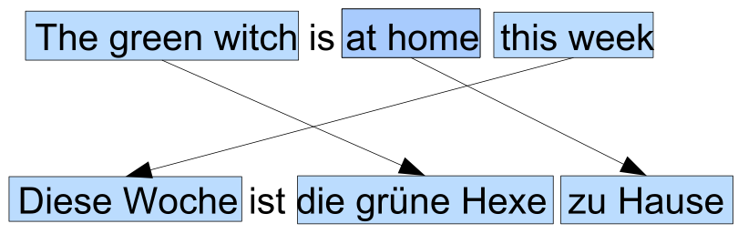

  Translation probability: .smaller[generating German phrases from English phrases]  
  Distortion probability: .smaller[reordering German phrases]

---

## Statistical MT

+ Advantages
  + It requires minimal human effort. There is no need for linguists.
  + With enough training data, it can be created for any language pair.
  + A new system can be prototyped quickly and at low cost.
  + It produces state-of-the-art results when very large data sets are available.

+ Disadvantages
  + A large parallel corpus is required.
  + It depends too much on the corpora from which probabilities are derived.

---

## Neural MT

+ A major recent development in statistical machine translation

+ Used by Google Translate

  + Started on November 15, 2016
  + Used to translate English to and from French, German, Spanish, Portuguese, Chinese, Japanese, Korean and Turkish.
  + Google: its translation app is “improving more in a single leap than we’ve seen in the last 10 years combined”

+ Explored but abandoned in the 1990s

  _"The computational complexity involved by far exceeded the computational resources of that era."_

---

## Neural MT

+ Fast speed of Development
  .plarger[
  _"... the entire research field of machine translation went neural... At the shared task for machine translation organized by the Conference on Machine Translation (WMT), only one pure neural machine translation system was submitted in 2015. It was competitive, but outperformed by traditional statistical systems. A year later, in 2016, a neural machine translation system won in almost all language pairs. In 2017, almost all submissions were neural machine translation systems."_]

---

## Neural MT

+ Basic notions about NMT

  + It is based on the model of neural networks in the human brain.
  + It uses deep learning techniques to translate text based on existing statistical models.
  + It is able to use algorithms to learn linguistic rules on its own from statistical models.
  + It makes for faster translations than the statistical method and has the ability to create higher quality output.

+ Neural network language models
  + Better sharing of statistical evidence between similar words
  + Inclusion of rich context

---

## Some reflections

+ Could the high-quality output of MT help us better understand translation and the languages involved?

+ What role could linguistics still play?

+ Could a hybrid approach help?

  + Combination of different approaches
  + Multi-engine MT

    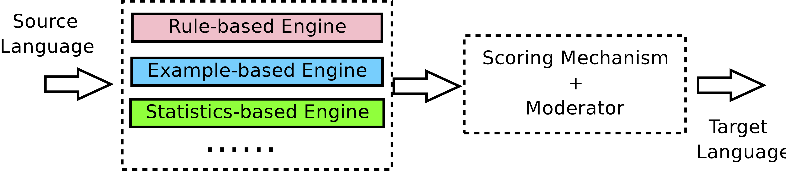  

---

## Computer-assisted translation (CAT)

+ Translator workstation
  + Translation Memory (TM)
  + Terminology management
  + Monolingual/bilingual concordancer
  + Translator-friendly word-processer
  + ...

+ Related products

+ Related educational opportunities

---

## Computer-assisted translation (CAT)

+ Translation Memory

  + Example-based MT (Nagao, 1984): reuse examples of already existing translations as
the basis for a new translation

.left-column-2[
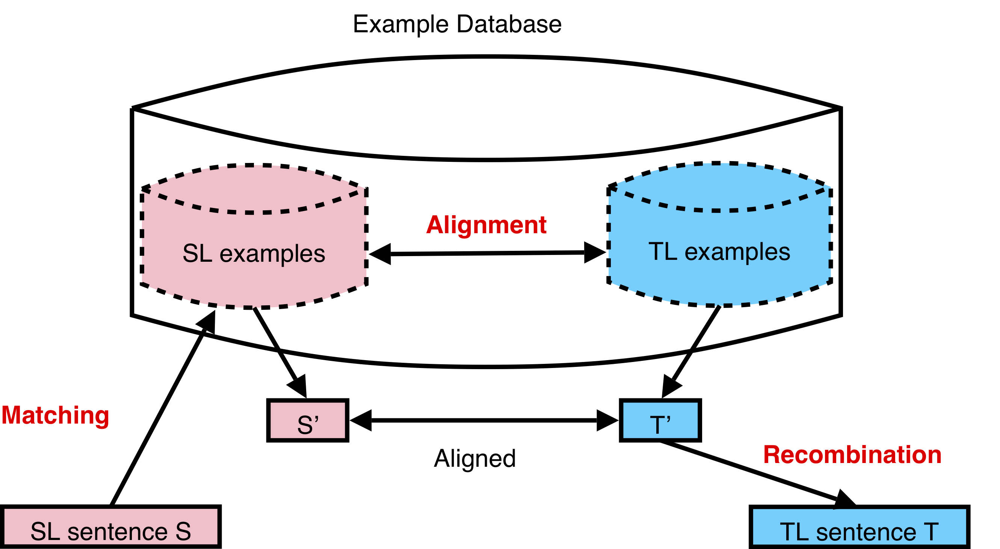
]
.right-column-2[
Sentence similarity measurement

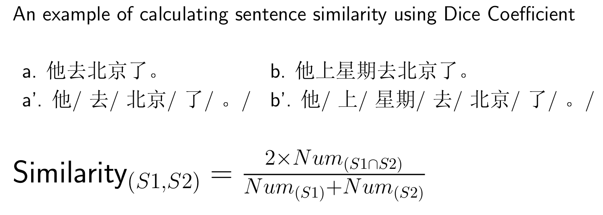
]

---

## At the end of this session you will

+ understand the task of machine translation

+ know about the difficulties of machine translation

+ know about the different approaches of machine translation

+ know about computer-assisted translation

---
## Final exam: sample questions

.smaller[
1. Which of the following matches regular expression /(very )+(fat )?(tall|ugly) man/ 
1) very fat man 
2) fat tall man 
3) very very fat ugly man 
4) very very very tall man

2. Convert the following FOL expression into a natural language sentence.  
$\forall xVegetarianRestaurant(x) \implies Serves(x,VegetarianFood)$

3. Discuss ambiguity in part-of-speech tagging and techniques that can be used to deal with it. Illustrate your discussion with examples.

4. Describe two different natural language processing systems which require semantic information for optimal performance and explain how the semantic information could be obtained and integrated in the systems.

5. Explain how to automatically resolve the pronominal anaphora in the following discourse: 
_John saw a house he liked. The windows were large and the door was varnished. He wanted to go inside it._
]
---
class: center, middle
## Next session

NLP Applications
