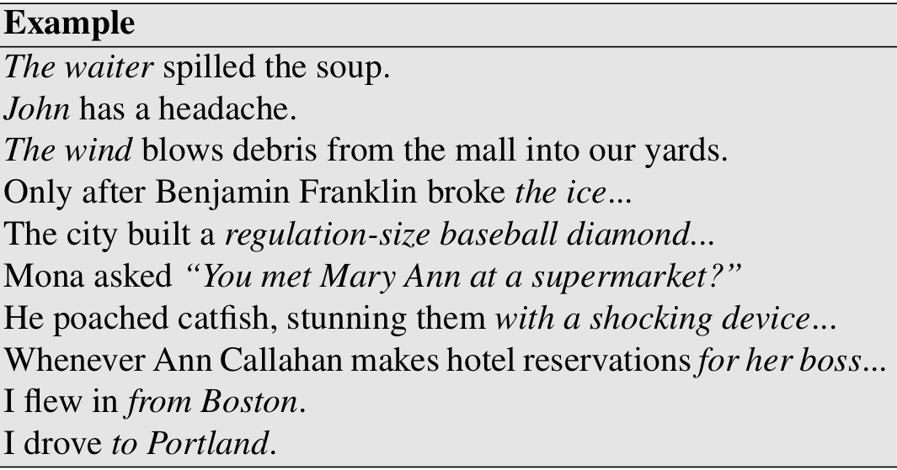

class: center, middle
# Computational Linguistics 
## 13. Semantic Role Labeling and Computational Discourse

** Xiaojing Bai **

** Tsinghua University **

** https://bxjthu.github.io/CompLing **

---

## At the end of this session you will

+ understand what are semantic roles and how to model them

+ know about two commonly used lexical resources with semantic roles

+ know about the task of semantic role labeling

+ know about the tasks of computational discourse

+ understand what coherence means and how to describe coherence relations

+ know about automatic coherence assignment and reference resolution

---

## Semantic role labeling

+ The earliest linguistic realization of events and their participants [by Panini]

+ Applications: question answering, dialogue systems, machine translation, etc.

+ Grammatical function vs. semantic role
  + Grammatical function: subject, object, prepositional complement, ...
  + Semantic role: agent, patient, theme, goal, ...

+ Semantic roles
  + Representations that express the abstract role that arguments of a predicate can take in the event
  + Shallow meaning representations
  + Representations that capture the semantic commonality between linguistic expressions

---

## Commonly used thematic roles

+ Semantic roles - the general term for all sets of roles, large or small

+ No universally agreed-upon set of roles

+ One of the oldest linguistic models by Panini (7th-4th centuries BCE)

+ Modern formulation by Fillmore (1968) and Gruber (1965)

???
Panini |ˈpɑːnɪni|: Indian grammarian

---

## Diathesis alternations .smaller[(aka: argument alternations, verb alterations)]

+ Diathesis: the set of syntactic patterns with which a verb or other word is most typically associated

+ The multiple argument structure realizations

  

---

## Alternative semantic role models

+ Define generalized semantic roles that abstract over the specific thematic roles

+ Define semantic roles that are specific to a particular verb or a particular group of semantically related verbs or nouns

+ Two commonly used lexical resources

  + PropBank

  + FrameNet

   
  Food for your thought: How would _PropBank_ and _FrameNet_ be used?

---

## The Proposition Bank (PropBank)

+ A corpus of sentences annotated with semantic roles

+ Semantic roles defined with respect to individual verb senses

+ Semantic roles numbered rather than named, e.g. Arg0, Arg1, Arg2, etc.

  + Arg0: the PROTO-AGENT
  + Arg1: the PROTO-PATIENT
  + Arg2: the benefactive, instrument, attribute, or end state
  + Arg3: the start point, benefactive, instrument, or attribute
  + Arg4: the end point

  [John]\\(\scriptscriptstyle{ARG0} \\) broke [the window] \\(\scriptscriptstyle{ARG1} \\)

  [The window]\\(\scriptscriptstyle{ARG1}\\) broke

---

## PropBank: functional tags for modifiers
.left-column-2[
+ LOC: location
+ EXT: extent
+ CAU: cause
+ TMP: time
+ MNR: manner
+ DIR: direction
+ PNC: purpose
+ ADV: general-purpose
+ NEG: negation marker
+ MOD: modal verb
]
.right-column-2[
_Mr. Bush met him privately, in the White House, on Thursday._

REL: _met_ 
ARG0: _Mr. Bush_ 
ARG1: _him_ 
ARGM-MNR: _privately_ 
ARGM-LOC: _in the White House_ 
ARGM-TMP: _on Thursday_
]

.smaller[
.right[https://propbank.github.io/
]]

???
Predicate-argument relations
---

## PropBank: creation

+ Extraction of all Penn Treebank II sentences for a given verb

+ Automatic tagging of semantic roles

+ Manual correction by annotators

+ Adjudication of tagging disagreements

---

## FrameNet

[\\(\scriptscriptstyle{Arg1}\\) The price of bananas] increased [\\(\scriptscriptstyle{Arg2}\\) 5%].

[\\(\scriptscriptstyle{Arg1}\\)  The price of bananas] rose [\\(\scriptscriptstyle{Arg2}\\) 5%].

There has been a [\\(\scriptscriptstyle{Arg2}\\) 5%] rise [\\(\scriptscriptstyle{Arg1}\\) in the price of bananas].

 
+ Semantic roles: specific to an individual verb vs. specific to a frame

+ Connections between verbs vs. connections between verbs and nouns
---

## FrameNet

A highly detailed lexicon of English predicates based on Frame Semantics

+ Hypothesis: People understand things by performing mental operations on what they already know. Such knowledge is describable in terms of information packets called frames.

+ Basic assumption (Fillmore et al., 2002): Each word in a given meaning evokes a particular frame and possibly profiles some element or aspect of that frame.

+ Semantic frames are schematic representations of situations involving various participants, props, and other conceptual roles.

+ Frames annotated for events, states, and relations

+ Frames connected to each other by frame-to-frame relations

---

## FrameNet: important terms

+ [Frame Elements](https://framenet.icsi.berkeley.edu/fndrupal/frameIndex) (FEs)

  + The participants, props, and roles of a frame [[See Glossary](https://framenet.icsi.berkeley.edu/fndrupal/glossary)]
  + Including agents, inanimate objects, and elements of the setting
  + Corresponding roughly to syntactic dependents (arguments and adjuncts)

+ [Lexical Units](https://framenet.icsi.berkeley.edu/fndrupal/luIndex) (LUs)

  A pairing of a lemma and frame - i.e. a "word" taken in one of its senses, e.g. the verb _tie_ in the _Attaching_ frame

---

## FrameNet: important terms

+ Valence: the particular kinds of constituents, in terms of semantic roles, grammatical functions, and phrase types, with which a word combines in a grammatical sentence

  + Semantic valence: the frame that underlies the meaning of a word, and the number and kinds of entities that participate in the situation instantiating the frame

  + Syntactic valence: the number and type of syntactic constituents that are dependent on, or in construction with a word

.smaller[
.right[
https://framenet.icsi.berkeley.edu/]]

---
## Semantic Role Labeling (SRL)

+ Task: automatically find the semantic roles of each argument of each predicate in a sentence

+ Current approaches

  + Based on supervised machine learning

  + FrameNet and PropBank: specify what counts as a predicate, define the set of roles used in the task, and provide training and test sets

---
## A feature-based algorithm for SRL

+ Parsing the input sentence to find all words that are predicates

+ Extracting feature vectors from PropBank or FrameNet for each node

+ Classifying the semantic role of each node

Common feature templates:

+ The governing predicate
+ The phrase type of the constituent
+ The headword of the constituent
+ The headword part of speech of the constituent
+ ...

---
## Computational discourse

Gracie&#58; _Oh yeah... and then Mr. and Mrs. Jones were having matrimonial trouble,  Gracie&#58; and my brother was hired to watch Mrs. Jones._

George: _Well,I imagine she was a very attractive woman._

Gracie: _She was, and my brother watched her day and night for six months._

George: _Well,what happened?_

Gracie: _She finally got a divorce._

George: _Mrs. Jones?_

Gracie: _No, my brother’s wife._

.right[George Burns and Gracie Allen in _The Salesgirl_]

---
## Computational discourse

Previously: language phenomena operating at the word or sentence level

+ A discourse: a coherent structured group of sentences

+ Discourse tasks

  + Discourse Segmentation

  + Coherence relation assignment

  + Reference Resolution (esp. anaphora resolution, coreference resolution)

+ Applications

  + Information extraction, summarization, conversational agent, automatic essay grading...
---

## Discourse segmentation

+ Task: separate a document into a linear sequence of subtopics

+ Algorithms: unsupervised vs. supervised

+ Cohesion vs. coherence

  + Cohesion: the use of linguistic devices to link textual units

  + Coherence: the meaning relation between the textual units

???
lexical and non-lexical devices
---
## Text coherence

+ A property of well-written texts

+ Ensuring that sentences in the texts are meaningfully related

  + Thematic organization
  + Temporal organization
  + ...
  + NOT a random juxtaposition

+ Making texts easier to read and understand

+ Two aspects of coherence

  + Coherence relations
  + Entity-based coherence

---

## Coherence relations

John hid Bill’s car keys. He was drunk.

John hid Bill’s car keys. He likes spinach.

???
Cause or explanation
---

## Entity-based coherence

a. John went to his favorite music store to buy a piano. 
b. He had frequented the store for many years. 
c. He was excited that he could finally buy a piano. 
d. He arrived just as the store was closing for the day.

a. John went to his favorite music store to buy a piano. 
b. It was a store John had frequented for many years. 
c. He was excited that he could finally buy a piano. 
d. It was closing just as John arrived.

???
introducing them and following them in a focused way
---

## Coherence relations between sentences

The Tin Woodman was caught in the rain. His joints rusted.

John hid Bill’s car keys. He was drunk.

The Scarecrow wanted some brains. The Tin Woodman wanted a heart.

Dorothy was from Kansas. She lived in the midst of the great Kansas prairies.

Dorothy picked up the oil-can. She oiled the Tin Woodman’s joints.

---

## Coherence relations between sentences: Hobbs (1979)

+ Result: Infer that the state or event asserted by S0 causes or could cause the state or event asserted by S1.

  .smaller[_The Tin Woodman was caught in the rain. His joints rusted._]

+ Explanation: Infer that the state or event asserted by S1 causes or could cause the state or event asserted by S0.

  .smaller[_John hid Bill’s car keys. He was drunk._]

+ Parallel: Infer p(a1,a2,...) from the assertion of S0 and p(b1,b2,...) from the assertion of S1, where ai and bi are similar, for all i.

  .smaller[_The Scarecrow wanted some brains. The Tin Woodman wanted a heart._]

---

## Coherence relations between sentences: Hobbs (1979)

+ Elaboration: Infer the same proposition P from the assertions of S0 and S1.

  .smaller[_Dorothy was from Kansas. She lived in the midst of the great Kansas prairies._]

+ Occasion: A change of state can be inferred from the assertion of S0, whose final state can be inferred from S1, or a change of state can be inferred from the assertion of S1, whose initial state can be inferred from S0.

  .smaller[_Dorothy picked up the oil-can. She oiled the Tin Woodman’s joints._]

---

## Coherence relations in a discourse

John went to the bank to deposit his paycheck. (S1)

He then took a train to Bill’s car dealership. (S2)

He needed to buy a car. (S3)

The company he works for now isn’t near any public transportation. (S4)

He also wanted to talk to Bill about their softball league. (S5)

---

## Coherence relations in a discourse

.smaller[
John went to the bank to deposit his paycheck. (S1)

He then took a train to Bill’s car dealership. (S2)

He needed to buy a car. (S3)

The company he works for now isn’t near any public transportation. (S4)

He also wanted to talk to Bill about their softball league. (S5)
]

???
hierarchical structure rather than linear
e: event
---

## Coherence relations between sentences: RST

+ Rhetorical Structure Theory (RST)

+ A model of text organization for text generation (Mann & Thompson, 1987)

+ A set of 23 rhetorical relations held between spans of text within a discourse

  + The nucleus: the unit that is more central to the writer’s purpose and interpretable independently

  + The satellite: the unit that is less central and generally only interpretable with respect to the nucleus

  E.g., The _Evidence_ relation: a satellite presents evidence for the proposition or situation expressed in the nucleus.

  _Kevin must be here. His car is parked outside._

---

## RST: examples

.smaller[
.right[
http://www.sfu.ca/rst/01intro/intro.html
]
]
???
乳糖\乳糖酶
---

## RST: examples

---

## Automatic coherence assignment

+ Assigning a relation between two sentences

+ Discourse parsing: extracting a tree representing an entire discourse

+ A shallow cue-phrase-based algorithm for coherence extraction

  1. Identify the cue phrases or discourse markers in a text;

  2. Segment the text into discourse segments, using cue phrases;

  3. Classify the relationship between each consecutive discourse segment, using cue phrases.

---
## Cue phrases or discourse markers

A word or phrase that functions to signal discourse structure

+ Text segmentation: [Broadcasts]... good evening, I’m ⟨PERSON⟩ ... joining us now is ⟨PERSON⟩ ... coming up

+ Coherence relation assignment: connectives and others

---

## Reference resolution

.smaller[Victoria Chen, Chief Financial Officer of Megabucks Banking Corp since 2004, saw her pay jump 20%, to $1.3 million, as the 37-year-old also became the Denver-based financial-services company’s president. It has been ten years since she came to Megabucks from rival Lotsabucks.]

+ The task: What entity is being talked about by each NP?

+ Reference: the use of linguistic expressions to denote an entity or individual

+ Referring expression: a linguistic expression used to perform reference

+ Referent: the entity that is referred to

---
## Referring expressions

+ Indefinite noun phrases: introduce new entities into the discourse  
  e.g. a pair of stove-lids

+ Definite noun phrases: refer to entities that are uniquely identifiable  
  e.g. the room

+ (Personal) pronouns: refer to entities with a high degree of salience  
  e.g. she, them

+ Demonstrative pronouns: refer to entities and events  
  e.g. this (room), (I had not expected) that

+ Proper nouns: evoke uniquely identifiable known entity  
  e.g. Beijing, Tsinghua
---

## Coreference vs. anaphora

.smaller[Victoria Chen, Chief Financial Officer of Megabucks Banking Corp since 2004, saw her pay jump 20%, to $1.3 million, as the 37-year-old also became the Denver-based financial-services company’s president. It has been ten years since she came to Megabucks from rival Lotsabucks.]

+ Anaphora: reference to an entity previously introduced into the discourse

  + Antecedent: an earlier word, phrase, or clause to which another word (especially a following relative pronoun) refers back
  + Anaphor: a word or phrase that refers back to an earlier word or phrase

+ Cataphora: the phenomenon where the anaphor precedes the antecedent  
  .smaller[e.g. After his class, John will play football.]

+ Coreference: reference to an entity by two or more referring expressions

  + Coreference chain: a set of coreferring expressions that corefer

---

## Reference resolution

+ Reference resolution: to determine what entities are referred to by which linguistic expressions

  + Anaphora resolution: to find an antecedent for each anaphor (typically, third person pronoun)

  + Coreference resolution: to find the referring expressions that refer to the same entity

---

## Pronominal anaphora resolution: the task

+ The input
  + A single pronoun (he, him, she, her, it, and sometimes they/them)
  + The previous context

+ The Output
  + The antecedent of the pronoun in this context

+ Constraints on possible referents
  + Hard constraints
  + Soft constraints

---

## Pronominal anaphora resolution: hard constraints

+ Number agreement: singular, plural

+ Person agreement: first, second, third

+ Gender agreement: masculine, feminine, non-personal

+ Binding theory constraints

Note: A complete statement of the constraints requires reference to semantic and other factors, and cannot be stated purely in terms of syntactic configuration.

---

## Pronominal anaphora resolution: binding theory constraints

Chomsky (1981)

+ Principle A: Reflexives must have local antecedents 

  .smaller[(1) **Johni** washed **himselfi**.  (2) **Johni** asked Mary to wash **himselfi**.]

+ Principle B: Personal pronouns must not have local antecedents 

  .smaller[(1) **Johni** asked Mary to wash **himi**.  (2) **Johni** washed **himi**.]

+ Principle C: A referring expression must not have an antecedent that c-commands it  

  .smaller[**Johni** saw **Johni**.]

???
A c-commands B if and only if neither A dominates B nor B dominates A; and every
branching node that dominates A, also dominates B.
---

## Pronominal anaphora resolution: soft constraints

+ Selectional restrictions: Verbs impose semantic constraints on the kind of concepts that are allowed to be their arguments

  .smaller[John parked his car in the garage after driving it around for hours.]

+ Recency: Entities introduced in recent utterances are more likely to be referred to by a pronoun than entities introduced in utterances further back.

  .smaller[The doctor found an old map in the captain’s chest. Jim found an even older map hidden on the shelf. It described an island.]

---

## Pronominal anaphora resolution: soft constraints

+ Grammatical role: Entities introduced in subject position tend to get topicalised and are more likely to be referred to by a pronoun than entities in object positions.

  .smaller[Jim Hawkins went to the bar with Billy Bones. He called for a glass of rum.]

+ Repeated mention: Entities that have already been referred to frequently are more likely to be pronominalised than those that have not.

  .smaller[Billy Bones had been thinking about a glass of rum ever since the pirate ship docked. He hobbled over to the Old Parrot bar. Jim Hawkins went with him. He called for a glass of rum.]

---

## Pronominal anaphora resolution: soft constraints

+ Parallelism: Pronouns are more likely to refer to those entities that do not violate syntactically parallel constructions.

  .smaller[Long John Silver went with Jim to the Old Parrot. Billy Bones went with him to the Old Anchor Inn.]

+ Verb semantics: Certain verbs appear to place a semantically-oriented emphasis on one of their argument positions, which can have the effect of biasing the manner in which subsequent pronouns are interpreted.

  .smaller[John telephoned Bill. He had lost the laptop.

  John criticised Bill. He had lost the laptop.]

---

## Pronominal anaphora resolution: three algorithms

+ Many factors influence pronominal anaphora resolution.

+ Many of these factors might contradict each other for specific examples.

+ No pronoun resolution algorithm successfully accounts for all these factors.

+ Three algorithms
  + Purely syntax-based (Hobbs, 1978)
  + Centering (Grosz et al., 1995)
  + Supervised ML

---
## At the end of this session you will

+ understand what are semantic roles and how to model them

+ know about two commonly used lexical resources with semantic roles

+ know about the task of semantic role labeling

+ know about the tasks of computational discourse

+ understand what coherence means and how to describe coherence relations

+ know about automatic coherence assignment and reference resolution

---
##Homework

+ Read/Review

  + [J+M_18](https://bxjthu.github.io/CompLing/readings/13/J+M_18.pdf)

  + [J+M_second_edition_21](https://bxjthu.github.io/CompLing/readings/13/J+M_second_edition_21.pdf)

+ Term project milestone 2 [literature review] (DDL: Dec. 25, 2018)

  [Read the detailed requirements](term_project_milestone_2.pdf)
---

## Important events for the remaining weeks

\\(\surd\\) Week 12: Teamwork presentation

\\(\surd\\) Week 13: Quiz 9

\\(\surd\\) Week 14: Term project milestone 1 [idea(s)] (5%)

\\(\Box\\) Week 15: Term project milestone 2 [literature review] (10%)

\\(\Box\\) Week 16: Final exam

\\(\Box\\) Week 17: Term project milestone 3 [methodology] (10%)

\\(\Box\\) Week 18: Term project milestone 4 [final submission] (10%)

---
class: center, middle
## Next session

AliMe Bot:  Knowledge-base-Based Question Answering,  and Real-world NLP Applications

By Yuxiao Ye
