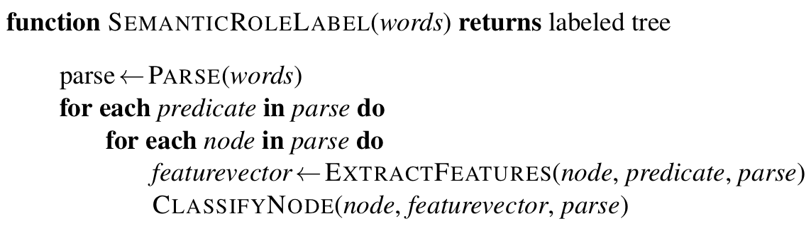
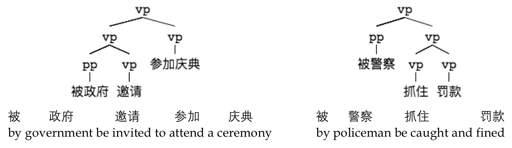
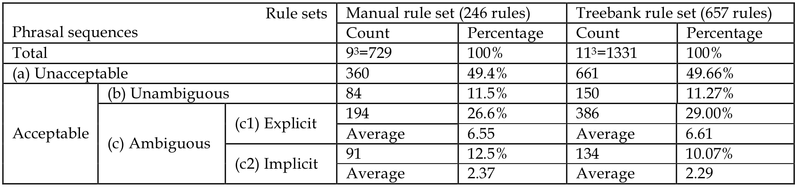
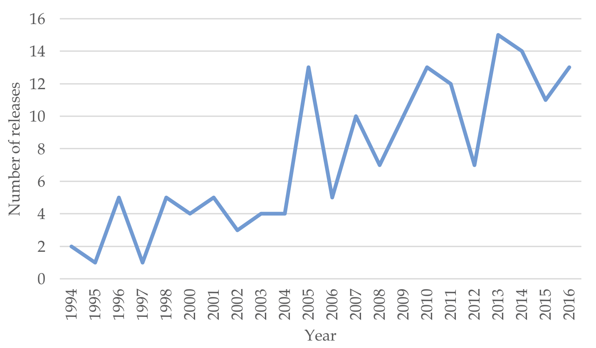

class: center, middle
# Computational Linguistics 
## 14. Online Language Resources:  Advances, Applications, and Challenges

** Xiaojing Bai **

** Tsinghua University **

** https://bxjthu.github.io/CompLing **

---

## Recap

+ Word similarity

+ Evaluation in NLP

+ Semantic roles and semantic role labelling

+ Coherence, coherence relations and entity-based coherence

+ Automatic coherence assignment and reference resolution

---

## Semantic role labelling

+ The task: automatically find the semantic roles of each argument of each predicate in a sentence

+ Current approaches: supervised machine learning

  + FrameNet and PropBank resources
      + What counts as a predicate?
      + What roles are involved?
      + Training + test sets

> .smaller[
|  |  |  |
:--|:--|:--|:--|:--
[You] |can’t &nbsp; &nbsp; &nbsp; |[blame] |[the program] &nbsp; &nbsp; &nbsp; |[for being unable to identify it]
COGNIZER &nbsp; &nbsp; &nbsp; | |TARGET &nbsp; &nbsp; &nbsp; |EVALUEE |REASON

|  |  |  
:--|:--|:--|:--
[The San Francisco Examiner] &nbsp; &nbsp; &nbsp;|issued |[a special edition] &nbsp; &nbsp; &nbsp;|[yesterday]
ARG0 |TARGET &nbsp; &nbsp; &nbsp;|ARG1 |ARGM-TMP

]

---

## Semantic role labelling

+ A simplified semantic role labeling algorithm

  

  + Features
  + Further issues

???
While there are a large number of algorithms, many of them use some version of the steps in this algorithm.

---

## Recap: Pronominal anaphora resolution

+ Many factors influence pronominal anaphora resolution.

+ Many of these factors might contradict each other for specific examples.

+ No pronoun resolution algorithm successfully accounts for all these factors.

+ Three algorithms

  + Purely syntax-based (Hobbs, 1978)
  + Centering (Grosz et al., 1995)
  + Supervised ML

---

## Pronominal anaphora resolution: the Hobbs algorithm

+ The baseline for pronominal anaphora

+ A syntactic parser

+ A morphological gender and number checker

+ Intuition

    Start with the target pronoun and walk up the parse tree to the root S. For each NP or S node that it finds, it does a breadth-first left-to-right search of the node’s children to the left of the target. As each candidate noun phrase is proposed, it is checked for gender, number, and person agreement with the pronoun. If no referent is found, the algorithm performs the same breadth-first search on preceding sentences.

???
The constraints and preferences on pronominalization

---
## Pronominal anaphora resolution: more examples
.plarger[

_“For art has to leave reality, it has to raise itself bodily above necessity and neediness; for art is the daughter of freedom, and it requires its prescriptions and rules to be furnished by the necessity of spirits and not by that of matter.”_
]

---
## Pronominal anaphora resolution: more examples
.plarger[
_"High-quality education requires great investment, only when parents are affluent can their children learn what they desire without worrying that they will dry up their parents’ wallet. Material wealth can provide not only good foundation for the children to fulfill their dreams but also make it easier to access to their talents and skills. On the rather abstract side, money can buy their children the way to experience art, literature and music, increase their passion and taste on these areas. Perhaps it is not what they will write on their application letter to universities, but it will be marked on their way of speaking and moving."_
]

---
## Pronominal anaphora resolution: more examples
.plarger[
_"High-quality education requires great investment, only when parents are affluent can their children learn what they desire without worrying that they will dry up their parents’ wallet. Material wealth can provide not only good foundation for the children to fulfill their dreams but also make it easier to access to their talents and skills. On the rather abstract side, money can buy their children the way to experience art, literature and music, increase their passion and taste on these areas. Perhaps it is not what they will write on their application letter to universities, but it will be marked on their way of speaking and moving."_
]

---

## At the end of this session you will

+ know more about the language resources online, including corpora, knowledge bases, and the related search engines

+ know more about the possible applications of language resources in linguistic research

+ know more about challenges for the future development of language resources

+ probably start to consider the construction and application of your language resources

---

## Overview

+ Dramatic development of the Internet and computer technology

+ New waves of AI and NLP brought by the rapid progress of mobile web, social media, and machine learning

+ Large amounts of language resources available in the past three decades

+ Unprecedentedly prevailing use of language resources

  + NLP
  + Linguistic research
  + Language teaching  
  + In academia, industry, and government

---

## Paradigms of linguistic research

+ The late 1950s: the beginning of the Chomskyan revolution
.smaller[(Chomsky, 1957)]

+ The shift of the goal .smaller[(research interest)] and methodology in linguistic research

  + The structuralist and functional paradigm
      + Linguistic performance and how linguistic units are actually used
      + Relying on the concrete “examples” of language use

  + The Chomskyan paradigm
      + Linguistic competence and how language is generated
      + Focusing on the possible “counterexamples” of language use 

---

## The Chomskyan paradigm

+ Counterexamples: sentences that people never use or rarely use in communication, which is most typically showcased in the following sentences (Chomsky, 1957):

  .smaller[
_a. Colorless green ideas sleep furiously.  
b. * Furiously sleep ideas green colorless._]

+ The goal of linguistic research: to explore how grammar is built inside the human brain so that grammatical and meaningful sentences can be produced while ungrammatical or meaningless ones be avoided

---
## Chomsky's argument against the adequacy of corpora

+ _Syntactic Structures_ (Chomsky, 1957)

  .smaller[“...there appears to be no particular relation between order of approximation and grammaticalness...”]

  .smaller[“...probabilistic models give no particular insight into some of the basic problems of syntactic structure...”]

+ Interview (Jozsef Andor, 2004)

 .smaller[“Corpus linguistics doesn’t mean anything. It’s like saying suppose a physicist decides, suppose physics and chemistry decide that instead of relying on experiments, what they’re going to do is take videotapes of things happening in the world and they’ll collect huge videotapes of everything that’s happening and from that maybe they’ll come up with some generalizations or insights. Well, you know, sciences don’t do this.”]

---

## Other moderate expressions of doubt

For example, from the mainstream of theoretical linguistics:

Newmeyer (2003), in response to the usage-based models, questions the relevance of corpus-derived statistical information to the nature of the grammar of an individual speaker.

However, he points out that corpora can be extremely valuable for revealing “broad typological features of language that any theory of language variation, use, and change has to address”.

---

## Corpus-related resources

+ Web portals as repositories and distribution points for corpora
  + [LDC](https://www.ldc.upenn.edu/)
  + [Chinese LDC](http://www.chineseldc.org/)

+ Online search engines equipped with big corpora
  + [Word Sketch Engine](https://www.sketchengine.co.uk/)
  + [WebCorp Search Engine](http://www.webcorp.org.uk/live/index.jsp)
  + [CCL Corpus Search Engine](http://ccl.pku.edu.cn:8080/ccl_corpus/) (PKU)
  + [BCC Corpus Search Engine](http://bcc.blcu.edu.cn/) (BLCU)

+ Smaller corpora for special purposes
  + [UCLA Written Chinese Corpus](http://www.lancaster.ac.uk/fass/projects/corpus/UCLA/default.htm)
  + [Hong Kong Bilingual Child Language Corpus](http://www.cuhk.edu.hk/lin/home/bilingual.htm) (CUHK)

---

## Knowledge bases

+ Knowledge bases for academia and the information industry

  + The Grammatical Knowledge-base of Contemporary Chinese (PKU)

  + The Chinese Semantic Dictionary (PKU)

  + The Chinese Concept Dictionary (PKU)

  + [The Chinese Wordnet](http://cwn.ling.sinica.edu.tw/) (Sinica)

  + [The Bilingual Ontological Wordnet](http://bow.ling.sinica.edu.tw/intro/bow_ebg_cont.html) (Sinica)

  + [HowNet](http://www.keenage.com/html/e_index.html) (Zhendong Dong)

  + [The Emotion Ontology](http://ir.dlut.edu.cn/EmotionOntologyDownload) (Dalian University of Technology)

---

## Knowledge bases

+ Online lexicons, dictionaries, mobile applications available to the public

  + [Souwen Jiezi](http://words.sinica.edu.tw/) (Taiwan)
  + [Tradict.net for Translators](http://www.tradict.net/lang_guoyu.php) (Taiwan)
  + [Han Dian](http://www.zdic.net/) (mainland China)    

+ Web portals or websites of the world’s languages

  + [The Association for Linguistic Typology](http://www.linguistic-typology.org/resources.html)
  + [The World Atlas of Language Structures Online](http://wals.info/)
  + [The UPSID](http://phoible.org/) (UCLA Phonological Segment Inventory Database)
  + [The P-base of sound patterns](http://aix1.uottawa.ca/~jmielke/pbase/) (University of Ottawa)

???
for the special purposes of cross-linguistic comparison, theoretical linguistic research, typological studies, etc.,

---

## Early corpora

+ Manual work
+ Small collections of sample texts
+ Used for counting the frequencies of characters and words

## Corpora today

+ Large quantities of multimedia data
+ Accessibility vs. open collaboration
+ Size
+ Variety
  + Different annotations
  + Different types of data

.right[冯志伟 (2006).《应用语言学中的语料库》导读.北京: 世界图书出版公司.]

---
## Extremely big linguistic data

+ [Google Ngram](https://books.google.com/ngrams) (Wiki: [Google Ngram Viewer](https://en.wikipedia.org/wiki/Google_Ngram_Viewer))

+ [Chinese Web 5-gram Version 1](https://catalog.ldc.upenn.edu/LDC2010T06)

---

## Applications of Chinese language resources

+ Using corpora in the study of synonyms

+ Using treebanks in the analysis of syntactic ambiguities

+ Using language resources in contrastive and typological analysis

+ Using corpora in sociolinguistic analysis

---

## Using corpora in the study of synonyms

Tao, H. (2000). Adverbs of absolute time and assertiveness in vernacular Chinese: a corpus-based study. _Journal of the Chinese Language Teachers Association_, 35(2), 53-74.
+ A 500,000-character corpus of vernacular texts
+ More precise details about the distinctions

(1) 从来, 向来, 一向
(2) 根本, 本来, 全然
(3) 一直, 始终

真的，我当时根本没想过会有今天这种事儿。 
银行有律师，靠我可打不赢官司，我从来不打官司。 
一九四二年回国后，我一直在东北。 
“她这是胡说，她始终不明白，‘按能承包’也得分地。……”她丈夫说。

---

## Using corpora in the study of synonyms

Huang, C. R., Kilgarriff, A., Wu, Y., Chiu, C. M., Smith, S., Rychly, P., ... & Chen, K. J. (2005). Chinese Sketch Engine and the extraction of grammatical collocations. In _Proceedings of the Fourth SIGHAN Workshop on Chinese Language Processing_, pp. 48-55.

+ Measure the pattern and the salience of collocations, by using statistics like Mutual Information which indicates the mutual dependence between random variables.

.right[
[Statistics used in Sketch Engine](https://www.sketchengine.co.uk/documentation/statistics-used-in-sketch-engine/)
]

---

## Using corpora in the study of synonyms

Hong, J. F., & Huang, C. R. (2006). Using Chinese Gigaword Corpus and Chinese Word Sketch in linguistic Research. In _PACLIC_.

+ Use the collocating relations to present the difference between two synonymous verbs 吃 and 喝, based on the Chinese GigaWord Corpus of 1.1 billion Chinese characters.

Hong, J. F. (2014). Chinese Near-Synonym Study Based on the Chinese Gigaword Corpus and the Chinese Learner Corpus. In _Workshop on Chinese Lexical Semantics_, pp. 329-340.

+ Use a learner corpus of 300 million Chinese characters to investigate the usage errors of 方便 and 便利, which are compared with the proper usages of native speakers to show the different distributions of the synonyms.

---

## Using treebanks in the analysis of syntactic ambiguities

(1) v-n-de-n: 咬死了猎人的狗, 发现敌人的哨兵, 怀疑张三的老师 
(2) pp-vp-vp: 被政府邀请参加庆典, 被警察抓住罚款

---

## Using treebanks in the analysis of syntactic ambiguities

(1) v-n-de-n: 咬死了猎人的狗, 发现敌人的哨兵, 怀疑张三的老师 (explicit ambiguity) 
(2) pp-vp-vp: 被政府邀请参加庆典, 被警察抓住罚款 (implicit ambiguity)

---

## Using treebanks in the analysis of syntactic ambiguities

Use treebanks to extract Context Free Grammar rules (e.g. vp $\to$ pp vp, vp $\to$ vp vp) for a systematical investigation into the possibility of linguistic ambiguity.

.smaller[**Compare:** Zhan, W., Chang, B. & Yu, S. (1999). Analysis on types of phrase boundary ambiguity in contemporary Chinese. _Journal of Chinese Information Processing_, 3: 9–17.]

---

## Using treebanks in the analysis of syntactic features

Liu, H., Hudson, R., & Feng, Z. (2009). Using a Chinese treebank to measure dependency distance. _Corpus Linguistics and Linguistic Theory_, 5(2), 161-174.

+ Use a dependency treebank to measure the dependency distance and dependency direction, hence the complexity, of Chinese.

Jing, Y., & Liu, H. (2015). Mean Hierarchical Distance Augmenting Mean Dependency Distance. In _DepLing_, pp. 161-170.

+ Measure the dependency distances across languages, using an English and Czech dependency treebank.

---

## Using language resources in contrastive and typological analysis

Feng, S. (2015). Tone, Intonation and Sentence Final Particles in Chinese. _Essays on Linguistics_, 51: 52–79. Beijing: The Commercial Press.

+ New arguments about the relation between tone, intonation and sentence final particles:

(1) All tonal languages have sentence final particles.  
(2) Non-tonal languages have no sentence final particle (with exceptions). 
(3) More tones exist in a language with more sentence final particles. 
(4) More sentence final particles exist in a language with fewer intonations. 
(5) Tones in a language develop in parallel with its sentence final particles.

---

## Using language resources in contrastive and typological analysis

WALS currently contains data from 2,679 languages and facts about 192 grammatical features, each feature having between 2 and 28 different values.

Ye, S. (2016). Typological Correlations between Tones, Intonation and Particles: A Case Study of Polar Questions. _Essays on Linguistics_, 53: 336-363. Beijing: The Commercial Press.

+ Argue against a salient typological correlation between tones and sentence final particles.

Theoretical linguistic research tends to suggest and verify a hypothesis based on a small sample of language facts. With the increase of data for world’s languages, which are sophisticatedly annotated and easy to search, large-scale investigations cross languages will better support linguistic typology and enable deeper understanding of human languages.

---

## Using language resources in contrastive and typological analysis

Bai, X. & Zhan, W. (2006) Constraints on “Bei”(passive) Sentence in Chinese For Machine Translation of English Passive Sentence. _New Advances in Studies on Passive Sentences in Chinese, Huazhong Normal University Press_, pp.1 – 17.

+ They love to read and be read to.

Ma, Q. (2011) The Investigation of Definite Expressions of Chinese "Zhe (This)" and "Na (That)" by Comparing Chinese with English. Master Thesis of Peking University.

---

## Using corpora in sociolinguistic analysis

[国家语言资源监测与研究中心](http://www.moe.gov.cn/s78/A19/A19_xglj/201309/t20130929_158028.html)
+ 平面媒体语言中心
+ 有声媒体语言中心
+ 网络媒体语言中心
+ 教育教材语言中心
+ 少数民族语言中心
+ 海外华语研究中心

---

## Using corpora in sociolinguistic analysis

+ Linguistic data as public resources

+ Big dynamic corpora
  + Linguistic research and language teaching
  + Facts about the actual use of Chinese and its dialects

+ Annual reports on Language in China 《[中国语言生活状况报告](http://www.moe.edu.cn/s78/A19/yxs_left/moe_813/s237/)》(2006 - )
  + 5514 new words recorded in the past ten years 
  互联网+, 阅兵蓝, 重要的事情说三遍, 微博, 中国梦, 微信, 正能量

+ Varieties of Chinese compared and contrasted
  + [LIVAC corpus](http://www.livac.org) (City University of Hong Kong): texts from newspapers of 8 Chinese-spoken cities around the world

---

## Using corpora in sociolinguistic analysis

Zhan, W. & Tao, H. (2016). A Corpus Approach to North American Chinese based on Written Media Texts. _Global Chinese_, Vol.2, Issue.1, 51-72. De Gruyter Mouton.

+ A corpus of written texts (approximately 100 million Chinese characters) from North American

+ Words and their variations, together with the grammatical features

+ The influence of English and the trace of southern dialects of Chinese

+ An obvious tendency for Chinese and its varieties to converge

+ New usages in Chinese spread quickly around the globe by the new media

---

## Using corpora in sociolinguistic analysis

[The GDELT Project](http://www.gdeltproject.org/): a global database of society

+ The Global Database of Events, Language, and Tone
+ Supported by Google Jigsaw
+ Over a quarter-billion event records in over 300 categories covering the entire world from 1979 to present
+ A massive network diagram connecting every person, organization, location, theme and emotion
+ Global Content Analysis Measures to assess emotional undercurrents and reaction in articles of 15 languages, including Chinese
+ From the on-going stories around the world to the study of human societal behavior and beliefs

---

## Rapid progress of Chinese language resources

+ Chinese language resources at LDC

  + 109 text data sets

  + 54 audio data sets

  + 1 video data set  

  + Text data .smaller[from newspapers, magazines, blogs, forums, newsgroups, etc.]

  + Audio data .smaller[from telephone conversations, broadcast conversations, news broadcasts, etc.]

---

## Rapid progress of Chinese language resources

LDC Chinese Language Resources: Annual Releases (1994-2016)

---

## Chinese language resources: some reflections

+ LDC data sets in 2016: 434 English data sets out of 787 data sets in total

+ More corpora (160 data sets) than knowledge bases or lexicons (4 data sets)

  + Cost of constructing knowledge bases or lexicons (the human input of refined linguistic knowledge)
  + Big corpora: automatic collection and processing vs. human input and expert knowledge
  + More sophisticated annotations (particularly semantic annotations)

+ Quality of language resources and validity of their support for research
  +  The embedded errors and the redundant data (e.g., [WebCorp](http://www.webcorp.org.uk/live/index.jsp))

???
Last but not least, while big corpora are much easier to compile today, the quality of these language resources is more likely to be overlooked. It is reported12, for example, that the Chinese data from Google Ngram between 1970 and 2000 is relatively more reliable than data from before 1940, with fewer OCR errors and hence smaller amount of noise for automatic counts.

---

## Chinese language resources: some reflections

+ The “low-hanging fruit” and the challenge to reach the higher

  一直, 始终, 根本, 从来 
  “Insufficient data” from [Word Sketch Difference](https://www.sketchengine.co.uk/quick-start-guide/word-sketch-difference-lesson-2/)

  的 
  No collocation found by [Word Sketch](https://www.sketchengine.co.uk/quick-start-guide/word-sketch-lesson-1/) 
  (A simple query of the word through Sketch Search returns 99,838,775 hits.)

  了 _le_ 
  Collocation for its homograph 了 _liao3_ are also retrieved.

---

## Chinese language resources: some reflections

+ The further exploiting these resources

  刷系统, 刷微博, 刷街, 刷票, 刷人品

  ②【动】用刷子清除或涂抹：~牙|~鞋|~锅|用石灰浆~墙。 
  ③【动】除名；淘汰：他不守劳动纪律，让厂里给~了

  Conceptual blending: By “blending” the semantic components of the verb itself and those of the nominals in the new contexts, the meanings of the new usages can be better distinguished.

  刷墙: add a new layer to the wall 
  刷系统: add the new usage to the mobile phone 
  .smaller[Blending the semantic component of “adding something new” in the traditional scenario of the verb with the semantic component of “an electronic system with various features” in the new scenario of its collocate.]

---

## Chinese language resources: some reflections

.plarger[
.smaller[
There might be one day when NLP becomes fully mature and AI sufficiently powerful, so that language resources could turn into the magic lamp of Aladdin to help people in language-related tasks (such as foreign language learning and translation), telling them what it is and how to do it. As Chomsky argues, however, the point of science is to understand as much as we can about the nature of things, to answer “why”. Linguistic data and the related computer tools nowadays, while helping to sketch what language it and how it works, provide little sight into the question – why language is the way it is. In this sense, the future of the science of language lies in the combination of human insights and language resources. It is time to promote the connection between introspection-based theoretical analysis and data-driven statistical analysis, rather than arguing against the value and potential of one another.
]]

---

## At the end of this session you will

+ know more about the language resources online, including corpora, knowledge bases, and the related search engines

+ know more about the possible applications of language resources in linguistic research

+ know more about challenges for the future development of language resources

+ probably start to consider the construction and application of your language resources

---

##Assignment

Prepare a 3-minute introduction to one of the online language resources for NLP, together with the possible applications that interest you most.

To save time, please copy your slides to the desktop of the computer in our classroom before class.

---
## Final exam: sample questions
.smaller[
1. Which of the following matches regular expression /(very )+(fat )?(tall|ugly) man/ 
1) very fat man 
2) fat tall man 
3) very very fat ugly man 
4) very very very tall man

2. Convert the following FOL expression into a natural language sentence.  
$\forall xVegetarianRestaurant(x) \implies Serves(x,VegetarianFood)$

3. Discuss ambiguity in part-of-speech tagging and techniques that can be used to deal with it. Illustrate your discussion with examples.

4. Describe two different natural language processing systems which require semantic information for optimal performance and explain how the semantic information could be obtained and integrated in the systems.

5. Explain how to automatically resolve the pronominal anaphora in the following discourse: 
_John saw a house he liked. The windows were large and the door was varnished. He wanted to go inside it._
]
---
class: center, middle
## Next session

NLP Applications
