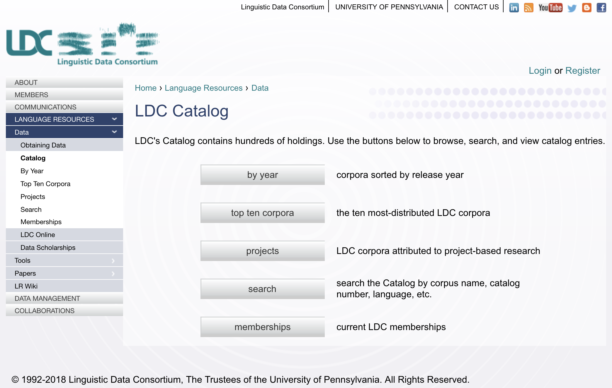
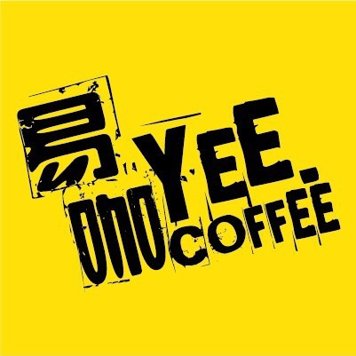
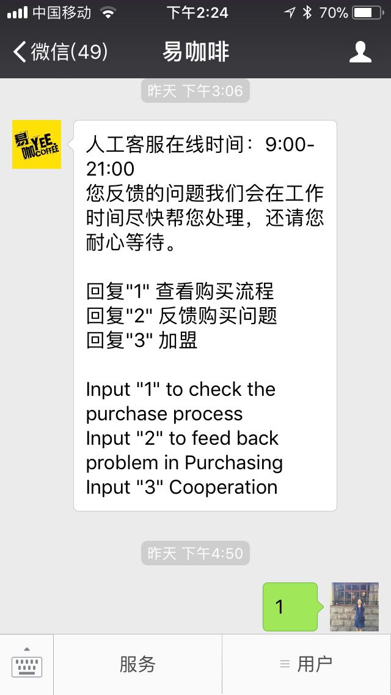
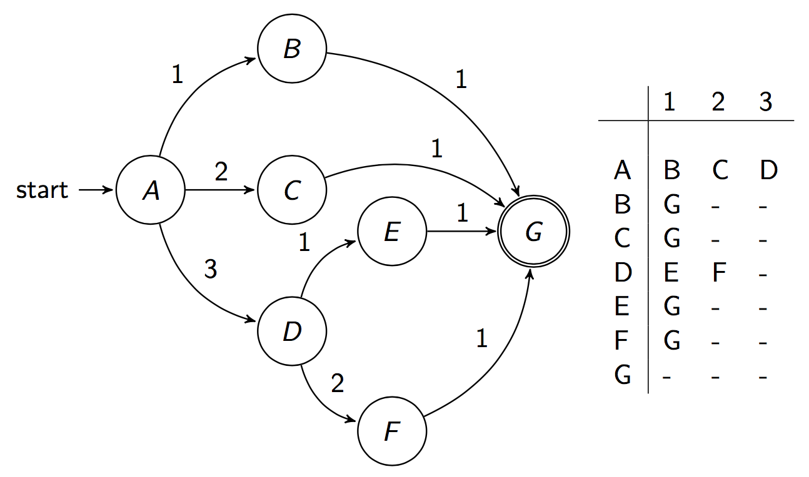
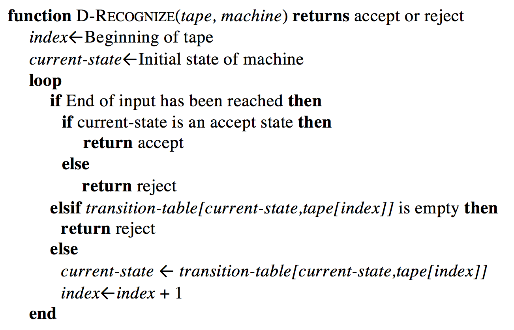

class: center, middle
# Computational Linguistics<br>
##2. Text Normalization, Regular Expressions, and Edit Distance

** Xiaojing Bai **

** Tsinghua University **

** https://bxjthu.github.io/CompLing **

---
## At the end of this session you will
+ know some basic tasks in text processing; <br><br>

+ understand what is a finite state automaton and how it is related to regular expressions and regular languages; <br><br>

+ be able to work with basic regular expressions in pattern matching;<br><br>

+ learn the structure of programs and some basic string operations. <br><br>

---
class: middle
Over the past 20 years, computational linguistics has grown into both an exciting area of scientific research and a practical technology that is increasingly being incorporated into consumer products (for example, in applications such as Apple’s Siri and Skype Translator). **Four key factors** enabled these developments: (i) a vast increase in computing power, (ii) the availability of very large amounts of **linguistic data**, (iii) the development of highly successful machine learning (ML) methods, and (iv) a much richer understanding of the structure of human language and its deployment in social contexts. <br><br>

.right[Hirschberg, J., & Manning, C. D. (2015).

**Advances in natural language processing**. _Science_, 349(6245), 261-266.

[](https://www.ldc.upenn.edu/)]

???
The Linguistic Data Consortium (LDC) is an open consortium of universities, libraries, corporations and government research laboratories. It was formed in 1992 to address the critical data shortage then facing language technology research and development.<br>
linguistic data / language resources mainly include lexicons, corpora<br>
Language knowledge base<br>
(S12) Language Resources in NLP

---


---

##Some notes on _Corpus/Corpora_

A corpus is a **collection** of **machine-readable text or speech** produced in a **natural** communicative setting.

+ Representative
+ Balanced

Dimensions of variation

+ Language
+ Genre
+ Writer/speaker
+ Time

.right[
.smaller[
Later in this course (12. Language Resources in NLP):<br>history of corpus linguistics (ups and downs, people/reasons/events behind), <br>well-known corpora, use of corpora, etc.
]]

???
the content of the corpus reflects that of the larger population from which it is taken<br>
a rather fuzzy notion and difficult to define strictly. Atkins and Ostler (1992) propose a formulation of attributes that can be used to define the types of text, and thereby contribute to creating a balanced corpus.<br>
linguistic observations and theoretical generalizations (testing and evaluating your hypotheses against observed phenomena)<br>

---

```
>>> import nltk
>>> nltk.download()
```
<br>


???
Once you've installed NLTK, start up the Python interpreter as before, and install the data required for the book by typing the following two commands at the Python prompt, then selecting the book collection as shown

---
class: center, middle
### Let's start our study of language from a computational perspective with ...

---
.left-column-2[
##What counts as a _word_ ?

+ Text vs. speech

+ Lemma vs. wordform

+ Word type vs. word token

+ English vs. Chinese
]
.right-column-2[
E.g.

> a. _He stepped out into the hall, was delighted to encounter a water brother._

> b. _I do uh main- mainly business data processing_

> c. _His	cat is different from other cats!_

> d. _They picnicked by the pool, then lay back on the grass and looked at the stars._

> e. _他特别喜欢北京烤鸭。_

]
???
A lemma is a set of lexical forms having the same stem, the same major part-of-speech, and the same word sense. <br>
The word- form is the full inflected or derived form of the word.<br>
cat vs. cats<br>
Types are the number of distinct words.<br>
Tokens are the total number running words.<br>
16 tokens and 14 types

---
##Text normalization

###What every NLP task needs to do!

1. Tokenize/segment words in running text

2. Lemmatize word forms

3. Segment sentences in running text

---
##Tokenization: What counts as a _word_ ? (word boundary)
 .left-column-2[
+ Space? Punctuations?  

+ Clitic contractions

+ Multiword expressions and hyphenated words

+ Special characters and numbers

+ URLs and email addresses

]

.right-column-2[
 e.g. _m.p.h., Ph.D., AT&T, cap’n_

> _what’re, we’re_

> _San Francisco-based_
.smaller[<br><br><br>]
> _$45.55, 01/02/06_

> _https://bxjthu.github.io, bxj@tsinghua.edu.cn_
]


???
A clitic is a part of a word that can’t stand on its own, and can only occur when it is attached to another word. <br>
One commonly used tokenization standard is known as the Penn Treebank tokenization standard, <br>
used for the parsed corpora (treebanks) released by the Linguistic Data Consortium (LDC), the source of many useful datasets. <br>
This standard separates out clitics (doesn’t becomes does plus n’t), <br>
keeps hyphenated words together, and separates out all punctuation:

---
##Tokenization: What counts as a _word_ ? (word boundary)


<br><br><br>
.smaller[Tokenization in NLTK]
```
>>> help(word_tokenize)
```

.smaller[More at http://www.nltk.org/book/ch03.html]

---

##Tokenization: language issues
+ **Chinese**: no space between words
.smaller[
E.g. _计算语言学课程是三个学时  &#8594;   计算语言学 课程 是 三 个 学时_ <br>

Read:Word Segmentation in Chinese: the MaxMatch algorithm (J+M_2)
]
+ **German**: noun compounds not segmented
.smaller[
E.g. _Lebensversicherungsgesellschaftsangestellter  ‘life insurance company employee’_
]
+ **Japanese**: multiple	alphabets	intermingled Katakana

> 

+ ...

???
片假名Katakana  |ˌkatəˈkɑːnə|<br>
平假名Hiragana |ˌhɪrəˈɡɑːnə|<br>
汉字kanji |ˈkandʒi, ˈkɑːndʒi| Chinese characters, used primarily for content words<br>
罗马字Romaji|ˈrəʊmədʒi| a system of romanized  |ˈrəʊmənʌɪz|  spelling used to transliterate Japanese.
---
## Lemmatization
+ Choose a single normalized form for words with multiple forms
.smaller[
E.g. _USA, U.S.A., US; uh-huh, uhhuh_
]
+ Reduce all letters to lower case (case folding)
.smaller[
E.g. _US, us_
]
+ Represent words by their lemmas

> + Simply reduce inflections or variant forms to base form

.smaller[
>> E.g. _am, are, is &#8594;  be; dinner, dinners &#8594; dinner_
]

> + Perform complete morphological parsing

.smaller[
>> E.g. _fox &#8594;  fox; cats &#8594;  cat + -s_
]

???
Applications	like IR reduce all	letters to lower case since users tend to use lower case.<br>
For sentiment analysis,	MT, information extraction, case is helpful.

Morphology is the study of the way words are built up from smaller meaning-bearing units called morphemes. <br>
Two broad classes of morphemes can be distinguished: <br>
stems: the central morpheme of the word, supplying the main meaning<br>
affixes: adding “additional” meanings of various kinds

finite-state transducers to build a full morphological parser: the most general way to deal with morphological variation in word forms<br>
simpler but cruder chopping off of affixes, naive version of morphological analysis called stemming

---

##Lemmatization

Dealing with morphological variation in word forms:

+ Finite-state transducers: full morphological parsing

+ Stemmer: simpler but cruder chopping off of affixes

  + The Porter stemmer

  + The Lancaster stemmer

  .smaller[More at http://www.nltk.org/book/ch03.html]

---
##Sentence segmentation
+ Punctuations:

 + Relatively unambiguous: question marks, exclamation points

 + Quite ambiguous: periods

+ Binary classifier

 + Hand-written rules

 + Machine-learning

  \+ Abbreviation dictionary
???
Sentence boundary<br>
Abbreviations like Inc.	or	Dr.<br>
Numbers like 4.3

---

##Text normalization

###What every NLP task needs to do!

1. Tokenize/segment words in running text

2. Lemmatize word forms

3. Segment sentences in running text

<br><br>
**Question:** How could NLTK help? >>> Practical 2

---
##Modelling _actions_ and _events_

Situations with a predefined set of actions

Examples: lift, traffic lights with motion sensors, vending machines




<br>
The order of actions depends on events happening at the time.

---
##Modelling _actions_ and _events_ : finite state automaton (FSA)





---
##A toy example of FSA: Tele-fruit-sales
.left-column-4[

]
.right-column-4[
> Based on the wordy description of what happens when you call the Tele-fruit-sales line, can you represent all the information in a simpler way?
]

---
##A toy example of FSA: Tele-fruit-sales



---
##FSA for recognizing language

.left-column-1[
+ The sheep talk<br><br>
baa!<br>
baaa!<br>
baaaa!<br>
baaaaa!<br>
...

<br><br><br><br><br><br><br><br><br><br><br><br>
]

---
##FSA for recognizing language

.left-column-1[
+ The sheep talk<br><br>
baa!<br>
baaa!<br>
baaaa!<br>
baaaaa!<br>
...

<br><br><br><br><br><br><br><br><br><br>
]

.right-column-1[

.left-column-3[
+ FSA for the sheep talk


]
.right-column-3[
> 
]
]

<font color="red">_Q = {q<sub>0</sub> q<sub>1</sub> q<sub>2</sub> ... q<sub>N-1</sub>}_</font>: a finite set of _N_ **states**
<font color="red">_Σ_</font>: a finite **input alphabet** of symbols
<font color="red">_q<sub>0</sub>_</font>: the **start state**
<font color="red">_F_</font>: the set of **final states**, _F_ &#8838; _Q_
<font color="red">_δ(q, i)_</font>: the **transition function** or transition matrix between states. Given a state _q_ &#8712; _Q_ and an input symbol _i_  &#8712; _Σ_, _δ(q, i)_ returns a new state _q'_ &#8712; _Q_.

---
##FSA for recognizing language

.left-column-1[
+ The sheep talk<br><br>
baa!<br>
baaa!<br>
baaaa!<br>
baaaaa!<br>
...

<br><br><br><br><br><br><br><br><br><br>
]

.right-column-1[

+ FSA for the sheep talk


]

---
##FSA for recognizing language

.left-column-1[
+ The sheep talk<br><br>
baa!<br>
baaa!<br>
baaaa!<br>
baaaaa!<br>
...

<br><br><br><br><br><br><br><br><br><br>
]

.right-column-1[

+ FSA for the sheep talk


]

???

The algorithm will fail whenever there is no legal transition for a given combination of state and input.

The input abc will fail to be recognized since there is no legal transition out of state q0 on the input a.

Even if the automaton had allowed an initial a it would have certainly failed on c, since c isn’t even in the sheeptalk alphabet!.

We can think of these ‘empty’ elements in the table as if they all pointed at one ‘empty’ state, which we might call the fail state or sink state.

In a sense then, we could view any machine with empty transitions as if we had augmented it with a fail state, and drawn in all the extra arcs, so we always had somewhere to go from any state on any possible input. Just for completeness, Figure 2.14 shows the FSA from Figure 2.9 with the fail state qF filled in.
---
##How does a computer use an FSA?
A pseudo-code example in J&M_2.1



---
##FSA for the sheep talk

.left-column-1[
+ The sheep talk<br><br>
baa!<br>
baaa!<br>
baaaa!<br>
baaaaa!<br>
...

+ <font color="red">RE for the sheep talk</font>

> <font color="red">/baa+!/</font>
<br><br><br><br><br><br><br>
]

.right-column-1[

.left-column-3[
+ FSA for the sheep talk


]
.right-column-3[
> 
]
]

_Q = {q<sub>0</sub> q<sub>1</sub> q<sub>2</sub> ... q<sub>N-1</sub>}_: a finite set of _N_ **states**

_Σ_: a finite **input alphabet** of symbols

_q<sub>0</sub>_: the **start state**

_F_: the set of **final states**, _F_ &#8838; _Q_

_δ(q, i)_: the **transition function** or transition matrix between states. Given a state _q_ &#8712; _Q_ and an input symbol _i_  &#8712; _Σ_, _δ(q, i)_ returns a new state  _q'_ &#8712; _Q_.

---
##Regular expressions
One of the **unsung successes** in standardization in computer science

+ The most important tool for describing text pattern &#8594; **computational model**

+ Useful for searching in texts, with a **pattern** to search for and a corpus of **texts** to search through

---
##Regular expressions
One of the **unsung successes** in standardization in computer science

+ The most important tool for describing text pattern &#8594; **computational model**

+ Useful for searching in texts, with a **pattern** to search for and a corpus of **texts** to search through

+ **Eliza**: a program which makes natural language conversation between man and computer possible

 .left-column-3[

Weizenbaum, J. (1966). ELIZA - a computer program for the study of natural language communication between man and machine. _Communications of the ACM_, 9(1), 36-45.
<br><br><br><br>

>>>>_"Like the Eliza of Pygmalion fame, it can<br>
be made to appear even more civilized ..."_

]

 .right-column-3[

 ]

???
Pygmalion |pɪɡˈmeɪlɪən| is a play by George Bernard Shaw, named after a Greek mythological figure.

In ancient Greek mythology, Pygmalion fell in love with one of his sculptures, which then came to life.  

Eliza is a flower girl, who comes to Professor Henry Higgins asking for elocution lessons.

Higgins goes along with it for the purposes of a wager: That he can turn her into the toast of elite London society.

Doolittle receives voice coaching and learns the rules of etiquette.
---
##Regular expressions
+ **Eliza**: a program which makes natural language conversation between man and computer possible

.left-column-2[
> _"...the text is <font color="red">read and inspected</font> for the presence of a **keyword**. If such a word is found, the sentence is transformed according to a **rule** associated with the keyword, if not a content-free remark or, under certain conditions, an earlier transformation is retrieved. The text so computed or retrieved is then printed out."_

E.g. "You are X" &#8594; "What makes you think I am X?"

]

---
##Regular expressions
+ **Eliza**: a program which makes natural language conversation between man and computer possible

.left-column-2[
> _"...the text is <font color="red">read and inspected</font> for the presence of a **keyword**. If such a word is found, the sentence is transformed according to a **rule** associated with the keyword, if not a content-free remark or, under certain conditions, an earlier transformation is retrieved. The text so computed or retrieved is then printed out."_

E.g. "You are X" &#8594; "What makes you think I am X?"

]

.right-column-2[
Men are all alike.
<br>
IN WHAT WAY

They're always bugging us about something or other.
<br>
CAN YOU THINK OF A SPECIFIC EXAMPLE

Well, my boyfriend made me come here.
<br>
YOUR BOYFRIEND MADE YOU COME HERE

He says I'm depressed much of the time.
<br>
I AM SORRY TO HEAR YOU ARE DEPRESSED

...
]

---
##Regular expressions
+ **Eliza**: a program which makes natural language conversation between man and computer possible

.left-column-2[
> _"...the text is <font color="red">read and inspected</font> for the presence of a **keyword**. If such a word is found, the sentence is transformed according to a **rule** associated with the keyword, if not a content-free remark or, under certain conditions, an earlier transformation is retrieved. The text so computed or retrieved is then printed out."_

E.g. "You are X" &#8594; "What makes you think I am X?"
<br><br>

>_"a fun diversion"_

>cf. modern conversational agents

]

.right-column-2[
Men are all alike.
<br>
IN WHAT WAY

They're always bugging us about something or other.
<br>
CAN YOU THINK OF A SPECIFIC EXAMPLE

Well, my boyfriend made me come here.
<br>
YOUR BOYFRIEND MADE YOU COME HERE

He says I'm depressed much of the time.
<br>
I AM SORRY TO HEAR YOU ARE DEPRESSED

...
]

???

Person-centered therapy was developed by Carl Rogers in the 1940s. This type of therapy diverged from the traditional model of the therapist as expert and moved instead toward a nondirective, empathic approach that empowers and motivates the client in the therapeutic process. The therapy is based on Rogers’s belief that every human being strives for and has the capacity to fulfill his or her own potential. Person-centered therapy, also known as Rogerian therapy, has had a tremendous impact on the field of psychotherapy and many other disciplines.
Such chatbots are a fun diversion.
Modern conversational agents are much more than a diversion; they can answer questions, book flights, or find restaurants, functions for which they rely on a much more sophisticated understanding of the user’s intent, as we will see in Chapter 29.

---
##Regular expressions

+ A quite reference at https://regex101.com/


---
##Regular expressions

+ Two kinds of errors

 + **False positives**: matching strings that we should not have matched (e.g. _there, then, other_)

 + **False	 negatives**: not matching strings that we should have matched	(e.g. _The_)

+ With NLP applications, reducing the error rate	often	 involves two antagonistic efforts

 + Increasing	 **accuracy**	or	**precision** (minimizing false positives)

 + Increasing **coverage** or **recall** (minimizing false negatives).
---
##Regular expressions

+ Two kinds of errors

 + **False positives**: matching strings that we should not have matched (e.g. _there, then, other_)

 + **False	 negatives**: not matching strings that we should have matched	(e.g. _The_)

+ With NLP applications, reducing the error rate	often	 involves two _antagonistic_ efforts

 + Increasing	 **accuracy**	or	**precision** (minimizing false positives)

 + Increasing **coverage** or **recall** (minimizing false negatives).

<br>
.right[
### Why are these two efforts <font color="red">“antagonistic”</font>?
]

---
##Regular expressions

+ Sophisticated	 sequences of regular expressions	are often the first model for text processing tasks

+ Regular	expressions as features in machine learning classifiers

###Any use of RE that you can think of?

---
##RE and FSA

.left-column-2[
Three equivalent ways of describing regular languages


]

.right-column-2[
>+ The Chomsky hierarchy

>+ Natural language and its complexity

>+ Formal models and formal languages

>+ Power of formal models: complexity of the phenomena they can describe
]

---
##RE and FSA

+ Formal language

 + a set of strings, each composed of symbols from a finite symbol-set called an alphabet

 + characterized by a model _m_ (such as a particular FSA)

???
The set of all of the strings that are generated by a regular expression (or its corresponding FSA) is called a regular language.

---

##RE and FSA

+ Formal language

 + a set of strings, each composed of symbols from a finite symbol-set called an alphabet

 + characterized by a model _m_ (such as a particular FSA)

 >E.g. _L(m) = {baa!, baaa!, baaaa!, baaaaa!, baaaaaa!, <font color="red">**. . .**</font>}_

 > The sheep talk automaton helps us **recognize** and **generate** the sheeptalk.

 > 

 > **Usefulness** of an automaton: a <font color="red">finite</font> set of symbols to define an <font color="red">infinite</font> set
---
##RE and FSA

+ Formal language

 + a set of strings, each composed of symbols from a finite symbol-set called an alphabet

 + characterized by a model _m_ (such as a particular FSA)

 >E.g. _L(m) = {baa!, baaa!, baaaa!, baaaaa!, baaaaaa!, <font color="red">**. . .**</font>}_

 > The sheep talk automaton helps us **recognize** and **generate** the sheeptalk.

 > 

 > **Usefulness** of an automaton: a <font color="red">finite</font> set of symbols to define an <font color="red">infinite</font> set

 + Formal language vs. natural language

???
Use a formal language to model part of a natural language,

such as parts of the phonology, morphology, syntax
---
## At the end of this session you will
+ know some basic tasks in text processing; <br><br>

+ understand what is a finite state automaton and how it is related to regular expressions and regular languages; <br><br>

+ be able to work with basic regular expressions in pattern matching;<br><br>

+ learn the structure of programs and some basic string operations. <br><br>

---
##Assignment

** 1. Readings **

J+M 2 (Regular Expressions and Automata);

J+M[3rd] (Words and Corpora, Text Normalization)

** 2. Read and Practice **

2.1 Read the Quick Reference at https://regex101.com/, particularly the common tokens. Review and test the regular expressions in J+M 2.

2.2 Review Practical 2 (Refer to the related sections in http://www.nltk.org/book/ch02.html; http://www.nltk.org/book/ch03.html; http://www.nltk.org/book/ch04.html)

---
class: center, middle
##Next session

Finite State Transducers and N-grams
