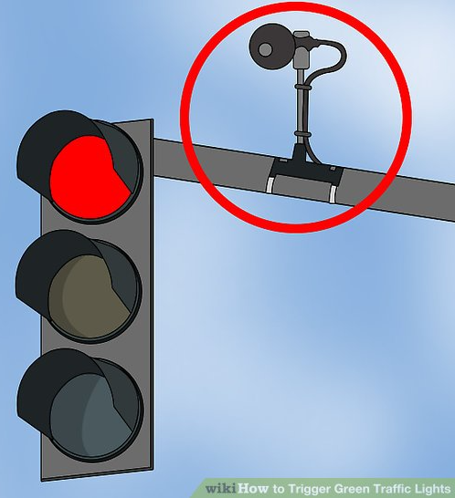
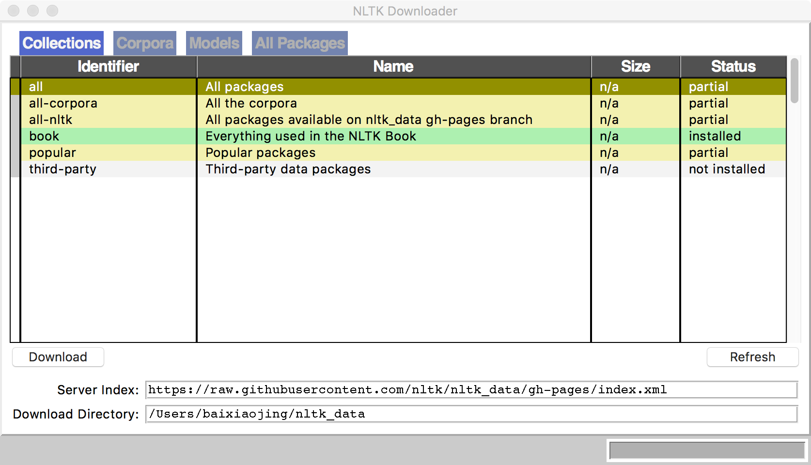
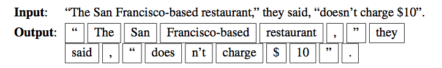
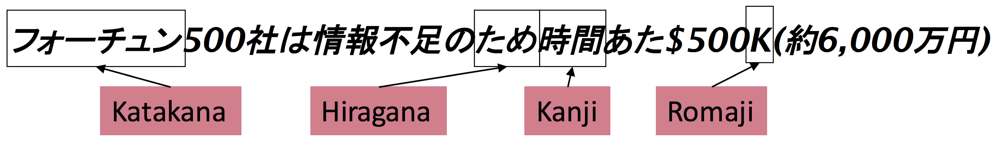
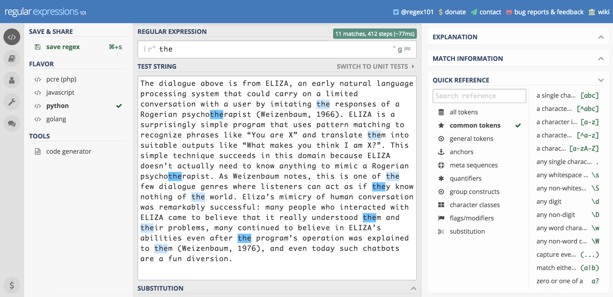
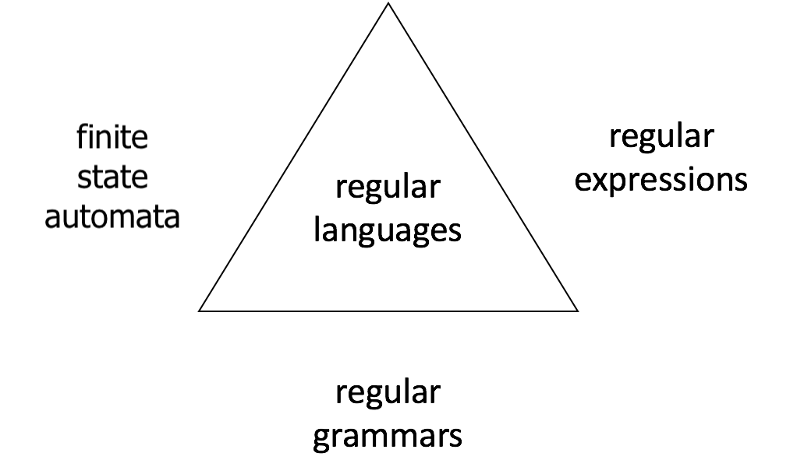
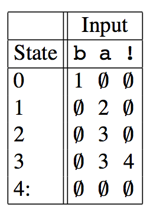
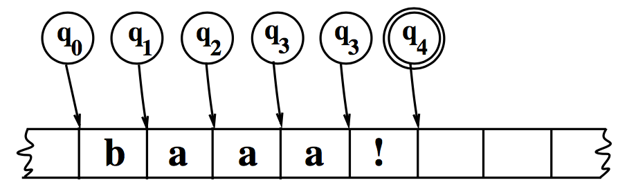
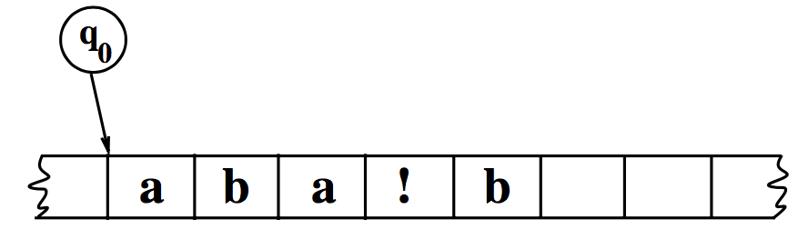
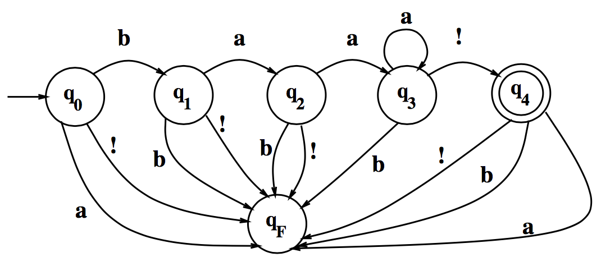

class: center, middle
# Computational Linguistics<br>
##2. Text Normalization, Regular Expressions, <br>and Finite State Transducers
** Xiaojing Bai **

** Tsinghua University **

** https://bxjthu.github.io/CompLing **

---
##Modelling _actions_ and _events_

Situations described by a predefined set of actions

Examples: lift, traffic lights with motion sensors, vending machines





The order of actions depends on events happening at the time

Finite state automata (FSA) or finite state machine

---
class: center, middle


---
class: middle
Over the past 20 years, computational linguistics has grown into both an exciting area of scientific research 

and a practical technology that is increasingly being incorporated into consumer products (for example, in 

applications such as Apple’s Siri and Skype Translator). **Four key factors** enabled these developments: (i) a 

vast increase in computing power, (ii) the availability of very large amounts of **linguistic data**, (iii) the 

development of highly successful machine learning (ML) methods, and (iv) a much richer understanding of 

the structure of human language and its deployment in social contexts. <br><br>

.right[Hirschberg, J., & Manning, C. D. (2015). 

**Advances in natural language processing**. _Science_, 349(6245), 261-266.

]

???
The Linguistic Data Consortium (LDC) is an open consortium of universities, libraries, corporations and government research laboratories. It was formed in 1992 to address the critical data shortage then facing language technology research and development.<br>
linguistic data / language resources mainly include lexicons, corpora<br>
Language knowledge base<br>
(S12) Language Resources in NLP
---
##Some notes on _Corpus/Corpora_

A corpus is a **collection** of **machine-readable text or speech** produced in a **natural** communicative setting. 

+ Representative 

+ Balanced 

<br><br>

Later in this course (12. Language Resources in NLP)

+ History of corpus linguistics (ups and downs, people/reasons/events behind)

+ Well-known corpora

+ Use of corpora

???
the content of the corpus reflects that of the larger population from which it is taken<br>
a rather fuzzy notion and difficult to define strictly. Atkins and Ostler (1992) propose a formulation of attributes that can be used to define the types of text, and thereby contribute to creating a balanced corpus.<br>
linguistic observations and theoretical generalizations (testing and evaluating your hypotheses against observed phenomena)<br>

---
Let's start our study of language from a computational perspective with ...
##What counts as a _word_ ?

+ Text vs. speech

+ Lemma vs. wordform

+ Word type vs. word token

+ English vs. Chinese
<br><br>

E.g. a. _He stepped out into the hall, was delighted to encounter a water brother._

> b. _I do uh main- mainly business data processing_

> c. _His	cat is different from other cats!_

> d. _They picnicked by the pool, then lay back on the grass and looked at the stars._

> e. _他特别喜欢北京烤鸭。_

???
word boundary
space
(word-internal) punctuations, special characters, numbers, URLs, email addresses
disfluency, fragment, filled pause
non-alphabetic characters
clitic contractions
multiword expressions
hyphenated words

---
##Text normalization >> basic text processing

 ###What every NLP task needs	to	do!

1. Tokenize words in running text

2. Normalize and lemmatize word forms

3. Segment sentences in running text

---
##Text normalization >> basic text processing
### Tokenization: What counts as a _word_ ? >> word boundary
 .left-column-2[
+ Space? Punctuations?  

+ Clitic contractions

+ Multiword expressions and hyphenated words

+ Special characters and numbers

+ URLs and email addresses

]

.right-column-2[
 e.g. _m.p.h,, Ph.D., AT&T, cap’n_

> _what’re, we’re_

> _San Francisco-based_

> _$45.55, 01/02/06_

> _https://bxjthu.github.io, bxj@tsinghua.edu.cn_
]



---
##Text normalization >> basic text processing
### Tokenization: language issues
+ **Chinese**: no space between words

> E.g. _计算语言学课程是三个学时 >> 计算语言学 课程 是 三 个 学时_

+ **German**: noun compounds not segmented

> E.g. _Lebensversicherungsgesellschaftsangestellter >> ‘life insurance company employee’_ 

+ **Japanese**: multiple	alphabets	intermingled Katakana

> 

+ ...
---
##Text normalization >> basic text processing
### Normalization and lemmatization
+ Choose a single normalized form for words with multiple forms

> E.g. _USA, U.S.A., US; uh-huh, uhhuh_

+ Reduce all letters to lower case >> case folding

> E.g. _US, us_

+ Represent words by their lemmas

> + Simply reduce inflections or variant forms to base form

>> E.g. _am, are, is >> be; dinner, dinners >> dinner_

> + Or, perform complete morphological parsing 

>>  E.g. _fox >> fox; cats >> cat + -s_
???
Applications	like IR reduce all	letters to lower case since users tend to use lower case.

For sentiment analysis,	MT, information extraction, case is helpful.	

Morphology is the study of the way words are built up from smaller meaning-bearing units called morphemes. 

Two broad classes of morphemes can be distinguished: 

stems: the central morpheme of the word, supplying the main meaning

affixes: adding “additional” meanings of various kinds

finite-state transducers to build a full morphological parser: the most general way to deal with morphological variation in word forms

simpler but cruder chopping off of affixes, naive version of morphological analysis called stemming
---
##Text normalization >> basic text processing
### Sentence segmentation
+ Punctuations: 

 + Relatively unambiguous: question marks, exclamation points
 
 + Quite ambiguous: periods
 
+ Binary classifier

 + Hand-written rules

 + Machine-learning

  \+ Abbreviation dictionary
???
Sentence boundary
Abbreviations like Inc.	or	Dr.
Numbers like 4.3
 
---
##Text normalization >> basic text processing

 ###What every NLP task needs to do!
.left-column-2[
1. Tokenize words in running text

2. Normalize and lemmatize word forms

3. Segment sentences in running text

<br><br>
**Question:** How could NLTK help?
]

.right-column-2[
```
>>> len(text3)
44764

>>> len(set(text3))
2789

>>> for fileid in gutenberg.fileids():
...     num_chars = len(gutenberg.raw(fileid))
...     num_words = len(gutenberg.words(fileid))
...     num_sents = len(gutenberg.sents(fileid))
...
```

### >> Pattern matching
]

---
##Regular expressions
One of the **unsung successes** in standardization in computer science

+ The most important tool for describing text pattern >> **computational model**

+ Useful for searching in texts, with a **pattern** to search for and a corpus of **texts** to search through

---
##Regular expressions
One of the **unsung successes** in standardization in computer science

+ The most important tool for describing text pattern >> **computational model**

+ Useful for searching in texts, with a **pattern** to search for and a corpus of **texts** to search through

+ **Eliza**: a program which makes natural language conversation between man and computer possible

 .left-column-3[
 
Weizenbaum, J. (1966). ELIZA - a computer program for the study of natural language communication between man and machine. _Communications of the ACM_, 9(1), 36-45.
<br><br><br><br>

>>>>_"Like the Eliza of Pygmalion fame, it can<br>
be made to appear even more civilized ..."_

]

 .right-column-3[

 ]
---
##Regular expressions
+ **Eliza**: a program which makes natural language conversation between man and computer possible

.left-column-2[
> _"...the text is <font color="red">read and inspected</font> for the presence of a **keyword**. If such a word is found, the sentence is transformed according to a **rule** associated with the keyword, if not a content-free remark or, under certain conditions, an earlier transformation is retrieved. The text so computed or retrieved is then printed out."_

E.g. "You are X" >> "What makes you think I am X?"

]

---
##Regular expressions
+ **Eliza**: a program which makes natural language conversation between man and computer possible

.left-column-2[
> _"...the text is <font color="red">read and inspected</font> for the presence of a **keyword**. If such a word is found, the sentence is transformed according to a **rule** associated with the keyword, if not a content-free remark or, under certain conditions, an earlier transformation is retrieved. The text so computed or retrieved is then printed out."_

E.g. "You are X" >> "What makes you think I am X?"

]

.right-column-2[
Men are all alike.
<br>
IN WHAT WAY

They're always bugging us about something or other. 
<br>
CAN YOU THINK OF A SPECIFIC EXAMPLE

Well, my boyfriend made me come here.
<br>
YOUR BOYFRIEND MADE YOU COME HERE 

He says I'm depressed much of the time.
<br>
I AM SORRY TO HEAR YOU ARE DEPRESSED

...
]

---
##Regular expressions
+ **Eliza**: a program which makes natural language conversation between man and computer possible

.left-column-2[
> _"...the text is <font color="red">read and inspected</font> for the presence of a **keyword**. If such a word is found, the sentence is transformed according to a **rule** associated with the keyword, if not a content-free remark or, under certain conditions, an earlier transformation is retrieved. The text so computed or retrieved is then printed out."_

E.g. "You are X" >> "What makes you think I am X?"
<br><br>

>_"a fun diversion"_ 

>cf. modern conversational agents 

]

.right-column-2[
Men are all alike.
<br>
IN WHAT WAY

They're always bugging us about something or other. 
<br>
CAN YOU THINK OF A SPECIFIC EXAMPLE

Well, my boyfriend made me come here.
<br>
YOUR BOYFRIEND MADE YOU COME HERE 

He says I'm depressed much of the time.
<br>
I AM SORRY TO HEAR YOU ARE DEPRESSED

...
]

???

Person-centered therapy was developed by Carl Rogers in the 1940s. This type of therapy diverged from the traditional model of the therapist as expert and moved instead toward a nondirective, empathic approach that empowers and motivates the client in the therapeutic process. The therapy is based on Rogers’s belief that every human being strives for and has the capacity to fulfill his or her own potential. Person-centered therapy, also known as Rogerian therapy, has had a tremendous impact on the field of psychotherapy and many other disciplines.
Such chatbots are a fun diversion. 
Modern conversational agents are much more than a diversion; they can answer questions, book flights, or find restaurants, functions for which they rely on a much more sophisticated understanding of the user’s intent, as we will see in Chapter 29. 

---
##Regular expressions

+ A quite reference at https://regex101.com/



---
##Regular expressions

+ Two kinds of errors

 + **False positives**: matching strings that we should not have matched (e.g. _there, then, other_)

 + **False	 negatives**: not matching strings that we should have matched	(e.g. _The_)

+ With NLP applications, reducing the error rate	often	 involves two antagonistic efforts

 + Increasing	 **accuracy**	or	**precision** (minimizing false positives)
 
 + Increasing **coverage** or **recall** (minimizing false negatives).
---
##Regular expressions

+ Two kinds of errors

 + **False positives**: matching strings that we should not have matched (e.g. _there, then, other_)

 + **False	 negatives**: not matching strings that we should have matched	(e.g. _The_)

+ With NLP applications, reducing the error rate	often	 involves two _antagonistic_ efforts

 + Increasing	 **accuracy**	or	**precision** (minimizing false positives)
 
 + Increasing **coverage** or **recall** (minimizing false negatives).
 
<br>
.right[
### Why are these two efforts <font color="red">“antagonistic”</font>?
]

---
##Regular expressions

+ Sophisticated	 sequences of regular expressions	are often the first model for text processing tasks

+ Regular	expressions as features in machine learning classifiers

###Any use of RE that you can think of?

---
##Regular expressions (RE) and finite-state automaton (FSA)

.left-column-2[
Three equivalent ways of describing regular languages


]

.right-column-2[
>+ The Chomsky hierarchy

>+ Natural language and its complexity

>+ Formal models and formal languages

>+ Power of formal models: complexity of the phenomena they can describe
]

---
##Regular expressions (RE) and finite-state automaton (FSA)

.left-column-2[
Three equivalent ways of describing regular languages


]

.right-column-2[
>+ The Chomsky hierarchy

>+ Natural language and its complexity

>+ Formal models and formal languages

>+ Power of formal models: complexity of the phenomena they can describe

>+ The sheeptalk<br><br>
> baa!<br>
> baaa!<br>
> baaaa!<br>
> baaaaa!<br>
> ...

]

---
##Regular expressions (RE) and finite-state automaton (FSA)

.left-column-1[
+ The sheeptalk<br><br>
baa!<br>
baaa!<br>
baaaa!<br>
baaaaa!<br>
...

+ RE for the sheeptalk

> /baa+!/
<br><br><br><br><br><br><br><br>
]

.right-column-1[

.left-column-3[
+ FSA for the sheeptalk


]
.right-column-3[
> 
]
]

<font color="red">_Q = q<sub>0</sub> q<sub>1</sub> q<sub>2</sub> ... q<sub>N-1</sub>_</font>: a finite set of _N_ **states** 
<font color="red">_Σ_</font>: a finite **input alphabet** of symbols 
<font color="red">_q<sub>0</sub>_</font>: the **start state**
<font color="red">_F_</font>: the set of **final states**, _F_ `\( \subseteq \)` _Q_ 
<font color="red">_δ(q, i)_</font>: the **transition function** or transition matrix between states. <br> Given a state _q_ `\( \in \)` _Q_ and an input symbol _i_  `\( \in \)` _Σ_, _δ(q, i)_ returns a new state <br> _q'_ `\( \in \)` _Q_. Thus δ is a relation from _Q_ `\( \times \)`  _Σ_ to _Q_.

---
##Regular expressions (RE) and finite-state automaton (FSA)

.left-column-1[
+ The sheeptalk<br><br>
baa!<br>
baaa!<br>
baaaa!<br>
baaaaa!<br>
...

+ RE for the sheeptalk

> /baa+!/

]

.right-column-1[

+ FSA for the sheeptalk


 


]

---
##Regular expressions (RE) and finite-state automaton (FSA)

.left-column-1[
+ The sheeptalk<br><br>
baa!<br>
baaa!<br>
baaaa!<br>
baaaaa!<br>
...

+ RE for the sheeptalk

> /baa+!/

]

.right-column-1[

+ FSA for the sheeptalk


 

]

---
##Regular expressions (RE) and finite-state automaton (FSA)

+ Formal language

 + a set of strings, each composed of symbols from a finite symbol-set called an alphabet
 
 + characterized by a model _m_ (such as a particular FSA)
 
---

##Regular expressions (RE) and finite-state automaton (FSA)

+ Formal language

 + a set of strings, each composed of symbols from a finite symbol-set called an alphabet
 
 + characterized by a model _m_ (such as a particular FSA)
 
 >E.g. _L(m) = {baa!, baaa!, baaaa!, baaaaa!, baaaaaa!, <font color="red">**. . .**</font>}_

 > The sheeptalk automaton helps us **recognize** and **generate** the sheeptalk.
 
 > 

 > **Usefulness** of an automaton: a <font color="red">finite</font> set of symbols to define an <font color="red">infinite</font> set
---
##Regular expressions (RE) and finite-state automaton (FSA)

+ Formal language

 + a set of strings, each composed of symbols from a finite symbol-set called an alphabet
 
 + characterized by a model _m_ (such as a particular FSA)
 
 >E.g. _L(m) = {baa!, baaa!, baaaa!, baaaaa!, baaaaaa!, <font color="red">**. . .**</font>}_

 > The sheeptalk automaton helps us **recognize** and **generate** the sheeptalk.
 
 > 

 > **Usefulness** of an automaton: a <font color="red">finite</font> set of symbols to define an <font color="red">infinite</font> set
 
 + Formal language vs. natural language
  
---
+ Formal language vs. natural language


---

##Regular expressions (RE) and finite-state automaton (FSA)

.left-column-1[
+ The sheeptalk<br><br>
baa!<br>
baaa!<br>
baaaa!<br>
baaaaa!<br>
...

+ RE for the sheeptalk

> /baa+!/
]

.right-column-1[
.left-column-3[
+ FSA for the sheeptalk


<br><br>

<br>
]
.right-column-3[
> 
]
]
---

##Regular expressions and finite-state automaton (FSA)

The set of all of the strings that are generated by a regular expression (or its corresponding FSA) is called a regular language.

---