class: center, middle
# Computational Linguistics<br>
##2. Text Normalization, Finite State Transducers,<br>and Morphological Parsing

** Xiaojing Bai **

** Tsinghua University **

** https://bxjthu.github.io/CompLing **

---
## At the end of this session you will

+ learn that corpora are important linguistic data for NLP;

+ know the basic tasks in text processing;

+ understand what are finite state automata and finite state transducers;

+ understand how a finite state transducer is used in morphological parsing;

+ learn Python functions and the functions in NLKT for text normalization.

---
class: middle
Over the past 20 years, computational linguistics has grown into both an exciting area of scientific research and a practical technology that is increasingly being incorporated into consumer products (for example, in applications such as Apple’s Siri and Skype Translator). **Four key factors** enabled these developments: (i) a vast increase in computing power, (ii) the availability of very large amounts of **linguistic data**, (iii) the development of highly successful machine learning (ML) methods, and (iv) a much richer understanding of the structure of human language and its deployment in social contexts. <br><br>

.right[Hirschberg, J., & Manning, C. D. (2015).

**Advances in natural language processing**. _Science_, 349(6245), 261-266.

[](https://www.ldc.upenn.edu/)]

???
The Linguistic Data Consortium (LDC) is an open consortium of universities, libraries, corporations and government research laboratories. It was formed in 1992 to address the critical data shortage then facing language technology research and development.<br>
linguistic data / language resources mainly include lexicons, corpora<br>
Language knowledge base<br>
(S12) Language Resources in NLP

---

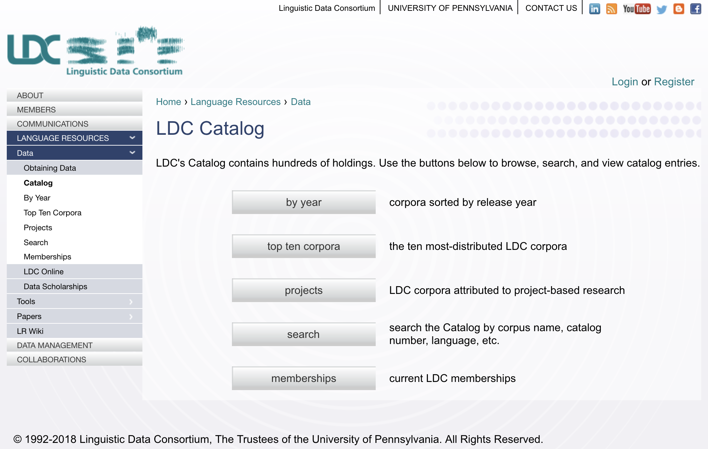
---

##Some notes on _Corpus/Corpora_

A corpus is a **collection** of **machine-readable text or speech** produced in a **natural** communicative setting.

+ Representative
+ Balanced

Dimensions of variation

+ Language
+ Genre
+ Writer/speaker
+ Time

.right[
.smaller[
Later in this course (12. Language Resources in NLP):<br>history of corpus linguistics (ups and downs, people/reasons/events behind), <br>well-known corpora, use of corpora, etc.
]]

???
the content of the corpus reflects that of the larger population from which it is taken<br>
a rather fuzzy notion and difficult to define strictly. Atkins and Ostler (1992) propose a formulation of attributes that can be used to define the types of text, and thereby contribute to creating a balanced corpus.<br>
linguistic observations and theoretical generalizations (testing and evaluating your hypotheses against observed phenomena)<br>

---

```
>>> import nltk
>>> nltk.download()
```


.smaller[More at http://www.nltk.org/book/ch01.html and http://www.nltk.org/book/ch02.html]

???
Once you've installed NLTK, start up the Python interpreter as before, and install the data required for the book by typing the following two commands at the Python prompt, then selecting the book collection as shown

---
class: center, middle
### Let's start our study of language from a computational perspective with ...

---
.left-column-2[
##What counts as a _word_ ?

+ Text vs. speech

+ Lemma vs. wordform

+ Word type vs. word token

+ English vs. Chinese
]
.right-column-2[
E.g.

> a. _He stepped out into the hall, was delighted to encounter a water brother._

> b. _I do uh main- mainly business data processing_

> c. _His	cat is different from other cats!_

> d. _They picnicked by the pool, then lay back on the grass and looked at the stars._

> e. _他特别喜欢北京烤鸭。_

]
???
A lemma is a set of lexical forms having the same stem, the same major part-of-speech, and the same word sense. <br>
The word- form is the full inflected or derived form of the word.<br>
cat vs. cats<br>
Types are the number of distinct words.<br>
Tokens are the total number running words.<br>
16 tokens and 14 types

---
##Text normalization

###What every NLP task needs to do!

1. Tokenize/segment words in running text

2. Lemmatize word forms

3. Segment sentences in running text

---
##Tokenization: What counts as a _word_ ? (word boundary)
 .left-column-2[
+ Space? Punctuations?  

+ Clitic contractions

+ Multiword expressions and hyphenated words

+ Special characters and numbers

+ URLs and email addresses

]

.right-column-2[
 e.g. _m.p.h., Ph.D., AT&T, cap’n_

> _what’re, we’re_

> _San Francisco-based_
.smaller[<br><br><br>]
> _$45.55, 01/02/06_

> _https://bxjthu.github.io/CompLing, bxj@tsinghua.edu.cn_
]


???
A clitic is a part of a word that can’t stand on its own, and can only occur when it is attached to another word. <br>
One commonly used tokenization standard is known as the Penn Treebank tokenization standard, <br>
used for the parsed corpora (treebanks) released by the Linguistic Data Consortium (LDC), the source of many useful datasets. <br>
This standard separates out clitics (doesn’t becomes does plus n’t), <br>
keeps hyphenated words together, and separates out all punctuation:

---
##Tokenization: What counts as a _word_ ? (word boundary)


<br><br><br>
.smaller[Tokenization in NLTK]
```
>>> help(word_tokenize)
```

.smaller[More at http://www.nltk.org/book/ch03.html]

---

##Tokenization: language issues
+ **Chinese**: no space between words
.smaller[
E.g. _计算语言学课程是三个学时  &#8594;   计算语言学 课程 是 三 个 学时_ <br>

Read:Word Segmentation in Chinese: the MaxMatch algorithm (J+M_2)
]
+ **German**: noun compounds not segmented
.smaller[
E.g. _Lebensversicherungsgesellschaftsangestellter  ‘life insurance company employee’_
]
+ **Japanese**: multiple	alphabets	intermingled Katakana

> 

+ ...

???
片假名Katakana  |ˌkatəˈkɑːnə|<br>
平假名Hiragana |ˌhɪrəˈɡɑːnə|<br>
汉字kanji |ˈkandʒi, ˈkɑːndʒi| Chinese characters, used primarily for content words<br>
罗马字Romaji|ˈrəʊmədʒi| a system of romanized  |ˈrəʊmənʌɪz|  spelling used to transliterate Japanese.
---
## Lemmatization
+ Choose a single normalized form for words with multiple forms
.smaller[
E.g. _USA, U.S.A., US; uh-huh, uhhuh_
]
+ Reduce all letters to lower case (case folding)
.smaller[
E.g. _US, us_
]
+ Represent words by their lemmas

> + Simply reduce inflections or variant forms to base form

.smaller[
>> E.g. _am, are, is &#8594;  be; dinner, dinners &#8594; dinner_
]

> + Perform complete morphological parsing

.smaller[
>> E.g. _fox &#8594;  fox; cats &#8594;  cat + -s_
]

???
Applications	like IR reduce all	letters to lower case since users tend to use lower case.<br>
For sentiment analysis,	MT, information extraction, case is helpful.

Morphology is the study of the way words are built up from smaller meaning-bearing units called morphemes. <br>
Two broad classes of morphemes can be distinguished: <br>
stems: the central morpheme of the word, supplying the main meaning<br>
affixes: adding “additional” meanings of various kinds

finite-state transducers to build a full morphological parser: the most general way to deal with morphological variation in word forms<br>
simpler but cruder chopping off of affixes, naive version of morphological analysis called stemming

---

##Lemmatization

Dealing with morphological variation in word forms:

+ Finite-state transducers: full morphological parsing

+ Stemmer: simpler but cruder chopping off of affixes

  + The Porter stemmer

  + The Lancaster stemmer

  .smaller[More at http://www.nltk.org/book/ch03.html]

---
##Sentence segmentation
+ Punctuations:

 + Relatively unambiguous: question marks, exclamation points

 + Quite ambiguous: periods

+ Binary classifier

 + Hand-written rules

 + Machine-learning

  \+ Abbreviation dictionary
???
Sentence boundary<br>
Abbreviations like Inc.	or	Dr.<br>
Numbers like 4.3

---

##Text normalization

###What every NLP task needs to do!

1. Tokenize/segment words in running text

2. Lemmatize word forms

3. Segment sentences in running text

<br><br>
**Question:** How could NLTK help? >>> Practical 2

---
##Modelling _actions_ and _events_

Situations with a predefined set of actions

Examples: lift, traffic lights with motion sensors, vending machines


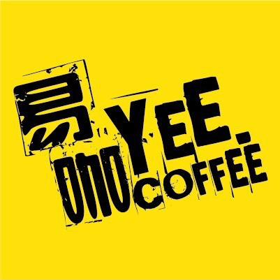

<br>
The order of actions depends on events happening at the time.

---
##Modelling _actions_ and _events_ : finite state automaton (FSA)


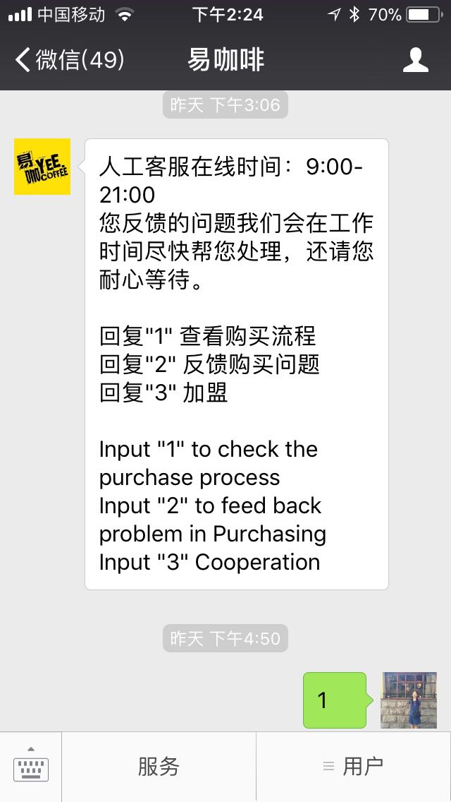


---
##A toy example of FSA: Tele-fruit-sales
.left-column-4[
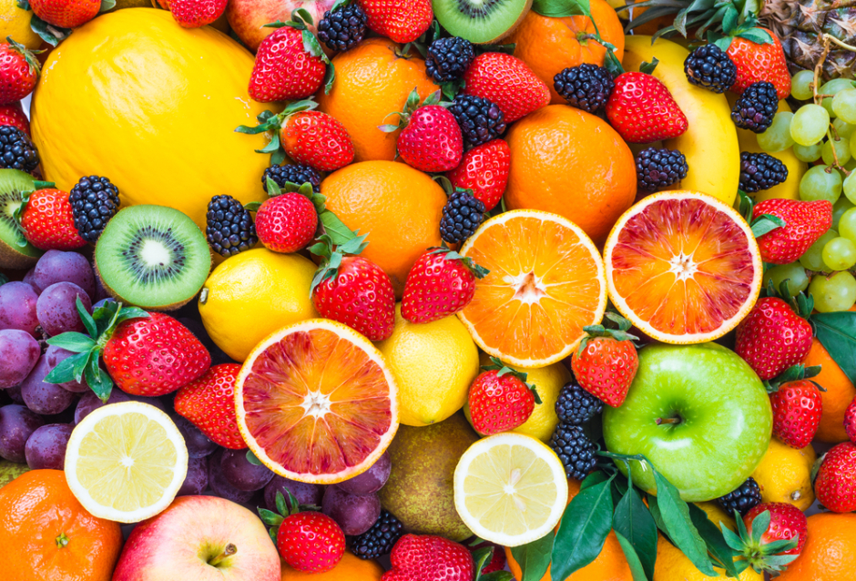
]
.right-column-4[
> Based on the wordy description of what happens when you call the Tele-fruit-sales line, can you represent all the information in a simpler way?
]

---
##A toy example of FSA: Tele-fruit-sales

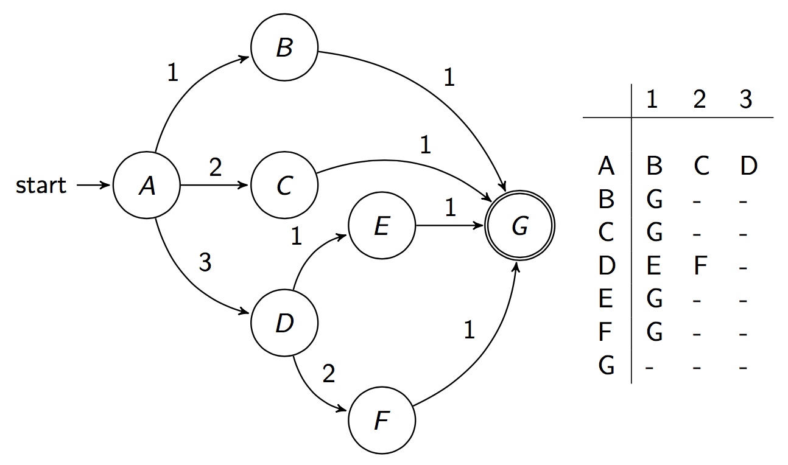

---
##FSA for recognizing language

.left-column-1[
+ The sheep talk<br><br>
baa!<br>
baaa!<br>
baaaa!<br>
baaaaa!<br>
...

]

---
##FSA for recognizing language

.left-column-1[
+ The sheep talk<br><br>
baa!<br>
baaa!<br>
baaaa!<br>
baaaaa!<br>
...

]

.right-column-1[

+ FSA for the sheep talk


]

---
##FSA for recognizing language

.left-column-2[
+ FSA for the sheep talk


]

.right-column-2[
<font color="red">_Q = {q<sub>0,</sub> q<sub>1,</sub> q<sub>2,</sub> ... q<sub>N-1</sub>}_</font>: a finite set of _N_ **states**
<font color="red">_Σ_</font>: a finite **input alphabet** of symbols
<font color="red">_q<sub>0</sub>_</font>: the **start state**
<font color="red">_F_</font>: the set of **final states**, _F_ &#8838; _Q_
<font color="red">_δ(q, i)_</font>: the **transition function** or **transition matrix** between states. Given a state _q_ &#8712; _Q_ and an input symbol _i_  &#8712; _Σ_, _δ(q, i)_ returns a new state _q'_ &#8712; _Q_.
]
---
##FSA for recognizing language

.left-column-1[
+ The sheep talk<br><br>
baa!<br>
baaa!<br>
baaaa!<br>
baaaaa!<br>
...

]

.right-column-1[

+ FSA for the sheep talk


]

---
##FSA for recognizing language

.left-column-1[
+ The sheep talk<br><br>
baa!<br>
baaa!<br>
baaaa!<br>
baaaaa!<br>
...

]

.right-column-1[

+ FSA for the sheep talk


]

???

The algorithm will fail whenever there is no legal transition for a given combination of state and input.

The input abc will fail to be recognized since there is no legal transition out of state q0 on the input a.

Even if the automaton had allowed an initial a it would have certainly failed on c, since c isn’t even in the sheeptalk alphabet!.

We can think of these ‘empty’ elements in the table as if they all pointed at one ‘empty’ state, which we might call the fail state or sink state.

In a sense then, we could view any machine with empty transitions as if we had augmented it with a fail state, and drawn in all the extra arcs, so we always had somewhere to go from any state on any possible input. Just for completeness, Figure 2.14 shows the FSA from Figure 2.9 with the fail state qF filled in.
---
##Deterministic FSA vs. non-deterministic FSA
.left-column-3[


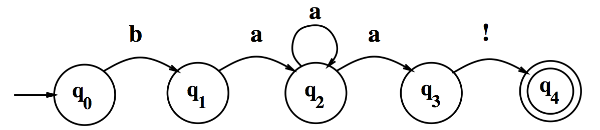

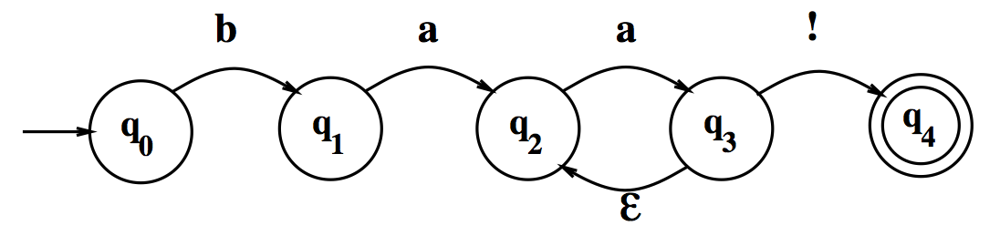
]
.right-column-3[

+ In an DFSA, a state q<sub>_i_</sub> has only one possible next state given the input _i_.

+ In an NFSA, a state q<sub>_i_</sub> may have more than one possible next state given an input _i_.

+ For any NFSA, there is an exactly equivalent DFSA.
]

---

##How does a computer use an FSA?
A pseudo-code example

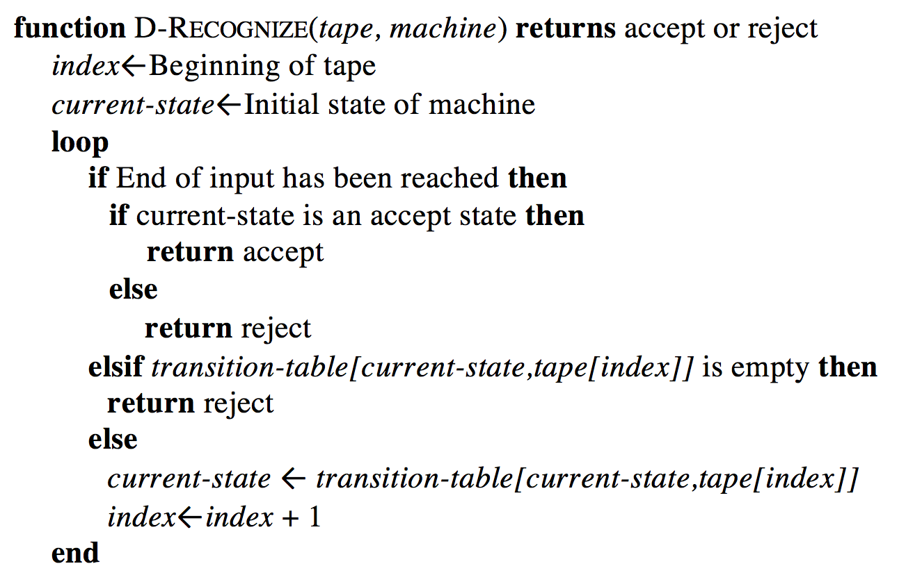

---
##Yet another formal description of the sheep talk

.left-column-1[
+ The sheep talk<br><br>
baa!<br>
baaa!<br>
baaaa!<br>
baaaaa!<br>
...
]

.right-column-1[
+ RE for the sheep talk

> /baa+!/

.left-column-3[

]

.right-column-3[
.smaller[Three equivalent ways of describing regular languages]

<br><br>
More to be learned in Lecture 3 ...]

]

---
##Finite state transducer (FST)

+ Finite-state morphological parsing

+ An augmentation to FSA

+ Used to map between representations (e.g. from /baa+!/ to /boo+!/)


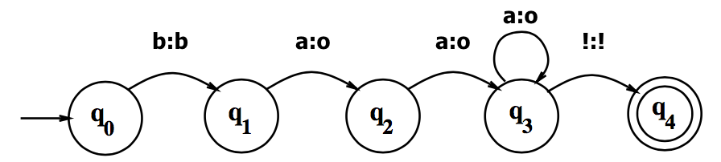

---
##FST: a formal definition

.left-column-2[

_Q_: a finite set of _N_ **states**
>_{q<sub>0</sub>, q<sub>1</sub>, q<sub>2</sub>, ... q<sub>N-1</sub>}_

_Σ_: a finite **input alphabet** of symbols

_∆_: a finite **output alphabet** of symbols

_q<sub>0</sub>_: the **start state**

_F_: the set of **final states**, _F_ &#8838; _Q_
]

.right-column-2[

_δ(q, i)_: the **transition function**. Given a state _q_ &#8712; _Q_ and an input symbol _i_  &#8712; _Σ_, _δ(q, i)_ returns a set of new states, each state _q'_ &#8712; _Q_.

_σ(q, i)_: the **output function**. Given a state _q_ &#8712; _Q_ and an input symbol _i_  &#8712; _Σ_, _σ(q, i)_ returns a set of output symbols, each symbol _o_ &#8712; _∆_ .
]


---
##FST: a formal definition

.left-column-1[

_Q={q<sub>0</sub>, q<sub>1</sub>, q<sub>2</sub>, q<sub>3</sub>, q<sub>4</sub>}_

_Σ= {b,a,!}_

_∆= {b,o,!}_

_q<sub>0</sub>=q<sub>0</sub>_

_F= {q4}_
]

.right-column-1[
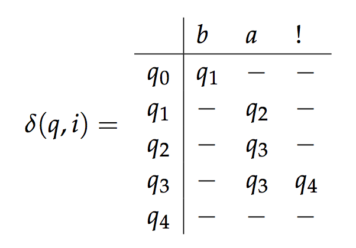


.center[]
]

---
##Morphological parsing

Example: Searching for singulars and plurals for English words

> _woodchuck|woodchuck<font color="red">s</font>_

> _fox|fox<font color="red">es</font>; fish|fish; peccuary|peccuar<font color="red">ies</font>; goose|g<font color="red">ee</font>se_

---
##Morphological parsing

Example: Searching for singulars and plurals for English words

> _woodchuck|woodchuck<font color="red">s</font>_

> _fox|fox<font color="red">es</font>; fish|fish; peccuary|peccuar<font color="red">ies</font>; goose|g<font color="red">ee</font>se_

###Parsing
Take an input and produce some sort of linguistic structure for it

+ Morphological, syntactic, semantic, discourse

+ A string, or a tree, or a network

---
##Morphological parsing

English morphology
+ Morphemes: stems and affixes
+ Types of affixes
+ Ways of combining morphemes to form words
.left-column-2[
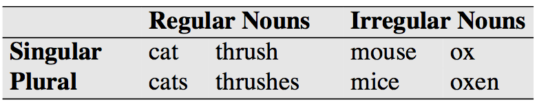<br>
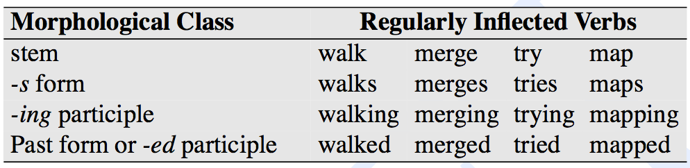
]
.right-column-2[
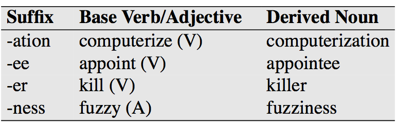<br>
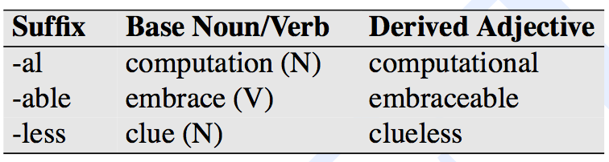
]
---
##Morphological parsing

Uses
+ Input for other parsings, esp. syntactic parsing

+ Web search, spell checking, ...

---
##Morphological parsing

.left-column-2[
Input&nbsp;&nbsp;&nbsp;|Morphological Parse   
-----|------
cat | _cat + N + Sing_
cats | _cat + N + PL_
hope | _hope + V_
hopes | _hope + V + 3P + Sing_
fox | _fox + N + Sing_
fox | _fox + V_
foxes | _fox + N + PL_
foxes | _fox + V + 3P + Sing_
foxed | _fox + V + PastPart_
]

.right-column-2[
.left-column-2[
Stem&nbsp;&nbsp;&nbsp;|Category
-----|------
cat|_N_
hope|_V_
fox|_N_
fox|_V_
]
.right-column-2[
Affix&nbsp;&nbsp;&nbsp;|Category
-----|------
^s|_PL_
^s|_+ 3P + Sing_
^ed|_+ PastPart_
<br>
]
]
cats → _cat^s → cat + N + PL_

foxed → _fox^ed → fox + V + PastPart_

---

##Lexions and morphotactic FSAs

**Lexion**: a list of the stems and affixes of a language<br>
**morphotactics**: a model to show how the stems and affixes can fit together

reg-noun&nbsp;&nbsp;&nbsp;|irreg-sg-noun&nbsp;&nbsp;&nbsp;|irreg-pl-noun&nbsp;&nbsp;&nbsp;|plural
---|---|---|---
fox|goose|geese|s
cat|sheep|sheep|
dog|mouse|mice|

.left-column-1[
<br>A morphotactic FSA<br> for English nominal inflection
]
.right-column-1[
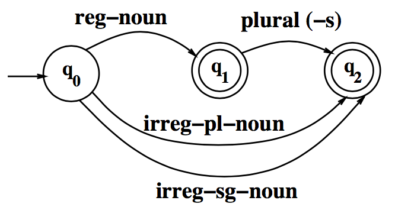
]
---
##Lexions and morphotactic FSAs

reg-verb &nbsp;&nbsp;| irreg-verb &nbsp;&nbsp;| irreg-past &nbsp;&nbsp;| past&nbsp;&nbsp;&nbsp;&nbsp;&nbsp; | past-part &nbsp;&nbsp;&nbsp;&nbsp;&nbsp;| pres-part&nbsp;&nbsp;&nbsp;&nbsp;&nbsp; | 3sg
--|--|--|--|--|--|--
walk | cut | caught | -ed | -ed | -ing | -s
fry|speak|ate| | | |
talk|sing|eaten| | | |
impeach||sang| | | |

.left-column-1[
<br><br>A morphotactic FSA<br> for English verbal inflection
]
.right-column-1[
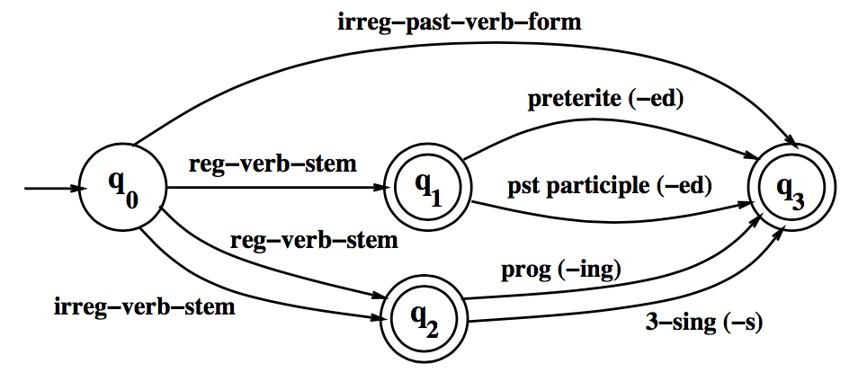
]
---
##FSTs for morphological parsing

reg-noun&nbsp;&nbsp;&nbsp; | irreg-pl-noun&nbsp;&nbsp;&nbsp; | irreg-sg-noun&nbsp;&nbsp;&nbsp;
---|---|---
fox | g o:e o:e s e | goose
cat | sheep | sheep
aardvark | m o:i u:&epsilon; s:c e | mouse

.left-column-3[
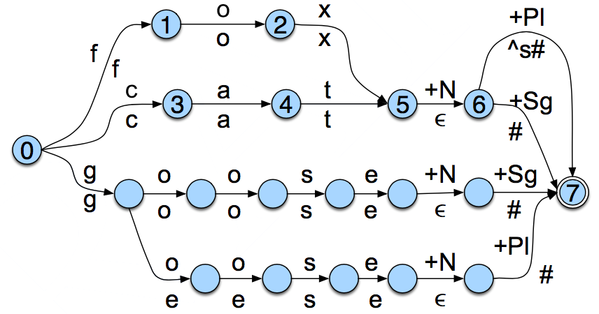
]
.right-column-3[
cat → _cat + N + Sg_

cat^s → _cat + N + PL_

geese → _goose + N + PL_

fox^s → _fox + N + PL_
]
---
##FSTs for morphological parsing

**Orthographic rules**: a model to show the changes that occur in a word

&nbsp;&nbsp;&nbsp;&nbsp;&nbsp;&nbsp;&nbsp;&nbsp;&nbsp;&nbsp;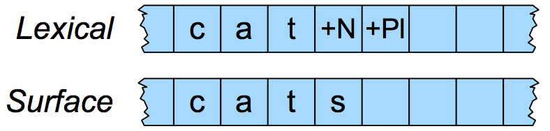

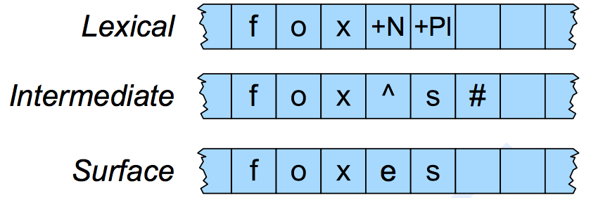
&nbsp;&nbsp;&nbsp;&nbsp;&nbsp;&nbsp;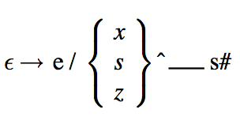

---
##FSTs for morphological parsing


.left-column-1[
<br><br>An FST for the <br>E-insertion rule
]
.right-column-1[
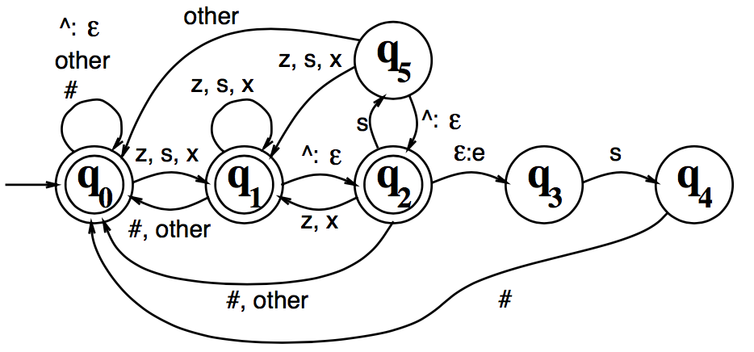
]

---
##Morphological parsing with FST lexion and rules
.left-column-2[
+ **Lexion**: a list of the stems and affixes of a language

+ **morphotactics**: a model to show how the stems and affixes can fit together

+ **Orthographic rules**: a model to show the changes that occur in a word
]
.right-column-2[
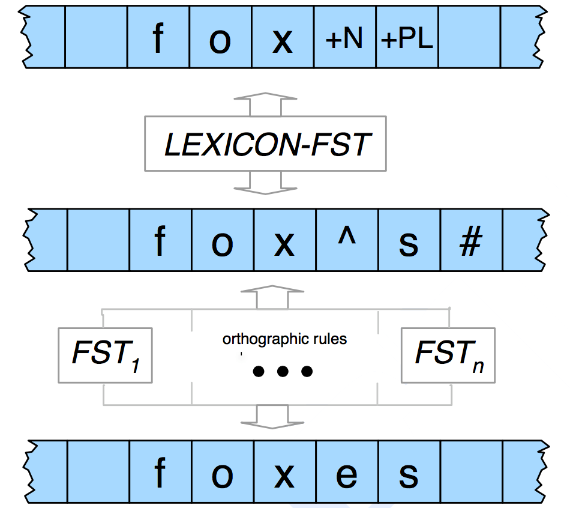
]

---
## At the end of this session you will

+ learn that corpora are important linguistic data for NLP;

+ know the basic tasks in text processing;

+ understand what are finite state automata and finite state transducers;

+ understand how a finite state transducer is used in morphological parsing;

+ learn Python functions and the functions in NLKT for text normalization.

---
##Homework

+ Review: (Quiz 2 on Oct. 10, 2018)

  + [J+M_2](https://bxjthu.github.io/CompLing/readings/2/J+M_2.pdf) (2.2, 2.3, 2.4)
  + [J+M_second_edition_2](https://bxjthu.github.io/CompLing/readings/2/J+M_second_edition_2.pdf)(2.2)

+ Read: [J+M_2](https://bxjthu.github.io/CompLing/readings/1/J+M_2.pdf) (2.1, 2.5)

+ Read and practice:

  + http://www.nltk.org/book/ch01.html
  + http://www.nltk.org/book/ch02.html
  + http://www.nltk.org/book/ch03.html

---
class: center, middle
##Next session

Regular Expressions and Edit Distance
