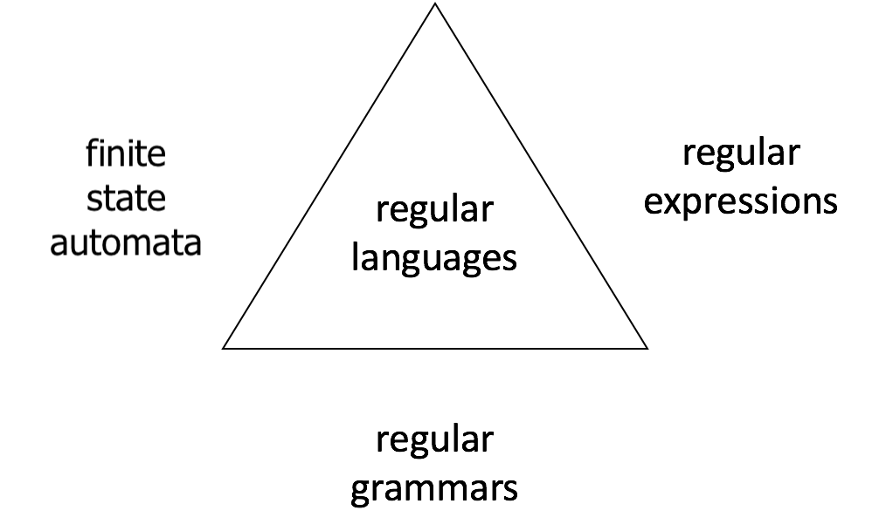
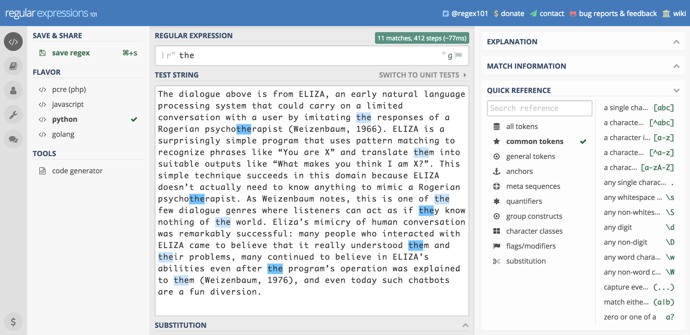
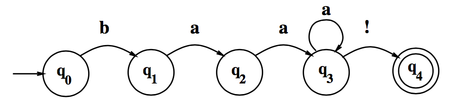
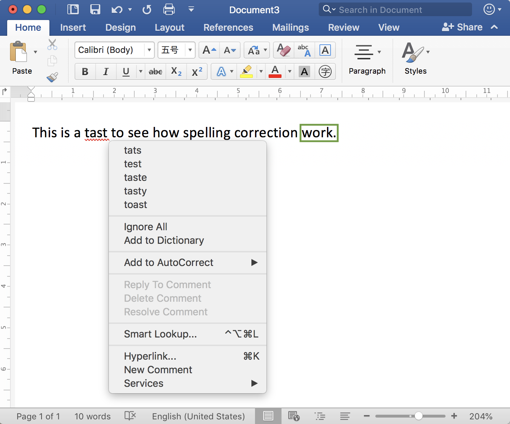
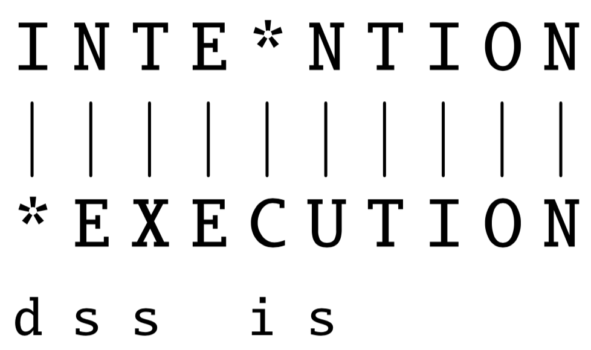
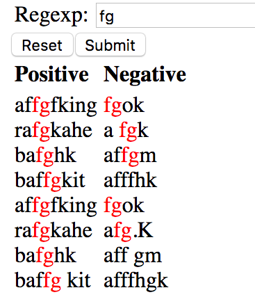
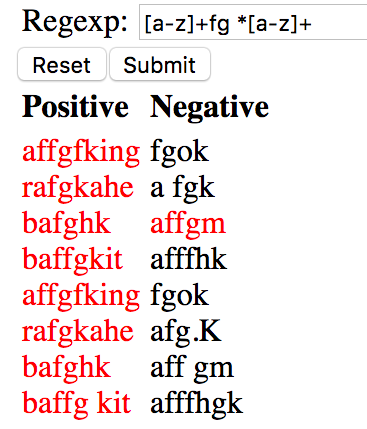
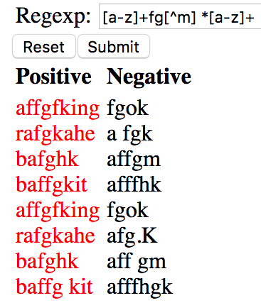

class: center, middle
# Computational Linguistics 
##3. Regular Expressions and Edit Distance

** Xiaojing Bai **

** Tsinghua University **

** https://bxjthu.github.io/CompLing **

---
## At the end of this session you will
+ understand how a finite state automaton is related to regular expressions and regular languages;

+ be able to work with basic regular expressions in pattern matching;

+ understand how to quantify the similarity between two strings with Minimum Edit Distance;

+ understand the basics of structured programs.

---
##Recap
+ An FSA describes a finite set of states together with event-driven transitions between states, with transitions indicated by labelled arcs.

+ Possible events were drawn from a finite set called the alphabet.

+ There is a start state and several final states.

+ The sequence of events that leads from the start state to a final state is said to be a sequence that is accepted by the FSA. (acceptor/recognizer vs. generator)

+ The set of all accepted sequences is called a regular language, which can also be defined with a regular expression or a regular grammar.

---

## Recap: Yet another formal description of the sheep talk

.left-column-1[
+ The sheep talk  
baa! 
baaa! 
baaaa! 
baaaaa! 
...
]

.right-column-1[
+ RE for the sheep talk

> /baa+!/

.left-column-3[

]

.right-column-3[
.smaller[Three equivalent ways of describing regular languages]
]
]

---
##Regular expressions
One of the **unsung successes** in standardization in computer science

+ The most important tool for describing text pattern &#8594; **computational model**

+ Useful for searching in texts, with a **pattern** to search for and a corpus of **texts** to search through

---
##Regular expressions and Eliza

**Eliza**: a program which makes natural language conversation between man and computer possible

 .left-column-4[

Weizenbaum, J. (1966). ELIZA - a computer program for the study of natural language communication between man and machine. _Communications of the ACM_, 9(1), 36-45.
 

_"Like the Eliza of Pygmalion fame, it can be made to appear even more civilized ..."_

]

 .right-column-3[

 ]

???

Eliza Doolittle is a fictional character from London who appears in the play Pygmalion (George Bernard Shaw, 1912) and the musical version of that play, My Fair Lady.

Pygmalion |pɪɡˈmeɪlɪən| is a play by George Bernard Shaw, named after a Greek mythological figure.

In ancient Greek mythology, Pygmalion fell in love with one of his sculptures, which then came to life.  

Eliza is a flower girl, who comes to Professor Henry Higgins asking for elocution lessons.

Higgins goes along with it for the purposes of a wager: That he can turn her into the toast of elite London society.

Doolittle receives voice coaching and learns the rules of etiquette.
---
##Regular expressions and Eliza

_"...the text is read and inspected for the presence of a **keyword**. If such a word is found, the sentence is transformed according to a **rule** associated with the keyword, if not a content-free remark or, under certain conditions, an earlier transformation is retrieved. The text so computed or retrieved is then printed out."_

 
E.g. "You are X" &#8594; "What makes you think I am X?"

[Eliza, the Rogerian Therapist](http://psych.fullerton.edu/mbirnbaum/psych101/Eliza.htm)

???

Person-centered therapy was developed by Carl Rogers in the 1940s. This type of therapy diverged from the traditional model of the therapist as expert and moved instead toward a nondirective, empathic approach that empowers and motivates the client in the therapeutic process. The therapy is based on Rogers’s belief that every human being strives for and has the capacity to fulfill his or her own potential. Person-centered therapy, also known as Rogerian therapy, has had a tremendous impact on the field of psychotherapy and many other disciplines.
Such chatbots are a fun diversion.
Modern conversational agents are much more than a diversion; they can answer questions, book flights, or find restaurants, functions for which they rely on a much more sophisticated understanding of the user’s intent, as we will see in Chapter 29.

---
##A quick reference .smaller[at https://regex101.com/]

---
##[Processing raw text](https://www.nltk.org/book/ch03.html) with regular expressions

3.4 Regular Expressions for Detecting Word Patterns

3.5 Useful Applications of Regular Expressions

To be covered by Quiz 3 (Oct. 17)
---
##Two kinds of errors

+ **False positives**: matching strings that we should not have matched (e.g. _there, then, other_)

+ **False	 negatives**: not matching strings that we should have matched	(e.g. _The_)

---
##Two kinds of errors

+ **False positives**: matching strings that we should not have matched (e.g. _there, then, other_)

+ **False	 negatives**: not matching strings that we should have matched	(e.g. _The_)

 
Reducing the error rate	in NLP applications: two antagonistic efforts

+ Increasing	 **accuracy**	or	**precision** (minimizing false positives)

+ Increasing **coverage** or **recall** (minimizing false negatives).

.right[
### Why are these two efforts “antagonistic”?
]

---
##Food for your thought

+ Sophisticated	 sequences of regular expressions	are often the first model for text processing tasks

+ Regular	expressions as features in machine learning classifiers

+ Any use of RE that you can think of?

---
##RE and FSA

.left-column-2[
Three equivalent ways of describing regular languages

]

.right-column-2[
>+ The Chomsky hierarchy

>+ Natural language and its complexity

>+ Formal models and formal languages

>+ Power of formal models: complexity of the phenomena they can describe
]

---
##Formal language

+ A set of strings, each composed of symbols from a finite symbol-set (alphabet)

+ Characterized by a model _m_ (such as a particular FSA)

>E.g. _L(m) = {baa!, baaa!, baaaa!, baaaaa!, baaaaaa!, ...}_

> The sheep talk automaton helps us **recognize** and **generate** the sheeptalk.

> 

> **Usefulness**: a finite set of symbols to define an infinite set

+ Formal language vs. natural language

???
The set of all of the strings that are generated by a regular expression (or its corresponding FSA) is called a regular language.
Use a formal language to model part of a natural language,
such as parts of the phonology, morphology, syntax

---

---

---
##How	similar	are	two	strings?
+ Spelling correction

  E.g.  
  _tast vs. tats | test | taste | tasty | toast_ 
  _李建 vs. 李健_ .smaller[([More to consider in the case of search engines!](https://support.google.com/websearch/answer/106230))]

+ Coreference

  E.g.  
  _Stanford President John Hennessy_ 
  _Stanford University President John Hennessy_

+ Also for	Machine	Translation,	Information	Extraction,	Speech	Recognition

---
## Quantify the similarity between two strings

.left-column-2[
**Minimum	Edit Distance**:  the	minimum	number	of	editing	operations needed	to transform	one	into	the	other
+ Insertion (i)
+ Deletion (d)
+ Substitution (s)

Cost/weight (Levenshtein, 1966)
+ If	each	operation	has	cost	of	1
+ If	substitutions	cost	2
]

.right-column-4[

  
Read: The Minimum Edit Distance Algorithm
]

???
Distance	between	these	is	5
Distance	between	them	is	8

##Regular expressions

Alternatively, try .\*af{1,2}g.{0,1}k.*

##Segmentation in Chinese

"这个门的把手 坏了好几天了" 
"你把手 抬高一点儿"

"这条马路可以并排 行驶四辆大卡车" 
"教务科指定了专任讲师并排 好了课程时间表"

"人身上哪怕有一点小病痛 ，都会影响到工作学习" 
"这种病痛 起来真要人命"

"本来他是想去赴宴的，不过 这两天胃口不好，就只得做罢了" 
"这次考试要还是不过 ，我就自杀"

---
## At the end of this session you will
+ understand how a finite state automaton is related to regular expressions and regular languages;

+ be able to work with basic regular expressions in pattern matching;

+ understand how to quantify the similarity between two strings with Minimum Edit Distance;

+ understand the basics of structured programs.

---

##Homework

+ Read and practice: (Quiz 3 on Oct. 17, 2018)

  + [NLTK Book](https://www.nltk.org/book/ch03.html): 3.4 Regular Expressions for Detecting Word Patterns; 3.5 Useful Applications of Regular Expressions

+ Review:

  + [J+M_2](https://bxjthu.github.io/CompLing/readings/2/J+M_2.pdf)
  + [J+M_second_edition_2](https://bxjthu.github.io/CompLing/readings/2/J+M_second_edition_2.pdf) (2.2)
  + [J+M_second_edition_3](https://bxjthu.github.io/CompLing/readings/2/J+M_second_edition_3.pdf) (3.1-3.7)

???

> Questions: 1) How might morphological parsing work for the NLP applications in our daily life? Any example? 2) What might be the difficulties of morphological parsing in Chinese?

**2. Practice**

+ Finish the exercise of Practical 3 and submit your codes at 网络学堂. (DDL: Oct. 25)

---
class: center, middle
##Next session

N-gram Language Models
