class: center, middle
# Computational Linguistics 
##3. Finite State Transducers and  Morphological Parsing

** Xiaojing Bai **

** Tsinghua University **

** https://bxjthu.github.io/CompLing **

---
##Recap
+ An FSA describes a finite set of states together with event-driven transitions between states, with transitions indicated by labelled arcs. 

+ Possible events were drawn from a finite set called the alphabet. 

+ There is a start state and several final states.

+ The sequence of events that leads from the start state to a final state is said to be a sequence that is accepted by the FSA. (acceptor/recognizer vs. generator)

+ The set of all accepted sequences is called a regular language, which can also be defined with a regular expression or a regular grammar. 

---
##Deterministic FSA vs. non-deterministic FSA
.left-column-3[

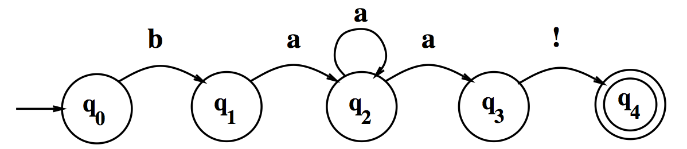

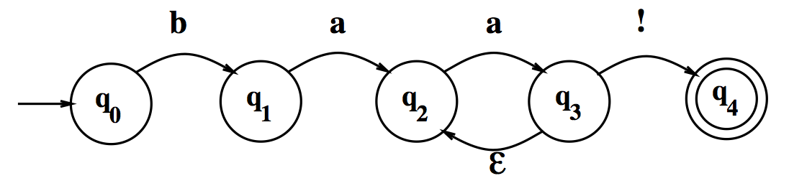
]
.right-column-3[

+ In an DFSA, a state q_i_ has only one possible next state given the input _i_.

+ In an NFSA, a state q_i_ may have more than one possible next state given an input _i_.

+ For any NFSA, there is an exactly equivalent DFSA.
] 

---
###Exercise 1: Draw an FSA for ...

###Exercise 2: Write a RE that matches ...

###Exercise 3: Write codes to ...

###Exercise 4: Write codes to ...

---
##Regular expressions

+ Two kinds of errors

 + False positives: matching strings that we should not have matched  (e.g. _there, then, other_)

 + False	 negatives: not matching strings that we should have matched 	(e.g. _The_)

+ With NLP applications, reducing the error rate	often involves two antagonistic efforts

 + Increasing	 accuracy	or	precision (minimizing false positives)
 
 + Increasing coverage or recall (minimizing false negatives).
 
---
##Regular expressions

Alternatively, try .\*af{1,2}g.{0,1}k.*
---

## At the end of this session you will
+ understand what a finite state transducer is and how it might be used in morphological parsing;  

+ learn how to define a function, what is a namespace, what is a scope, and how they work.

---
##Finite state transducer (FST)

+ Finite-state morphological parsing

+ An augmentation to FSA

+ Used to map between representations (e.g. from /baa+!/ to /boo+!/)

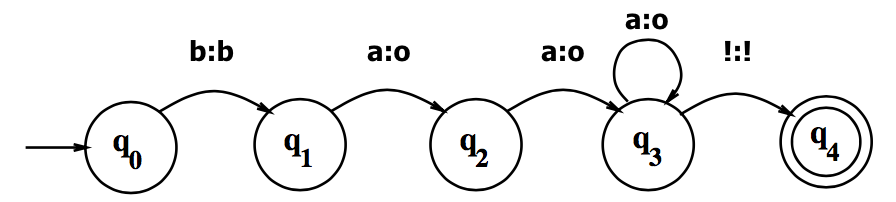

---
##FST: a formal definition

.left-column-2[

_Q_: a finite set of _N_ **states**
>_{q0, q1, q2, ... qN-1}_

_Σ_: a finite **input alphabet** of symbols 

_∆_: a finite **output alphabet** of symbols

_q0_: the **start state**

_F_: the set of **final states**, _F_ &#8838; _Q_ 
]

.right-column-2[

_δ(q, i)_: the **transition function**. Given a state _q_ &#8712; _Q_ and an input symbol _i_  &#8712; _Σ_, _δ(q, i)_ returns a set of new states, each state _q'_ &#8712; _Q_. 

_σ(q, i)_: the **output function**. Given a state _q_ &#8712; _Q_ and an input symbol _i_  &#8712; _Σ_, _σ(q, i)_ returns a set of output symbols, each symbol _o_ &#8712; _∆_ .
]

---
##FST: a formal definition

.left-column-1[

_Q={q0, q1, q2, q3, q4}_

_Σ= {b,a,!}_ 

_∆= {b,o,!}_

_q0=q0_

_F= {q4}_ 
]

.right-column-1[

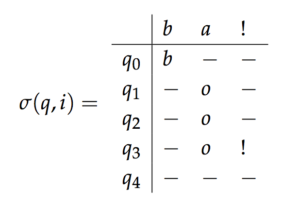

.center[]
]

---
##Morphological parsing

Example: Searching for singulars and plurals for English words

> _woodchuck|woodchucks_

> _fox|foxes; fish|fish; peccuary|peccuaries; goose|geese_

---
##Morphological parsing

Example: Searching for singulars and plurals for English words

> _woodchuck|woodchucks_

> _fox|foxes; fish|fish; peccuary|peccuaries; goose|geese_

###Parsing
Take an input and produce some sort of linguistic structure for it

+ Morphological, syntactic, semantic, discourse

+ A string, or a tree, or a network

---
##Morphological parsing

English morphology
+ Morphemes: stems and affixes
+ Types of affixes
+ Ways of combining morphemes to form words
.left-column-2[
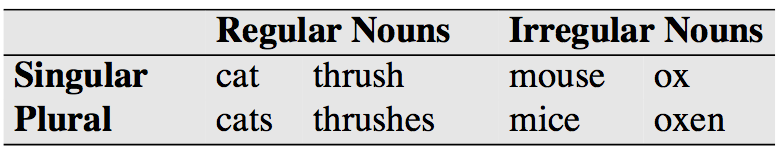 
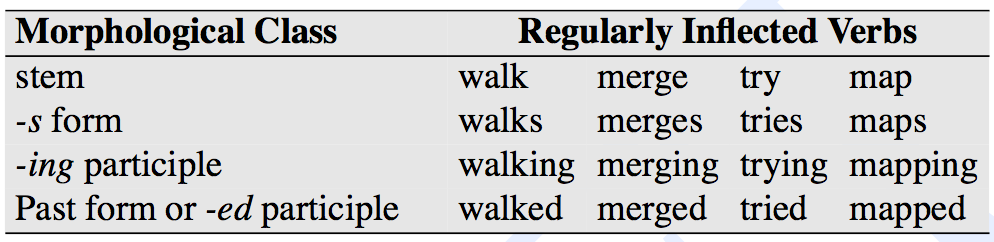
]
.right-column-2[
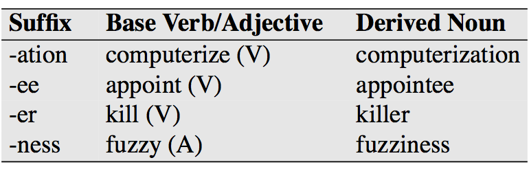 
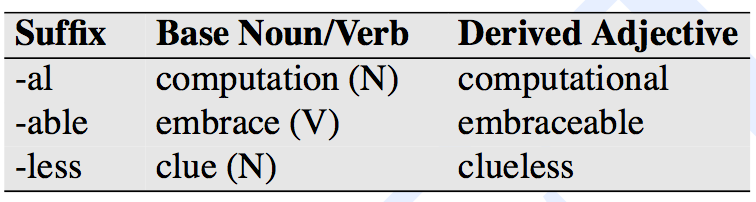
]
---
##Morphological parsing

Uses 
+ Input for other parsings, esp. syntactic parsing
 
+ Web search, spell checking, ...

---
##Morphological parsing

.left-column-2[
Input&nbsp;&nbsp;&nbsp;|Morphological Parse   
-----|------
cat | _cat + N + Sing_
cats | _cat + N + PL_
hope | _hope + V_
hopes | _hope + V + 3P + Sing_
fox | _fox + N + Sing_ 
fox | _fox + V_
foxes | _fox + N + PL_
foxes | _fox + V + 3P + Sing_ 
foxed | _fox + V + PastPart_
]

.right-column-2[
.left-column-2[
Stem&nbsp;&nbsp;&nbsp;|Category
-----|------
cat|_N_
hope|_V_
fox|_N_
fox|_V_
]
.right-column-2[
Affix&nbsp;&nbsp;&nbsp;|Category
-----|------
^s|_PL_
^s|_+ 3P + Sing_ 
^ed|_+ PastPart_
 
]
]
cats → _cat^s → cat + N + PL_

foxed → _fox^ed → fox + V + PastPart_

---

##Lexions and morphotactic FSAs

**Lexion**: a list of the stems and affixes of a language 
**morphotactics**: a model to show how the stems and affixes can fit together

reg-noun&nbsp;&nbsp;&nbsp;|irreg-sg-noun&nbsp;&nbsp;&nbsp;|irreg-pl-noun&nbsp;&nbsp;&nbsp;|plural
---|---|---|---
fox|goose|geese|s
cat|sheep|sheep|
dog|mouse|mice|

.left-column-1[
 A morphotactic FSA  for English nominal inflection
]
.right-column-1[
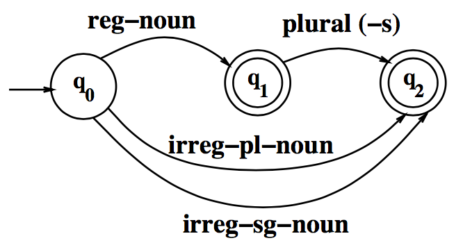
]
---
##Lexions and morphotactic FSAs

reg-verb &nbsp;&nbsp;| irreg-verb &nbsp;&nbsp;| irreg-past &nbsp;&nbsp;| past&nbsp;&nbsp;&nbsp;&nbsp;&nbsp; | past-part &nbsp;&nbsp;&nbsp;&nbsp;&nbsp;| pres-part&nbsp;&nbsp;&nbsp;&nbsp;&nbsp; | 3sg
--|--|--|--|--|--|--
walk | cut | caught | -ed | -ed | -ing | -s 
fry|speak|ate| | | | 
talk|sing|eaten| | | | 
impeach||sang| | | | 

.left-column-1[
  A morphotactic FSA  for English verbal inflection
]
.right-column-1[
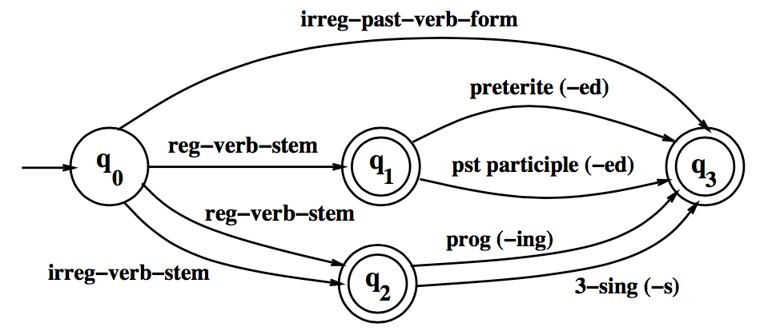
]
---
##FSTs for morphological parsing

reg-noun&nbsp;&nbsp;&nbsp; | irreg-pl-noun&nbsp;&nbsp;&nbsp; | irreg-sg-noun&nbsp;&nbsp;&nbsp;
---|---|---
fox | g o:e o:e s e | goose 
cat | sheep | sheep 
aardvark | m o:i u:&epsilon; s:c e | mouse

.left-column-3[
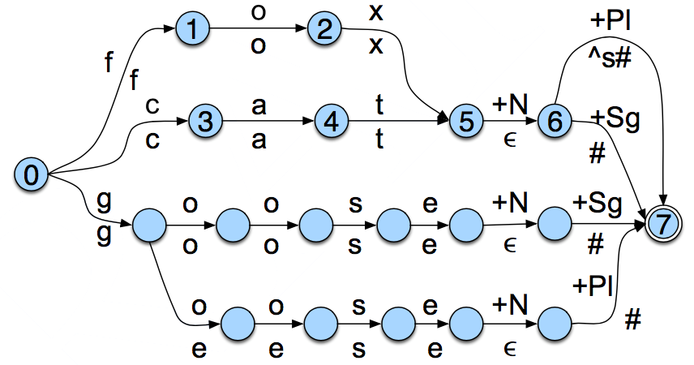
]
.right-column-3[
cat → _cat + N + Sg_

cat^s → _cat + N + PL_

geese → _goose + N + PL_

fox^s → _fox + N + PL_
]
---
##FSTs for morphological parsing

**Orthographic rules**: a model to show the changes that occur in a word

&nbsp;&nbsp;&nbsp;&nbsp;&nbsp;&nbsp;&nbsp;&nbsp;&nbsp;&nbsp;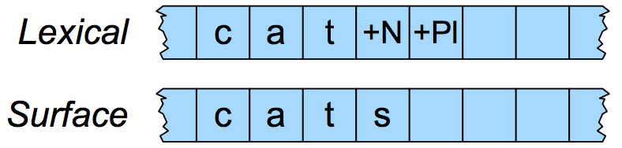

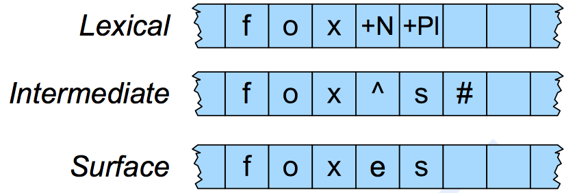
&nbsp;&nbsp;&nbsp;&nbsp;&nbsp;&nbsp;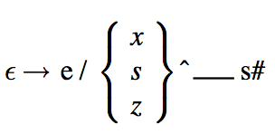

---
##FSTs for morphological parsing

.left-column-1[
  An FST for the  E-insertion rule
]
.right-column-1[
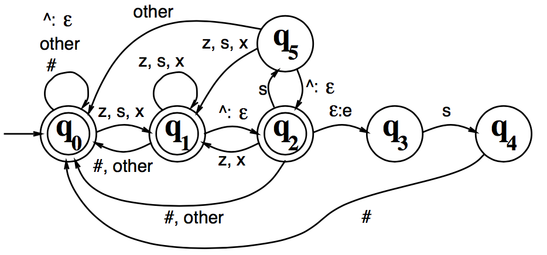
]

---
##Morphological parsing with FST lexion and rules
.left-column-2[
+ **Lexion**: a list of the stems and affixes of a language

+ **morphotactics**: a model to show how the stems and affixes can fit together

+ **Orthographic rules**: a model to show the changes that occur in a word
]
.right-column-2[

]

---
##Segmentation in Chinese

"这个门的把手 坏了好几天了" 
"你把手 抬高一点儿"

"这条马路可以并排 行驶四辆大卡车" 
"教务科指定了专任讲师并排 好了课程时间表"

"人身上哪怕有一点小病痛 ，都会影响到工作学习" 
"这种病痛 起来真要人命"

"本来他是想去赴宴的，不过 这两天胃口不好，就只得做罢了" 
"这次考试要还是不过 ，我就自杀"

---
## At the end of this session you will

+ understand what a finite state transducer is and how it might be used in morphological parsing;  

+ learn how to define a function, what is a namespace, what is a scope, and how they work.

---
##Assignment

**1. Review**

+ J+M 3 

> Questions: 1) How might morphological parsing work for the NLP applications in our daily life? Any example? 2) What might be the difficulties of morphological parsing in Chinese?

+ In-class practice for session 3

+ Practical 3

**2. Practice**

+ Finish the exercise of Practical 3 and submit your codes at 网络学堂.

---
class: center, middle
##Next session

N-grams and Hidden Markov Models

