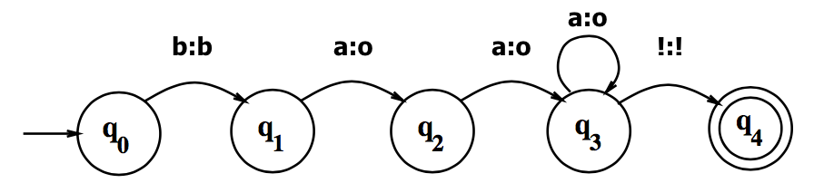
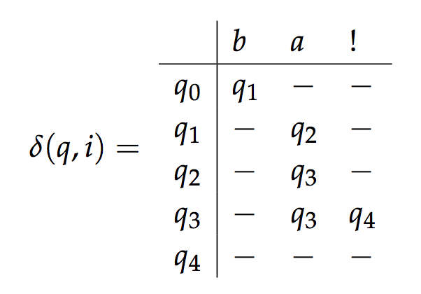

class: center, middle
# Computational Linguistics<br>
##4. N-grams and Hidden Markov Models

** Xiaojing Bai **

** Tsinghua University **

** https://bxjthu.github.io/CompLing **

---
##Recap: FSA vs. FST

Recognizer (acceptor) vs. generator

.left-column-2[
A recognizer takes a string as input and <font color="red">outputs</font> _accept_ if the string is in a string of the language, and _reject_ if it is not.

A generator takes a string as input and <font color="red">outputs</font> a new string.
]
.right-column-2[
> 

> 
]

---
##Recap: FSA for English numbers 1-999

Updating ...<br>


---
##Recap: a formal definition of FST

.left-column-2[

_Q_: a finite set of _N_ **states**
>_{q<sub>0</sub>, q<sub>1</sub>, q<sub>2</sub>, ... q<sub>N-1</sub>}_

_Σ_: a finite **input alphabet** of symbols

_∆_: a finite **output alphabet** of symbols

_q<sub>0</sub>_: the **start state**

_F_: the set of **final states**, _F_ &#8838; _Q_
]

.right-column-2[

_δ(q, i)_: the **transition function**. Given a state _q_ &#8712; _Q_ and an input symbol _i_  &#8712; _Σ_, _δ(q, i)_ returns a set of new states, each state _q'_ &#8712; _Q_.

_σ(q, i)_: the **output function**. Given a state _q_ &#8712; _Q_ and an input symbol _i_  &#8712; _Σ_, _σ(q, i)_ returns a set of output symbols, each symbol _o_ &#8712; _∆_ .
]


---
##Recap: a formal definition of FST

.left-column-1[

_Q={q<sub>0</sub>, q<sub>1</sub>, q<sub>2</sub>, q<sub>3</sub>, q<sub>4</sub>}_

_Σ= {b,a,!}_

_∆= {b,o,!}_

_q<sub>0</sub>=q<sub>0</sub>_

_F= {q4}_
]

.right-column-1[



.center[]
]

---
##Recap: morphological parsing
.left-column-2[
+ **Lexion**: a list of the stems and affixes of a language

+ **morphotactics**: a model to show how the stems and affixes can fit together

+ **Orthographic rules**: a model to show the changes that occur in a word
]
.right-column-2[

]

---
.left-column-2[
##Recap: questions

+ What might be the difficulties of morphological parsing in Chinese?

<br><br><br>

+ How might morphological parsing work for the NLP applications in our daily life? Any example?
]

---
.left-column-2[
##Recap: questions

+ What might be the difficulties of morphological parsing in Chinese?

 + Ambiguities
 + Unknown words
 + What is a WORD?

+ How might morphological parsing work for the NLP applications in our daily life? Any example?
]

---
.left-column-2[
##Recap: questions

+ What might be the difficulties of morphological parsing in Chinese?

 + Ambiguities
 + Unknown words
 + What is a WORD?

+ How might morphological parsing work for the NLP applications in our daily life? Any example?
]

.right-column-2[
.center[
<br>


]
]
---

class: center, middle


---
##At the end of this session you will

+ understand how n-grams can model a language;<br>

+ learn how to use corpus data to compute the probabilities of n-grams;<br>

+ understand how n-grams may help to develop NLP applications;<br>

+ learn the difference between Markov models and hidden Markov models;<br>

+ know hidden Markov models can help parsing on different levels;<br>

+ get a clearer picture of the fundamentals in python.

---
.left-column-2[
##Handwriting recognition
_I have the gub!_

<video width="480" height="360" controls src="https://bxjthu.github.io/CompLing/slides/4/images/gub.mp4" type="video/mp4"</video>
]

.right-column-2[
<br><br>
> _Bank Teller #1:_<br>
Does this look like "<font color="red">gub</font>" or "gun"?

> _Bank Teller #2: _<br>
Gun. See? But what does "<font color="red">abt</font>" mean?

> _Virgil:_ <br>
It's "act". A-C-T. Act natural. Please put fifty thousand dollars into this bag and act natural.

> _Bank Teller #1:_ <br>
Oh, I see. This is a holdup?
.right[
######_Take the Money and Run_ (1969)
]
]

???
Take the Money and Run is a 1969 American mockumentary comedy film directed by Woody Allen and starring Allen and Janet Margolin (with Louise Lasser in a small role). Written by Allen and Mickey Rose, the film chronicles the life of Virgil Starkwell (Woody Allen), an inept bank robber.
---

##Speech recognition

&nbsp;|&nbsp;
 -|-
<video width="480" height="320" controls src="https://bxjthu.github.io/CompLing/slides/4/images/helen.mp4" type="video/mp4"</video> | 
---
##Augmentative communication


---

.left-column-2[
##Language generation

_“You are uniformly charming!” cried he,_

_with a smile of associating and now and_

_then I bowed and they perceived a chaise_

_and four to wish for._

<br>
.right[
A random sentence generated from<br>a **Jane Austen <font color="red">trigram</font> model**
]
]
.right-column-2[
.right[

]
]

---
class: center, middle


---

class: center, middle


---

##N-grams for &nbsp;&nbsp;这菜不错！不咸！

+ unigram: 这 &nbsp;&nbsp;&nbsp;&nbsp;&nbsp;&nbsp;菜 &nbsp;&nbsp;&nbsp;&nbsp;&nbsp;&nbsp;不 &nbsp;&nbsp;&nbsp;&nbsp;&nbsp;&nbsp;错 &nbsp;&nbsp;&nbsp;&nbsp;&nbsp;&nbsp;！ &nbsp;&nbsp;&nbsp;&nbsp;&nbsp;&nbsp;不 &nbsp;&nbsp;&nbsp;&nbsp;&nbsp;&nbsp;咸 &nbsp;&nbsp;&nbsp;&nbsp;&nbsp;&nbsp;！
<br>
+ bigram: &nbsp;&nbsp;这菜 &nbsp;&nbsp;&nbsp;&nbsp;&nbsp;&nbsp;菜不 &nbsp;&nbsp;&nbsp;&nbsp;&nbsp;&nbsp;不错 &nbsp;&nbsp;&nbsp;&nbsp;&nbsp;&nbsp;错！ &nbsp;&nbsp;&nbsp;&nbsp;&nbsp;&nbsp;！不 &nbsp;&nbsp;&nbsp;&nbsp;&nbsp;&nbsp;不咸 &nbsp;&nbsp;&nbsp;&nbsp;&nbsp;&nbsp;咸！

+ trigram: &nbsp;这菜不 &nbsp;&nbsp;&nbsp;&nbsp;&nbsp;&nbsp;菜不错 &nbsp;&nbsp;&nbsp;&nbsp;&nbsp;&nbsp;不错！ &nbsp;&nbsp;&nbsp;&nbsp;&nbsp;&nbsp;错！不 &nbsp;&nbsp;&nbsp;&nbsp;&nbsp;&nbsp; ！不咸 &nbsp;&nbsp;&nbsp;&nbsp;&nbsp;&nbsp; 不咸！

+ 4-gram: &nbsp;&nbsp;这菜不错 &nbsp;&nbsp;&nbsp;&nbsp;&nbsp;&nbsp; 菜不错！&nbsp;&nbsp;&nbsp;&nbsp;&nbsp;&nbsp; 不错！不 &nbsp;&nbsp;&nbsp;&nbsp;&nbsp;&nbsp; 错！不咸&nbsp;&nbsp;&nbsp;&nbsp;&nbsp;&nbsp; ！不咸！

+ 5-gram: &nbsp;&nbsp;这菜不错！&nbsp;&nbsp;&nbsp;&nbsp;&nbsp;&nbsp; 菜不错！不 &nbsp;&nbsp;&nbsp;&nbsp;&nbsp;&nbsp; 不错！不咸 &nbsp;&nbsp;&nbsp;&nbsp;&nbsp;&nbsp; 错！不咸！

+ ...

+ n-gram

---

.left-column-2[
##N-grams as a model of language

**Basic problem: **<br>
Is this a probable sequence of words in the language and how probable is it?
]

---

.left-column-2[
##N-grams as a model of language

**Basic problem: **<br>
Is this a probable sequence of words in the language and how probable is it?

<br>
Using corpus data for probabilities

```
*<s>welcome home</s>
*
*<s>welcome back</s>
*
*<s>welcome home</s>
*
*<s>you are a welcome sight</s>
*
*<s>what a welcome</s>

```
.center[
.smaller[**A toy corpus**]
]
]

.right-column-4[
<br><br>
.smaller[
w<sub>n−1</sub> | w<sub>n</sub> | count&nbsp;&nbsp; | probability
--|--|:--:|:--:
`<s>` | welcome&nbsp;&nbsp; | 3 | 0.60
`<s>` | what | 1 | 0.20
`<s>` | you | 1 | 0.20
a | welcome | 2 | 1.00
are | a | 1 | 1.00
back | `</s>` | 1 | 1.00
home | `</s>` | 2 | 1.00
sight | `</s>` | 1 | 1.00
welcome&nbsp;&nbsp; | home | 2 | 0.40
welcome | back | 1 | 0.20
welcome | sight | 1 | 0.20
welcome | `</s>` | 1 | 0.20
what | a | 1 | 1.00
you | are | 1 | 1.00

.center[
**The bigram counts and probabilities <br>for the toy corpus**
]
]
]

---
.left-column-2[
##Probabilities of bigrams

`\(P(w_n|w_{n−1})=\frac{C(w_{n-1}w_n)}{\sum_wC(w_{n-1}w)}=\frac{C(w_{n-1}w_n)}{C(w_{n-1})} \)`

##Probabilities of sequences

`\(P(w_1^n)\approx\prod_{k=1}^nP(w_k|w_{k−1})\)`

Why approximately equal to?<br><br>

`\(P(w_1^n)= P(w_1)P(w_2|w_1)P(w_3|w_1^2)...P(w_n|w_1^{n-1})\)`
> &nbsp;&nbsp;&nbsp;&nbsp;&nbsp;`\(=\prod_{k=1}^nP(w_k|w_1^{k−1})\)`
]

.right-column-4[
<br><br>
.smaller[
w<sub>n−1</sub> | w<sub>n</sub> | count&nbsp;&nbsp; | probability
--|--|:--:|:--:
`<s>` | welcome&nbsp;&nbsp; | 3 | 0.60
`<s>` | what | 1 | 0.20
`<s>` | you | 1 | 0.20
a | welcome | 2 | 1.00
are | a | 1 | 1.00
back | `</s>` | 1 | 1.00
home | `</s>` | 2 | 1.00
sight | `</s>` | 1 | 1.00
welcome&nbsp;&nbsp; | home | 2 | 0.40
welcome | back | 1 | 0.20
welcome | sight | 1 | 0.20
welcome | `</s>` | 1 | 0.20
what | a | 1 | 1.00
you | are | 1 | 1.00

.center[
**The bigram counts and probabilities <br>for the toy corpus**
]
]
]

---
##N-grams for Machine translation

.left[
他 | 向 | 记者 | 介绍了 | 主要 | 内容
---|---|---|---|---|---
He &nbsp; |to &nbsp; |reporters &nbsp; |introduced &nbsp; |main &nbsp; |content
]

1. he introduced reporters to the main contents of the statement

2. he briefed to reporters the main contents of the statement

3. he briefed reporters on the main contents of the statement

---

##The Markov model or the Markov chain

+ The Markov assumption

 + the probability of a word depends only on the previous word<br><br>`\(P(q_i|q_1...q_{i-1}) = P(q_i|q_{i-1})\)`

+ An extension of an FSA: a special case of a weighted FSA
 + the weights being the probabilities
 + the input sequence uniquely determining the states to go through

+ Useful for assigning probabilities to unambiguous sequences

---
##The Markov model or the Markov chain
.left-column-2[


> ######The bigram counts and probabilities <br>&nbsp;&nbsp;&nbsp;&nbsp;&nbsp;&nbsp;&nbsp;&nbsp;&nbsp;&nbsp;&nbsp;&nbsp;&nbsp;&nbsp;&nbsp;for the toy corpus

]

.right-column-2[

> ######Part of the Markov chain for the toy corpus
]

---
##The Markov model or the Markov chain
.left-column-2[
<font color="red">`\(Q = \{q_1,q_2, ...q_N\}\)` </font><br> A set of _N_ **states**
<br>
<font color="red">`\(A = \{a_{ij}\}\)` </font><br> A **transition probability matrix** A, each `\(a_{ij}\)` representing the probability of moving from state _i_ to state _j_, s.t. `\(\sum_{j=1}^n a_{ij} = 1 ∀i\)`
<br>
<font color="red">`\(q_0\)`, `\(q_F\)` </font><br> A **start state** and an **end (final) state**, together with transition probabilities `\(\{a_{01},a_{02}...a_{0n}\}\)` out of the start state and `\(\{a_{1F},a_{2F}...a_{nF}\}\)` into the end state `\(q_0\)`, `\(q_F\)`
]

.right-column-2[

]
---
.left-column-2[

##A Markov model
Used to compute a probability for a sequence of observable events

##A hidden Markov model (HMM)
Used to compute a probability for a sequence of NOT observable events

######Example: Jason's ice cream climatology data

&nbsp;&nbsp;
&nbsp;&nbsp;

]
.right-column-2[

]

---
##HMM and Part-Of-Speech (POS) tagging

 <br>

The sequence of words observed:
<table border="0" width="100%">
    <tr>
      <td align="center" style="color:#ffffff" bgcolor="#33FFFF">colorless</td>
      <td align="center" style="color:#ffffff" bgcolor="#CC0000">green</td>
      <td align="center" style="color:#ffffff" bgcolor="#FFCC99">ideas</td>
      <td align="center" style="color:#ffffff" bgcolor="#006600">sleep</td>
      <td align="center" style="color:#ffffff" bgcolor="#00FF00">furiously</td>
    </tr>
</table>

???
Colorless green ideas sleep furiously is a sentence composed by Noam Chomsky in his 1957 book Syntactic Structures as an example of a sentence that is grammatically correct, but semantically nonsensical.

---
##The hidden Markov model

<font color="red">`\(Q = \{q_1, q_2, ...q_N\}\)` </font>: a set of _N_ **states**
<font color="red">`\(A = \{a_{ij}\}\)` </font>: a **transition probability matrix** A, each `\(a_{ij}\)` representing the probability of moving from state _i_ to state _j_, s.t. `\(\sum_{j=1}^n a_{ij} = 1 ∀i\)`<br>
<font color="red">`\(O = o_1o_2 ...o_T\)` </font>: a sequence of _T_ **observations**, each one drawn from a vocabulary `\(V = v_1,v_2,...,v_V\)`<br>
<font color="red">`\(B = \{b_i(o_t)\}\)`</font>: an **observation probability matrix**, each expressing the probability of an observation `\(o_t\)` being generated from a state _i_<br>
<font color="red">`\(q_0\)`, `\(q_F\)` </font>: a **start state** and an **end (final) state**, together with transition probabilities `\(\{a_{01},a_{02}...a_{0n}\}\)` out of the start state and `\(\{a_{1F},a_{2F}...a_{nF}\}\)` into the end state `\(q_0\)`, `\(q_F\)`

---
## HMM: a probabilistic sequence model

Given a sequence of units (words, letters, morphemes, sentences, whatever), <br>
a HMM assigns a label or class to each unit in the sequence, <br>
thus mapping a sequence of observations to a sequence of labels.

_colorless green ideas sleep furiously_


---
##At the end of this session you will

+ understand how n-grams can model a language;<br>

+ learn how to use corpus data to compute the probabilities of n-grams;<br>

+ understand how n-grams may help to develop NLP applications;<br>

+ learn the difference between Markov models and hidden Markov models;<br>

+ know hidden Markov models can help parsing on different levels;<br>

+ get a clearer picture of the fundamentals in python.

---
##Assignment

**1. Review**

+ J+M 4 - pages 1-8
+ J+M 9 - pages 1-6
+ Practical 4
+ Mathematical foundations

**2. Practice**

Build a toy corpus of your own and:

+ Write out the equation for trigram probability estimation. Then write out all the non-zero trigram probabilities for a sentence in your corpus.
+ Calculate the probability of the sentences in your corpus.

Bring your special findings, if any, to the class!
---
class: center, middle
##Next session

Part-Of-Speech Tagging and Syntactic Parsing
