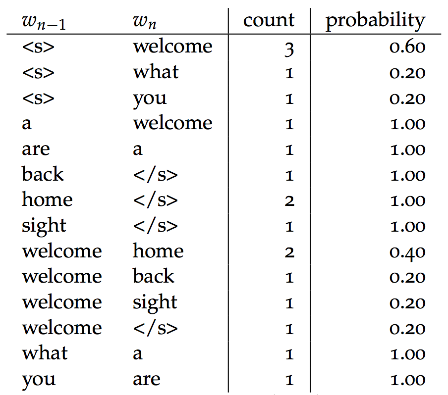

class: center, middle
# Computational Linguistics 
## 5. Part-Of-Speech Tagging and Syntactic Parsing

** Xiaojing Bai **

** Tsinghua University **

** https://bxjthu.github.io/CompLing **

---

.left-column-2[
## Recap:

**Probabilities of bigrams**

`\(P(w_n|w_{n−1})=\frac{C(w_{n-1}w_n)}{\sum_wC(w_{n-1}w)}=\frac{C(w_{n-1}w_n)}{C(w_{n-1})} \)`

**Probabilities of sequences** 
`\begin{align*}
P(w_1^n) &= P(w_1)P(w_2|w_1)P(w_3|w_1^2)...P(w_n|w_1^{n-1})\\
          &= \prod_{k=1}^nP(w_k|w_1^{k−1})\\
          &\approx \prod_{k=1}^nP(w_k|w_{k−1})
\end{align*}`
]

.right-column-2[
 
.center[

]
.center[
######The bigram counts and probabilities  for the toy corpus
]
]
---
## At the end of this session you will

+

---
##HMM and Part-Of-Speech (POS) tagging

  

The sequence of words observed:
<table border="0" width="100%">
    <tr>
      <td align="center" style="color:#ffffff" bgcolor="#33FFFF">colorless</td>
      <td align="center" style="color:#ffffff" bgcolor="#CC0000">green</td>
      <td align="center" style="color:#ffffff" bgcolor="#FFCC99">ideas</td>
      <td align="center" style="color:#ffffff" bgcolor="#006600">sleep</td>
      <td align="center" style="color:#ffffff" bgcolor="#00FF00">furiously</td>
    </tr>
</table>

???
Colorless green ideas sleep furiously is a sentence composed by Noam Chomsky in his 1957 book Syntactic Structures as an example of a sentence that is grammatically correct, but semantically nonsensical.

---
##The hidden Markov model

`\(Q = \{q_1, q_2, ...q_N\}\)` : a set of _N_ **states**
`\(A = \{a_{ij}\}\)` : a **transition probability matrix** A, each `\(a_{ij}\)` representing the probability of moving from state _i_ to state _j_, s.t. `\(\sum_{j=1}^n a_{ij} = 1 ∀i\)` 
`\(O = o_1o_2 ...o_T\)` : a sequence of _T_ **observations**, each one drawn from a vocabulary `\(V = v_1,v_2,...,v_V\)` 
`\(B = \{b_i(o_t)\}\)`: an **observation probability matrix**, each expressing the probability of an observation `\(o_t\)` being generated from a state _i_ 
`\(q_0\)`, `\(q_F\)` : a **start state** and an **end (final) state**, together with transition probabilities `\(\{a_{01},a_{02}...a_{0n}\}\)` out of the start state and `\(\{a_{1F},a_{2F}...a_{nF}\}\)` into the end state `\(q_0\)`, `\(q_F\)`

---
## HMM: a probabilistic sequence model

Given a sequence of units (words, letters, morphemes, sentences, whatever),  
a HMM assigns a label or class to each unit in the sequence,  
thus mapping a sequence of observations to a sequence of labels.

_colorless green ideas sleep furiously_

---
##At the end of this session you will

+ understand how n-grams can model a language; 

+ learn how to use corpus data to compute the probabilities of n-grams; 

+ understand how n-grams may help to develop NLP applications; 

+ learn the difference between Markov models and hidden Markov models; 

+ know hidden Markov models can help parsing on different levels; 

+ get a clearer picture of the fundamentals in python.

---
##Assignment

**1. Review**

+ J+M 4 - pages 1-8
+ J+M 9 - pages 1-6
+ Practical 4
+ Mathematical foundations

**2. Practice**

Build a toy corpus of your own and:

+ Write out the equation for trigram probability estimation. Then write out all the non-zero trigram probabilities for a sentence in your corpus.

+ Calculate the probability of the sentences in your corpus.

---
class: center, middle
##Next session

Part-Of-Speech Tagging and Syntactic Parsing
