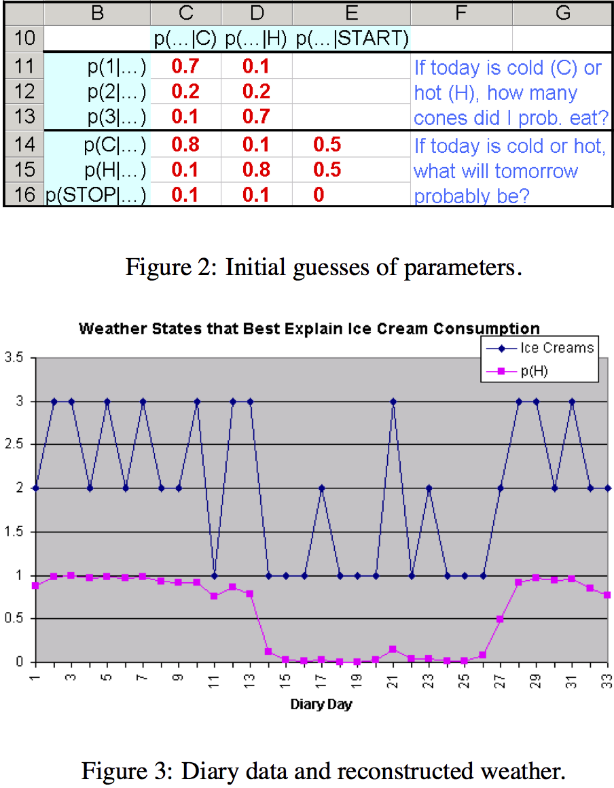

class: center, middle
# Computational Linguistics

## 5. Hidden Markov Models and Part-Of-Speech Tagging

** Xiaojing Bai **

** Tsinghua University **

** https://bxjthu.github.io/CompLing **

---
## Recap: conditional probability and joint probability

Conditional probability is the probability of event A given the occurrence of event B, written as $P(A|B)$.

Joint probability is the probability of two events in conjunction, i.e. the probability of both events together, written as $P(A \cap B)$ or $P(A,B)$.

If A and B are independent, i.e. knowing the outcome of A does not change the probability of B, or $P(B|A) = P(B)$, then $P(A \cap B) = P(A)P(B)$.

If A and B are not independent, e.g. knowing the outcome of A does change the probability of B, or $P(B|A) \neq P(B)$, then $P(A \cap B) = P(A)P(B|A)$.

---

.left-column-2[
## Recap

**Probabilities of bigrams**

\\(P(w\_n|w\_{n-1}) = \frac{C(w\_{n-1} w\_n)}{\sum\_w C(w\_{n-1}w)}=\frac{C(w\_{n-1}w\_n)}{C(w\_{n-1})} \\)

**Probabilities of sequences**<br>

\\(
\footnotesize
\begin{aligned}
P(w\_1^n) & = P(w\_1) P(w\_2|w\_1) P(w\_3|w\_1^2) \ldots P(w\_n|w\_1^{n-1}) \\\
& = \prod\_{k=1}^n P(w\_k|w\_1^{k-1})  \\\
& \approx \prod\_{k=1}^n P(w\_k|w\_{k-1})
\end{aligned}
\\)

]

.right-column-4[
<br><br>
.smaller[
w<sub>n−1</sub> | w<sub>n</sub> | count&nbsp;&nbsp; | probability
--|--|:--:|:--:
`<s>` | welcome&nbsp;&nbsp; | 3 | 0.60
`<s>` | what | 1 | 0.20
`<s>` | you | 1 | 0.20
a | welcome | 2 | 1.00
are | a | 1 | 1.00
back | `</s>` | 1 | 1.00
home | `</s>` | 2 | 1.00
sight | `</s>` | 1 | 1.00
welcome&nbsp;&nbsp; | home | 2 | 0.40
welcome | back | 1 | 0.20
welcome | sight | 1 | 0.20
welcome | `</s>` | 1 | 0.20
what | a | 1 | 1.00
you | are | 1 | 1.00

.center[
**The bigram counts and probabilities <br>for the toy corpus**
]
]
]

---

.left-column-2[
## Recap

**Probabilities of trigrams**

\\(
P(w\_n | w\_{n-2} w\_{n-1}) =
\frac{C(w\_{n-2}w\_{n-1}w\_n)}{C(w\_{n-2}w\_{n-1})}
\\)

**Probabilities of sequences**<br>

\\(
\footnotesize
\begin{aligned}
P(w\_1^n) & = P(w\_1)P(w\_2|w\_1)P(w\_3|w\_1^2) \ldots P(w\_n|w\_1^{n-1}) \\\
& = \prod\_{k=1}^n P(w\_k|w\_1^{k-1}) \\\
& \approx \prod\_{k=1}^n P(w\_k|w\_{k-1}w\_{k-2})
\end{aligned}
\\)
]

.right-column-4[
<br><br>
```
*
*<s>welcome back</s>
*
*<s>welcome home</s>
*
*<s>you are a welcome sight</s>
*
*<s>what a welcome</s>
*
*<s>what a lovely day</s>
*
*<s>you are so lovely</s>
*
```

.smaller[
w<sub>n−2</sub> | w<sub>n−1</sub>&nbsp;&nbsp; | w<sub>n</sub> | count&nbsp;&nbsp; | probability
--|--|--|:--:|:--:
you | are | so | 1 | 0.5
what&nbsp;&nbsp; | a | welcome | 1 | 0.5
are | so | lovely | 1 | 1
]
]

---
## Recap

+ Power of n-grams

+ Dependence of n-grams on their training sets

+ Evaluation of language models

+ N-grams in NLP applications

???
Evaluating the performance of a model

+ Extrinsic evaluation
+ Intrinsic evaluation
  + Training set
  + Development set
  + Test set
  How well does the trained model fit the test set?
  How well does the trained model predict the test set?
  Division of the data set
---

## At the end of this session you will

+ learn the difference between Markov models and hidden Markov models;

+ know that hidden Markov models can help parsing on different levels;

+ understand the purposes of POS tagging;

+ know what a tagset is and how tagsets vary;

+ know a rule-based method and a probabilistic method of POS tagging;

+ work better with REs in structured programs and handle file i/o well.

---

##The Markov model or the Markov chain

+ The Markov assumption

 + the probability of a word depends only on the previous word<br><br>$P(q\_i|q\_1...q\_{i-1}) = P(q\_i|q\_{i-1})$

+ An extension of an FSA: a special case of a weighted FSA
 + the weights being the probabilities
 + the input sequence uniquely determining the states to go through

+ Useful for assigning probabilities to unambiguous sequences

---
##The Markov model or the Markov chain
.left-column-2[
.smaller[
w<sub>n−1</sub> | w<sub>n</sub> | count&nbsp;&nbsp; | probability
:--|--|:--:|:--:
`<s>` | welcome&nbsp;&nbsp; | 3 | 0.60
`<s>` | what | 1 | 0.20
`<s>` | you | 1 | 0.20
a | welcome | 2 | 1.00
are | a | 1 | 1.00
back | `</s>` | 1 | 1.00
home | `</s>` | 2 | 1.00
sight | `</s>` | 1 | 1.00
welcome&nbsp;&nbsp; | home | 2 | 0.40
welcome | back | 1 | 0.20
welcome | sight | 1 | 0.20
welcome | `</s>` | 1 | 0.20
what | a | 1 | 1.00
you | are | 1 | 1.00

<br>
**The bigram counts and probabilities <br>for the toy corpus**

]
]

.right-column-2[

> ######Part of the Markov chain for the toy corpus
]

---
##The Markov model or the Markov chain
.left-column-2[
<font color="red">$Q = \lbrace q\_1,q\_2, \ldots , q\_n \rbrace $ </font>: a set of _n_ **states**

<font color="red">$A = \lbrack a\_{ij} \rbrack $ </font>: a **transition probability matrix** A, each $a\_{ij}$ representing the probability of moving from state _i_ to state _j_, s.t. $\sum\_{j=1}^n a\_{ij} = 1 \space \space \forall i$

<font color="red">$\pi = \lbrace \pi\_1, \pi\_2, \ldots, \pi\_n \rbrace $ </font>: an **initial probability distribution** over states, each $\pi\_i$ representing the probability that the Markov chain will start in state _i_, s.t. $\sum\_{i=1}^n \pi\_i = 1$
]

.right-column-2[

]

---
.left-column-2[

##A Markov model
Used to compute a probability for a sequence of observable events

##A hidden Markov model (HMM)
Used to compute a probability for a sequence of NOT observable events

######Example: Jason's ice cream climatology data

&nbsp;&nbsp;
&nbsp;&nbsp;

]
.right-column-2[

]

---
## HMM: a probabilistic sequence model

Given a sequence of units (words, letters, morphemes, sentences, whatever), <br>
a HMM assigns a label or class to each unit in the sequence, <br>
thus mapping a sequence of observations to a sequence of labels.


???
Colorless green ideas sleep furiously is a sentence composed by Noam Chomsky in his 1957 book Syntactic Structures as an example of a sentence that is grammatically correct, but semantically nonsensical.

---
##The hidden Markov model

<font color="red">$Q = \lbrace q\_1,q\_2, \ldots , q\_n \rbrace $ </font>: a set of _n_ **states**

<font color="red">$A = \lbrack a\_{ij} \rbrack $ </font>: a **transition probability matrix** A, each $a\_{ij}$ representing the probability of moving from state _i_ to state _j_, s.t. $\sum\_{j=1}^n a\_{ij} = 1 \space \space \forall i$

<font color="red">$O = o\_1 o\_2 \ldots o\_T$ </font>: a sequence of _T_ **observations**, each one drawn from a vocabulary $V = \lbrace v\_1,v\_2,\ldots,v_V \rbrace$

<font color="red">$B = b\_i(o\_t)$</font>: an sequence of **observation probabilities**, each expressing the probability of an observation $o\_t$ being generated from a state _i_

<font color="red">$\pi = \lbrace \pi\_1, \pi\_2, \ldots, \pi\_n \rbrace $ </font>: an **initial probability distribution** over states, each $\pi\_i$ representing the probability that the Markov chain will start in state _i_, s.t. $\sum\_{i=1}^n \pi\_i = 1$

---
## The astonishing durability of POS through two millennia

Terminology: parts-of-speech, word classes, syntactic categories, ...

&nbsp;|&nbsp;
-|-
&nbsp;&nbsp;&nbsp; | <video width="480" height="360" controls src="images/conjunction_junction.mp4" type="video/mp4"</video>

---

## Why we need to assign parts-of-speech to words?

+ Part-of-Speech tagging
  + Input: a sequence of words + a tagset<br>
  + Output: a sequence of tags

+ POS features used in
  + Syntactic parsing
<br><br>
  + Information extraction
  + Informational retrieval
  + Automatic summarization
  + Speech synthesis and recognition

Review: [English](https://bxjthu.github.io/CompLing/readings/5/J+M_8.pdf) and [Chinese](https://bxjthu.github.io/CompLing/readings/5/现代汉语_北大现代汉语教研室.pdf) Word Classes

---

.left-column-4[
## Ambiguities in POS tagging

The amount of tag ambiguity for word types <br>
in the Brown and the WSJ corpora


+ Differences across the genres

+ The most ambiguous frequent words

  _that, back, down, put, set_
]

.right-column-4[  
<br><br><br><br><br><br><br>
.smaller[
E.g.

earnings growth took a <font color="red">back/JJ</font> seat

a small building in the <font color="red">back/NN</font>

a clear majority of senators <font color="red">back/VBP</font> the bill

Dave began to <font color="red">back/VB</font> toward the door

enable the country to buy <font color="red">back/RP</font> about

debt I was twenty-one <font color="red">back/RB</font> then
]
]

---

## Tagged corpora and Tagsets

+ POS-tagged corpora as the training and test sets for statistical tagging algorithms and other statistical NLP tasks

+ Automatic POS tagger + human annotators hand-correction

+ Very commonly used tagsets
  + The 87-tag Brown set
  + The 61-tag CLAWS 5 set
  + The 45-tag Penn Treebank set

---

.left-column-2[

## The Penn Treebank POS Tagset

+ The Brown corpus
+ The Wall Street Journal corpus
+ The Switchboard corpus
<br><br>
+ Tag + slash

.smaller[
E.g.

The/DT&nbsp;&nbsp; grand/JJ&nbsp;&nbsp; jury/NN&nbsp;&nbsp; commented/VBD&nbsp;&nbsp; on/IN&nbsp;&nbsp; a/DT&nbsp;&nbsp; number/NN&nbsp;&nbsp; of/IN&nbsp;&nbsp; other/JJ&nbsp;&nbsp; topics/NNS&nbsp;&nbsp; ./.

There/EX&nbsp;&nbsp; are/VBP&nbsp;&nbsp; 70/CD&nbsp;&nbsp; children/NNS&nbsp;&nbsp; there/RB&nbsp;&nbsp;

Preliminary/JJ&nbsp;&nbsp; findings/NNS&nbsp;&nbsp; were/VBD&nbsp;&nbsp; reported/VBN&nbsp;&nbsp; in/IN&nbsp;&nbsp; today/NN&nbsp;&nbsp;
’s/POS&nbsp;&nbsp; New/NNP&nbsp;&nbsp; England/NNP&nbsp;&nbsp; Journal/NNP&nbsp;&nbsp; of/IN&nbsp;&nbsp; Medicine/NNP&nbsp;&nbsp; ./.
]
]
.right-column-2[

]
---

.left-column-2[

## Rule-based POS tagging

+ A dictionary: to assign each word a list of potential parts-of-speech

+ A set of hand-written disambiguation rules: to winnow down this list to a single part-of-speech for each word

.smaller[
E.g.

I consider <font color="red">that</font> odd.

I wouldn't go <font color="red">that</font> far.
]
]

.right-column-2[


.smaller[ADVERBIAL-THAT RULE Given input: “that”]
```
if
 (+1 A/ADV/QUANT);
          # if next word is adj, adverb, or quantifier
 (+2 SENT-LIM);
          # and following which is a sentence boundary
 (NOT -1 SVOC/A);
          # and the previous word is not a verb
          # like ‘consider’ which allows adjs as
          # object complements
then eliminate non-ADV tags
else eliminate ADV tag
```
]

---

.left-column-2[
## HMM POS tagging: a decoding task
Given as <font color="red">input</font> an HMM \\(\lambda = (A, B)\\) <br>and a sequence of observations \\(O = o_1o_2 \ldots o_T\\), <font color="red">find</font> the most probable sequence of states \\(Q = q_1q_2q_3 \ldots q_T\\).

<br>

]

.right-column-4[
<br><br>
.smaller[
<font color="red">$Q = \lbrace q\_1,q\_2, \ldots , q\_n \rbrace $ </font>: a set of _n_ **states**

<font color="red">$A = \lbrack a\_{ij} \rbrack $ </font>: a **transition probability matrix** A, each $a\_{ij}$ representing the probability of moving from state _i_ to state _j_, s.t. $\sum\_{j=1}^n a\_{ij} = 1 \space \space \forall i$

<font color="red">$O = o\_1 o\_2 \ldots o\_T$ </font>: a sequence of _T_ **observations**, each one drawn from a vocabulary $V = \lbrace v\_1,v\_2,\ldots,v_V \rbrace$

<font color="red">$B = b\_i(o\_t)$</font>: an sequence of **observation probabilities**, each expressing the probability of an observation $o\_t$ being generated from a state _i_

<font color="red">$\pi = \lbrace \pi\_1, \pi\_2, \ldots, \pi\_n \rbrace $ </font>: an **initial probability distribution** over states, each $\pi\_i$ representing the probability that the Markov chain will start in state _i_, s.t. $\sum\_{i=1}^n \pi\_i = 1$
]
]

---

.left-column-4[
## Bayes' theorem

Property A = {F,M}

Property B = {FL,CS}

\\(
\footnotesize P(M) = \frac{5}{10} = 0.5 \quad P(F) = \frac{5}{10} = 0.5\\)

\\(\footnotesize P(CS) = \frac{4}{10} = 0.4  \quad  P(FL) = \frac{6}{10} = 0.6\\)

\\(\footnotesize P(CS|M) = \frac{3}{5} = 0.6  \quad  P(FL|M) = \frac{2}{5} = 0.4\\)

\\(\footnotesize P(CS|F) = \frac{1}{5} = 0.2  \quad  P(FL|F) = \frac{4}{5} = 0.8\\)

\\(\footnotesize P(M|CS) = \frac{3}{4} = 0.75 \quad  P(F|CS) = \frac{1}{4} = 0.25\\)

\\(\footnotesize P(M|FL) = \frac{2}{6} = 0.33  \quad  P(F|FL) = \frac{4}{6} = 0.66 \\)

]

.right-column-4[

Example: <br>
Consider a group of 10 students taking this course: some are male (M) and others female (F); some are enrolled in the Computer Science department (CS) and others in the Foreign Languages department (FL).

.smaller[
Gender&nbsp;&nbsp; | Dept.
:--:|:--:
M | CS
M | CS
M | CS
M | FL
M | FL
F | CS
F | FL
F | FL
F | FL
F | FL
]
]

???
a theorem describing how the conditional probability of each of a set of possible causes for a given observed outcome can be computed from knowledge of the probability of each cause and the conditional probability of the outcome of each cause.

---

.left-column-2[
## Bayes' theorem

Property A = {F,M}

Property B = {FL,CS}

The interaction between probabilities of the two properties.

\\[P(A|B) = \frac{P(B|A)P(A)}{P(B)}\\]

Applying Bayes’ theorem to POS tagging:

A = {POS tags in the tagset}

B = {word tokens in the corpus}

]

.right-column-4[

Example: <br>
Consider a group of 10 students taking this course: some are male (M) and others female (F); some are enrolled in the Computer Science department (CS) and others in the Foreign Languages department (FL).

.smaller[
Gender&nbsp;&nbsp; | Dept.
:--:|:--:
M | CS
M | CS
M | CS
M | FL
M | FL
F | CS
F | FL
F | FL
F | FL
F | FL
]
]

---

## The basic equation of HMM tagging

The most probable tag sequence given the observation sequence of n words \\(w\_1^n\\):

\\(\hat{t}\_1^n = \underset{t\_1^n}{\text{argmax}}P(t\_1^n|w\_1^n)\\)

\\(\hat{t}\_1^n\\) means 'the estimate of the sequence of n tags'

\\(\underset{x}{\text{argmax}}P(x)\\) means 'the x such that P(x) is maximized'

---

## The basic equation of HMM tagging

The most probable tag sequence given the observation sequence of n words \\(w\_1^n\\):

\\(\hat{t}\_1^n = \underset{t\_1^n}{\text{argmax}}P(t\_1^n|w\_1^n)\\)

\\(\hat{t}\_1^n = \underset{t\_1^n}{\text{argmax}}\frac{P(w\_1^n|t\_1^n)P(t\_1^n)}{P(w\_1^n)} \quad \Lleftarrow\\) using the Bayes’ rule

\\(\hat{t}\_1^n = \underset{t\_1^n}{\text{argmax}}P(w\_1^n|t\_1^n)P(t\_1^n) \quad \Lleftarrow\\) dropping the denominator \\(P(w\_1^n)\\)

\\(P(w\_1^n|t\_1^n) \approx \prod\_{i=1}^n P(w\_i|t\_i) \quad P(w\_i|t\_i) = \frac{\text{Frequency of } w\_i \text{ tagged as } t\_i \text{ in the training corpus}}{\text{Frequency of } t\_i \text{ in the training corpus}}\\)

\\(P(t\_1^n) \approx \prod\_{i=1}^n P(t\_i|t\_{i-1}) \qquad P(t\_i|t\_{i-1}) = \frac{\text{Frequency of } t\_i \text{ after }t\_{i-1} \text{ in the training corpus}}{\text{Frequency of } t\_{i-1} \text{ in the training corpus}}\\)

---

## The basic equation of HMM tagging

The most probable tag sequence given the observation sequence of n words \\(w\_1^n\\):

$$\hat{t}\_1^n = \underset{t\_1^n}{\text{argmax}}P(w\_1^n|t\_1^n)P(t\_1^n)\approx\underset{t\_1^n}{\text{argmax}}\prod\_{i=1}^nP(w\_i|t\_i)P(t\_i|t\_{i-1})$$

<br>

$$P(w\_i|t\_i) = \frac{\text{Frequency of } w\_i \text{ tagged as } t\_i \text{ in the training corpus}}{\text{Frequency of } t\_i \text{ in the training corpus}}$$

$$P(t\_i|t\_{i-1}) = \frac{\text{Frequency of } t\_i \text{ after }t\_{i-1} \text{ in the training corpus}}{\text{Frequency of } t\_{i-1} \text{ in the training corpus}}$$

---

.left-column-2[
## HMM POS tagging: an example

.smaller[
E.g. Janet will back the bill
]


.smaller[
Janet/NNP&nbsp;&nbsp; will/MD&nbsp;&nbsp; back/VB&nbsp;&nbsp; the/DT&nbsp;&nbsp; bill/NN
]
]

.right-column-2[
<br><br><br>

]

???
Extending the HMM Algorithm to Trigrams
Maximum entropy Markov models

---

##At the end of this session you will

+ learn the difference between Markov models and hidden Markov models;

+ know that hidden Markov models can help parsing on different levels;

+ understand the purposes of POS tagging;

+ know what a tagset is and how tagsets vary;

+ know a rule-based method and a probabilistic method of POS tagging;

+ work better with REs in structured programs and handle file i/o well.

---
##Homework

+ Read/review (Quiz 5 on Oct. 31, 2018)

  + [J+M_8](https://bxjthu.github.io/CompLing/readings/5/J+M_8.pdf) (8.1-8.4; 8.7)

  Question: How might POS features be used in information extraction, informational retrieval, automatic summarization, speech synthesis and recognition, or other NLP applications you can think of?

+ Read and Practice

  + http://www.nltk.org/book/ch05.html

---
class: center, middle
##Next session

Formal Grammars and Syntactic Parsing
