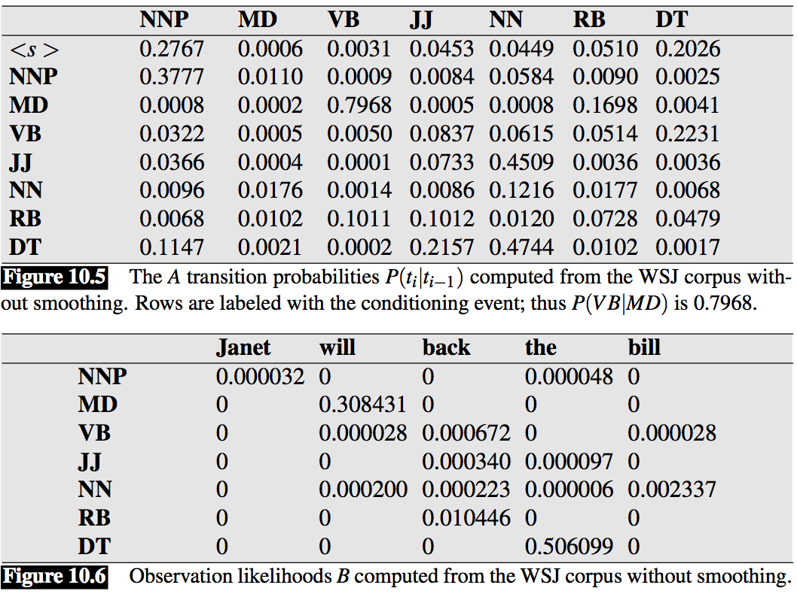
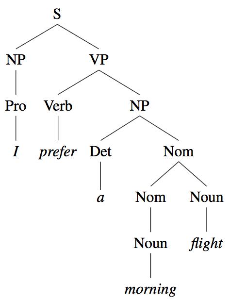

class: center, middle
# Computational Linguistics<br>
## 5. Part-Of-Speech Tagging and Formal Grammars

** Xiaojing Bai **

** Tsinghua University **

** https://bxjthu.github.io/CompLing **

---

.left-column-2[
## Recap:

**Probabilities of bigrams**

`\(P(w_n|w_{n−1})=\frac{C(w_{n-1}w_n)}{\sum_wC(w_{n-1}w)}=\frac{C(w_{n-1}w_n)}{C(w_{n-1})} \)`

**Probabilities of sequences**<br>
`\begin{align*}
P(w_1^n) &= P(w_1)P(w_2|w_1)P(w_3|w_1^2)...P(w_n|w_1^{n-1})\\
          &= \prod_{k=1}^nP(w_k|w_1^{k−1})\\
          &\approx \prod_{k=1}^nP(w_k|w_{k−1})
\end{align*}`
]

.right-column-4[
<br><br>
.smaller[
w<sub>n−1</sub> | w<sub>n</sub> | count&nbsp;&nbsp; | probability
--|--|:--:|:--:
`<s>` | welcome&nbsp;&nbsp; | 3 | 0.60
`<s>` | what | 1 | 0.20
`<s>` | you | 1 | 0.20
a | welcome | 2 | 1.00
are | a | 1 | 1.00
back | `</s>` | 1 | 1.00
home | `</s>` | 2 | 1.00
sight | `</s>` | 1 | 1.00
welcome&nbsp;&nbsp; | home | 2 | 0.40
welcome | back | 1 | 0.20
welcome | sight | 1 | 0.20
welcome | `</s>` | 1 | 0.20
what | a | 1 | 1.00
you | are | 1 | 1.00

.center[
**The bigram counts and probabilities <br>for the toy corpus**
]
]
]

---

.left-column-2[
## Recap:

**Probabilities of trigrams**

`\(P(w_n|w_{n−2}w_{n−1})=\frac{C(w_{n-2}w_{n-1}w_n)}{C(w_{n-2}w_{n-1})} \)`

**Probabilities of sequences**<br>
`\begin{align*}
P(w_1^n) &= P(w_1)P(w_2|w_1)P(w_3|w_1^2)...P(w_n|w_1^{n-1})\\
          &= \prod_{k=1}^nP(w_k|w_1^{k−1})\\
          &\approx \prod_{k=1}^nP(w_k|w_{k−2}w_{k−1})
\end{align*}`
]

.right-column-4[
<br><br>
```
*
*<s>welcome back</s>
*
*<s>welcome home</s>
*
*<s>you are a welcome sight</s>
*
*<s>what a welcome</s>
*
*<s>what a lovely day</s>
*
*<s>you are so lovely</s>
*
```

.smaller[
w<sub>n−2</sub> | w<sub>n−1</sub>&nbsp;&nbsp; | w<sub>n</sub> | count&nbsp;&nbsp; | probability
--|--|--|:--:|:--:
you | are | so | 1 | 0.5
what&nbsp;&nbsp; | a | welcome | 1 | 0.5
are | so | lovely | 1 | 1
]
]
---

## At the end of this session you will

+ learn how to evaluate the performance of a language model;

+ understand the purposes of POS tagging;

+ know what a tagset is and how tagsets vary;

+ know a rule-based method and a probabilistic method of POS tagging;

+ know how to describe a language using a regular grammar;

+ know how to describe a language using a context free grammar.

---
## Evaluating the performance of a model

+ Extrinsic evaluation

+ Intrinsic evaluation

  + Training set

  + Development set

  + Test set

  How well does the trained model fit the test set?

  How well does the trained model predict the test set?

  + Division of the data set
---

## The astonishing durability of POS through two millennia

Terminology: parts-of-speech, word classes, syntactic categories, ...

 &nbsp;|&nbsp;
 -|-
&nbsp;&nbsp;&nbsp; | <video width="480" height="360" controls src="images/conjunction_junction.mp4" type="video/mp4"</video>

---

## Why we need to assign parts-of-speech to words?

+ Part-of-Speech tagging
  + Input: a sequence of words + a tagset<br>
  + Output: a sequence of tags

+ POS features used in
  + Syntactic parsing
<br><br>
  + Information extraction
  + Informational retrieval
  + Automatic summarization
  + Speech synthesis and recognition

Review: English and Chinese Word Classes

---

.left-column-4[
## Ambiguities in POS tagging

The amount of tag ambiguity for word types <br>
in the Brown and the WSJ corpora


+ Differences across the genres

+ The most ambiguous frequent words

  _that, back, down, put, set_
]

.right-column-4[  
<br><br><br><br><br><br><br>
.smaller[
E.g.

earnings growth took a <font color="red">back/JJ</font> seat

a small building in the <font color="red">back/NN</font>

a clear majority of senators <font color="red">back/VBP</font> the bill

Dave began to <font color="red">back/VB</font> toward the door

enable the country to buy <font color="red">back/RP</font> about

debt I was twenty-one <font color="red">back/RB</font> then
]
]

---

## Tagged corpora and Tagsets

+ POS-tagged corpora as the training and test sets for statistical tagging algorithms and other statistical NLP tasks

+ Automatic POS tagger + human annotators hand-correction

+ Very commonly used tagsets
  + The 87-tag Brown set
  + The 61-tag CLAWS 5 set
  + The 45-tag Penn Treebank set

---

.left-column-2[

## The Penn Treebank POS Tagset

+ The Brown corpus
+ The Wall Street Journal corpus
+ The Switchboard corpus
<br><br>
+ Tag + slash

.smaller[
E.g.

The/DT&nbsp;&nbsp; grand/JJ&nbsp;&nbsp; jury/NN&nbsp;&nbsp; commented/VBD&nbsp;&nbsp; on/IN&nbsp;&nbsp; a/DT&nbsp;&nbsp; number/NN&nbsp;&nbsp; of/IN&nbsp;&nbsp; other/JJ&nbsp;&nbsp; topics/NNS&nbsp;&nbsp; ./.

There/EX&nbsp;&nbsp; are/VBP&nbsp;&nbsp; 70/CD&nbsp;&nbsp; children/NNS&nbsp;&nbsp; there/RB&nbsp;&nbsp;

Preliminary/JJ&nbsp;&nbsp; findings/NNS&nbsp;&nbsp; were/VBD&nbsp;&nbsp; reported/VBN&nbsp;&nbsp; in/IN&nbsp;&nbsp; today/NN&nbsp;&nbsp;
’s/POS&nbsp;&nbsp; New/NNP&nbsp;&nbsp; England/NNP&nbsp;&nbsp; Journal/NNP&nbsp;&nbsp; of/IN&nbsp;&nbsp; Medicine/NNP&nbsp;&nbsp; ./.
]
]
.right-column-2[

]
---

.left-column-2[

## Rule-based POS tagging

+ A dictionary: to assign each word a list of potential parts-of-speech

+ A set of hand-written disambiguation rules: to winnow down this list to a single part-of-speech for each word

.smaller[
E.g.

I consider <font color="red">that</font> odd.

I wouldn't go <font color="red">that</font> far.
]
]

.right-column-2[


.smaller[ADVERBIAL-THAT RULE Given input: “that”]
```
if
 (+1 A/ADV/QUANT);
          # if next word is adj, adverb, or quantifier
 (+2 SENT-LIM);
          # and following which is a sentence boundary
 (NOT -1 SVOC/A);
          # and the previous word is not a verb
          # like ‘consider’ which allows adjs as
          # object complements
then eliminate non-ADV tags
else eliminate ADV tag
```
]

---

.left-column-2[
## HMM POS tagging: a decoding task
Given as <font color="red">input</font> an HMM `\(\lambda = (A, B)\)` <br>and a sequence of observations `\(O = o_1o_2...o_T\)`, <font color="red">find</font> the most probable sequence of states `\(Q = q_1q_2q_3...q_T\)`.

<br>

]

.right-column-4[
<br><br>
.smaller[
<font color="red">`\(Q = \{q_1, q_2, ...q_N\}\)` </font>: a set of _N_ **states**
<font color="red">`\(A = \{a_{ij}\}\)` </font>: a **transition probability matrix** A, each `\(a_{ij}\)` representing the probability of moving from state _i_ to state _j_, s.t. `\(\sum_{j=1}^n a_{ij} = 1 ∀i\)`<br>
<font color="red">`\(O = o_1o_2 ...o_T\)` </font>: a sequence of _T_ **observations**, each one drawn from a vocabulary `\(V = v_1,v_2,...,v_V\)`<br>
<font color="red">`\(B = \{b_i(o_t)\}\)`</font>: an **observation probability matrix**, each expressing the probability of an observation `\(o_t\)` being generated from a state _i_<br>
<font color="red">`\(q_0\)`, `\(q_F\)` </font>: a **start state** and an **end (final) state**, together with transition probabilities `\(\{a_{01},a_{02}...a_{0n}\}\)` out of the start state and `\(\{a_{1F},a_{2F}...a_{nF}\}\)` into the end state `\(q_0\)`, `\(q_F\)`
]
]

---

.left-column-4[
## Bayes' theorem

Property A = {F,M}<br>
Property B = {FL,CS}

`\(P(M) = \frac{5}{10} = 0.5\)`&nbsp;&nbsp;&nbsp;&nbsp;&nbsp;&nbsp;&nbsp;&nbsp;&nbsp;&nbsp;&nbsp;&nbsp;&nbsp; `\(P(F) = \frac{5}{10} = 0.5\)`

`\(P(CS) = \frac{4}{10} = 0.4\)`&nbsp;&nbsp;&nbsp;&nbsp;&nbsp;&nbsp;&nbsp;&nbsp;&nbsp;&nbsp;&nbsp; `\(P(FL) = \frac{6}{10} = 0.6\)`

`\(P(CS|M) = \frac{3}{5} = 0.6\)`&nbsp;&nbsp;&nbsp;&nbsp;&nbsp;&nbsp;&nbsp;&nbsp; `\(P(FL|M) = \frac{2}{5} = 0.4\)`

`\(P(CS|F) = \frac{1}{5} = 0.2\)`&nbsp;&nbsp;&nbsp;&nbsp;&nbsp;&nbsp;&nbsp;&nbsp;&nbsp; `\(P(FL|F) = \frac{4}{5} = 0.8\)`

`\(P(M|CS) = \frac{3}{4} = 0.75\)`&nbsp;&nbsp;&nbsp;&nbsp;&nbsp;&nbsp; `\(P(F|CS) = \frac{1}{4} = 0.25\)`

`\(P(M|FL) = \frac{2}{6} = 0.33\)`&nbsp;&nbsp;&nbsp;&nbsp;&nbsp;&nbsp; `\(P(F|FL) = \frac{4}{6} = 0.66\)`

]

.right-column-4[

Example: <br>
Consider a group of 10 students taking this course: some are male (M) and others female (F); some are enrolled in the Computer Science department (CS) and others in the Foreign Languages department (FL).

.smaller[
Gender&nbsp;&nbsp; | Dept.
:--:|:--:
M | CS
M | CS
M | CS
M | FL
M | FL
F | CS
F | FL
F | FL
F | FL
F | FL
]
]

???
a theorem describing how the conditional probability of each of a set of possible causes for a given observed outcome can be computed from knowledge of the probability of each cause and the conditional probability of the outcome of each cause.

---

.left-column-2[
## Bayes' theorem

Property A = {F,M}<br>
Property B = {FL,CS}

The interaction between probabilities of the two properties.

`\[P(A|B) = \frac{P(B|A)P(A)}{P(B)}\]`

Applying Bayes’ theorem to POS tagging:

A = {POS tags in the tagset}

B = {word tokens in the corpus}

]

.right-column-4[

Example: <br>
Consider a group of 10 students taking this course: some are male (M) and others female (F); some are enrolled in the Computer Science department (CS) and others in the Foreign Languages department (FL).

.smaller[
Gender&nbsp;&nbsp; | Dept.
:--:|:--:
M | CS
M | CS
M | CS
M | FL
M | FL
F | CS
F | FL
F | FL
F | FL
F | FL
]
]

---

## The basic equation of HMM tagging

The most probable tag sequence given the observation sequence of n words `\(w_1^n\)`:

`\(\hat{t}_1^n = \underset{t_1^n}{\operatorname{argmax}}P(t_1^n|w_1^n)\)`

`\(\hat{t}_1^n = \underset{t_1^n}{\operatorname{argmax}}\frac{P(w_1^n|t_1^n)P(t_1^n)}{P(w_1^n)}\)` &nbsp;&nbsp;&nbsp;&nbsp;&nbsp;&nbsp;&nbsp;&nbsp; `\(\Lleftarrow\)` using the Bayes’ rule

`\(\hat{t}_1^n = \underset{t_1^n}{\operatorname{argmax}}P(w_1^n|t_1^n)P(t_1^n)\)` &nbsp;&nbsp;&nbsp; `\(\Lleftarrow\)` dropping the denominator `\(P(w_1^n)\)`

`\(P(w_1^n|t_1^n)\approx\prod_{i=1}^nP(w_i|t_i)\)` &nbsp;&nbsp;&nbsp;&nbsp;&nbsp; `\(P(w_i|t_i) = \frac{\text{Frequency of } w_i \text{ tagged as } t_i \text{ in the training corpus}}{\text{Frequency of } t_i \text{ in the training corpus}}\)`

`\(P(t_1^n)\approx\prod_{i=1}^nP(t_i|t_{i-1})\)` &nbsp;&nbsp;&nbsp;&nbsp;&nbsp;&nbsp;&nbsp;&nbsp;&nbsp; `\(P(t_i|t_{i-1}) = \frac{\text{Frequency of } t_i \text{ after }t_{i-1} \text{ in the training corpus}}{\text{Frequency of } t_{i-1} \text{ in the training corpus}}\)`

---

## The basic equation of HMM tagging

The most probable tag sequence given the observation sequence of n words `\(w_1^n\)`:

`$$\hat{t}_1^n = \underset{t_1^n}{\operatorname{argmax}}P(w_1^n|t_1^n)P(t_1^n)\approx\prod_{i=1}^nP(w_i|t_i)P(t_i|t_{i-1})$$`

<br>

`$$P(w_i|t_i) = \frac{\text{Frequency of } w_i \text{ tagged as } t_i \text{ in the training corpus}}{\text{Frequency of } t_i \text{ in the training corpus}}$$`

`$$P(t_i|t_{i-1}) = \frac{\text{Frequency of } t_i \text{ after }t_{i-1} \text{ in the training corpus}}{\text{Frequency of } t_{i-1} \text{ in the training corpus}}$$`

---

.left-column-2[
## HMM POS tagging: an example

.smaller[
E.g. Janet will back the bill
]


.smaller[
Janet/NNP&nbsp;&nbsp; will/MD&nbsp;&nbsp; back/VB&nbsp;&nbsp; the/DT&nbsp;&nbsp; bill/NN
]
]

.right-column-2[
<br><br><br>

]

???
Extending the HMM Algorithm to Trigrams
Maximum entropy Markov models

---

## Syntax

+ The way words are arranged together

+ Syntactic notions
  + Regular expressions: representing the sequences of words<br>
  + N-grams: computing probabilities for the sequences of words<br>
  + Parts-of-speech: acting as a kind of equivalence class for words<br>
<br>
  + Models of syntax and grammar
    > + Regular grammars
    > + Context free grammars
    > + ...

---

## Representing an FSA as a grammar

.left-column-2[
Three equivalent ways of describing regular languages


]

.right-column-2[
+ The Chomsky hierarchy

+ Natural language and its complexity

+ Formal models and formal languages

+ Power of formal models: complexity of the phenomena they can describe
]

---

## A formal grammar for the sheep talk

.left-column-2[

starting symbol = _S_ <br>
non-terminals = _{S, A, B, C}_ <br>
terminals = _{b, a, !}_

Rewrite rules or production rules

_S → bA_<br>
_A → aB_<br>
_B → aC_<br>
_C → aC_<br>
_C → !_

]

.right-column-2[

/baa+!/


`\begin{align*}
Q &= \{q_0,q_1,q_2,q_3,q_4\}\\
Σ &= \{b,a,!\}\\
q_0 &= q_0\\
F &= \{q_4\}
\end{align*}`

]

---

## Derivation of the sheep talk


---

.left-column-2[

## Derivation of the sheep talk

starting symbol = _S_ <br>
non-terminals = _{S, A, B, C}_ <br>
terminals = _{b, a, !}_

Rewrite rules or production rules

_S → bA_<br>
_A → aB_<br>
_B → aC_<br>
_C → aC_<br>
_C → !_

]

.right-column-2[

<br>


]

---

## The grammar definition vs. the FSA definition

.left-column-2[

starting symbol = _S_ <br>
non-terminals = _{S, A, B, C}_ <br>
terminals = _{b, a, !}_

Rewrite rules or production rules

_S → bA_<br>
_A → aB_<br>
_B → aC_<br>
_C → aC_<br>
_C → !_

]

.right-column-2[

/baa+!/


`\begin{align*}
Q &= \{S,A,B,C,q_4\}\\
Σ &= \{b,a,!\}\\
q_0 &= S\\
F &= \{q_4\}
\end{align*}`

]

---

## Rewrite rules of a regular grammar

.left-column-2[
Left-branching structures
.left-column-1[
_X → Ya_<br>
_X → a_

_S → A!_<br>
_A → Ba_<br>
_B → Ca_<br>
_C → Ca_<br>
_C → b_
]
.right-column-1[

]
]
.right-column-2[
Right-branching structures
.left-column-1[
_X → aY_<br>
_X → a_

_S → bA_<br>
_A → aB_<br>
_B → aC_<br>
_C → aC_<br>
_C → !_
]
.right-column-1[

]
]
---

## Regular grammars for natural language: problems

+ Redundancy

+ Centre Embedding

  E.g.

  The students <font color="red">the police arrested</font> complained.

  The luggage <font color="red">that the passengers checked</font> arrived.

  The luggage <font color="red">that the passengers that the storm delayed checked</font> arrived.

---

## Context free grammars for natural language

+ Less restrictive and hence more powerful

+ Aka: phrase-structure grammars

+ Equivalent to Backus-Naur Form (BNF)

+ Backbone of many formal models of the syntax of natural language

+ Applications
  + syntactic parsing, semantic interpretation etc.
  + grammar checking, semantic interpretation, dialogue understanding,  machine translation etc.

+ Computationally tractable

---

## Context free grammars: the formal definition

_S_: a designated start symbol;

_Σ_: a set of terminal symbols;

_N_: a set of non-terminal symbols;

_R_: a set of rewrite rules of the form _A → β_<br>
&nbsp;&nbsp;&nbsp;&nbsp;where _A_ is a non-terminal<br>
&nbsp;&nbsp;&nbsp;&nbsp;and _β_ is a string of elements from the infinite set _(Σ ∪ N)*_.

---
.left-column-2[
## Context free grammars: an example

E.g. I prefer a morning flight

Bracketed notation:

[S [NP [Pro I]] [VP [V prefer] [NP [Det a] [Nom [N morning] [Nom [N flight]]]]]]
]

.right-column-4[
<br>
Parse tree:


]

---

.left-column-2[
## Context free grammars: an example


]

.right-column-4[
<br>
Parse tree:


]

---

## What are formal grammars used for?

+ Generating sentences

+ Recognizing grammatical and ungrammatical sentences

+ Parsing sentences

---

##At the end of this session you will

+ learn how to evaluate the performance of a language model;

+ understand the purposes of POS tagging;

+ know what a tagset is and how tagsets vary;

+ know a rule-based method and a probabilistic method of POS tagging;

+ know how to describe a language using a regular grammar;

+ know how to describe a language using a context free grammar.

---
##Assignment

**1. Review**

+ J+M 4 - pages 1-8
+ J+M 9 - pages 1-6
+ Practical 4
+ Mathematical foundations

**2. Practice**

Build a toy corpus of your own and:

+ Write out the equation for trigram probability estimation. Then write out all the non-zero trigram probabilities for a sentence in your corpus.

+ Calculate the probability of the sentences in your corpus.

---
class: center, middle
##Next session

Part-Of-Speech Tagging and Syntactic Parsing
