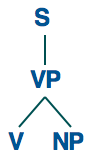
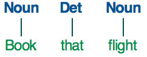

class: center, middle
# Computational Linguistics<br>
## 6. Formal Grammars and Syntactic Parsing

** Xiaojing Bai **

** Tsinghua University **

** https://bxjthu.github.io/CompLing **

---

## Recap: HMM POS tagging as a <font color="red">decoding</font> task
.left-column-2[

Given as <font color="red">input</font> an HMM \\(\lambda = (A, B)\\) <br>and a sequence of observations \\(O = o_1o_2 \cdots o_T\\), <font color="red">find</font> the most probable sequence of states \\(Q = q_1q_2q_3 \cdots q_T\\).


]

.right-column-4[
Hidden Markov models are characterized by three fundamental problems:

+ Problem 1: Likelihood

+ <font color="red">Problem 2: Decoding</font>

+ Problem 3: Learning

]

---

## Recap: The basic equation of HMM tagging

The most probable tag sequence given the observation sequence of n words \\(w\_1^n\\):

\\(\hat{t}\_1^n = \underset{t\_1^n}{\text{argmax}}P(t\_1^n|w\_1^n)\\)

\\(\hat{t}\_1^n\\) means 'the estimate of the sequence of n tags'

\\(\underset{x}{\text{argmax}}P(x)\\) means 'the x such that P(x) is maximized'

---

## Recap: The basic equation of HMM tagging

The most probable tag sequence given the observation sequence of n words \\(w\_1^n\\):

$$\hat{t}\_1^n = \underset{t\_1^n}{\text{argmax}}P(w\_1^n|t\_1^n)P(t\_1^n)\approx\underset{t\_1^n}{\text{argmax}}\prod\_{i=1}^nP(w\_i|t\_i)P(t\_i|t\_{i-1})$$

<br>

$$P(w\_i|t\_i) = \frac{\text{Frequency of } w\_i \text{ tagged as } t\_i \text{ in the training corpus}}{\text{Frequency of } t\_i \text{ in the training corpus}}$$

$$P(t\_i|t\_{i-1}) = \frac{\text{Frequency of } t\_i \text{ after }t\_{i-1} \text{ in the training corpus}}{\text{Frequency of } t\_{i-1} \text{ in the training corpus}}$$

---

.left-column-2[
## Recap: An example

.smaller[
E.g. Janet will back the bill
]


.smaller[
Janet/NNP&nbsp;&nbsp; will/MD&nbsp;&nbsp; back/VB&nbsp;&nbsp; the/DT&nbsp;&nbsp; bill/NN
]
]

.right-column-2[
<br><br><br>

]

???
Extending the HMM Algorithm to Trigrams
Maximum entropy Markov models

---

.left-column-3[
## Recap: Models and algorithms
### How NLP systems work?


]
.right-column-3[
<br><br>
+ **A language model:** <br>a formal description of linguistic knowledge to show how a language works

<br>
+ **An algorithm:** <br>a series of steps in a computer program to solve a problem in an efficient way
]
---

.left-column-2[
## Recap: An example

.smaller[
E.g. Janet will back the bill
]


.smaller[
Janet/NNP&nbsp;&nbsp; will/MD&nbsp;&nbsp; back/VB&nbsp;&nbsp; the/DT&nbsp;&nbsp; bill/NN
]
]

.right-column-2[
**Viterbi algorithm**

+ Andrew Viterbi, 1967

+ A dynamic programming algorithm

+ Maximize the probabilities

+ Find the most likely sequence of tags

+ Algorithm: exponential complexity

  With a tagset of N tags, for a sequence of M words, there are, in the worse case, \\(N^M\\) possible paths.

+ Efficiency: \\(N^M\\) vs. \\(N^2 \times M\\)

]

---

## Rationale behind dynamic programming

Aka: dynamic optimization

+ Solving a complex problem by breaking it down into a collection of simpler subproblems

+ Solving each of those subproblems just once and storing their solutions

+ Looking up the previously computed solution the next time the same subproblem occurs

+ Thereby saving computation time at the expense of a hopefully modest expenditure in storage space

Memoization: storing solutions to subproblems instead of recomputing them

---
.left-column-2[
## Viterbi algorithm: an example

.smaller[Consider a village where all villagers are either <font color="red">healthy</font> or have a <font color="red">fever</font> and only the village doctor can determine whether each has a fever. The doctor diagnoses fever by asking patients how they feel. The villagers may only answer that they feel <font color="red">normal</font>, <font color="red">dizzy</font>, or <font color="red">cold</font>.

Python representation of the given HMM:]
```
obs = ('normal', 'cold', 'dizzy')
states = ('Healthy', 'Fever')
start_p = {'Healthy': 0.6, 'Fever': 0.4}
trans_p = {
   'Healthy' : {'Healthy': 0.7, 'Fever': 0.3},
   'Fever' : {'Healthy': 0.4, 'Fever': 0.6}
   }
emit_p = {
   'Healthy' : {'normal': 0.5, 'cold': 0.4, 'dizzy': 0.1},
   'Fever' : {'normal': 0.1, 'cold': 0.3, 'dizzy': 0.6}
   }
```
]
.right-column-4[

<br>
.smaller[Graphical representation of the given HMM]

]

---

## Viterbi algorithm: an example


---
## Viterbi algorithm: an example


---
## Viterbi algorithm: an example


---
## Viterbi algorithm: an example


---
## Viterbi algorithm: an example


???
Efficiency: \\(N^M\\) vs. \\(N^2 \times M\\)

---

.left-column-3[

]
.right-column-3[
<br><br><br><br>

+ The first few entries in the individual state columns for the Viterbi algorithm.

+ Each cell keeps the probability of the best path so far and a pointer to the previous cell along that path.

]

---

## Recap: Rewrite rules of a regular grammar

.left-column-2[
Left-branching structures
.left-column-1[
_X → Ya_<br>
_X → a_

_S → A!_<br>
_A → Ba_<br>
_B → Ca_<br>
_C → Ca_<br>
_C → b_
]
.right-column-1[

]
]
.right-column-2[
Right-branching structures
.left-column-1[
_X → aY_<br>
_X → a_

_S → bA_<br>
_A → aB_<br>
_B → aC_<br>
_C → aC_<br>
_C → !_
]
.right-column-1[

]
]

---

## Recap: Rewrite rules of a regular grammar

**Strong equivalence** vs. **weak equivalence**

+ Two grammars are **strongly equivalent** if they generate the same set of strings <font color="red">and</font> if they assign the same phrase structure to each sentence (allowing merely for renaming of the non-terminal symbols).

+ Two grammars are **weakly equivalent** if they generate the same set of strings <font color="red">but</font> do not assign the same phrase structure to each sentence.

---

## Recap: Using a regular grammar to model natural language

Weaknesses

+ Redundancy

+ Centre Embedding

  E.g.

  The students <font color="red">the police arrested</font> complained.<br>
  The luggage <font color="red">that the passengers checked</font> arrived.<br>
  The luggage <font color="red">that the passengers that the storm delayed checked</font> arrived.

<br>
Left/Right-branching vs. binary branching

---

## Recap: A formal definition of context-free grammars

_S_: a designated start symbol;

_Σ_: a set of terminal symbols;

_N_: a set of non-terminal symbols;

_R_: a set of rewrite rules of the form <font color="red">_A → β_</font><br>
&nbsp;&nbsp;&nbsp;&nbsp;where _A_ is a non-terminal<br>
&nbsp;&nbsp;&nbsp;&nbsp;and _β_ is a string of elements from the infinite set _(Σ ∪ N)*_.

Or most commonly written as **Chomsky Normal Form** (CNF):

<font color="red">_A → BC_</font>, or, <font color="red">_A → a_</font>, where, _A, B, C ∈ N_, and, _a ∈ Σ_.

---

.left-column-2[
## Recap: An example


]

.right-column-4[
<br>
Parse tree:


]

---

## Recap: An example

E.g. The man who will visit us prefers a morning flight


???
(S (NP (NP (DT The) (NN man)) (SBAR (WHNP (WP who))(S (VP (MD will)(VP (VB visit)(NP (PRP us)))))))(VP (VBZ prefers)(NP (DT a) (NN morning) (NN flight))))

---

## Recap: What are formal grammars used for?

+ Generating sentences

+ Recognizing grammatical and ungrammatical sentences

+ <font color="red">Parsing sentences</font>


---

## Syntax

+ The way words are arranged together

+ Syntactic notions
  + Regular expressions: representing the sequences of words<br>
  + N-grams: computing probabilities for the sequences of words<br>
  + Parts-of-speech: acting as a kind of equivalence class for words<br>
<br>
  + Models of syntax and grammar
    > + Regular grammars
    > + Context-free grammars
    > + ...

---

## Representing an FSA as a grammar

.left-column-2[
Three equivalent ways of describing regular languages


]

.right-column-2[
+ The Chomsky hierarchy

+ Natural language and its complexity

+ Formal models and formal languages

+ Power of formal models: complexity of the phenomena they can describe
]

---

## A formal grammar for the sheep talk

.left-column-2[

starting symbol = _S_ <br>
non-terminals = _{S, A, B, C}_ <br>
terminals = _{b, a, !}_

Rewrite rules or production rules

_S → bA_<br>
_A → aB_<br>
_B → aC_<br>
_C → aC_<br>
_C → !_

]

.right-column-2[

/baa+!/


$$
\begin{aligned}
Q &= \\{q\_0,q\_1,q\_2,q\_3,q\_4\\}\\\
Σ &= \\{b,a,!\\}\\\
q\_0 &= q\_0\\\
F &= \\{q\_4\\}
\end{aligned}
$$

]

---

## Derivation of the sheep talk


---

.left-column-2[

## Derivation of the sheep talk

starting symbol = _S_ <br>
non-terminals = _{S, A, B, C}_ <br>
terminals = _{b, a, !}_

Rewrite rules or production rules

_S → bA_<br>
_A → aB_<br>
_B → aC_<br>
_C → aC_<br>
_C → !_

]

.right-column-2[

<br>


]

---

## The grammar definition vs. the FSA definition

.left-column-2[

starting symbol = _S_ <br>
non-terminals = _{S, A, B, C}_ <br>
terminals = _{b, a, !}_

Rewrite rules or production rules

_S → bA_<br>
_A → aB_<br>
_B → aC_<br>
_C → aC_<br>
_C → !_

]

.right-column-2[

/baa+!/


$$
\begin{aligned}
Q &= \\{S,A,B,C,q\_4\\}\\\
Σ &= \\{b,a,!\\}\\\
q\_0 &= S\\\
F &= \\{q\_4\\}
\end{aligned}
$$

]

---

## Rewrite rules of a regular grammar

.left-column-2[
Left-branching structures
.left-column-1[
_X → Ya_<br>
_X → a_

_S → A!_<br>
_A → Ba_<br>
_B → Ca_<br>
_C → Ca_<br>
_C → b_
]
.right-column-1[

]
]
.right-column-2[
Right-branching structures
.left-column-1[
_X → aY_<br>
_X → a_

_S → bA_<br>
_A → aB_<br>
_B → aC_<br>
_C → aC_<br>
_C → !_
]
.right-column-1[

]
]
---

## Regular grammars for natural language: problems

+ Redundancy

+ Centre Embedding

  E.g.

  The students <font color="red">the police arrested</font> complained.

  The luggage <font color="red">that the passengers checked</font> arrived.

  The luggage <font color="red">that the passengers that the storm delayed checked</font> arrived.

---

## Context-free grammars for natural language

+ Less restrictive and hence more powerful

+ Aka: phrase-structure grammars

+ Equivalent to Backus-Naur Form (BNF)

+ Backbone of many formal models of the syntax of natural language

+ Applications
  + syntactic parsing, semantic interpretation etc.
  + grammar checking, semantic interpretation, dialogue understanding,  machine translation etc.

+ Computationally tractable

---

## Context-free grammars: the formal definition

_S_: a designated start symbol;

_Σ_: a set of terminal symbols;

_N_: a set of non-terminal symbols;

_R_: a set of rewrite rules of the form _A → β_<br>
&nbsp;&nbsp;&nbsp;&nbsp;where _A_ is a non-terminal<br>
&nbsp;&nbsp;&nbsp;&nbsp;and _β_ is a string of elements from the infinite set _(Σ ∪ N)*_.

---
.left-column-2[
## Context-free grammars: an example

E.g. I prefer a morning flight

Bracketed notation:

[S [NP [Pro I]] [VP [V prefer] [NP [Det a] [Nom [N morning] [Nom [N flight]]]]]]
]

.right-column-4[
<br>
Parse tree:


]

---

.left-column-2[
## Context-free grammars: an example


]

.right-column-4[
<br>
Parse tree:


]

---

## What are formal grammars used for?

+ Generating sentences

+ Recognizing grammatical and ungrammatical sentences

+ Parsing sentences


---

##At the end of this session you will

+ understand the rationale behind dynamic programming;

+ know how the Viterbi algorithm works for POS tagging;

+ know how top-down parsing and bottom-up parsing work;

+ understand the strengths and weaknesses of top-down and bottom-up parsing algorithms;

+ understand how language models and parsing algorithms work together in syntactic parsing.

---

## Syntactic parsing with context-free grammars

+ **Parsing**: recognizing an input string and assigning a structure to the string

+ **Syntactic parsing**: recognizing a sentence and assigning a syntactic structure to the sentence

 + **A context-free grammar**: a declarative formalism of how words combine to form larger linguistic units (phrases and sentences)

 + **A parsing algorithm**: employing the grammar to produce parse trees for a given sentence

---
.left-column-2[
## Parsing as a search problem

**Goal**: to find all the trees whose root is the start symbol S and which cover exactly the words in the input (leaves)

E.g. _Book that flight_

**Constraint 1**: Whatever else is true of the final parse tree, its leaves must be three words from the input: _book_, _that_, and _flight_.

**Constraint 2**: Whatever else is true of the final parse tree, it must have one root: the start symbol _S_.
]

.right-column-2[
> 

.center[
]
]

---
.left-column-2[
## Top-down parsing

Start with the root and keep <br>
employing rules whenever <br>
possible to expand the tree .

With a context-free grammar, <br>
the top-down algorithm inspects <br>
the left-hand side of the rules <br>
to look for matches.


]

.right-column-2[
## Bottom-up parsing

Start with the leaves and <br>
keep employing rules whenever <br>
possible to combine the tree pieces.

With a context-free grammar, <br>
the bottom-up algorithm inspects <br>
the right-hand side of the rules
<br>to look for matches.


]

---
.left-column-2[
## Top-down parsing

Start with the root and keep <br>
employing rules whenever <br>
possible to expand the tree .

With a context-free grammar, <br>
the top-down algorithm inspects <br>
the left-hand side of the rules <br>
to look for matches.


]

.right-column-2[
## Bottom-up parsing

Start with the leaves and <br>
keep employing rules whenever <br>
possible to combine the tree pieces.

With a context-free grammar, <br>
the bottom-up algorithm inspects <br>
the right-hand side of the rules
<br>to look for matches.


]

---
.left-column-2[
## Top-down parsing

Start with the root and keep <br>
employing rules whenever <br>
possible to expand the tree .

With a context-free grammar, <br>
the top-down algorithm inspects <br>
the left-hand side of the rules <br>
to look for matches.


]

.right-column-2[
## Bottom-up parsing

Start with the leaves and <br>
keep employing rules whenever <br>
possible to combine the tree pieces.

With a context-free grammar, <br>
the bottom-up algorithm inspects <br>
the right-hand side of the rules
<br>to look for matches.


]

---

## Top-down parsing: an example
.center[
<br><br><br><br>
&nbsp;&nbsp;&nbsp;&nbsp;&nbsp;&nbsp;&nbsp;&nbsp;<br><br><br><br>
&nbsp;&nbsp;&nbsp;&nbsp;&nbsp;&nbsp;&nbsp;&nbsp;&nbsp;&nbsp;&nbsp;&nbsp;&nbsp;&nbsp;&nbsp;&nbsp;&nbsp;&nbsp;&nbsp;&nbsp;
]

---
.left-column-4[
## Bottom-up parsing: an example

.center[
<br><br>
&nbsp;&nbsp;&nbsp;&nbsp;&nbsp;&nbsp;&nbsp;&nbsp;
<br><br>
&nbsp;&nbsp;&nbsp;&nbsp;&nbsp;&nbsp;&nbsp;&nbsp;
<br><br>
&nbsp;&nbsp;&nbsp;&nbsp;
&nbsp;&nbsp;&nbsp;&nbsp;

]
]
.right-column-4[
.center[
<br><br>&nbsp;&nbsp;&nbsp;&nbsp;&nbsp;&nbsp;&nbsp;
<br><br>

]
]

---

## Strengths and weaknesses

The top-down algorithm

+ Does not explore trees that cannot result in an S, nor subtrees that cannot find a place in some S-rooted trees.
+ Does waste time on trees that are not consistent with the input.

The bottom-up algorithm

+ Does not explore trees that are not consistent with the input.
+ Does waste time on subtrees that cannot lead to an S or fit in with any of their neighbors.

---

## Models and algorithms

+ Language models: <font color="red">correct</font> parsing
  + Lexical-functional grammar
  + Head-driven phrase structure grammar
  + Link grammar
  + Dependency grammar
  + Probabilistic context-free grammar
  ...

+ Parsing algorithms: <font color="red">efficient</font> parsing
  + CYK parsing (Cocke-Younger-Kasami algorithm, Chomsky Normal Form)
  + Earley parsing
  + Chart parsing
  + Left‐corner parsing
  + ATN parsing
  ...

---
## Practice

+ http://nlp.stanford.edu:8080/parser/
  Try to get accustomed to seeing syntax trees written as bracketed structures.

+ Python: parse tree drawing

  ```
  >>> from nltk.tree import Tree
  >>> from nltk.draw.tree import TreeView
  >>> t = Tree.fromstring('(S (NP this tree) (VP (V is) (AdjP pretty)))')
  >>> TreeView(t)
  ```

---

## At the end of this session you will

+ understand the rationale behind dynamic programming;

+ know how the Viterbi algorithm works for POS tagging;

+ know how top-down parsing and bottom-up parsing work;

+ understand the strengths and weaknesses of top-down and bottom-up parsing algorithms;

+ understand how language models and parsing algorithms work together in syntactic parsing.

---

##Assignment

**1. Review**

+ [J+M 13](https://bxjthu.github.io/CompLing/readings/6_J+M_13.pdf)
+ [J+M[3rd] 12](https://bxjthu.github.io/CompLing/readings/6_J+M[3rd]_12.pdf): pages 1-9

Exercise: .smaller[Using the set of terminals {can, fish, rivers, pools, December, Scotland, it, they, in} and non-terminals {NP, VP, PP, V, P, S} with starting symbol S, design a CFG in Chomsky Normal Form capable of generating the following sentences _they can fish, they fish, they fish in rivers, they fish in rivers in December_. Give a formal definition of your CFG and discuss any weaknesses of it in terms of over/under-production.]

**2. Practice**

+ Download Stanford Parser to parse sentences and draw parse trees.  .smaller[([README](https://bxjthu.github.io/CompLing/slides/prac/stnlp_parser.py))]

+ Finish Exercise - Practical 6 and submit your codes at 网络学堂. .smaller[(DDL: Dec. 10)]

---
class: center, middle
## Next session

Statistical Parsing and Dependency Parsing
