class: center, middle
# Computational Linguistics<br>
## 7. Statistical Parsing and Dependency Parsing

** Xiaojing Bai **

** Tsinghua University **

** https://bxjthu.github.io/CompLing **

---
## Recap

Exercise: Using the set of <font color="red">terminals {can, fish, rivers, pools, December, Scotland, it, they, in}</font> and <font color="red">non-terminals {NP, VP, PP, V, P, S}</font> with <font color="red">starting symbol S</font>:

+ Design a <font color="red">CFG</font> in <font color="red">Chomsky Normal Form</font> capable of generating the following sentences:
  _they can fish, they fish, they fish in rivers, they fish in rivers in December_.

+ Give a <font color="red">formal definition</font> of your CFG.

+ Discuss any weaknesses of it in terms of <font color="red">over/under-production</font>.

---

## Recap: A formal definition of context-free grammars

_S_: a designated start symbol;

_Σ_: a set of terminal symbols;

_N_: a set of non-terminal symbols;

_R_: a set of rewrite rules of the form <font color="red">_A → β_</font><br>
&nbsp;&nbsp;&nbsp;&nbsp;where _A_ is a non-terminal<br>
&nbsp;&nbsp;&nbsp;&nbsp;and _β_ is a string of elements from the infinite set _(Σ ∪ N)*_.

Or most commonly written as **Chomsky Normal Form** (CNF):

<font color="red">_A → BC_</font>, or, <font color="red">_A → a_</font>, where, _A, B, C ∈ N_, and, _a ∈ Σ_.

---

## At the end of this session you will

+ reflect on how humans process sentences;

+ know about different kinds of ambiguities;

+ know how to describe a language using a probabilistic context-free grammar;

+ understand how treebanks present syntactic knowledge implicitly;

+ know about the problems with probabilistic context-free grammars and the possible solutions;

+ understand the difference between constituent-based language models and dependency-based language models

+ know how to describe a language using a dependency grammar.


---

class: center, middle

One way to avoid confusion is to make the changes during vacation.
---
class: center, middle

One way to avoid discovery is to make the changes during vacation.
---

## When humans are “processing” sentences ...

+ When humans read, the predictability of a word seems to influence the reading time.

  Evidence for the predictability of an upcoming word given
  + the preceding words
  + the syntactic parse of the preceding sentence prefix
  + the morphological structure of the word

$\maltese$ Voluntary research task

Scott and Shillcock (2003)<br>
Hale (2001), Levy (2008)<br>
Moscoso del Prado Martin et al. (2004)

???
Using an eye-tracker to monitor the gaze of participants reading sentences
---

## When humans are “processing” sentences ...

+ When humans disambiguate sentences that have multiple possible parses, the more probable parse is preferred.

  Garden-path sentences

  E.g.

  _The horse raced past the barn fell._

  _The complex houses married and single students and their families._

  _The student forgot the solution was in the back of the book._

---

## Garden-path sentences

E.g. _The horse raced past the barn fell._

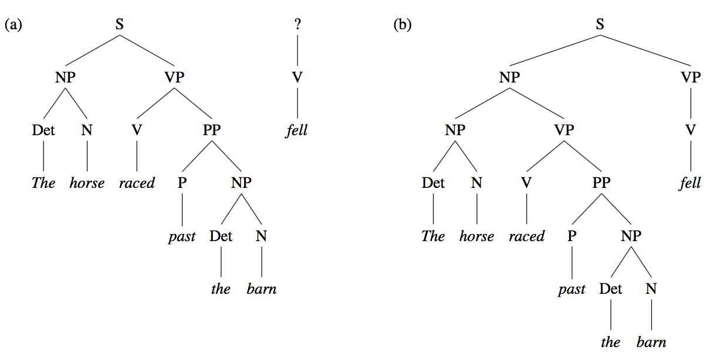

---

## Garden-path sentences

E.g. _The complex houses married and single students and their families._

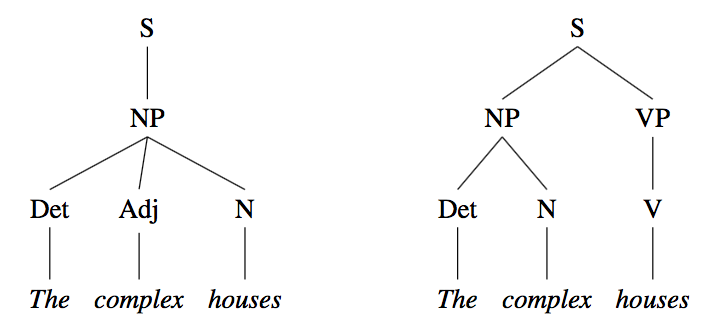


---

## Garden-path sentences

E.g. _The student forgot the solution was in the back of the book._

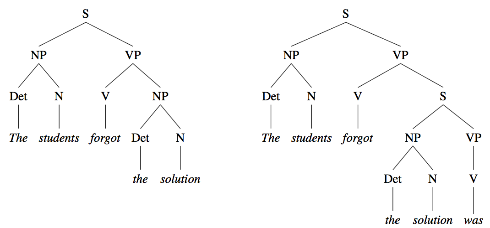


---

## Ambiguity

+ POS ambiguity and POS disambiguation

  + _E.g. book that flight_

  + POS ambiguity in the Brown and WSJ corpora

  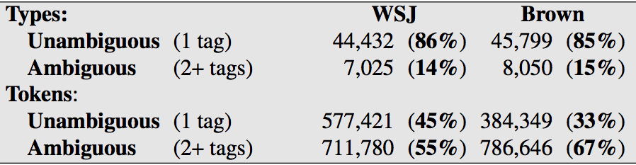

---

.left-column-2[
## Ambiguity

+ Structural ambiguity

  + Attachment ambiguity

  .smaller[
  E.g. _I shot an elephant in my pajamas._
  ]

  + Coordination ambiguity

  .smaller[
  E.g. _dogs in houses and cats_
  ]
  ]

.right-column-2[

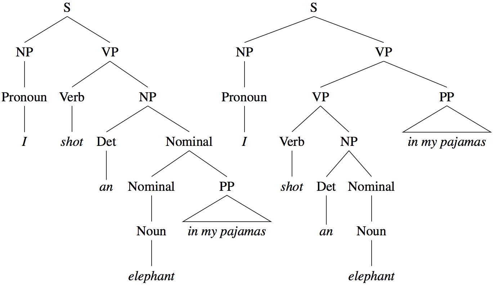

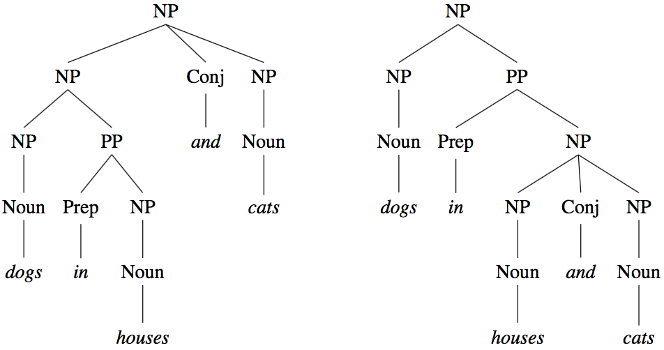

]
---

## Probabilistic context-free grammars (PCFG)

+ A natural extension to context-free grammars

+ Proposed by Booth (1969)

+ Aka: Stochastic context-free grammar (SCFG)

+ A context-free grammar G is defined by four parameters (N, S, Σ, R)

> _N_: a set of non-terminal symbols;<br>
> _S_: a designated start symbol;<br>
> _Σ_: a set of terminal symbols;<br>
> _R_: a set of rewrite rules of the form <font color="red">$A \rightarrow β \enspace [p]$</font><br>
&nbsp;&nbsp;&nbsp;&nbsp;&nbsp;where _A_ is a non-terminal,<br>
&nbsp;&nbsp;&nbsp;&nbsp;&nbsp;_β_ is a string of elements from the infinite set _(Σ ∪ N)*_,<br>
&nbsp;&nbsp;&nbsp;&nbsp;&nbsp;_p_ is a number between 0 and 1 expressing _P(β|A)_, .smaller[$\sum_{β}P(A \rightarrow β) = 1$]

???
All the possible expansions of a non-terminal probabilities must be 1.

---
.left-column-3[
## A toy PCFG

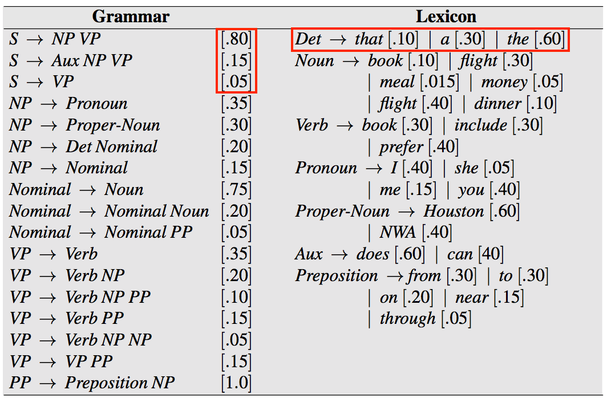

]

.right-column-3[
<br><br><br><br>
How are PCFGs used?

Assign a probability to each parse tree T of a sentence S

<br><br><br>
.smaller[
$$A \rightarrow β \enspace [p]$$
$$\sum_{β}P(A \rightarrow β) = 1$$
]
]

???
These probabilities were made up for pedagogical purposes and are not based on a corpus (since any real corpus would have many more rules, so the true probabilities of each rule would be much smaller).

---
.left-column-2[
## PCFGs for disambiguation

+ Disambiguation algorithm

> Selecting the parse with <br>
the highest PCFG probability

<br>
E.g. _Book the dinner flight_

$P(T|S) = \prod\_{i=1}^nP(RHS\_i|LHS\_{i})$

$P(T|S) = P(T)P(S|T) = P(T)$

<br>
+ Formalization of this algorithm
]

.right-column-2[
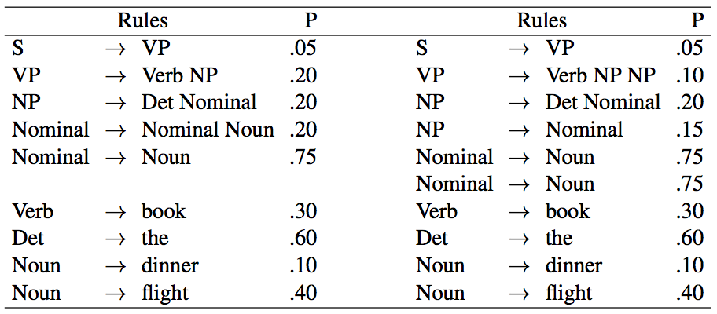
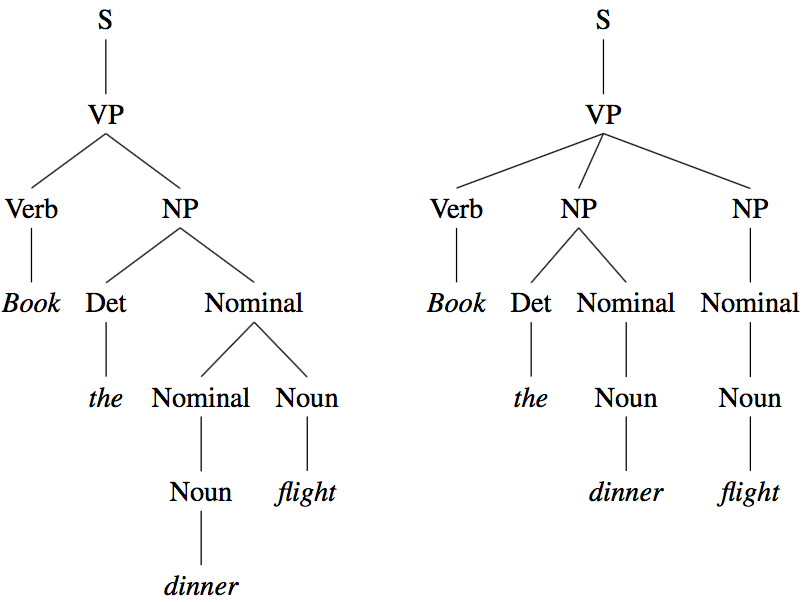

]

---

## Learn PCFG rule probabilities with a non-probabilistic parser

+ If sentences were unambiguous, increment a counter for every rule in the parse, and then normalize to get probabilities. (Not very probable!)

+ If sentences are ambiguous, use the inside-outside algorithm.

---

## Learn PCFG rule probabilities with a treebank

+ Treebank: a syntactically annotated corpus

+ Annotation: automatic parsers + human correction

+ Treebanks in use
    + Penn Treebank project
        + Treebanks for English (the Brown, Switchboard, ATIS, WSJ corpora)
        + Treebanks for Arabic and Chinese

    + Other treebanks
        + The Sinica Treebank Corpus for Chinese
        + The Prague Dependency Treebank for Czech,
        + The Negra Treebank for German
        + The Susanne Treebank for English

---
## Accessing treebanks

```
from nltk.corpus import treebank
t = treebank.parsed_sents('wsj_0001.mrg')[0]
print(t)
```

Or

```
import nltk
print(nltk.corpus.treebank.parsed_sents('wsj_0001.mrg')[0])
```

And

```
nltk.corpus.sinica_treebank.parsed_sents()[3450].draw()
```
---
## Treebanks as implicit grammars

Given a treebank, compute the probability of each expansion of a non-terminal by counting the number of times that expansion occurs in the treebank and then normalizing.

<br>
$$P(\alpha\to\beta|\alpha)=\frac{Count(\alpha\to\beta)}{\sum_{\gamma}Count(\alpha\to\gamma)}=\frac{Count(\alpha\to\beta)}{Count(\alpha)}$$

---

## Constructing and manipulating PCFGs


```
nltk.grammar.pcfg_demo()
```

<br>
More detailed instructions at

https://www.cs.bgu.ac.il/~elhadad/nlp16/NLTK-PCFG.html


???
The function illustrates how PCFGs can be constructed and manipulated.

---

## Problems with PCFGs

+ Lack of sensitivity to structural/contextual dependencies

  CFG independence assumption

  $NP \to DT \quad NN \quad 0.28$

  $NP \to PRP \quad 0.25$

&nbsp;&nbsp;&nbsp;&nbsp;| |Pronoun &nbsp;&nbsp; |Non-pronoun
-|-|-|-
|Subject &nbsp;&nbsp; |0.91|0.9
|Object|0.34|0.66

---

## Problems with PCFGs

+ Lack of sensitivity to lexical dependencies

  E.g. _Workers dumped sacks into a bin._

  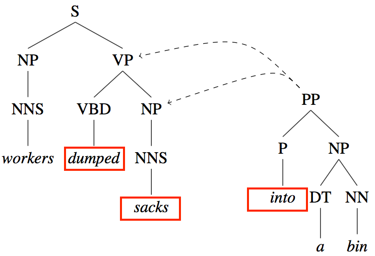

---

## Problems with PCFGs

+ Lack of sensitivity to lexical dependencies

  E.g. _dogs in houses and cats_

  

---

.left-column-2[
## Improving PCFGs

+ Lack of sensitivity to structural/contextual dependencies

  CFG independence assumption

  $NP \to DT \quad NN \quad 0.28$

  $NP \to PRP \quad 0.25$

&nbsp;&nbsp;&nbsp;&nbsp;| |Pronoun &nbsp;&nbsp; |Non-pronoun
-|-|-|-
|Subject &nbsp;&nbsp; |0.91|0.9
|Object|0.34|0.66
]

.right-column-4[
**Solution:<br>
Splitting non-terminals**

$NP_{subject} \to PRP$

$NP_{object} \to PRP$

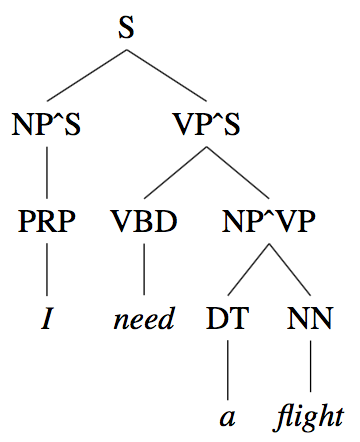
]

---

## Improving PCFGs

+ Lack of sensitivity to lexical dependencies

  E.g. _Workers dumped sacks into a bin._

  **Solution: Lexicalizing the rules**

  $VP \to VBD \enspace  NP \enspace  PP$

  $VP\_{(dumped)} \to VBD\_{(dumped)} \enspace NP\_{\(sacks\)} \enspace PP\_{\(into\)}$

  $VP\_{(dumped,VBD)} \to VBD\_{(dumped,VBD)} \enspace NP\_{\(sacks,NNS\)} \enspace PP\_{\(into,P\)}$

  <br>
  Lexicalized grammar, head tag

---
class: center, middle


---
## Constituency

+ Constituent-based language models vs. dependency-based language models

+ Abstraction: the fundamental notion underlying the idea of constituency

  + A group of words behaving as a single unit
  + A group of words appearing in similar syntactic environments

  E.g.<br>
  (1) _<font color="red">three parties from Brooklyn</font> arrive_ ...<br>
  (2) _<font color="red">a high-class spot such as Mindy’s</font>  attracts_ ...<br>
  (3) _<font color="red">the Broadway coppers</font> love_ ...<br>
  (4) _<font color="red">they</font> sit_ ...<br>

  (5) _<font color="red">On September seventeenth</font> , I’d like to fly from Atlanta to Denver_ <br>
  (6) _I’d like to fly <font color="red">on September seventeenth</font>  from Atlanta to Denver_ <br>
  (7) _I’d like to fly from Atlanta to Denver <font color="red">on September seventeenth</font>_ <br>

---

## Dependency parsing

Describing the syntactic structure of a sentence in terms of the constituting words (or lemmas) and an associated set of directed binary grammatical relations that hold among them.

<br>
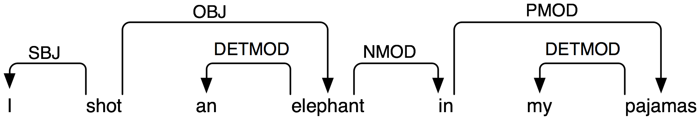

Arrows point from <font color="red">heads</font> to their <font color="red">dependents</font>.<br>
Labels indicate the <font color="red">grammatical functions</font> of the dependents.

---

## Dependency relations

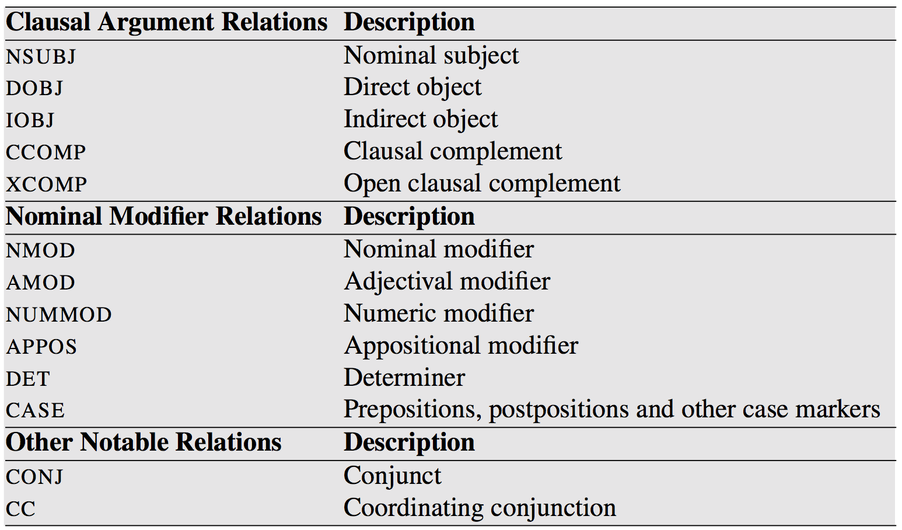
<br>
.smaller[Selected from the Universal Dependency set
]

---

.left-column-3[

## Dependency relations

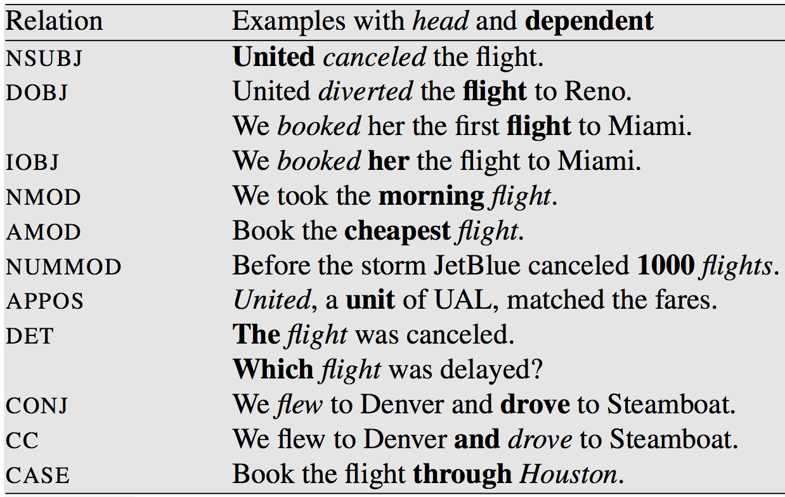
<br>
.smaller[
Examples of core Universal Dependency relations]
]

.right-column-3[
<br><br><br><br><br><br><br><br>

The Universal Dependencies project (Nivre et al., 2016)<br>
.smaller[provides an inventory of dependency relations that are linguistically motivated, computationally useful, and cross-linguistically applicable.]
]

---

## Dependency parsing algorithms

+ Transition-based dependency parsing

+ Graph-based dependency parsing

---

## Models and algorithms

+ Language models: correct parsing
  + Lexical-functional grammar
  + Head-driven phrase structure grammar
  + Link grammar
  + <font color="red">Dependency grammar</font>
  + <font color="red">Probabilistic context-free grammar</font>
  ...

+ Parsing algorithms: efficient parsing
  + CYK parsing (Cocke-Younger-Kasami algorithm, Chomsky Normal Form)
  + Earley parsing
  + Chart parsing
  + Left‐corner parsing
  + ATN parsing
  ...

---

## At the end of this session you will

+ reflect on how humans process sentences;

+ know about different kinds of ambiguities;

+ know how to describe a language using a probabilistic context-free grammar;

+ understand how treebanks present syntactic knowledge implicitly;

+ know about the problems with probabilistic context-free grammars and the possible solutions;

+ understand the difference between constituent-based language models and dependency-based language models

+ know how to describe a language using a dependency grammar.

---

##Assignment

**1. Review**

+ [J+M[3rd] 13](https://bxjthu.github.io/CompLing/readings/7_J+M[3rd]_13.pdf)
+ [J+M[3rd] 14](https://bxjthu.github.io/CompLing/readings/7_J+M[3rd]_14.pdf)

**2. Practice**

+ Learn to build your own CFG, PCFG, and DG to describe the structure of a limited set of sentences.
+ Learn to use your grammars, together with the nltk parsers, to analyze sentences and automatically build their syntax trees.

.smaller[
Reference:<br>
http://www.nltk.org/howto/parse.html<br>
http://www.nltk.org/book/ch08.html <br>
https://www.cs.bgu.ac.il/~elhadad/nlp16/NLTK-PCFG.html
]
---
class: center, middle
## Next session

Features and Unification, Language and Complexity
