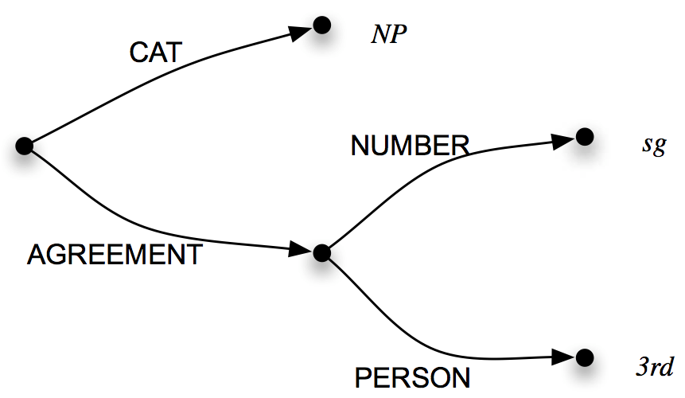
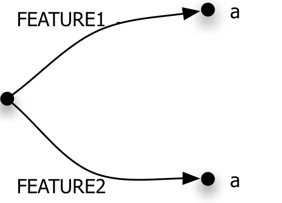
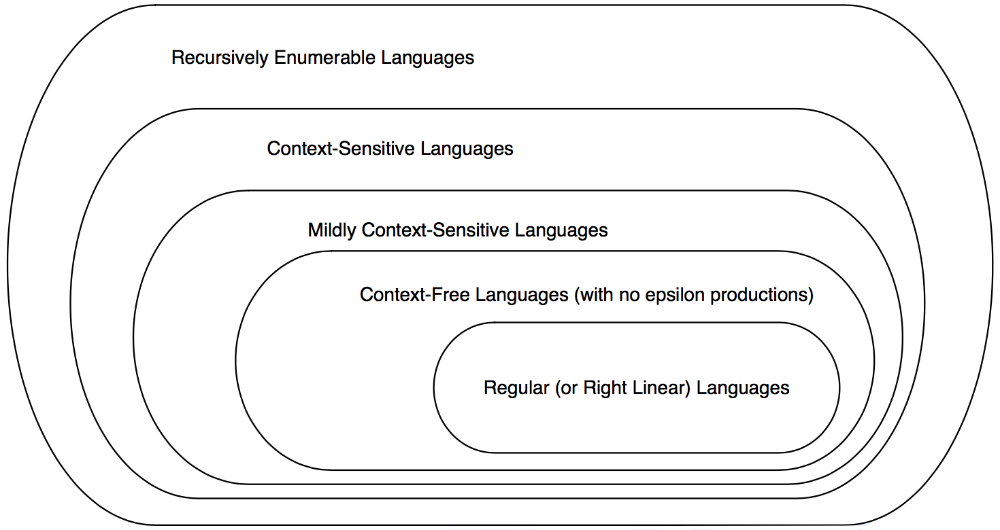
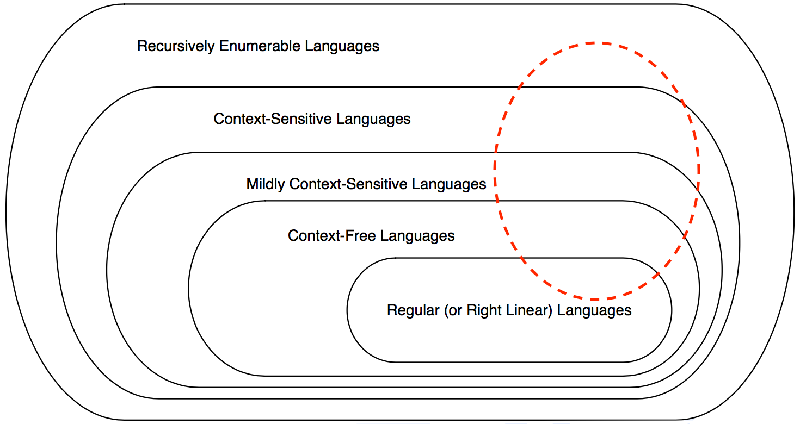

class: center, middle
# Computational Linguistics<br>
## 8. Features and Unification, Language and Complexity

** Xiaojing Bai **

** Tsinghua University **

** https://bxjthu.github.io/CompLing **

---

## At the end of this session you will

+ know about feature structures and their representations;

+ know how to unify feature structures and know when unification will fail;

+ know how to integrate feature structures into a context free grammar and understand the benefits of doing so;

+ know about the overloaded term ‘complexity’;

+ understand that algorithms may be classified by their time and space complexity;

+ know that formal grammars can be more or less complex as defined by their generative power.

---
.left-column-3[
## Problems with CFGs
]

.right-column-3[
<br><br>
.smaller[
|  |  
:--|:--|:--
S | $\to$ | NP VP
NP | $\to$ | N PP
NP | $\to$ | N
PP | $\to$ | P NP
VP | $\to$ | VP PP
VP | $\to$ | V VP
VP | $\to$ | V NP
VP | $\to$ | V
N | $\to$ | {it, fish, rivers, pools,
 |  | December, Scotland, they}
P | $\to$ | {in}
V | $\to$ | {can, fish}
]
]

---
.left-column-3[

## Problems with CFGs

**Agreement**
.smaller[
_they fish rivers_

? _it fish rivers_
]

**Sub-categorization**
.smaller[
_they can can it_

? _they fish fish it_
]

**Long distance dependency**
.smaller[
_which dress did you say [ ] looks better with those shoes_

_what gluten-free products does that new company sell [ ]_

? _what gluten free products does that new company sell cake_
]
]

.right-column-3[
<br><br>
.smaller[
|  |  
:--|:--|:--
S | $\to$ | NP VP
NP | $\to$ | N PP
NP | $\to$ | N
PP | $\to$ | P NP
VP | $\to$ | VP PP
VP | $\to$ | V VP
VP | $\to$ | V NP
VP | $\to$ | V
N | $\to$ | {it, fish, rivers, pools,
 |  | December, Scotland, they}
P | $\to$ | {in}
V | $\to$ | {can, fish}
]
]

---

## How to solve these problems?
.left-column-2[
.smaller[
|  |  
:--|:--|:--
S | $\to$ | NP VP
VP | $\to$ | V NP
NP | $\to$ | N
V | $\to$ | {can, fish}
N | $\to$ | {it, fish, rivers, pools, I, you,
 |  | December, Scotland, they}
]
]

---

## How to solve these problems?
.left-column-2[
.smaller[
|  |  
:--|:--|:--
<font color="red">S</font> | <font color="red">$\to$</font> | <font color="red">NP VP</font>
VP | $\to$ | V NP
NP | $\to$ | N
V | $\to$ | {can, fish}
N | $\to$ | {it, fish, rivers, pools, I, you,
 |  | December, Scotland, they}
]
]

.right-column-2[
.smaller[
|  |  
:--|:--|:--
S | $\to$ | NP$\_{1st2ndsing}$ VP$\_{1st2ndsing}$
S | $\to$ | NP$\_{3rdsing}$ VP$\_{3rdsing}$
S | $\to$ | NP$\_{plural}$ VP$\_{plural}$
]
]

---

## How to solve these problems?
.left-column-2[
.smaller[
|  |  
:--|:--|:--
S | $\to$ | NP VP
<font color="red">VP</font> | <font color="red">$\to$</font> | <font color="red">V NP</font>
NP | $\to$ | N
V | $\to$ | {can, fish}
N | $\to$ | {it, fish, rivers, pools, I, you,
 |  | December, Scotland, they}
]
]

.right-column-2[
.smaller[
|  |  
:--|:--|:--
VP$\_{1st2ndsing}$ | $\to$ | V$\_{1st2ndsing}$ NP$\_{1st2ndsing}$
VP$\_{1st2ndsing}$ | $\to$ | V$\_{1st2ndsing}$ NP$\_{3rdsing}$
VP$\_{1st2ndsing}$ | $\to$ | V$\_{1st2ndsing}$ NP$\_{plural}$
 &nbsp;|  |  
VP$\_{3rdsing}$ | $\to$ | V$\_{3rdsing}$ NP$\_{1st2ndsing}$
VP$\_{3rdsing}$ | $\to$ | V$\_{3rdsing}$ NP$\_{3rdsing}$
VP$\_{3rdsing}$ | $\to$ | V$\_{3rdsing}$ NP$\_{plural}$
 &nbsp;|  |  
VP$\_{plural}$ | $\to$ | V$\_{plural}$ NP$\_{1st2ndsing}$
VP$\_{plural}$ | $\to$ | V$\_{plural}$ NP$\_{3rdsing}$
VP$\_{plural}$ | $\to$ | V$\_{plural}$ NP$\_{plural}$
]
]

---

## How to solve these problems?
.left-column-2[
.smaller[
|  |  
:--|:--|:--
S | $\to$ | NP VP
VP | $\to$ | V NP
<font color="red">NP</font> | <font color="red">$\to$</font> | <font color="red">N</font>
V | $\to$ | {can, fish}
N | $\to$ | {it, fish, rivers, pools, I, you,
 |  | December, Scotland, they}
]
]

.right-column-2[
.smaller[
|  |  
:--|:--|:--
NP$\_{1st2ndsing}$ | $\to$ | N$\_{1st2ndsing}$
NP$\_{3rdsing}$ | $\to$ | N$\_{3rdsing}$
NP$\_{plural}$ | $\to$ | N$\_{plural}$
]
]

---

## How to solve these problems?
.left-column-2[
.smaller[
|  |  
:--|:--|:--
S | $\to$ | NP VP
VP | $\to$ | V NP
NP| $\to$ | N
<font color="red">V</font>  | <font color="red">$\to$</font>  | <font color="red">{can, fish}</font>
<font color="red">N</font>  | <font color="red">$\to$</font>  | <font color="red">{it, fish, rivers, pools, I, you, </font>
 |  | <font color="red">December, Scotland, they}<font color="red"></font>
]
]

.right-column-2[
.smaller[
|  |  
:--|:--|:--
N$\_{1st2ndsing}$ | $\to$ | {I, you}
N$\_{3rdsing}$ | $\to$ | {it, December, Scotland}
N$\_{plural}$ | $\to$ | {fish, rivers, pools, they}
 &nbsp;|  |  
V$\_{1st2ndsing}$ | $\to$ | {fish, can}
V$\_{3rdsing}$ | $\to$ | {fishes, cans, can}
V$\_{plural}$ | $\to$ | {fish, can}

]
]

---
.left-column-3[

## Problems with CFGs

**Agreement**
.smaller[
_they fish rivers_

? _it fish rivers_
]

**Sub-categorization**
.smaller[
_they can can it_

? _they fish fish it_
]

**Long distance dependency**
.smaller[
_which dress did you say [ ] looks better with those shoes_

_what gluten-free products does that new company sell [ ]_

? _what gluten free products does that new company sell cake_
]
]

.right-column-3[
<br><br>
.smaller[
|  |  
:--|:--|:--
S | $\to$ | NP VP
NP | $\to$ | N PP
NP | $\to$ | N
PP | $\to$ | P NP
VP | $\to$ | VP PP
VP | $\to$ | V VP
VP | $\to$ | V NP
VP | $\to$ | V
N | $\to$ | {it, fish, rivers, pools,
 |  | December, Scotland, they}
P | $\to$ | {in}
V | $\to$ | {can, fish}
]
]

---

## Grammar formalisms

+ Constituent-based language models
+ Dependency-based language models


+ Constraint-based language models

  A more fine-grained way of <br>
  representing and placing constraints <br>
  on grammatical categories

---

## A feature structure represented by an attribute-value matrix

.smaller[

$
\left[
\begin{array}{ll}
\textrm{FEATURE}_1 & value_1 \\\
\textrm{FEATURE}_2 & value_2 \\\
... & ... \\\
\textrm{FEATURE}_n & value_n
\end{array}
\right]
$

<br><br>
$
\left[
\begin{array}{ll}
\textrm{CAT} & NP \\\
\textrm{NUMBER} & sing \\\
\textrm{PERSON} & 3rd
\end{array}
\right]
$

<br>
$
\left[
\begin{array}{ll}
\textrm{CAT} & NP \\\
\textrm{AGREEMENT} & \left[ \begin{array}{ll}
\textrm{NUMBER} & sing \\\
\textrm{PERSON} & 3rd
\end{array}
\right]
\end{array}
\right]
$

]

---

## A feature structure represented by a directed acyclic graph

.left-column-2[

+ Features as labeled edges

+ Values as nodes

+ Feature path

  A sequence of features through<br> a feature structure leading to a particular value

.smaller[
> The < AGREEMENT NUMBER > path

> The < AGREEMENT PERSON > path
]  
]
.right-column-2[

<br>


.smaller[
<br>
$
\left[
\begin{array}{ll}
\textrm{CAT} & NP \\\
\textrm{AGREEMENT} & \left[ \begin{array}{ll}
\textrm{NUMBER} & sing \\\
\textrm{PERSON} & 3rd
\end{array}
\right]
\end{array}
\right]
$
]
]
---

## Reentrancy and reentrant structures

Reentrancy: A feature structure occurs more than once in an enclosing feature structure, i.e. there are two or more feature paths of reaching the same node in the directed acyclic graph.

.left-column-2[
+ Non-reentrant
.smaller[
$
\left[
\begin{array}{ll}
\textrm{FEATURE}_1 & a \\\
\textrm{FEATURE}_2 & a
\end{array}
\right]
$
]

+ Reentrant
.smaller[
$
\left[
\begin{array}{ll}
\textrm{FEATURE}_1 & [1]a \\\
\textrm{FEATURE}_2 & [1]
\end{array}
\right]
$
]
]
.right-column-2[

]
---

## Reentrancy and reentrant structures

.smaller[
$
\left[
\begin{array}{ll}
\textrm{CAT} & S \\\\[3ex]
\textrm{HEAD} &
\left[
\begin{array}{ll}
\textrm{AGREEMENT} & [1]
\left[
\begin{array}{ll}
\textrm{NUMBER} & sing \\\
\textrm{PERSON} & 3rd
\end{array}
\right] \\\ \[3ex]
\textrm{SUBJECT} &
\left[
\begin{array}{ll}
\textrm{AGREEMENT} & [1]
\end{array}
\right]
\end{array}
\right]
\end{array}
\right]
$
]

<br>


---
## Unification of feature structures

+ A merger of the original two structures into one larger structure

+ A union of all the information stored in each of the original structures

+ Compatibility

.smaller[

$
\left[
\begin{array}{ll}
\textrm{NUMBER} & sing
\end{array}
\right]
\sqcup
\left[
\begin{array}{ll}
\textrm{NUMBER} & sing
\end{array}
\right]
=
\left[
\begin{array}{ll}
\textrm{NUMBER} & sing
\end{array}
\right]
$

$
\left[
\begin{array}{ll}
\textrm{NUMBER} & sing
\end{array}
\right]
\sqcup
\left[
\begin{array}{ll}
\textrm{NUMBER} & plural
\end{array}
\right]
Fails!
$

$
\left[
\begin{array}{ll}
\textrm{NUMBER} & sing
\end{array}
\right]
\sqcup
\left[
\begin{array}{ll}
\textrm{NUMBER} & [\\,]
\end{array}
\right]
=
\left[
\begin{array}{ll}
\textrm{NUMBER} & sing
\end{array}
\right]
$

$
\left[
\begin{array}{ll}
\textrm{NUMBER} & sing
\end{array}
\right]
\sqcup
\left[
\begin{array}{ll}
\textrm{PERSON} & 3rd
\end{array}
\right]
=
\left[
\begin{array}{ll}
\textrm{NUMBER} & sing \\\
\textrm{PERSON} & 3rd
\end{array}
\right]
$
]

---

## Unification of reentrant feature structures

.smaller[
$
\left[
\begin{array}{ll}
\textrm{AGREEMENT} & [1]
\left[
\begin{array}{ll}
\textrm{NUMBER} & sing \\\
\textrm{PERSON} & 3rd
\end{array}
\right] \\\ \[3ex]
\textrm{SUBJECT} &
\left[
\begin{array}{ll}
\textrm{AGREEMENT} & [1]
\end{array}
\right]
\end{array}
\right]
$

<br>
$
\sqcup
\left[
\begin{array}{ll}
\textrm{SUBJECT} &
\left[
\begin{array}{ll}
\textrm{AGREEMENT} &
\left[
\begin{array}{ll}
\textrm{PERSON} & 3rd \\\
\textrm{NUMBER} & sing
\end{array}
\right]
\end{array}
\right]
\end{array}
\right]
$

<br>
$
=
\left[
\begin{array}{ll}
\textrm{AGREEMENT} & [1]
\left[
\begin{array}{ll}
\textrm{NUMBER} & sing \\\
\textrm{PERSON} & 3rd
\end{array}
\right] \\\ \[3ex]
\textrm{SUBJECT} &
\left[
\begin{array}{ll}
\textrm{AGREEMENT} & [1]
\end{array}
\right]
\end{array}
\right]
$
]

---

## Unification of reentrant feature structures

.smaller[
$
\left[
\begin{array}{ll}
\textrm{AGREEMENT} & [1]\\\
\textrm{SUBJECT} &
\left[
\begin{array}{ll}
\textrm{AGREEMENT} & [1]
\end{array}
\right]
\end{array}
\right]
$

<br>
$
\sqcup
\left[
\begin{array}{ll}
\textrm{SUBJECT} &
\left[
\begin{array}{ll}
\textrm{AGREEMENT} &
\left[
\begin{array}{ll}
\textrm{PERSON} & 3rd \\\
\textrm{NUMBER} & sing
\end{array}
\right]
\end{array}
\right]
\end{array}
\right]
$

<br>
$
=
\left[
\begin{array}{ll}
\textrm{AGREEMENT} & [1]\\\
\textrm{SUBJECT} &
\left[
\begin{array}{ll}
\textrm{AGREEMENT} & [1]
\left[
\begin{array}{ll}
\textrm{PERSON} & 3rd \\\
\textrm{NUMBER} & sing
\end{array}
\right]
\end{array}
\right]
\end{array}
\right]
$
]

---

## Unification of non-reentrant feature structures

.smaller[

$
\left[
\begin{array}{ll}
\textrm{AGREEMENT} &
\left[
\begin{array}{ll}
\textrm{NUMBER} & sing
\end{array}
\right] \\\ \[3ex]
\textrm{SUBJECT} &
\left[
\begin{array}{ll}
\textrm{AGREEMENT} &
\left[
\begin{array}{ll}
\textrm{NUMBER} & sing
\end{array}
\right]
\end{array}
\right]
\end{array}
\right]
$

<br>
$
\sqcup
\left[
\begin{array}{ll}
\textrm{SUBJECT} &
\left[
\begin{array}{ll}
\textrm{AGREEMENT} &
\left[
\begin{array}{ll}
\textrm{PERSON} & 3rd \\\
\textrm{NUMBER} & sing
\end{array}
\right]
\end{array}
\right]
\end{array}
\right]
$

<br>
$
=
\left[
\begin{array}{ll}
\textrm{AGREEMENT} &
\left[
\begin{array}{ll}
\textrm{NUMBER} & sing
\end{array}
\right] \\\ \[3ex]
\textrm{SUBJECT} &
\left[
\begin{array}{ll}
\textrm{AGREEMENT} &
\left[
\begin{array}{ll}
\textrm{PERSON} & 3rd \\\
\textrm{NUMBER} & sing
\end{array}
\right]
\end{array}
\right]
\end{array}
\right]
$
]

---

## Failed unification of feature structures

.smaller[
$
\left[
\begin{array}{ll}
\textrm{AGREEMENT} & [1]
\left[
\begin{array}{ll}
\textrm{NUMBER} & sing \\\
\textrm{PERSON} & 3rd
\end{array}
\right] \\\ \[3ex]
\textrm{SUBJECT} &
\left[
\begin{array}{ll}
\textrm{AGREEMENT} & [1]
\end{array}
\right]
\end{array}
\right]
$

<br>
$
\sqcup
\left[
\begin{array}{ll}
\textrm{AGREEMENT} &
\left[
\begin{array}{ll}
\textrm{NUMBER} & sing \\\
\textrm{PERSON} & 3rd
\end{array}
\right] \\\ \[3ex]
\textrm{SUBJECT} &
\left[
\begin{array}{ll}
\textrm{AGREEMENT} &
\left[
\begin{array}{ll}
\textrm{NUMBER} & plural \\\
\textrm{PERSON} & 3rd
\end{array}
\right]
\end{array}
\right]
\end{array}
\right]
$
]

Fails!

---

## Feature structures in the grammar

Augmenting the ordinary CFGs rules with attachments that specify feature structures for the constituents of the rules, along with appropriate unification operations that express <font color="red">constraints</font> on those constituents.

.smaller[
|  |  
:--|:--|:--
$\beta_0$ | $\to$ | $\beta_1 ... \beta_n$
| |_{set of constraints}_
&nbsp; | |
| |< $\beta_i$ feature path > = atomic value
| |< $\beta_i$ feature path > = < $\beta_j$ feature path >
&nbsp; | |
S | $\to$ | NP VP
| |< NP NUMBER > = < VP NUMBER >
]

---
## Application: agreement

.smaller[
[1] _This flight serves breakfast._<br>
[2] _Does this flight serve breakfast?_<br>
[3] _Do these flights serve breakfast?_

.left-column-2[
|  |  
:--|:--|:--
S | $\to$ | NP VP
| |< NP AGREEMENT > = < VP AGREEMENT >
&nbsp; | |
NP | $\to$ | Det Nominal
| |< Det AGREEMENT > = < Nominal AGREEMENT >
| |< NP AGREEMENT > = < Nominal AGREEMENT >
&nbsp; | |
Aux | $\to$ | do
| |< Aux AGREEMENT NUMBER > = _plural_
| |< Aux AGREEMENT PERSON > = _3rd_
]
.right-column-2[
|  |  
:--|:--|:--
S | $\to$ | Aux NP VP
| |< Aux AGREEMENT > = < NP AGREEMENT >
&nbsp; | |
&nbsp; | |
&nbsp; | |
&nbsp; | |
&nbsp; | |
Aux | $\to$ | does
| |< Aux AGREEMENT NUMBER > = _sing_
| |< Aux AGREEMENT PERSON > = _3rd_
]
]

---
## Application: head features

.smaller[
|  |  
:--|:--|:--
VP | $\to$ | Verb NP
| |< VP AGREEMENT > = < Verb AGREEMENT >
VP | $\to$ | Verb NP
| |< VP HEAD > = < Verb HEAD >
NP | $\to$ | Det Nominal
| |< Det AGREEMENT > = < Nominal AGREEMENT >
| |< NP AGREEMENT > = < Nominal AGREEMENT >
NP | $\to$ | Det Nominal
| |< Det HEAD AGREEMENT > = < Nominal HEAD AGREEMENT >
| |< NP HEAD > = < Nominal HEAD >
Nominal | $\to$ | Noun
| |< Nominal AGREEMENT > = < Noun AGREEMENT >
Nominal | $\to$ | Noun
| |< Nominal HEAD > = < Noun HEAD >
Noun | $\to$ | _flights_
| |< Noun HEAD AGREEMENT NUMBER > = _plural_
]

---
## Application: subcategorization

## Application: long-distance dependencies

## Building Feature Based Grammars
http://www.nltk.org/book/ch09.html
---

## Complexity: an overloaded term

It may refer to:

+ the computational ‘expense’ of an algorithm;

+ the generative power of a grammar; or

+ the human processing difficulty of a sentence.

---

## The complexity of algorithms

Comparing the efficiency of algorithms: how will they behave in the worst case?

Two particular measures:

1. the amount of <font color="red">time</font> it takes for the algorithm to run to completion;

2. the amount of <font color="red">space</font> (computer memory) it will take to hold the instructions that are waiting to be executed while the algorithm is running.

---

## The time complexity of algorithms

Scenario 1: How many items are on my 11.11 shopping list?

.left-column-1[

```
*  + 旺仔大礼包
*  + Thermos保温杯
*  + 森田面膜
*  + 欧莱雅卸妆水
*  + 沃隆每日坚果
*  + 良品铺子猪肉脯
```
]
.right-column-1[
.smaller[

<br>
> **The counting algorithm**

> + Start with a count of zero item;

> + While there are items left to count:

>   + Point to the next item on the list; [0.25s for each]

>   + Increase the count by 1. [0.25s for each]

> **The time cost of the algorithm**: $0.5n$ seconds
]
]
---

## The time complexity of algorithms

Scenario 2: How many items are on the following two shopping lists?

.left-column-1[

```
*  + 旺仔大礼包
*  + Thermos保温杯
*  + 森田面膜
*  + 欧莱雅卸妆水
*  + 沃隆每日坚果
*  + 良品铺子猪肉脯
```

```
*  + MacBook VGA转接头
*  + 中国哲学简史
*  + 旺仔大礼包
*  + 沙宣洗护套装
*  + 云南白药牙膏
*  + 良品铺子猪肉脯
```
]
.right-column-1[
.smaller[

<br>
> **The condensing algorithm**

> + Start with a count of 6 items;

> + While there are items left my friend's list:

>   + Point to the next item on my friend's list; [0.25s for each]

>   + Compare the current item on my friend's list to all the items on my original list; if no match is found, then add the current item to my list and increase the count by 1. [0.5s for each]

> **The time cost of the algorithm**: $0.25n + 0.5n^2$ seconds
]
]

---

## The time complexity of algorithms

Big O notation of time complexity (or asymptotic complexity)

In computer science, big O notation is used to classify algorithms according to how their running time or space requirements grow as the input size grows.

+ The counting algorithm: a time complexity of $O(n)$

+ The condensing algorithm: a time complexity of $O(n^2)$

.smaller[
Notes: The time cost of an algorithm is usually a complicated formula. We are only interested in the most significant term when stating its order, which means the term involving the highest exponent of $n$.
]

+ An algorithm with a time complexity of $O(c^n)$, where $c$ is a constant, is said to be intractable.

---

.left-column-2[
## Recap: An example

.smaller[
E.g. Janet will back the bill
]


.smaller[
Janet/NNP&nbsp;&nbsp; will/MD&nbsp;&nbsp; back/VB&nbsp;&nbsp; the/DT&nbsp;&nbsp; bill/NN
]
]

.right-column-2[
**Viterbi algorithm**

+ Andrew Viterbi, 1967

+ A dynamic programming algorithm

+ Maximize the probabilities

+ Find the most likely sequence of tags

+ Algorithm: exponential complexity

  With a tagset of N tags, for a sequence of M words, there are, in the worse case, <font color="red"> $N^M$ </font> possible paths.

+ Efficiency: <font color="red"> $N^M$ </font> vs. <font color="red"> $N^2 \times M$ </font>

]
---

## The space complexity of algorithms

The stack memory: Stacks in computing architectures are regions of memory where data is added or removed in a last-in-first-out (LIFO) manner.
.left-column-4[
Named after the plate-stacking devices

+ Pushing: placing an item on the stack
+ Popping: removing an item off the stack

The counting/condensing algorithm:

+ a space complexity of $O(1)$ .smaller[stack depth = 1]
+ a space complexity of $O(n)$ .smaller[stack depth = n]

]

.right-column-4[

]
---

## The complexity of a grammar

+ The complexity of the most efficient algorithm to decide whether a string belongs to a regular language is $O(n)$, where $n$ is the length of the string.


+ The complexity of many algorithms to decide whether a string belongs to a context-free language is $O(n^a)$, where $a$ is a whole number. The algorithms are therefore tractable.

---

## Chomsky hierarchy

+ A theoretical tool to compare the generative power or complexity of formal mechanisms

+ A theoretical tool to better understand human parsing: What makes individual constructions or sentences hard to understand?

**Generative power**

+ One grammar is of greater generative power than another if it can define a language that the other cannot define.

+ The set of languages describable by grammars of greater power <font color="red">subsumes</font> the set of languages describable by grammars of lesser power.

---

## Chomsky hierarchy



---

## Chomsky hierarchy

.smaller[
Type &nbsp;&nbsp;&nbsp;&nbsp;| Language | Rule | Complexity | Automaton
-|:-|:-|:- |:-
0| Recursively Enumerable &nbsp;&nbsp;&nbsp;&nbsp;&nbsp;&nbsp;| $ \alpha \to \beta $ (where $ \alpha \not = \epsilon$) | Intractable | Turing machine
1| Context-Sensitive | $ \alpha A \beta \to \alpha \gamma \beta $ (where $ \gamma \not = \epsilon$) &nbsp;&nbsp;&nbsp;&nbsp;&nbsp;&nbsp; | $ O(c^n) $, intractable &nbsp;&nbsp;&nbsp;&nbsp;| Linear-bounded
-| Mildly Context-Sensitive |
2| Context-Free | $ A \to \gamma $ | $ O(n^a) $, polynomial | Push downs s
3| Regular | $ A \to xB $ and $ A \to x $ | $ O(n) $, linear | 	Finite state


.left-column-2[
**Meaning of symbols:**<br>
$x$: terminal<br>
$A$ and $B$: non-terminal<br>
$\alpha$ and $\beta$: terminal, non-terminal, or empty<br>
$\gamma$: terminal or non-terminal
]
.right-column-2[


]
]

---

## Chomsky hierarchy

+ Is some part of natural language representable by a certain class of grammars?

+ Which type of rules can be used to write computational grammars for this part of natural language?

+ Which type of automata can be used to process the rules?

+ Where does a language keeps its complexity?
]

---

## Chomsky hierarchy


---

## At the end of this session you will

+ know about feature structures and their representations;

+ know how to unify feature structures and know when unification will fail;

+ know how to integrate feature structures into a context free grammar and understand the benefits of doing so;

+ know about the overloaded term ‘complexity’;

+ understand that algorithms may be classified by their time and space complexity;

+ know that formal grammars can be more or less complex as defined by their generative power.

---

##Assignment
???
**1. Review**

+ [J+M[3rd] 13](https://bxjthu.github.io/CompLing/readings/7_J+M[3rd]_13.pdf)
+ [J+M[3rd] 14](https://bxjthu.github.io/CompLing/readings/7_J+M[3rd]_14.pdf)

**2. Practice**

+ Learn to build your own CFG, PCFG, and DG to describe the structure of a limited set of sentences.
+ Learn to use your grammars, together with the nltk parsers, to analyze sentences and automatically build their syntax trees.

Reference:<br>
http://www.nltk.org/book/ch08.html <br>
https://www.cs.bgu.ac.il/~elhadad/nlp16/NLTK-PCFG.html

---
class: center, middle
## Next session

Meaning Representation and Vector Semantics
