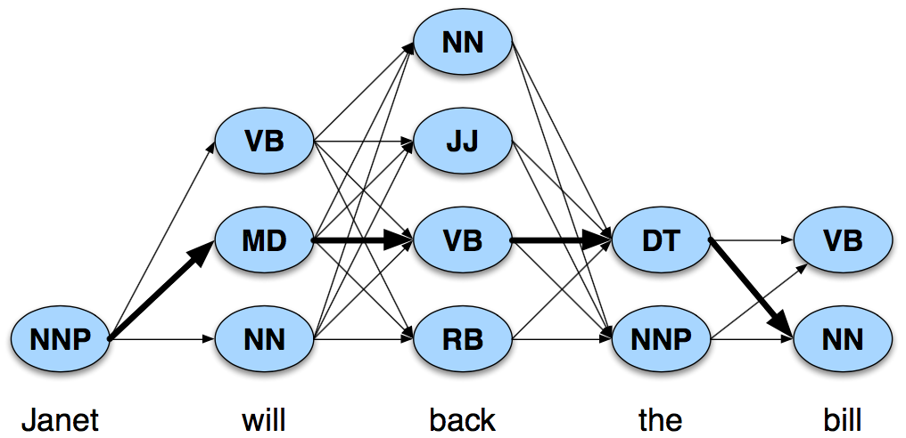

class: center, middle
# Computational Linguistics<br>
## 8. Features and Unification, Language and Complexity

** Xiaojing Bai **

** Tsinghua University **

** https://bxjthu.github.io/CompLing **

---

Evaluation

---

## Complexity: an overloaded term

It may refer to:

+ the computational ‘expense’ of an algorithm;

+ the generative power of a grammar; or

+ the human processing difficulty of a sentence.

---

## The complexity of algorithms

Comparing the efficiency of algorithms: how will they behave in the worst case?

Two particular measures:

1. the amount of <font color="red">time</font> it takes for the algorithm to run to completion;

2. the amount of <font color="red">space</font> (computer memory) it will take to hold the instructions that are waiting to be executed while the algorithm is running.

---

## The time complexity of algorithms

Scenario 1: How many items are on my 11.11 shopping list?

.left-column-1[

```
*  + 旺仔大礼包
*  + Thermos保温杯
*  + 森田面膜
*  + 欧莱雅卸妆水
*  + 沃隆每日坚果
*  + 良品铺子猪肉脯
```
]
.right-column-1[
.smaller[

<br>
> **The counting algorithm**

> + Start with a count of zero item;

> + While there are items left to count:

>   + Point to the next item on the list; [0.25s for each]

>   + Increase the count by 1. [0.25s for each]

> **The time cost of the algorithm**: $0.5n$ seconds
]
]
---

## The time complexity of algorithms

Scenario 2: How many items are on the following two shopping lists?

.left-column-1[

```
*  + 旺仔大礼包
*  + Thermos保温杯
*  + 森田面膜
*  + 欧莱雅卸妆水
*  + 沃隆每日坚果
*  + 良品铺子猪肉脯
```

```
*  + MacBook VGA转接头
*  + 中国哲学简史
*  + 旺仔大礼包
*  + 沙宣洗护套装
*  + 云南白药牙膏
*  + 良品铺子猪肉脯
```
]
.right-column-1[
.smaller[

<br>
> **The condensing algorithm**

> + Start with a count of 6 items;

> + While there are items left my friend's list:

>   + Point to the next item on my friend's list; [0.25s for each]

>   + Compare the current item on my friend's list to all the items on my original list; if no match is found, then add the current item to my list and increase the count by 1. [0.5s for each]

> **The time cost of the algorithm**: $0.25n + 0.5n^2$ seconds
]
]

---

## The time complexity of algorithms

Big O notation of time complexity (or asymptotic complexity)

In computer science, big O notation is used to classify algorithms according to how their running time or space requirements grow as the input size grows.

+ The counting algorithm: a time complexity of $O(n)$

+ The condensing algorithm: a time complexity of $O(n^2)$

.smaller[
Notes: The time cost of an algorithm is usually a complicated formula. We are only interested in the most significant term when stating its order, which means the term involving the highest exponent of $n$.
]

+ An algorithm with a time complexity of $O(c^n)$, where $c$ is a constant, is said to be intractable.

---

.left-column-2[
## Recap: An example

.smaller[
E.g. Janet will back the bill
]


.smaller[
Janet/NNP&nbsp;&nbsp; will/MD&nbsp;&nbsp; back/VB&nbsp;&nbsp; the/DT&nbsp;&nbsp; bill/NN
]
]

.right-column-2[
**Viterbi algorithm**

+ Andrew Viterbi, 1967

+ A dynamic programming algorithm

+ Maximize the probabilities

+ Find the most likely sequence of tags

+ Algorithm: exponential complexity

  With a tagset of N tags, for a sequence of M words, there are, in the worse case, <font color="red"> $N^M$ </font> possible paths.

+ Efficiency: <font color="red"> $N^M$ </font> vs. <font color="red"> $N^2 \times M$ </font>

]
---

## The space complexity of algorithms

The stack memory: Stacks in computing architectures are regions of memory where data is added or removed in a last-in-first-out (LIFO) manner.
.left-column-4[
Named after the plate-stacking devices

+ Pushing: placing an item on the stack
+ Popping: removing an item off the stack

The counting/condensing algorithm:

+ a space complexity of $O(1)$ .smaller[stack depth = 1]
+ a space complexity of $O(n)$ .smaller[stack depth = n]

]

.right-column-4[

]
---

## The complexity of a grammar

+ The complexity of the most efficient algorithm to decide whether a string belongs to a regular language is $O(n)$, where $n$ is the length of the string.


+ The complexity of many algorithms to decide whether a string belongs to a context-free language is $O(n^a)$, where $a$ is a whole number. The algorithms are therefore tractable.

---

## Chomsky hierarchy

+ A theoretical tool to compare the generative power or complexity of formal mechanisms

+ A theoretical tool to better understand human parsing: What makes individual constructions or sentences hard to understand?

**Generative power**

+ One grammar is of greater generative power than another if it can define a language that the other cannot define.

+ The set of languages describable by grammars of greater power <font color="red">subsumes</font> the set of languages describable by grammars of lesser power.

---

## Chomsky hierarchy


---

## Chomsky hierarchy

.smaller[
Type &nbsp;&nbsp;&nbsp;&nbsp;| Language | Rule | Complexity | Automaton
-|:-|:-|:- |:-
0| Recursively Enumerable &nbsp;&nbsp;&nbsp;&nbsp;&nbsp;&nbsp;| $ \alpha \to \beta $ (where $ \alpha \not = \epsilon$) | Intractable | Turing machine
1| Context-Sensitive | $ \alpha A \beta \to \alpha \gamma \beta $ (where $ \gamma \not = \epsilon$) &nbsp;&nbsp;&nbsp;&nbsp;&nbsp;&nbsp; | $ O(c^n) $, intractable &nbsp;&nbsp;&nbsp;&nbsp;| Linear-bounded
-| Mildly Context-Sensitive |
2| Context-Free | $ A \to \gamma $ | $ O(n^a) $ | Push down
3| Regular | $ A \to xB $ and $ A \to x $ | $ O(n) $ | 	Finite state


.left-column-2[
**Meaning of symbols:**<br>
$x$: terminal<br>
$A$ and $B$: non-terminal<br>
$\alpha$ and $\beta$: terminal, non-terminal, or empty<br>
$\gamma$: terminal or non-terminal
]
.right-column-2[


]
]

---

Is some part of natural language representable by a certain class of grammars?
Which type of rules can be used to write computational grammars for this part of natural language?
Which type of automata can be used to process the rules?
Where does a language keeps its complexity?

---

## Recap

Exercise: Using the set of <font color="red">terminals {can, fish, rivers, pools, December, Scotland, it, they, in}</font> and <font color="red">non-terminals {NP, VP, PP, V, P, S}</font> with <font color="red">starting symbol S</font>:

+ Design a <font color="red">CFG</font> in <font color="red">Chomsky Normal Form</font> capable of generating the following sentences:
  _they can fish, they fish, they fish in rivers, they fish in rivers in December_.

+ Give a <font color="red">formal definition</font> of your CFG.

+ Discuss any weaknesses of it in terms of <font color="red">over/under-production</font>.

---

## Recap: A formal definition of context-free grammars

_S_: a designated start symbol;

_Σ_: a set of terminal symbols;

_N_: a set of non-terminal symbols;

_R_: a set of rewrite rules of the form <font color="red">_A → β_</font><br>
&nbsp;&nbsp;&nbsp;&nbsp;where _A_ is a non-terminal<br>
&nbsp;&nbsp;&nbsp;&nbsp;and _β_ is a string of elements from the infinite set _(Σ ∪ N)*_.

Or most commonly written as **Chomsky Normal Form** (CNF):

<font color="red">_A → BC_</font>, or, <font color="red">_A → a_</font>, where, _A, B, C ∈ N_, and, _a ∈ Σ_.

---

## At the end of this session you will

+ reflect on how humans process sentences;

+ know about different kinds of ambiguities;

+ know how to describe a language using a probabilistic context-free grammar;

+ understand how treebanks present syntactic knowledge implicitly;

+ know about the problems with probabilistic context-free grammars and the possible solutions;

+ understand the difference between constituent-based language models and dependency-based language models

+ know how to describe a language using a dependency grammar.


---

class: center, middle

One way to avoid confusion is to make the changes during vacation.
---
class: center, middle

One way to avoid discovery is to make the changes during vacation.
---

## When humans are “processing” sentences ...

+ When humans read, the predictability of a word seems to influence the reading time.

  Evidence for the predictability of an upcoming word given
  + the preceding words
  + the syntactic parse of the preceding sentence prefix
  + the morphological structure of the word

$\maltese$ Voluntary research task

Scott and Shillcock (2003)<br>
Hale (2001), Levy (2008)<br>
Moscoso del Prado Martin et al. (2004)

???
Using an eye-tracker to monitor the gaze of participants reading sentences
---

## When humans are “processing” sentences ...

+ When humans disambiguate sentences that have multiple possible parses, the more probable parse is preferred.

  Garden-path sentences

  E.g.

  _The horse raced past the barn fell._

  _The complex houses married and single students and their families._

  _The student forgot the solution was in the back of the book._

---

## Garden-path sentences

E.g. _The horse raced past the barn fell._


---

## Garden-path sentences

E.g. _The complex houses married and single students and their families._


---

## Garden-path sentences

E.g. _The student forgot the solution was in the back of the book._


---

## Ambiguity

+ POS ambiguity and POS disambiguation

  + _E.g. book that flight_

  + POS ambiguity in the Brown and WSJ corpora

  

---

.left-column-2[
## Ambiguity

+ Structural ambiguity

  + Attachment ambiguity

  .smaller[
  E.g. _I shot an elephant in my pajamas._
  ]

  + Coordination ambiguity

  .smaller[
  E.g. _dogs in houses and cats_
  ]
  ]

.right-column-2[


]
---

## Probabilistic context-free grammars (PCFG)

+ A natural extension to context-free grammars

+ Proposed by Booth (1969)

+ Aka: Stochastic context-free grammar (SCFG)

+ A context-free grammar G is defined by four parameters (N, S, Σ, R)

> _N_: a set of non-terminal symbols;<br>
> _S_: a designated start symbol;<br>
> _Σ_: a set of terminal symbols;<br>
> _R_: a set of rewrite rules of the form <font color="red">$A \rightarrow β \enspace [p]$</font><br>
&nbsp;&nbsp;&nbsp;&nbsp;&nbsp;where _A_ is a non-terminal,<br>
&nbsp;&nbsp;&nbsp;&nbsp;&nbsp;_β_ is a string of elements from the infinite set _(Σ ∪ N)*_,<br>
&nbsp;&nbsp;&nbsp;&nbsp;&nbsp;_p_ is a number between 0 and 1 expressing _P(β|A)_, .smaller[$\sum_{β}P(A \rightarrow β) = 1$]

???
All the possible expansions of a non-terminal probabilities must be 1.

---
.left-column-3[
## A toy PCFG


]

.right-column-3[
<br><br><br><br>
How are PCFGs used?

Assign a probability to each parse tree T of a sentence S

<br><br><br>
.smaller[
$$A \rightarrow β \enspace [p]$$
$$\sum_{β}P(A \rightarrow β) = 1$$
]
]

???
These probabilities were made up for pedagogical purposes and are not based on a corpus (since any real corpus would have many more rules, so the true probabilities of each rule would be much smaller).

---
.left-column-2[
## PCFGs for disambiguation

+ Disambiguation algorithm

> Selecting the parse with <br>
the highest PCFG probability

<br>
E.g. _Book the dinner flight_

$P(T|S) = \prod\_{i=1}^nP(RHS\_i|LHS\_{i})$

$P(T|S) = P(T)P(S|T) = P(T)$

<br>
+ Formalization of this algorithm
]

.right-column-2[


]

---

## Learn PCFG rule probabilities with a non-probabilistic parser

+ If sentences were unambiguous, increment a counter for every rule in the parse, and then normalize to get probabilities. (Not very probable!)

+ If sentences are ambiguous, use the inside-outside algorithm.

---

## Learn PCFG rule probabilities with a treebank

+ Treebank: a syntactically annotated corpus

+ Annotation: automatic parsers + human correction

+ Treebanks in use
    + Penn Treebank project
        + Treebanks for English (the Brown, Switchboard, ATIS, WSJ corpora)
        + Treebanks for Arabic and Chinese

    + Other treebanks
        + The Sinica Treebank Corpus for Chinese
        + The Prague Dependency Treebank for Czech,
        + The Negra Treebank for German
        + The Susanne Treebank for English

---
## Accessing treebanks

```
>>> from nltk.corpus import treebank
>>> t = treebank.parsed_sents('wsj_0001.mrg')[0]
>>> print(t)
```

Or

```
import nltk
print(nltk.corpus.treebank.parsed_sents('wsj_0001.mrg')[0])
```

And

```
nltk.corpus.sinica_treebank.parsed_sents()[3450].draw()
```
---
## Treebanks as implicit grammars

Given a treebank, compute the probability of each expansion of a non-terminal by counting the number of times that expansion occurs in the treebank and then normalizing.

<br>
$$P(\alpha\to\beta|\alpha)=\frac{Count(\alpha\to\beta)}{\sum_{\gamma}Count(\alpha\to\gamma)}=\frac{Count(\alpha\to\beta)}{Count(\alpha)}$$

---

## Constructing and manipulating PCFGs


```
nltk.grammar.pcfg_demo()
```

<br>
More detailed instructions at

https://www.cs.bgu.ac.il/~elhadad/nlp16/NLTK-PCFG.html


???
The function illustrates how PCFGs can be constructed and manipulated.

---

## Problems with PCFGs

+ Lack of sensitivity to structural/contextual dependencies

  CFG independence assumption

  $NP \to DT \quad NN \quad 0.28$

  $NP \to PRP \quad 0.25$

&nbsp;&nbsp;&nbsp;&nbsp;| |Pronoun &nbsp;&nbsp; |Non-pronoun
-|-|-|-
|Subject &nbsp;&nbsp; |0.91|0.9
|Object|0.34|0.66

---

## Problems with PCFGs

+ Lack of sensitivity to lexical dependencies

  E.g. _Workers dumped sacks into a bin._

  

---

## Problems with PCFGs

+ Lack of sensitivity to lexical dependencies

  E.g. _dogs in houses and cats_

  

---

.left-column-2[
## Improving PCFGs

+ Lack of sensitivity to structural/contextual dependencies

  CFG independence assumption

  $NP \to DT \quad NN \quad 0.28$

  $NP \to PRP \quad 0.25$

&nbsp;&nbsp;&nbsp;&nbsp;| |Pronoun &nbsp;&nbsp; |Non-pronoun
-|-|-|-
|Subject &nbsp;&nbsp; |0.91|0.9
|Object|0.34|0.66
]

.right-column-4[
**Solution:<br>
Splitting non-terminals**

$NP_{subject} \to PRP$

$NP_{object} \to PRP$


]

---

## Improving PCFGs

+ Lack of sensitivity to lexical dependencies

  E.g. _Workers dumped sacks into a bin._

  **Solution: Lexicalizing the rules**

  $VP \to VBD \enspace  NP \enspace  PP$

  $VP\_{(dumped)} \to VBD\_{(dumped)} \enspace NP\_{\(sacks\)} \enspace PP\_{\(into\)}$

  $VP\_{(dumped,VBD)} \to VBD\_{(dumped,VBD)} \enspace NP\_{\(sacks,NNS\)} \enspace PP\_{\(into,P\)}$

  <br>
  Lexicalized grammar, head tag

---
class: center, middle


---
## Constituency

+ Constituent-based language models vs. dependency-based language models

+ Abstraction: the fundamental notion underlying the idea of constituency

  + A group of words behaving as a single unit
  + A group of words appearing in similar syntactic environments

  E.g.<br>
  (1) _<font color="red">three parties from Brooklyn</font> arrive_ ...<br>
  (2) _<font color="red">a high-class spot such as Mindy’s</font>  attracts_ ...<br>
  (3) _<font color="red">the Broadway coppers</font> love_ ...<br>
  (4) _<font color="red">they</font> sit_ ...<br>

  (5) _<font color="red">On September seventeenth</font> , I’d like to fly from Atlanta to Denver_ <br>
  (6) _I’d like to fly <font color="red">on September seventeenth</font>  from Atlanta to Denver_ <br>
  (7) _I’d like to fly from Atlanta to Denver <font color="red">on September seventeenth</font>_ <br>

---

## Dependency parsing

Describing the syntactic structure of a sentence in terms of the constituting words (or lemmas) and an associated set of directed binary grammatical relations that hold among them.

<br>


Arrows point from <font color="red">heads</font> to their <font color="red">dependents</font>.<br>
Labels indicate the <font color="red">grammatical functions</font> of the dependents.

---

## Dependency relations


<br>
.smaller[Selected from the Universal Dependency set
]

---

.left-column-3[

## Dependency relations


<br>
.smaller[
Examples of core Universal Dependency relations]
]

.right-column-3[
<br><br><br><br><br><br><br><br>

The Universal Dependencies project (Nivre et al., 2016)<br>
.smaller[provides an inventory of dependency relations that are linguistically motivated, computationally useful, and cross-linguistically applicable.]
]

---

## Dependency parsing algorithms

+ Transition-based dependency parsing

+ Graph-based dependency parsing

---

## Models and algorithms

+ Language models: correct parsing
  + Lexical-functional grammar
  + Head-driven phrase structure grammar
  + Link grammar
  + <font color="red">Dependency grammar</font>
  + <font color="red">Probabilistic context-free grammar</font>
  ...

+ Parsing algorithms: efficient parsing
  + CYK parsing (Cocke-Younger-Kasami algorithm, Chomsky Normal Form)
  + Earley parsing
  + Chart parsing
  + Left‐corner parsing
  + ATN parsing
  ...

---

## At the end of this session you will

+ reflect on how humans process sentences;

+ know about different kinds of ambiguities;

+ know how to describe a language using a probabilistic context-free grammar;

+ understand how treebanks present syntactic knowledge implicitly;

+ know about the problems with probabilistic context-free grammars and the possible solutions;

+ understand the difference between constituent-based language models and dependency-based language models

+ know how to describe a language using a dependency grammar.

---

##Assignment

**1. Review**

+ [J+M[3rd] 13](https://bxjthu.github.io/CompLing/readings/7_J+M[3rd]_13.pdf)
+ [J+M[3rd] 14](https://bxjthu.github.io/CompLing/readings/7_J+M[3rd]_14.pdf)

**2. Practice**

+ Learn to build your own CFG, PCFG, and DG to describe the structure of a limited set of sentences.
+ Learn to use your grammars, together with the nltk parsers, to analyze sentences and automatically build their syntax trees.

Reference:<br>
http://www.nltk.org/book/ch08.html <br>
https://www.cs.bgu.ac.il/~elhadad/nlp16/NLTK-PCFG.html

---
class: center, middle
## Next session

Features and Unification, Language and Complexity
