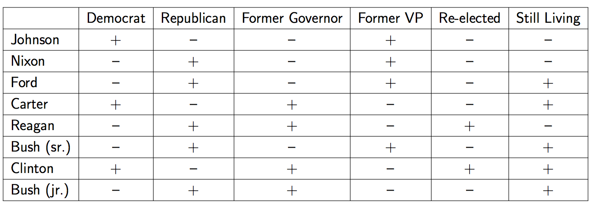

class: center, middle
# Computational Linguistics<br>
## 9. Meaning Representation and Vector Semantics

** Xiaojing Bai **

** Tsinghua University **

** https://bxjthu.github.io/CompLing **

---
.left-column-2[
## Recap: grammar formalisms

+ Constituent-based language models
+ Dependency-based language models


+ <font color="red">Constraint-based language models</font>

  A more fine-grained way of representing and placing constraints on grammatical categories
]

.right-column-4[
<br><br>
Natural languages have an extensive range of grammatical constructions which are hard to handle with the simple methods described in 8. In order to gain <font color="red">more flexibility</font>, we change our treatment of grammatical categories like S, NP and V. In place of <font color="red">atomic labels</font>, we decompose them into structures like dictionaries, where features can take on <font color="red">a range of values</font>.
]

---

## Recap: feature structures in the grammar

Augmenting the ordinary CFGs rules with attachments that specify feature structures for the constituents of the rules, along with appropriate unification operations that express <font color="red">constraints</font> on those constituents.

.smaller[
|  |  
:--|:--|:--
\\(\beta_0\\) | \\(\to\\)| \\(\beta_1 ... \beta_n\\)
| |_{set of constraints}_
&nbsp; | |
| |< \\(\beta_i\\) feature path > = <font color="red">atomic value</font>
| |< \\(\beta_i\\) feature path > = <font color="red">< \\(\beta_j\\) feature path ></font>
&nbsp; | |
Aux | \\(\to\\) | do
| |< Aux AGREEMENT NUMBER > = _plural_
| |< Aux AGREEMENT PERSON > = _3rd_
S | \\(\to\\) | NP VP
| |< NP NUMBER > = < VP NUMBER >
]

---

## Recap: reentrancy and reentrant structures

.left-column-1[
.smaller[
$$
\left[
\begin{array}{ll}
\textrm{CAT} & S \\\\[3ex]
\textrm{HEAD} &
\left[
\begin{array}{ll}
\textrm{AGREEMENT} & [1]
\left[
\begin{array}{ll}
\textrm{NUMBER} & sing \\\
\textrm{PERSON} & 3rd
\end{array}
\right] \\\ \[3ex]
\textrm{SUBJECT} &
\left[
\begin{array}{ll}
\textrm{AGREEMENT} & [1]
\end{array}
\right]
\end{array}
\right]
\end{array}
\right]
$$
]

<br>

]

.right-column-3[
Reentrancy: A feature structure occurs <font color="red">more than once</font> in an enclosing feature structure, i.e. there are <font color="red">two or more</font> feature paths of reaching the same node in the directed acyclic graph.
]

---

## Recap: unification of feature structures

.smaller[
\\(
\textrm{FS1:}
\left[
\begin{array}{ll}
\textrm{NAME} & Lee\\\
\textrm{ADDRESS} &
\left[
\begin{array}{ll}
\textrm{NUMBER} & 74 \\\
\textrm{STREET} & Rue Pascal
\end{array}
\right] \\\ \[3ex]
\textrm{SPOUSE} &
\left[
\begin{array}{ll}
\textrm{NAME} & Kim \\\
\textrm{ADDRESS} &
\left[
\begin{array}{ll}
\textrm{NUMBER} & 74 \\\
\textrm{STREET} & Rue Pascal
\end{array}
\right]
\end{array}
\right]
\end{array}
\right]
\\)

<br>
\\(
\sqcup
\textrm{FS3:}
\left[
\begin{array}{ll}
\textrm{SPOUSE} &
\left[
\begin{array}{ll}
\textrm{ADDRESS} &
\left[
\begin{array}{ll}
\textrm{CITY} & Paris
\end{array}
\right]
\end{array}
\right]
\end{array}
\right]
\\)

]

```
*>>> fs1 = nltk.FeatStruct("""[NAME=Lee,
*...                           ADDRESS=[NUMBER=74,
*...                                    STREET='rue Pascal'],
*...                           SPOUSE= [NAME=Kim,
*...                                    ADDRESS=[NUMBER=74,
*...                                             STREET='rue Pascal']]]""")
*>>> print(fs1)
```

```
*>>> fs3 = nltk.FeatStruct("[SPOUSE = [ADDRESS = [CITY = Paris]]]")
*>>> print(fs3.unify(fs1))
```

---

## Recap: unification of reentrant feature structures

.smaller[
\\(
\textrm{FS2:}
\left[
\begin{array}{ll}
\textrm{NAME} & Lee\\\
\textrm{ADDRESS} & [1]
\left[
\begin{array}{ll}
\textrm{NUMBER} & 74 \\\
\textrm{STREET} & Rue Pascal
\end{array}
\right] \\\ \[3ex]
\textrm{SPOUSE} &
\left[
\begin{array}{ll}
\textrm{NAME} & Kim \\\
\textrm{ADDRESS} & [1]
\end{array}
\right]
\end{array}
\right]
\\)

<br>
\\(
\sqcup
\textrm{FS3:}
\left[
\begin{array}{ll}
\textrm{SPOUSE} &
\left[
\begin{array}{ll}
\textrm{ADDRESS} &
\left[
\begin{array}{ll}
\textrm{CITY} & Paris
\end{array}
\right]
\end{array}
\right]
\end{array}
\right]
\\)

]

```
*>>> fs2 = nltk.FeatStruct("""[NAME=Lee,
*...                           ADDRESS=(1)[NUMBER=74,
*...                                    STREET='rue Pascal'],
*...                           SPOUSE= [NAME=Kim,
*...                                    ADDRESS->(1)]]""")
*>>> print(fs2)
```

```
*>>> fs3 = nltk.FeatStruct("[SPOUSE = [ADDRESS = [CITY = Paris]]]")
*>>> print(fs3.unify(fs2))
```

---
## Recap: applications

+ Agreement

+ Head features

+ Subcategorization

+ Long-distance dependencies

---

## At the end of this session you will

+ know why meaning representations are needed and what they should do

+ know how a meaning representation models a particular state of affairs

+ know more about first-order logic as a meaning representation language

+ know about how syntax-driven semantic analysis works

+ know how the meaning of a word can be represented in different ways

+ know how to represent the meaning of a word as a vector

---

## The representation of meaning

+ Basic assumption<br><br>
The meaning of linguistic expressions <font color="red">can</font> be captured in <font color="red">formal</font> structures

+ Representations

  + <font color="grey">Phonological</font>
  + <font color="grey">Morphological</font>
  + <font color="grey">Syntactic</font>
  + Semantic

---

.left-column-3[
## Example meaning representations


]
.right-column-3[

.smaller[
+ Meaning representations
+ Linguistic inputs
+ The world
+ Our knowledge of the world
]

<br>
First-Order Logic (FOL)

<br>
Directed graph

<br>
Abstract Meaning Representation (AMR)

<br>
Frame-Based / <br> Slot-Filler representation
]
---
## Why do we need to represent meaning?

  + To bridge the gap between linguistic inputs and the non-linguistic knowledge of the world

  + The frameworks we have studied so far can not facilitate this kind of semantic processing

** Aims of computational semantics**

+ Find techniques to associate semantic representations with expressions of natural language automatically

+ Use semantic representations of natural language expressions to draw inferences automatically

---
## Why do we need to represent meaning?

+ Applications

  Information retrieval, information extraction, machine translation, dialogue systems, question answering, ...

+ Sample cases in question answering

  **Scenario 1: Hi Siri!**
---


---


---

**Scenario 2: Hi Zijing!**

A computer system accepts spoken language queries from tourists and construct appropriate responses by using a knowledge base of relevant domain knowledge.

Query 1: Does Zijing serve vegetarian food?

Query 2: I’d like to find a restaurant where I can get vegetarian food.

Query 3: I wanna eat someplace that’s close to Tsinghua.

Query 4: Does Zijing have vegetarian dishes?

Query 5: Do they have vegetarian food at Zijing?

Query 6: Are vegetarian dishes served at Zijing?

Query 7: Does Zijing serve vegetarian fare?

---
## Computational desiderata for meaning representations

+ What should meaning representations do for us?

---

## Computational desiderata for meaning representations

(1) Does Maharani serve vegetarian food?<br>

(2) I wanna eat someplace that’s close to ICSI.<br>
(3) I want to eat Italian food.<br>

(4) Does Maharani have vegetarian dishes?<br>
(5) Do they have vegetarian food at Maharani?<br>
(6) Are vegetarian dishes served at Maharani?<br>
(7) Does Maharani serve vegetarian fare?<br>

(8) Maharani serves vegetarian dishes.<br>
(9) Vegetarian dishes are served by Maharani.<br>

(10) Can vegetarians eat at Maharani?<br>
(11) I’d like to find a restaurant where I can get vegetarian food.

---

## Computational desiderata for meaning representations

+ What should meaning representations do for us?

  + Verifiability

  + Unambiguous representations

  + Canonical form

  + Inference and variables

  + Expressiveness

???
alternative syntactic analyses often have meanings that are, if not identical, at least systematically related to one another
a commonsense connection between what vegetarians eat and what vegetarian restaurants serve
this request does not make reference to any particular restaurant

---

## A meaning representation as a model

A model is a formal construct that stands for the particular state of affairs in the world in a <font color="red">systematic</font> and hence simple and powerful way.

+ Elements in a model .smaller[and their denotations]
  + Objects: .smaller[elements of the domain]
  + Properties of objects: .smaller[sets of elements of the domain]
  + Relations among objects: .smaller[sets of tuples of elements of the domain]

+ Denotation of a meaning representation: the interpretation

+ Vocabularies of a meaning representation
  + Non-logical: an open-ended set .smaller[of names of objects, properties, and relations]
  + Logical: a closed set .smaller[of symbols, operators, quantifiers, links, etc.]

---

## A sample model of the restaurant world


---

## Truth-conditional semantics

+ Determining the truth of a complex expression from the meanings of its <font color="red">parts</font> and the meaning of an <font color="red">operator</font> by essentially consulting a truth-table.

+ Modeling the objects, properties, and relations out in the external world by <font color="red">the knowledge base</font>

+ Complications: conjunctions, equality, quantified variables and negations

> (1) Katie likes the Rio <font color="red">and</font> Matthew likes the Med.<br>
(2) Katie <font color="red">and</font> Caroline like the same restaurants.<br>
(3) Franco likes <font color="red">noisy, expensive</font> restaurants. <br>
(4) <font color="red">Not</font> everybody likes Frasca.

---

.left-column-4[
## First-order logic


]

.right-column-4[
<br>
Zijing<br>
\\(\textit{Zijing}\\)

the location of Zijing
\\(\textit{LocationOf(Zijing)}\\)

the location of restaurants
\\(\textit{LocationOf(x)}\\)

Zijing serves vegetarian food.
\\(\textit{Serves(Zijing,VegetarianFood)}\\)

Zijing is a restaurant.
\\(\textit{Restaurant(Zijing)}\\)

]

---

## First-order logic

I only have $5 and I don’t have a lot of time.

\\(\textit{Have(Speaker,\textdollar5)} \land \lnot \textit{Have(Speaker,LotOfTime)}\\)

<br><br>
a restaurant that serves hot-pot near Tsinghua

\\(\exists \textit{xRestaurant(x)}\\) <br>
\\(\land \textit{Serves(x,HotPot)}\\) <br>
\\(\land \textit{Near((LocationOf(x),LocationOf(Tsinghua))}\\)

---

## Syntax-driven semantic Analysis


???
 CFG rules with semantic attachments

A \\(\to a_1...a_n \qquad \\{f(a_1.sem,...a_n.sem)\\}\\)

.left-column-4[

<font color="red">Qingfen reopened.</font>

ProperNoun \\(\to\\) Qingfen  \\(\quad \\{Qingfen\\} \\)

NP \\(\to\\) ProperNoun \\(\quad \\{ProperNoun.sem\\}\\)

VP \\(\to\\) Verb \\(\quad \\{Verb.sem\\}\\)

Verb \\(\to\\) reopened \\(\quad \\{ \lambda x.Reopened(x)\\}\\)

S \\(\to\\) NP VP \\(\quad \\{ VP.sem(NP.sem)\\}\\)

]

.right-column-4[

<br><br><br>
> \\(\lambda x.Reopened(x)(Qingfen)\\)

> \\(Reopened(Qingfen)\\)
]

---
.left-column-3[
## Representing the meaning of a word

+ **Dictionary entries**

  Johnson, Andrew (1808–1875), American Democratic statesman, 17th president of the US 1865–1869.

  Nixon, Richard (1913–1994), American Republican statesman, 37th president of the US 1969–1974.
]

.right-column-3[
<br><br><br><br><br>
.center[]
]
---
.left-column-3[
## Representing the meaning of a word

+ **Feature structures**

> .smaller[
\\(
\left[
\begin{array}{ll}
\textrm{WORD} & Johnson\\\
\textrm{DEMOCRAT} & Yes \\\
\textrm{FORMER GOVERNOR} & No \\\
\textrm{FORMER VP} & Yes \\\
\textrm{...} & ...
\end{array}
\right]
\\)

\\(
\left[
\begin{array}{ll}
\textrm{WORD} & Nixon\\\
\textrm{DEMOCRAT} & No \\\
\textrm{FORMER GOVERNOR} & No \\\
\textrm{FORMER VP} & Yes \\\
\textrm{...} & ...
\end{array}
\right]
\\)
]
]

.right-column-3[
<br><br><br><br><br>
.smaller[
Johnson, Andrew (1808–1875), American Democratic statesman, 17th president of the US 1865–1869.

Nixon, Richard (1913–1994), American Republican statesman, 37th president of the US 1969–1974.
]
]

---

## Representing the meaning of a word

+ **Relational databases**

  

.right[[Also see: The database of Chinese adverbs](副词用法词典_公开数据_20120117.xls)]

---

## Representing the meaning of a word

+ **Semantic trees**

  > 
  <br>
.right[[PKU semantic tree](http://ccl.pku.edu.cn/doubtfire/Semantics/973_Beida/index.htm)]

---
## Representing the meaning of a word

+ **Synsets**

  > {教师, 教书匠, 教书先生, 老师}<br>
  {母亲, 妈妈, 娘亲}<br>
  {mother, female parent}<br>
  {mother, fuss, overprotect}<br>
  {father, male parent, begetter}<br>
  {beget, get, engender, father, mother, sire, generate, bring forth}
  <br><br>
.right[[WordNet](http://wordnetweb.princeton.edu/perl/webwn)]


---

## Representing the meaning of a word

+ Two words have first-order co-occurrence (i.e. syntagmatic association) if they are typically nearby each other.

  Thus <font color="red">_write_</font> is a first-order associate of <font color="red">_book_</font> or <font color="red">_poem_</font>.

+ Two words have second-order co-occurrence (i.e. paradigmatic association) if they have similar neighbors.

  Thus <font color="red">_write_</font> is a second-order associate of <font color="red">_say_</font> or <font color="red">_remark_</font>.

---

## Representing the meaning of a word

+ Syntagmatic association

+ Paradigmatic association


---
## Representing the meaning of a word as a vector

** Basic assumption: **
<br>
The meaning of a word is defined by how often it occurs near other words.

> On the one hand, <font color="red">_bank_</font> co-occurs with words and expression such as <font color="red">_money</font>, <font color="red">notes</font>, <font color="red">loan</font>, <font color="red">account</font>, <font color="red">investment</font>, <font color="red">clerk</font>, <font color="red">official</font>, <font color="red">manager</font>, <font color="red">robbery</font>, <font color="red">vaults</font>, <font color="red">working in a</font>, <font color="red">its actions</font>, <font color="red">First National</font>, <font color="red">of England_</font>, and so forth. On the other hand, we find <font color="red">_bank_</font> co-occurring with <font color="red">_river</font>, <font color="red">swim</font>, <font color="red">boat</font>, <font color="red">east_</font> (and of course <font color="red">_West_</font> and <font color="red">_South_</font>, which have acquired special meanings of their own), <font color="red">_on top of the_</font>, and </font><font color="red">_of the Rhine_</font>. (Hanks 1987, p. 127)

<br>
“You shall know a word by the <font color="red">company</font> it keeps!”

.smaller[
Firth, J. R. (1957). A synopsis of linguistic theory 1930–1955. In \\(\textit{Studies in Linguistic Analysis}\\). <br>Philological Society. Reprinted in Palmer, F. (ed.) 1968. Selected Papers of J. R. Firth. Longman, Harlow.
]

---
## Documents as vectors


+ Vector: a list or array of numbers

+ A vector space: a collection of vectors

+ A term-document matrix: the occurrence of four words in four plays

+ A dimension (row): the number of times a word  occurs

---
## Documents as vectors


.smaller[A two-dimension spatial visualization of the document vectors for four Shakespeare plays

+ The comedies have high values for the _fool_ dimension and low values for the _battle_ dimension.

+ Similar documents had similar vectors, because similar documents tend to have similar words.
]

---

## Words as vectors


+ Vector: a list or array of numbers

+ A vector space: a collection of vectors

+ The term-document matrix represents the meaning of words by the documents it tends to occur in

+ Similar words have similar vectors because they tend to occur in similar documents.

---

## Words as vectors


+ The word-word matrix: the number of times the row (target) word and the column (context) word co-occur in the same document.

+ The window


---
.left-column-2[
## Words as vectors


.smaller[A two-dimension spatial visualization of word vectors for _digital_ and _information_, showing just two of the dimensions, corresponding to the words _data_ and _result_.]
]
.right-column-4[
<br>
** Size of the window ** <br>
used to collect counts

+ Varied based on the goals of the representation

+ Generally between 1 and 8 words on each side of the target word

+ In general, the shorter the window, the more syntactic the representations; the longer the window, the more semantic the relations.
]

???
## Measure of the association between words

+ Simple frequency isn’t the best measure!

  Words that are frequent but not informative or discriminative: _the, it, they_

+ Positive Pointwise Mutual	Information	(PPMI)

$$ I(x,y) = \log_2 \frac{P(x,y)}{P(x)P(y)}  \qquad  PMI(w,c) = \log_2 \frac{P(w,c)}{P(w)P(c)} $$

<br>
$$ PPMI(w,c) = max (\log_2 \frac{P(w,c)}{P(w)P(c)} ,0)$$

---

## At the end of this session you will

+ know why meaning representations are needed and what they should do

+ know how a meaning representation models a particular state of affairs

+ know more about first-order logic as a meaning representation language

+ know about how syntax-driven semantic analysis works

+ know how the meaning of a word can be represented in different ways

+ know how to represent the meaning of a word as a vector

---

##Homework

+ Read/Review (Quiz 8 on Nov. 28, 2018)

  + [J+M_14](https://bxjthu.github.io/CompLing/readings/9/J+M_14.pdf) (14.1-14.4)
  + [J+M_6](https://bxjthu.github.io/CompLing/readings/9/J+M_6.pdf) (6.1-6.3)

+ Practice

  + Practical 10
  + http://www.nltk.org/book/ch10.html

---
class: center, middle
## Next session

Semantic Similarity and

Word Sense Disambiguation
